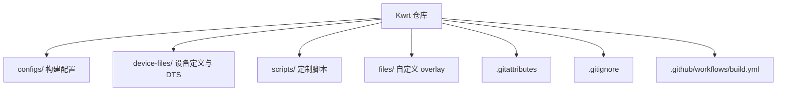
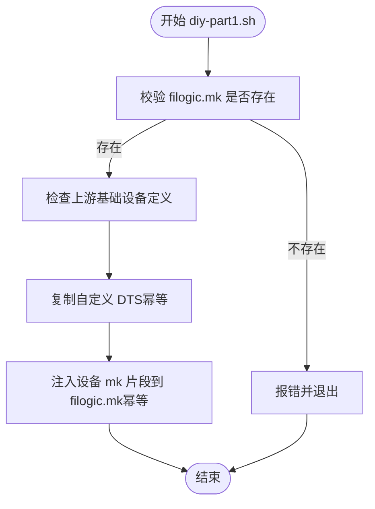
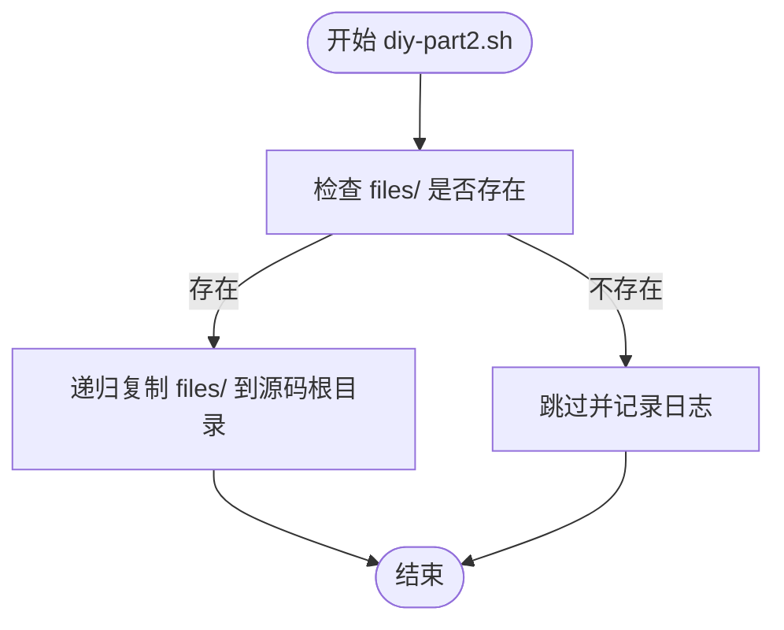
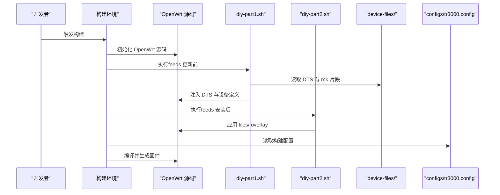
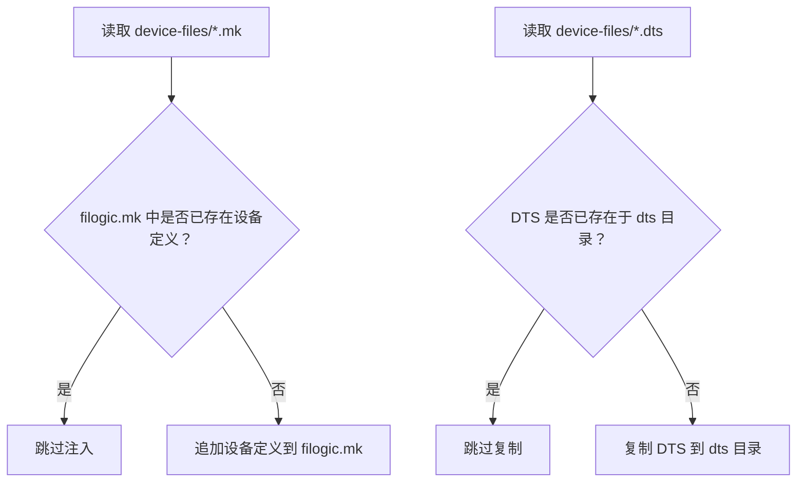
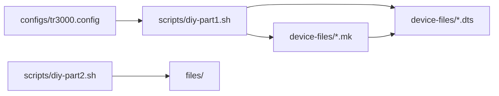

# 代码结构说明

<cite>
**本文引用的文件**   
- [.gitattributes](file://.gitattributes)
- [.gitignore](file://.gitignore)
- [scripts/diy-part1.sh](file://scripts/diy-part1.sh)
- [scripts/diy-part2.sh](file://scripts/diy-part2.sh)
- [configs/tr3000.config](file://configs/tr3000.config)
- [device-files/filogic-cudy_tr3000-mod.mk](file://device-files/filogic-cudy_tr3000-mod.mk)
- [device-files/filogic-cudy_tr3000-256mb-mod.mk](file://device-files/filogic-cudy_tr3000-256mb-mod.mk)
- [device-files/mt7981b-cudy-tr3000-mod.dts](file://device-files/mt7981b-cudy-tr3000-mod.dts)
- [device-files/mt7981b-cudy-tr3000-256mb-mod.dts](file://device-files/mt7981b-cudy-tr3000-256mb-mod.dts)
</cite>

## 目录
1. [引言](#引言)
2. [项目结构总览](#项目结构总览)
3. [核心目录职责](#核心目录职责)
4. [构建与定制脚本机制](#构建与定制脚本机制)
5. [设备定义文件规范](#设备定义文件规范)
6. [Git 行为配置](#git-行为配置)
7. [架构与数据流图](#架构与数据流图)
8. [依赖关系分析](#依赖关系分析)
9. [性能与构建注意事项](#性能与构建注意事项)
10. [故障排查指南](#故障排查指南)
11. [结论](#结论)
12. [附录：常用开发工具与导航建议](#附录常用开发工具与导航建议)

## 引言
本仓库围绕 Cudy TR3000 路由器，在 OpenWrt 源码之上提供“大分区”固件方案。通过 scripts/ 中的定制脚本、device-files/ 中的设备定义与设备树、以及 configs/ 中的构建配置，实现从源码到固件的完整构建流程。文档重点解释目录组织原则、脚本执行时机与作用机制、设备定义命名规范，并给出可操作的代码导航与排错建议。

## 项目结构总览
仓库采用“最小化定制层 + OpenWrt 上游源码”的组织方式：
- configs/：OpenWrt 构建配置，声明目标平台、设备与软件包。
- device-files/：设备 Makefile 片段与设备树（DTS）定义，描述硬件布局与镜像参数。
- scripts/：在 OpenWrt 构建过程中注入设备定义与应用自定义 overlay 的脚本。
- files/：编译时覆盖到 OpenWrt 源码根目录的自定义文件（如 uci-defaults）。
- .gitattributes/.gitignore：统一换行符与忽略本地产物。
- .github/workflows/build.yml：GitHub Actions 构建入口（仓库中存在该文件，但本文不展开其内容）。

**图表来源**
- [configs/tr3000.config:1-34](file://configs/tr3000.config#L1-L34)
- [scripts/diy-part1.sh:1-52](file://scripts/diy-part1.sh#L1-L52)
- [scripts/diy-part2.sh:1-22](file://scripts/diy-part2.sh#L1-L22)
- [.gitattributes:1-7](file://.gitattributes#L1-L7)
- [.gitignore:1-13](file://.gitignore#L1-L13)

**章节来源**
- [configs/tr3000.config:1-34](file://configs/tr3000.config#L1-L34)
- [.gitattributes:1-7](file://.gitattributes#L1-L7)
- [.gitignore:1-13](file://.gitignore#L1-L13)

## 核心目录职责
- configs/
  - tr3000.config：声明 Mediatek Filogic 目标、四款设备（标准版与大分区版）、LuCI 与中文界面，并提供按需启用插件的示例注释。
- device-files/
  - *.mk：设备 Makefile 片段，定义 DEVICE_* 变量、UBI 参数、镜像大小、内核打包方式与默认软件包。
  - *.dts：设备树，继承官方 v1 或 256mb-v1 定义，调整 ubi 分区大小以支持大分区方案。
- scripts/
  - diy-part1.sh：在 feeds 更新前运行，将 device-files/ 中的 DTS 与 mk 片段注入到 OpenWrt 源码对应位置。
  - diy-part2.sh：在 feeds 安装后运行，将 files/ 目录内容覆盖到 OpenWrt 源码根目录，作为编译期 overlay。
- files/
  - etc/uci-defaults/：存放首次启动时的 UCI 默认配置脚本（由 diy-part2.sh 应用）。

**章节来源**
- [configs/tr3000.config:11-34](file://configs/tr3000.config#L11-L34)
- [device-files/filogic-cudy_tr3000-mod.mk:1-19](file://device-files/filogic-cudy_tr3000-mod.mk#L1-L19)
- [device-files/filogic-cudy_tr3000-256mb-mod.mk:1-20](file://device-files/filogic-cudy_tr3000-256mb-mod.mk#L1-L20)
- [device-files/mt7981b-cudy-tr3000-mod.dts:1-23](file://device-files/mt7981b-cudy-tr3000-mod.dts#L1-L23)
- [device-files/mt7981b-cudy-tr3000-256mb-mod.dts:1-24](file://device-files/mt7981b-cudy-tr306mb-mod.dts#L1-L24)
- [scripts/diy-part1.sh:1-52](file://scripts/diy-part1.sh#L1-L52)
- [scripts/diy-part2.sh:1-22](file://scripts/diy-part2.sh#L1-L22)

## 构建与定制脚本机制
### diy-part1.sh：注入设备定义（feeds 更新前）
- 作用
  - 校验 OpenWrt 源码路径是否正确。
  - 检查上游是否包含基础设备定义（cudy_tr3000-v1、cudy_tr3000-256mb-v1），若缺失则发出警告。
  - 复制自定义 DTS 到 target/linux/mediatek/dts（幂等：已存在则跳过）。
  - 将 device-files/*.mk 中的设备定义注入到 target/linux/mediatek/image/filogic.mk（幂等：已存在则跳过）。
- 关键路径
  - DTS 目标目录：target/linux/mediatek/dts
  - 镜像定义目标：target/linux/mediatek/image/filogic.mk
- 输出
  - 日志打印注入结果；完成时输出“完成”。

**图表来源**
- [scripts/diy-part1.sh:16-51](file://scripts/diy-part1.sh#L16-L51)

**章节来源**
- [scripts/diy-part1.sh:1-52](file://scripts/diy-part1.sh#L1-L52)

### diy-part2.sh：应用自定义 overlay（feeds 安装后）
- 作用
  - 将仓库 files/ 目录内容复制到 OpenWrt 源码根目录，使编译系统将其打包进固件。
  - 适用于首次启动脚本、默认 UCI 配置等。
- 关键路径
  - 自定义文件源：WORKSPACE_DIR/files
  - 目标：OpenWrt 源码根目录（./）
- 输出
  - 成功应用后打印“已应用自定义文件 overlay”，完成后输出“完成”。

**图表来源**
- [scripts/diy-part2.sh:13-21](file://scripts/diy-part2.sh#L13-L21)

**章节来源**
- [scripts/diy-part2.sh:1-22](file://scripts/diy-part2.sh#L1-L22)

## 设备定义文件规范
### Makefile 片段（*.mk）
- 命名约定
  - 以平台前缀开头，例如 filogic-，便于按 SoC 平台归类。
  - 设备名使用下划线分隔，如 cudy_tr3000-mod、cudy_tr3000-256mb-mod。
- 关键字段
  - DEVICE_VENDOR / DEVICE_MODEL / DEVICE_VARIANT：厂商、型号、变体。
  - DEVICE_DTS / DEVICE_DTS_DIR：关联 DTS 名称与目录。
  - SUPPORTED_DEVICES：允许从某标准版 sysupgrade 刷入本固件。
  - UBINIZE_OPTS / BLOCKSIZE / PAGESIZE / IMAGE_SIZE / KERNEL_IN_UBI：UBI 与镜像参数。
  - IMAGE/sysupgrade.bin：sysupgrade 镜像生成规则。
  - DEVICE_PACKAGES：默认内置驱动与固件包。
- 典型用途
  - 128M 大分区：cudy_tr3000-mod（mod-112m 方案）。
  - 256M 大分区：cudy_tr3000-256mb-mod（ubi 扩展至 240MiB）。

**章节来源**
- [device-files/filogic-cudy_tr3000-mod.mk:1-19](file://device-files/filogic-cudy_tr3000-mod.mk#L1-L19)
- [device-files/filogic-cudy_tr3000-256mb-mod.mk:1-20](file://device-files/filogic-cudy_tr3000-256mb-mod.mk#L1-L20)

### 设备树（*.dts）
- 命名约定
  - 以 SoC 前缀开头，例如 mt7981b-，随后为设备名与变体后缀。
- 设计要点
  - 继承官方 v1 或 256mb-v1 的 DTS，仅修改 ubi 分区大小。
  - 128M 版：ubi 起始地址 0x5c0000，大小为 112MiB。
  - 256M 版：ubi 起始地址 0x5c0000，大小为 240MiB，尾部保留约 10.25MiB。
  - compatible 字符串用于内核匹配设备。

**章节来源**
- [device-files/mt7981b-cudy-tr3000-mod.dts:1-23](file://device-files/mt7981b-cudy-tr3000-mod.dts#L1-L23)
- [device-files/mt7981b-cudy-tr3000-256mb-mod.dts:1-24](file://device-files/mt7981b-cudy-tr3000-256mb-mod.dts#L1-L24)

## Git 行为配置
### .gitattributes
- 目的
  - 统一换行符，避免 Windows 编辑导致 Linux 构建机脚本执行异常。
- 关键规则
  - 所有文本文件自动检测换行。
  - .sh、.dts、.mk、.config 强制 LF 换行。

**章节来源**
- [.gitattributes:1-7](file://.gitattributes#L1-L7)

### .gitignore
- 目的
  - 忽略本地构建产物、系统临时文件与编辑器缓存。
- 关键规则
  - 忽略 openwrt/ 与 artifacts/ 目录。
  - 忽略 .DS_Store、Thumbs.db。
  - 忽略 .vscode/、.idea/、*.swp。

**章节来源**
- [.gitignore:1-13](file://.gitignore#L1-L13)

## 架构与数据流图
### 构建阶段时序

**图表来源**
- [scripts/diy-part1.sh:1-52](file://scripts/diy-part1.sh#L1-L52)
- [scripts/diy-part2.sh:1-22](file://scripts/diy-part2.sh#L1-L22)
- [configs/tr3000.config:1-34](file://configs/tr3000.config#L1-L34)

### 设备定义注入流程

**图表来源**
- [scripts/diy-part1.sh:28-49](file://scripts/diy-part1.sh#L28-L49)

## 依赖关系分析
- configs/tr3000.config 依赖 scripts/diy-part1.sh 注入的设备定义，否则 CONFIG_TARGET_mediatek_filogic_DEVICE_cudy_tr3000-mod 与 cudy_tr3000-256mb-mod 无法生效。
- scripts/diy-part1.sh 依赖 device-files/*.mk 与 *.dts 提供设备定义与硬件描述。
- scripts/diy-part2.sh 依赖 files/ 目录提供编译期 overlay。
- device-files/*.mk 依赖 device-files/*.dts 指定 DEVICE_DTS。

**图表来源**
- [configs/tr3000.config:15-19](file://configs/tr3000.config#L15-L19)
- [scripts/diy-part1.sh:28-49](file://scripts/diy-part1.sh#L28-L49)
- [scripts/diy-part2.sh:13-19](file://scripts/diy-part2.sh#L13-L19)
- [device-files/filogic-cudy_tr3000-mod.mk:4-18](file://device-files/filogic-cudy_tr3000-mod.mk#L4-L18)
- [device-files/filogic-cudy_tr3000-256mb-mod.mk:4-19](file://device-files/filogic-cudy_tr3000-256mb-mod.mk#L4-L19)

**章节来源**
- [configs/tr3000.config:15-19](file://configs/tr3000.config#L15-L19)
- [scripts/diy-part1.sh:28-49](file://scripts/diy-part1.sh#L28-L49)
- [scripts/diy-part2.sh:13-19](file://scripts/diy-part2.sh#L13-L19)
- [device-files/filogic-cudy_tr3000-mod.mk:4-18](file://device-files/filogic-cudy_tr3000-mod.mk#L4-L18)
- [device-files/filogic-cudy_tr3000-256mb-mod.mk:4-19](file://device-files/filogic-cudy_tr3000-256mb-mod.mk#L4-L19)

## 性能与构建注意事项
- 幂等性
  - diy-part1.sh 对 DTS 复制与 mk 注入均做了存在性检查，重复执行不会破坏源码。
- 换行一致性
  - .gitattributes 强制脚本与配置文件使用 LF，避免跨平台构建失败。
- 构建产物隔离
  - .gitignore 忽略 openwrt/ 与 artifacts/，保持仓库整洁。
- 设备选择
  - 通过 configs/tr3000.config 控制四款设备的构建开关，按需启用 LuCI 与中文界面。

[本节为通用指导，不直接分析具体文件]

## 故障排查指南
- 错误：未找到 filogic.mk
  - 现象：diy-part1.sh 报错提示未在 OpenWrt 源码根目录运行。
  - 处理：确保在 OpenWrt 源码根目录执行构建流程，或在 GitHub Actions 中设置 working-directory: openwrt。
  - 参考路径：[scripts/diy-part1.sh:16-19](file://scripts/diy-part1.sh#L16-L19)
- 警告：上游基础设备定义缺失
  - 现象：diy-part1.sh 警告未找到 cudy_tr3000-v1 或 cudy_tr3000-256mb-v1。
  - 处理：确认所选 OpenWrt 分支支持这些机型，或切换到兼容分支。
  - 参考路径：[scripts/diy-part1.sh:21-26](file://scripts/diy-part1.sh#L21-L26)
- 问题：自定义 overlay 未生效
  - 现象：files/ 目录内容未被复制到 OpenWrt 源码根目录。
  - 处理：确认 diy-part2.sh 已执行且 files/ 目录存在。
  - 参考路径：[scripts/diy-part2.sh:13-19](file://scripts/diy-part2.sh#L13-L19)
- 问题：设备定义未注入
  - 现象：CONFIG_TARGET_mediatek_filogic_DEVICE_cudy_tr3000-mod 或 cudy_tr3000-256mb-mod 无效。
  - 处理：检查 filogic.mk 是否已被注入设备定义；必要时清理构建缓存后重试。
  - 参考路径：[scripts/diy-part1.sh:37-49](file://scripts/diy-part1.sh#L37-L49)

**章节来源**
- [scripts/diy-part1.sh:16-26](file://scripts/diy-part1.sh#L16-L26)
- [scripts/diy-part1.sh:37-49](file://scripts/diy-part1.sh#L37-L49)
- [scripts/diy-part2.sh:13-19](file://scripts/diy-part2.sh#L13-L19)

## 结论
本仓库通过最小化的定制层，将 Cudy TR3000 的大分区方案无缝集成到 OpenWrt 构建体系。scripts/ 负责在正确时机注入设备定义与应用 overlay，device-files/ 提供设备 Makefile 与 DTS 定义，configs/ 控制构建目标与软件包。配合 .gitattributes 与 .gitignore，保证跨平台一致性与仓库整洁。遵循本文的命名规范与排错步骤，可稳定产出 128M 与 256M 两种大分区固件。

[本节为总结性内容，不直接分析具体文件]

## 附录：常用开发工具与导航建议
- 代码导航
  - 使用 IDE 的符号搜索快速定位 define Device/*、CONFIG_TARGET_*、DEVICE_DTS 等关键字。
  - 在 OpenWrt 源码中搜索 target/linux/mediatek/image/filogic.mk 与 target/linux/mediatek/dts 以理解注入效果。
- 常用命令
  - 在 OpenWrt 源码根目录执行构建流程，确保 working-directory 正确。
  - 查看构建配置：grep CONFIG_TARGET_mediatek_filogic_DEVICE ./configs/tr3000.config。
- 推荐工具
  - VS Code / IntelliJ IDEA：用于跨语言语法高亮与符号跳转。
  - Git 客户端：关注 .gitattributes 与 .gitignore 的影响，避免误提交构建产物。
  - 终端脚本调试：bash -x scripts/diy-part1.sh 与 bash -x scripts/diy-part2.sh 观察执行过程。

[本节为通用指导，不直接分析具体文件]