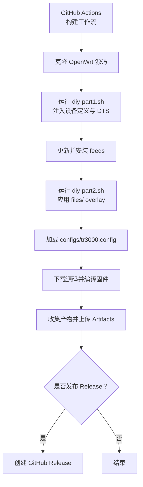
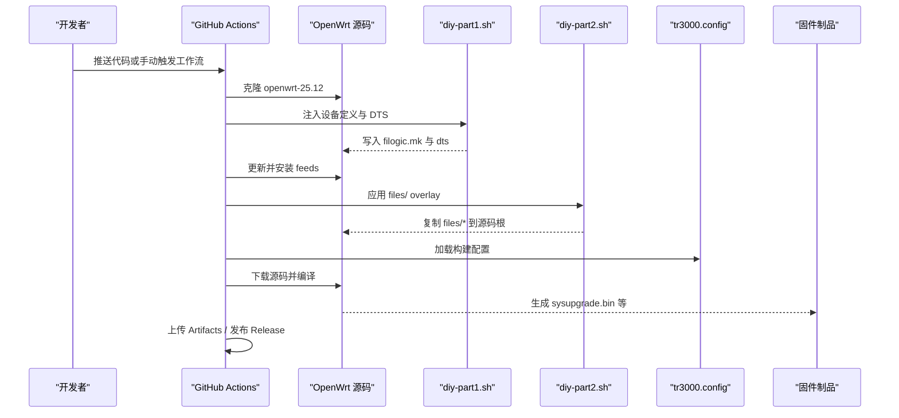
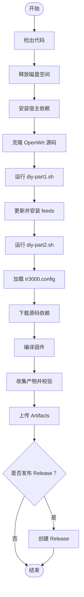
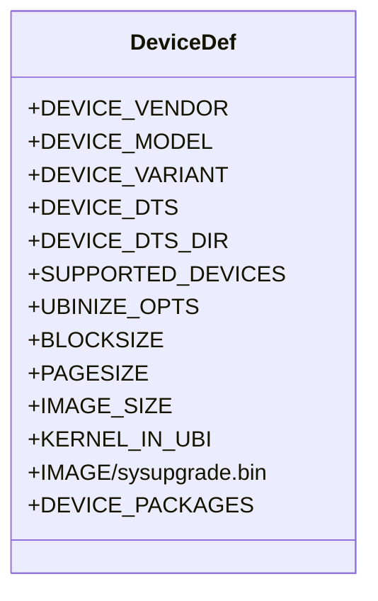
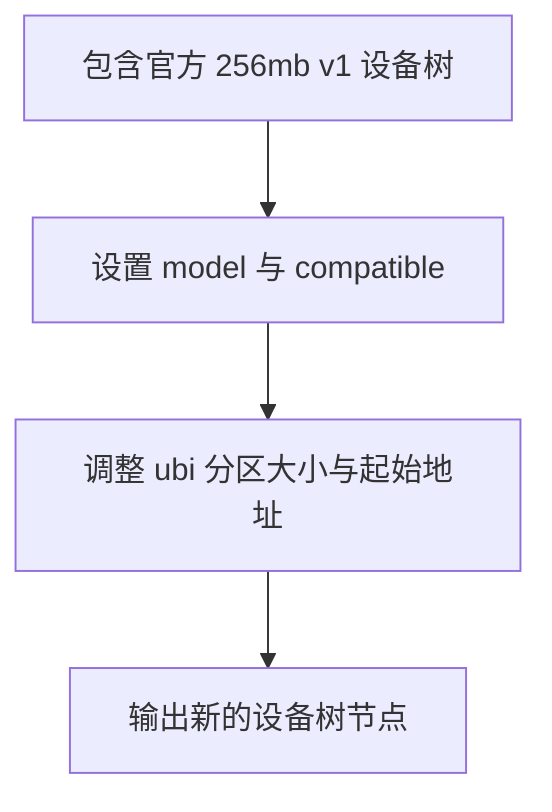
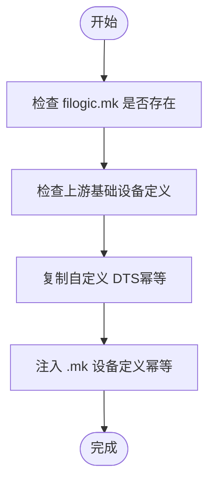
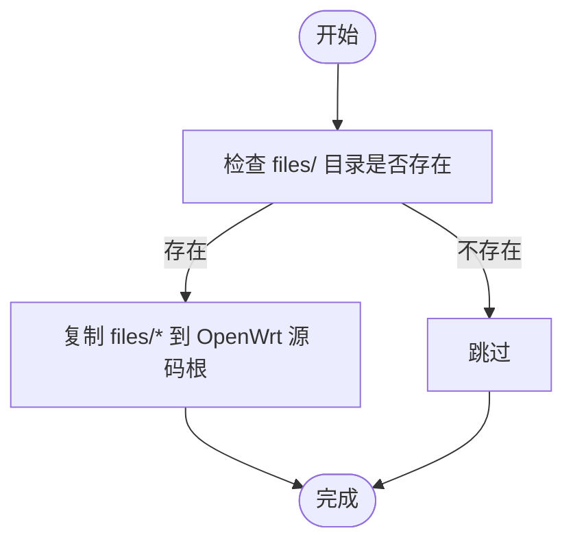
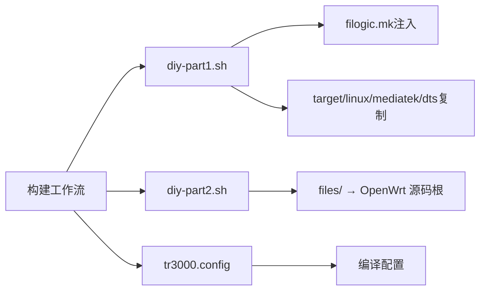

# 开发指南

<cite>
**本文引用的文件**   
- [构建工作流](file://.github/workflows/build.yml)
- [构建配置](file://configs/tr3000.config)
- [256M 大分区设备定义](file://device-files/filogic-cudy_tr3000-256mb-mod.mk)
- [256M 大分区设备树](file://device-files/mt7981b-cudy-tr3000-256mb-mod.dts)
- [DIY 注入脚本（构建前）](file://scripts/diy-part1.sh)
- [DIY 覆盖脚本（构建后）](file://scripts/diy-part2.sh)
</cite>

## 目录
1. [简介](#简介)
2. [项目结构](#项目结构)
3. [核心组件](#核心组件)
4. [架构总览](#架构总览)
5. [详细组件分析](#详细组件分析)
6. [依赖关系分析](#依赖关系分析)
7. [性能与体积优化](#性能与体积优化)
8. [故障排查](#故障排查)
9. [结论](#结论)
10. [附录：常见开发任务清单](#附录常见开发任务清单)

## 简介
本指南面向 Kwrt 项目的开发者，目标是帮助你在理解项目架构的基础上，快速完成以下任务：
- 搭建本地与 CI 构建环境
- 添加新设备支持（包括 .mk 设备定义与 .dts 设备树）
- 扩展构建流程（通过 diy 脚本实现自定义功能）
- 遵循 Git 协作规范与代码贡献流程
- 进行基础测试、调试与性能分析

本项目以 OpenWrt 源码为基础，通过 GitHub Actions 自动拉取官方分支、注入设备定义、编译固件并产出制品。仓库中提供 Cudy TR3000 的示例设备定义与设备树，可作为新增设备的参考模板。

## 项目结构
Kwrt 仓库采用“最小化定制 + 外部注入”的结构：
- .github/workflows：CI 流水线，负责克隆 OpenWrt、执行 diy 脚本、编译与发布
- configs：OpenWrt 构建配置（.config），用于选择目标平台、设备与软件包
- device-files：设备相关的 .mk 定义与 .dts 设备树
- scripts：diy 脚本，分别在构建前后对 OpenWrt 源码进行注入与覆盖
- files：可选的运行时 overlay 文件（如 uci-defaults 等），由 diy-part2 复制到 OpenWrt 源码根目录参与打包

**图表来源**
- [.github/workflows/build.yml:10-166](file://.github/workflows/build.yml#L10-L166)

**章节来源**
- [.github/workflows/build.yml:1-166](file://.github/workflows/build.yml#L1-L166)

## 核心组件
- 构建工作流：定义触发条件、依赖安装、OpenWrt 源码克隆、diy 注入、feeds 更新、配置加载、编译与制品管理。
- 构建配置：声明目标平台、设备选择、LuCI 与中文界面、可选插件。
- 设备定义（.mk）：描述设备厂商、型号、变体、DTS、UBI 参数、镜像大小、内核位置、默认包等。
- 设备树（.dts）：描述硬件资源布局（如 ubi 分区大小）、兼容性与模型信息。
- DIY 脚本：
  - diy-part1.sh：在 feeds 更新前，将 device-files 中的 .dts 与 .mk 注入到 OpenWrt 源码对应路径，确保幂等。
  - diy-part2.sh：在 feeds 安装后，将 files/ 目录内容复制到 OpenWrt 源码根目录，作为运行时 overlay。

**章节来源**
- [.github/workflows/build.yml:59-97](file://.github/workflows/build.yml#L59-L97)
- [configs/tr3000.config:1-34](file://configs/tr3000.config#L1-L34)
- [device-files/filogic-cudy_tr3000-256mb-mod.mk:1-20](file://device-files/filogic-cudy_tr3000-256mb-mod.mk#L1-L20)
- [device-files/mt7981b-cudy-tr3000-256mb-mod.dts:1-24](file://device-files/mt7981b-cudy-tr3000-256mb-mod.dts#L1-L24)
- [scripts/diy-part1.sh:1-52](file://scripts/diy-part1.sh#L1-L52)
- [scripts/diy-part2.sh:1-22](file://scripts/diy-part2.sh#L1-L22)

## 架构总览
下图展示从代码提交到固件产物的端到端流程，以及关键脚本与配置文件的作用点。

**图表来源**
- [.github/workflows/build.yml:40-166](file://.github/workflows/build.yml#L40-L166)
- [scripts/diy-part1.sh:28-49](file://scripts/diy-part1.sh#L28-L49)
- [scripts/diy-part2.sh:13-19](file://scripts/diy-part2.sh#L13-L19)
- [configs/tr3000.config:11-34](file://configs/tr3000.config#L11-L34)

## 详细组件分析

### 构建工作流（GitHub Actions）
- 触发方式：
  - 手动触发（workflow_dispatch），可选择是否发布 Release
  - 推送 main/master 分支时自动构建
  - 定时任务（每周六 22:30 UTC）自动构建并发布
- 主要步骤：
  - 清理磁盘空间、安装宿主依赖
  - 克隆 OpenWrt 源码（openwrt-25.12）
  - 执行 diy-part1.sh 注入设备定义
  - 更新并安装 feeds
  - 执行 diy-part2.sh 应用 files/ overlay
  - 加载 tr3000.config 并校验目标设备是否启用
  - 下载源码并编译固件
  - 收集产物、计算 SHA256SUMS、生成制品摘要
  - 上传 Artifacts；满足条件时创建 GitHub Release

**图表来源**
- [.github/workflows/build.yml:10-166](file://.github/workflows/build.yml#L10-L166)

**章节来源**
- [.github/workflows/build.yml:10-166](file://.github/workflows/build.yml#L10-L166)

### 构建配置（tr3000.config）
- 目标平台：mediatek_filogic
- 设备选择：同时启用 cudy_tr3000-v1、cudy_tr3000-mod、cudy_tr3000-256mb-v1、cudy_tr3000-256mb-mod
- LuCI 与中文界面：启用 luci、luci-ssl、luci-i18n-base-zh-cn、luci-i18n-firewall-zh-cn
- 可选插件：ttyd、filebrowser-q、openclash、USB 存储、block-mount、opkg 中文界面等（按需取消注释）

建议：
- 新增设备时，在 .config 中添加对应的 CONFIG_TARGET_mediatek_filogic_DEVICE_<dev>=y
- 如需调整软件包集合，直接编辑 tr3000.config，避免在 CI 中硬编码

**章节来源**
- [configs/tr3000.config:11-34](file://configs/tr3000.config#L11-L34)

### 设备定义（.mk）
以 256M 大分区设备为例，.mk 文件定义了：
- 设备元数据：厂商、型号、变体
- DTS 名称与目录
- SUPPORTED_DEVICES：允许从标准版系统直接 sysupgrade 刷入
- UBI 参数：块大小、页大小、擦除单元
- IMAGE_SIZE：镜像大小
- KERNEL_IN_UBI：是否将内核放入 UBI
- 默认包：驱动与固件包

**图表来源**
- [device-files/filogic-cudy_tr3000-256mb-mod.mk:4-19](file://device-files/filogic-cudy_tr3000-256mb-mod.mk#L4-L19)

**章节来源**
- [device-files/filogic-cudy_tr3000-256mb-mod.mk:1-20](file://device-files/filogic-cudy_tr3000-256mb-mod.mk#L1-L20)

### 设备树（.dts）
以 256M 大分区设备树为例，.dts 文件：
- 继承自官方 256mb v1 的设备树
- 设置 model 与 compatible
- 调整 ubi 分区起始地址与大小，扩大 ubi 容量并保留尾部安全空间

**图表来源**
- [device-files/mt7981b-cudy-tr3000-256mb-mod.dts:13-23](file://device-files/mt7981b-cudy-tr3000-256mb-mod.dts#L13-L23)

**章节来源**
- [device-files/mt7981b-cudy-tr3000-256mb-mod.dts:1-24](file://device-files/mt7981b-cudy-tr3000-256mb-mod.dts#L1-L24)

### DIY 注入脚本（diy-part1.sh）
职责：
- 在 OpenWrt 源码根目录下运行
- 检查上游基础设备是否存在（cudy_tr3000-v1、cudy_tr3000-256mb-v1）
- 复制自定义 DTS（若不存在则复制，存在则跳过）
- 幂等注入 .mk 设备定义到 filogic.mk（若已存在则跳过）

**图表来源**
- [scripts/diy-part1.sh:16-49](file://scripts/diy-part1.sh#L16-L49)

**章节来源**
- [scripts/diy-part1.sh:1-52](file://scripts/diy-part1.sh#L1-L52)

### DIY 覆盖脚本（diy-part2.sh）
职责：
- 在 OpenWrt 源码根目录下运行
- 将仓库 files/ 目录内容复制到 OpenWrt 源码根目录，作为运行时 overlay
- 建议在需要追加软件包时修改 tr3000.config，而非在此脚本中硬编码

**图表来源**
- [scripts/diy-part2.sh:13-19](file://scripts/diy-part2.sh#L13-L19)

**章节来源**
- [scripts/diy-part2.sh:1-22](file://scripts/diy-part2.sh#L1-L22)

## 依赖关系分析
- 构建工作流依赖：
  - OpenWrt 源码（openwrt-25.12）
  - diy-part1.sh 与 diy-part2.sh
  - tr3000.config
  - device-files 下的 .mk 与 .dts
- 设备定义依赖：
  - filogic.mk（由 diy-part1.sh 注入）
  - target/linux/mediatek/dts（由 diy-part1.sh 复制 .dts）
- 运行时 overlay 依赖：
  - files/ 目录（由 diy-part2.sh 复制到 OpenWrt 源码根）

**图表来源**
- [.github/workflows/build.yml:64-97](file://.github/workflows/build.yml#L64-L97)
- [scripts/diy-part1.sh:28-49](file://scripts/diy-part1.sh#L28-L49)
- [scripts/diy-part2.sh:13-19](file://scripts/diy-part2.sh#L13-L19)
- [configs/tr3000.config:11-34](file://configs/tr3000.config#L11-L34)

**章节来源**
- [.github/workflows/build.yml:64-97](file://.github/workflows/build.yml#L64-L97)
- [scripts/diy-part1.sh:28-49](file://scripts/diy-part1.sh#L28-L49)
- [scripts/diy-part2.sh:13-19](file://scripts/diy-part2.sh#L13-L19)
- [configs/tr3000.config:11-34](file://configs/tr3000.config#L11-L34)

## 性能与体积优化
- 控制软件包数量：仅在 tr3000.config 中启用必要插件，减少镜像体积与启动时间
- 合理设置 IMAGE_SIZE 与 UBI 参数：根据设备闪存容量与安全边界调整，避免过度占用尾部空间
- 使用 KERNEL_IN_UBI：将内核放入 UBI，便于动态升级与回滚
- 利用 SUPPORTED_DEVICES：允许从标准版系统直接 sysupgrade 刷入大分区版本，降低用户操作成本

[本节为通用指导，不直接分析具体文件]

## 故障排查
常见问题与建议：
- 设备未出现在 .config 中：
  - 检查 tr3000.config 是否启用了对应 DEVICE 选项
  - 确认 diy-part1.sh 已成功注入 .mk 定义
- 上游基础设备缺失：
  - 检查 OpenWrt 分支是否包含 cudy_tr3000-v1 与 cudy_tr3000-256mb-v1
  - 若上游不支持，需在上游 PR 或自行适配
- DTS 冲突或重复：
  - diy-part1.sh 会跳过已存在的同名 DTS，请确认是否需要更新
- files/ overlay 未生效：
  - 确认 diy-part2.sh 已执行且 files/ 目录存在
- 编译失败：
  - 查看 make V=s 的详细日志
  - 检查宿主机依赖是否完整安装

**章节来源**
- [.github/workflows/build.yml:83-89](file://.github/workflows/build.yml#L83-L89)
- [scripts/diy-part1.sh:21-26](file://scripts/diy-part1.sh#L21-L26)
- [scripts/diy-part2.sh:13-19](file://scripts/diy-part2.sh#L13-L19)

## 结论
Kwrt 项目通过最小化的仓库结构与强大的 CI 流水线，实现了设备定义的灵活注入与固件的自动化构建。开发者可基于现有模板快速添加新设备、扩展构建流程并进行持续集成。建议遵循本文档的流程与最佳实践，确保代码质量与构建稳定性。

[本节为总结性内容，不直接分析具体文件]

## 附录：常见开发任务清单
- 添加新设备支持
  - 在 device-files 下新增 .mk 设备定义与 .dts 设备树
  - 在 tr3000.config 中启用对应 DEVICE 选项
  - 验证 diy-part1.sh 能正确注入 .mk 与复制 .dts
- 扩展构建流程
  - 在 diy-part1.sh 中增加新的注入逻辑（保持幂等）
  - 在 diy-part2.sh 中追加 files/ overlay 的处理
  - 在 .github/workflows/build.yml 中调整触发条件或产物处理
- 代码贡献流程
  - 基于 feature 分支提交变更，遵循 commit 消息规范
  - 提交 PR 并等待 CI 构建与审查
  - 合并至 main/master 后触发自动构建与发布
- 测试方法
  - 本地模拟 CI：在 OpenWrt 源码根目录依次执行 diy-part1.sh、feeds 更新安装、diy-part2.sh、加载 .config、make download、make
  - 验证 sysupgrade 兼容性：从标准版系统刷入大分区版本
  - 检查日志与产物：查看 make V=s 输出与 artifacts 列表

[本节为操作性清单，不直接分析具体文件]