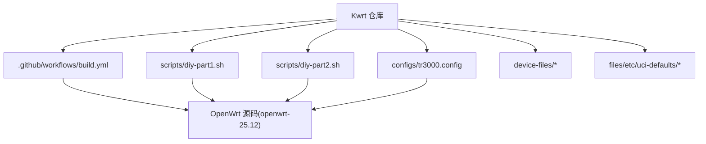
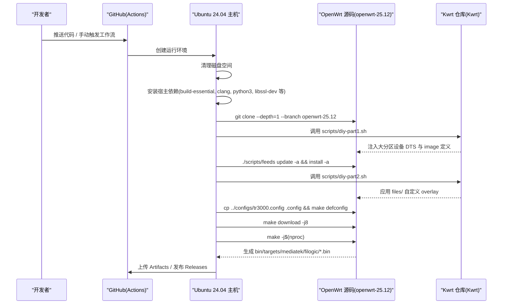
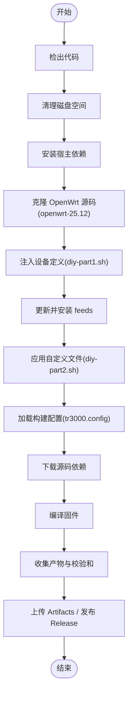
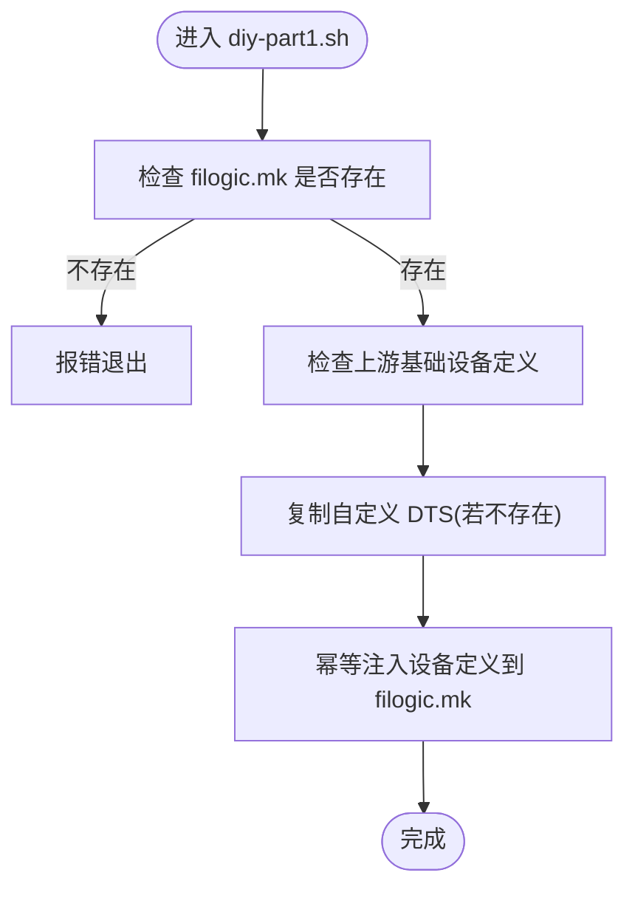
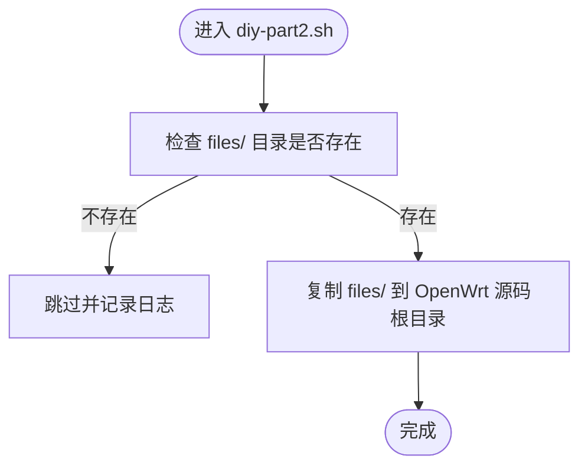
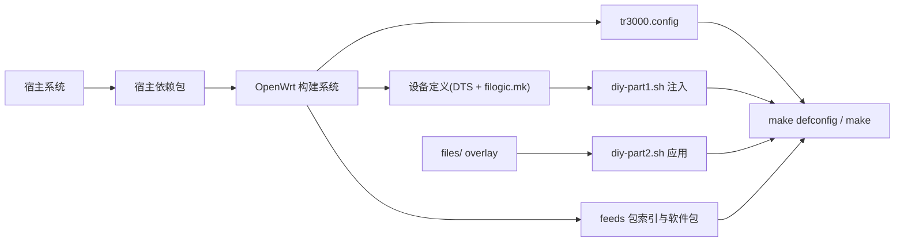

# 开发环境搭建

<cite>
**本文引用的文件**   
- [README.md](file://README.md)
- [.github/workflows/build.yml](file://.github/workflows/build.yml)
- [configs/tr3000.config](file://configs/tr3000.config)
- [scripts/diy-part1.sh](file://scripts/diy-part1.sh)
- [scripts/diy-part2.sh](file://scripts/diy-part2.sh)
</cite>

## 目录
1. [简介](#简介)
2. [项目结构](#项目结构)
3. [核心组件](#核心组件)
4. [架构总览](#架构总览)
5. [详细组件分析](#详细组件分析)
6. [依赖关系分析](#依赖关系分析)
7. [性能与构建优化](#性能与构建优化)
8. [故障排查指南](#故障排查指南)
9. [结论](#结论)
10. [附录：命令与环境变量清单](#附录命令与环境变量清单)

## 简介
本指南面向 Kwrt 项目的开发者，目标是帮助你在 Linux 环境下快速搭建可复用的 OpenWrt 固件编译环境。文档基于仓库中的 GitHub Actions 工作流、设备配置脚本与构建配置文件，说明如何准备宿主系统、安装依赖、获取并配置 OpenWrt 源码、理解构建系统的依赖注入机制，并提供 Git 工作流建议与常见问题排查方法。

本项目围绕 Cudy TR3000 设备，在官方 OpenWrt openwrt-25.12 分支基础上，通过自动化流程同时产出 128M/256M 标准版与大分区版共 4 款固件。本地开发时，你可以复用工作流中已验证的依赖与步骤，确保与云端构建一致。

**章节来源**
- [README.md:1-112](file://README.md#L1-L112)

## 项目结构
Kwrt 仓库采用“最小化定制 + 外部 OpenWrt 源码”的结构：
- .github/workflows/build.yml：GitHub Actions 自动构建流程，定义依赖安装、OpenWrt 源码拉取、设备注入、feeds 更新、下载源码与编译等步骤。
- configs/tr3000.config：OpenWrt 构建配置（目标平台、设备选择、LuCI 与中文界面、可选插件）。
- scripts/diy-part1.sh：在 feeds 更新前执行，向 OpenWrt 源码注入大分区(mod)设备的 DTS 与 image 定义。
- scripts/diy-part2.sh：在 feeds 安装后执行，将 files/ 目录覆盖到 OpenWrt 源码根目录，作为编译期 overlay。
- device-files/：存放大分区设备的 DTS 与 mk 定义，供 diy-part1.sh 注入。
- files/etc/uci-defaults/：默认 UCI 配置或首次启动脚本，随固件打包。

**图表来源**
- [.github/workflows/build.yml:40-97](file://.github/workflows/build.yml#L40-L97)
- [scripts/diy-part1.sh:1-52](file://scripts/diy-part1.sh#L1-L52)
- [scripts/diy-part2.sh:1-22](file://scripts/diy-part2.sh#L1-L22)
- [configs/tr3000.config:1-34](file://configs/tr3000.config#L1-L34)

**章节来源**
- [README.md:27-43](file://README.md#L27-L43)

## 核心组件
- 构建工作流（build.yml）：定义触发条件、宿主环境、依赖安装、OpenWrt 源码克隆、设备注入、feeds 更新、下载源码与编译、产物收集与发布。
- 构建配置（tr3000.config）：指定 mediatek/filogic 目标平台、启用 4 个 TR3000 设备、开启 LuCI 与中文界面，并提供插件开关示例。
- 设备注入脚本（diy-part1.sh）：幂等复制自定义 DTS，并向 filogic.mk 注入大分区设备定义；校验上游基础设备是否存在。
- 自定义文件覆盖（diy-part2.sh）：将 files/ 目录内容复制到 OpenWrt 源码根目录，参与编译打包。

这些组件共同构成“纯净化固件 + 云端自动编译 + 自动发布”的开发体验，本地开发可直接参考其步骤进行等价操作。

**章节来源**
- [.github/workflows/build.yml:34-97](file://.github/workflows/build.yml#L34-L97)
- [configs/tr3000.config:11-34](file://configs/tr3000.config#L11-L34)
- [scripts/diy-part1.sh:1-52](file://scripts/diy-part1.sh#L1-L52)
- [scripts/diy-part2.sh:1-22](file://scripts/diy-part2.sh#L1-L22)

## 架构总览
下图展示从代码提交到固件产物的端到端流程，以及本地开发时的对应步骤映射。

**图表来源**
- [.github/workflows/build.yml:40-105](file://.github/workflows/build.yml#L40-L105)
- [scripts/diy-part1.sh:1-52](file://scripts/diy-part1.sh#L1-L52)
- [scripts/diy-part2.sh:1-22](file://scripts/diy-part2.sh#L1-L22)
- [configs/tr3000.config:11-34](file://configs/tr3000.config#L11-L34)

## 详细组件分析

### 构建工作流（build.yml）
- 触发方式：手动触发、推送 main/master 分支、每周定时任务。
- 运行环境：ubuntu-24.04，超时时间较长以容纳完整编译。
- 关键步骤：
  - 清理磁盘空间，释放构建资源。
  - 安装宿主依赖：编译工具链、Python、SSL、ncurses、elf 库等。
  - 克隆 OpenWrt 源码：openwrt-25.12 分支，浅克隆减少体积。
  - 注入设备定义：执行 diy-part1.sh。
  - 更新并安装 feeds：保证包索引最新。
  - 应用自定义文件：执行 diy-part2.sh。
  - 加载构建配置：复制 tr3000.config 为 .config，执行 defconfig，并校验 4 个设备是否启用。
  - 下载源码与编译：先下载依赖源码，再并行编译。
  - 收集产物：复制 sysupgrade.bin、SHA256SUMS、profiles.json，生成 SHA256SUMS.txt。
  - 上传 Artifacts 与发布 Release（可选）。

**图表来源**
- [.github/workflows/build.yml:40-105](file://.github/workflows/build.yml#L40-L105)

**章节来源**
- [.github/workflows/build.yml:10-33](file://.github/workflows/build.yml#L10-L33)
- [.github/workflows/build.yml:40-105](file://.github/workflows/build.yml#L40-L105)

### 构建配置（tr3000.config）
- 目标平台：启用 mediatek 与 mediatek_filogic。
- 设备选择：启用 cudy_tr3000-v1、cudy_tr3000-mod、cudy_tr3000-256mb-v1、cudy_tr3000-256mb-mod。
- 界面与语言：启用 LuCI、LuCI SSL、中文界面包。
- 插件扩展：提供 ttyd、filebrowser-q、openclash、USB 存储、block-mount、opkg 中文等示例开关。

该配置文件是本地与云端构建一致的入口，修改此处即可控制最终固件包含的功能。

**章节来源**
- [configs/tr3000.config:11-34](file://configs/tr3000.config#L11-L34)

### 设备注入脚本（diy-part1.sh）
- 前置检查：确认 OpenWrt 源码根目录下存在 target/linux/mediatek/image/filogic.mk。
- 上游基础设备自检：检查 cudy_tr3000-v1 与 cudy_tr3000-256mb-v1 是否由上游定义。
- 复制自定义 DTS：若上游未存在同名文件则复制 mod 版本的 DTS。
- 幂等注入设备定义：向 filogic.mk 追加 cudy_tr3000-mod 与 cudy_tr3000-256mb-mod 的设备定义片段。

**图表来源**
- [scripts/diy-part1.sh:16-49](file://scripts/diy-part1.sh#L16-L49)

**章节来源**
- [scripts/diy-part1.sh:1-52](file://scripts/diy-part1.sh#L1-L52)

### 自定义文件覆盖（diy-part2.sh）
- 将仓库 files/ 目录内容复制到 OpenWrt 源码根目录，作为编译期 overlay。
- 适用于默认 UCI 配置、首次启动脚本等需要打包进固件的文件。

**图表来源**
- [scripts/diy-part2.sh:13-19](file://scripts/diy-part2.sh#L13-L19)

**章节来源**
- [scripts/diy-part2.sh:1-22](file://scripts/diy-part2.sh#L1-L22)

## 依赖关系分析
- 宿主依赖：build-essential、clang、flex、bison、g++、gawk、bc、gcc-multilib、g++-multilib、gettext、git、libncurses-dev、libssl-dev、libelf-dev、python3、python3-dev、python3-setuptools、rsync、swig、unzip、zlib1g-dev、file、wget。
- OpenWrt 源码依赖：feeds 包索引与软件包源，需在执行 make download 前更新并安装。
- 设备定义依赖：filogic.mk 与 DTS 文件，由 diy-part1.sh 注入。
- 构建配置依赖：tr3000.config 决定目标平台、设备与软件包。

**图表来源**
- [.github/workflows/build.yml:50-97](file://.github/workflows/build.yml#L50-L97)
- [scripts/diy-part1.sh:16-49](file://scripts/diy-part1.sh#L16-L49)
- [scripts/diy-part2.sh:13-19](file://scripts/diy-part2.sh#L13-L19)
- [configs/tr3000.config:11-34](file://configs/tr3000.config#L11-L34)

**章节来源**
- [.github/workflows/build.yml:50-97](file://.github/workflows/build.yml#L50-L97)

## 性能与构建优化
- 并行编译：使用 make -j$(nproc) 充分利用多核 CPU。
- 增量下载：先执行 make download -j8，避免编译过程中频繁网络阻塞。
- 磁盘空间：构建前清理不必要文件与镜像，确保足够空间。
- 缓存策略：本地可缓存 OpenWrt 源码与 dl 目录，减少重复下载。
- 分阶段构建：先只做 defconfig 与 download，确认配置无误后再全量编译。

[本节为通用指导，不直接分析具体文件]

## 故障排查指南
- 未找到 filogic.mk：
  - 现象：diy-part1.sh 报错提示未在 OpenWrt 源码根目录运行。
  - 处理：确保在 OpenWrt 源码根目录执行脚本，或调整 working-directory。
  - 参考路径：[scripts/diy-part1.sh:16-19](file://scripts/diy-part1.sh#L16-L19)
- 上游基础设备缺失：
  - 现象：警告上游源码中未找到 cudy_tr3000-v1 或 cudy_tr3000-256mb-v1。
  - 处理：确认使用的 OpenWrt 分支支持该机型；必要时升级分支或回退到兼容版本。
  - 参考路径：[scripts/diy-part1.sh:21-26](file://scripts/diy-part1.sh#L21-L26)
- 设备未出现在 .config：
  - 现象：构建流程校验失败，提示某设备未启用。
  - 处理：检查 tr3000.config 是否正确启用对应设备，或重新执行 defconfig。
  - 参考路径：[configs/tr3000.config:15-19](file://configs/tr3000.config#L15-L19)
- 自定义文件未生效：
  - 现象：files/ 下的默认配置未打包进固件。
  - 处理：确认 diy-part2.sh 已执行且 files/ 目录存在。
  - 参考路径：[scripts/diy-part2.sh:13-19](file://scripts/diy-part2.sh#L13-L19)
- 构建失败或网络问题：
  - 现象：make download 或 make 失败。
  - 处理：重试下载；查看 V=s 的详细输出；检查代理与镜像源设置。
  - 参考路径：[.github/workflows/build.yml:91-97](file://.github/workflows/build.yml#L91-L97)

**章节来源**
- [scripts/diy-part1.sh:16-26](file://scripts/diy-part1.sh#L16-L26)
- [scripts/diy-part2.sh:13-19](file://scripts/diy-part2.sh#L13-L19)
- [configs/tr3000.config:15-19](file://configs/tr3000.config#L15-L19)
- [.github/workflows/build.yml:91-97](file://.github/workflows/build.yml#L91-L97)

## 结论
通过复用 build.yml 的工作流步骤与依赖清单，你可以在本地 Linux 环境中高效搭建与云端一致的 OpenWrt 构建环境。结合 tr3000.config 与 diy-part1.sh/diy-part2.sh，能够灵活地管理设备定义与固件内容。建议在本地先执行 defconfig 与 download，确认配置正确后再进行全量编译，以提升迭代效率。

[本节为总结性内容，不直接分析具体文件]

## 附录：命令与环境变量清单

- 宿主依赖安装（Ubuntu/Debian）：
  - 参考路径：[.github/workflows/build.yml:50-57](file://.github/workflows/build.yml#L50-L57)
- 克隆 OpenWrt 源码（openwrt-25.12）：
  - 参考路径：[.github/workflows/build.yml:59-62](file://.github/workflows/build.yml#L59-L62)
- 注入设备定义：
  - 参考路径：[.github/workflows/build.yml:64-66](file://.github/workflows/build.yml#L64-L66)
  - 脚本逻辑：[scripts/diy-part1.sh:1-52](file://scripts/diy-part1.sh#L1-L52)
- 更新并安装 feeds：
  - 参考路径：[.github/workflows/build.yml:68-72](file://.github/workflows/build.yml#L68-L72)
- 应用自定义文件 overlay：
  - 参考路径：[.github/workflows/build.yml:74-76](file://.github/workflows/build.yml#L74-L76)
  - 脚本逻辑：[scripts/diy-part2.sh:1-22](file://scripts/diy-part2.sh#L1-L22)
- 加载构建配置：
  - 参考路径：[.github/workflows/build.yml:78-89](file://.github/workflows/build.yml#L78-L89)
  - 配置文件：[configs/tr3000.config:11-34](file://configs/tr3000.config#L11-L34)
- 下载源码与编译：
  - 参考路径：[.github/workflows/build.yml:91-97](file://.github/workflows/build.yml#L91-L97)
- 环境变量：
  - GITHUB_WORKSPACE：用于定位仓库根目录，便于脚本查找 device-files 与 files。
  - 参考路径：[scripts/diy-part1.sh:7-9](file://scripts/diy-part1.sh#L7-L9), [scripts/diy-part2.sh:7-9](file://scripts/diy-part2.sh#L7-L9)

**章节来源**
- [.github/workflows/build.yml:50-97](file://.github/workflows/build.yml#L50-L97)
- [scripts/diy-part1.sh:7-9](file://scripts/diy-part1.sh#L7-L9)
- [scripts/diy-part2.sh:7-9](file://scripts/diy-part2.sh#L7-L9)
- [configs/tr3000.config:11-34](file://configs/tr3000.config#L11-L34)