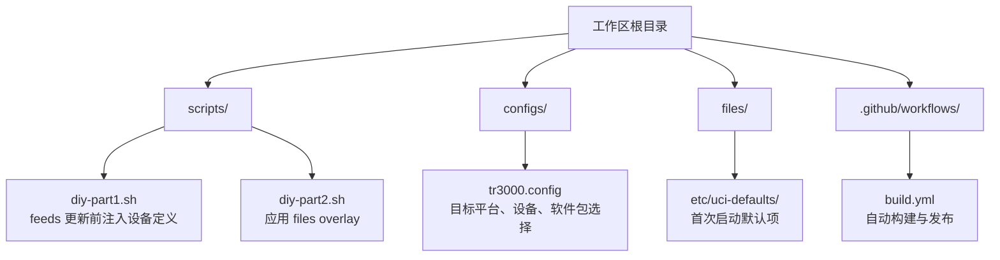
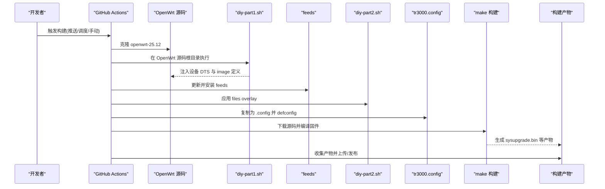
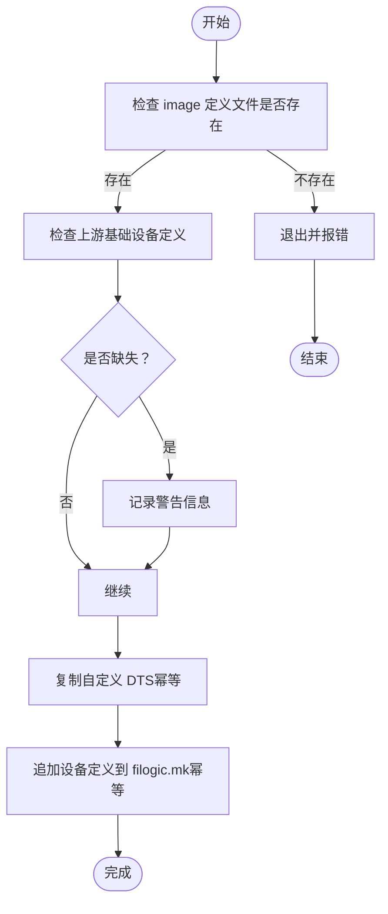
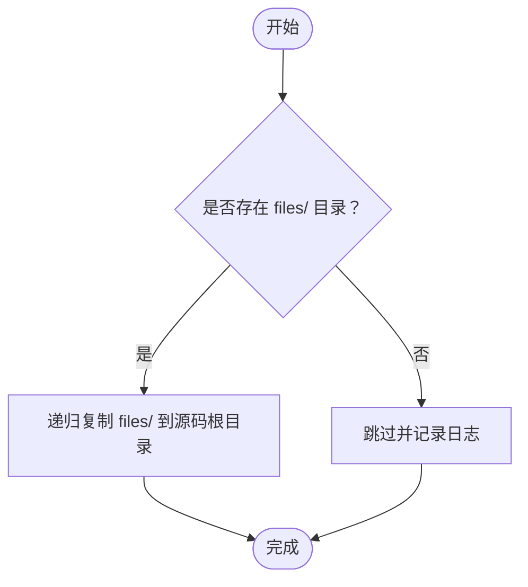
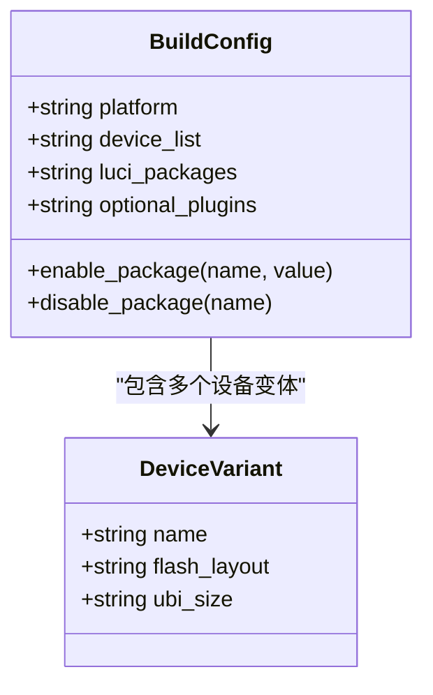
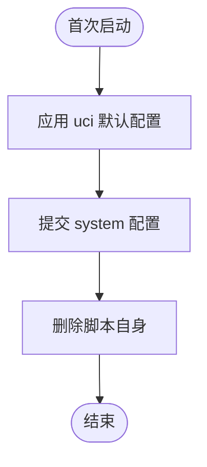
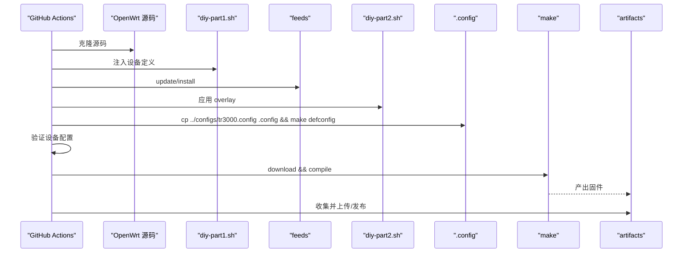
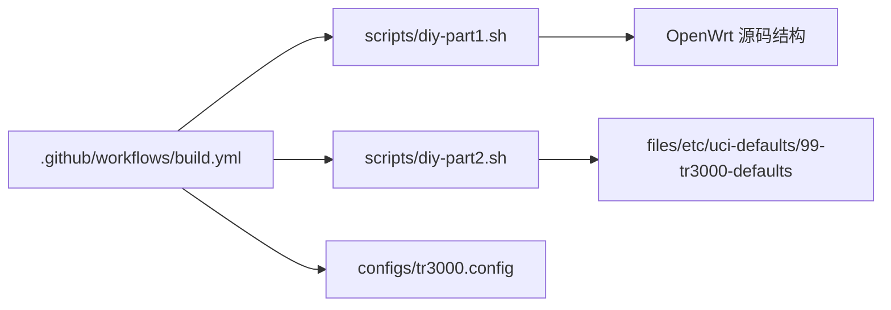

# 扩展构建系统

<cite>
**本文引用的文件**   
- [diy-part1.sh](file://scripts/diy-part1.sh)
- [diy-part2.sh](file://scripts/diy-part2.sh)
- [tr3000.config](file://configs/tr3000.config)
- [build.yml](file://.github/workflows/build.yml)
- [99-tr3000-defaults](file://files/etc/uci-defaults/99-tr3000-defaults)
</cite>

## 目录
1. [简介](#简介)
2. [项目结构](#项目结构)
3. [核心组件](#核心组件)
4. [架构总览](#架构总览)
5. [详细组件分析](#详细组件分析)
6. [依赖关系分析](#依赖关系分析)
7. [性能与构建优化](#性能与构建优化)
8. [故障排查指南](#故障排查指南)
9. [常见定制场景与方案](#常见定制场景与方案)
10. [结论](#结论)

## 简介
本指南面向希望扩展 Kwrt 构建系统的用户，重点说明：
- 如何通过 diy 脚本在 feeds 更新前、后插入自定义步骤
- 如何向固件中添加新软件包
- tr3000.config 配置文件的语法与选项含义
- 如何使用 overlay 覆盖默认配置
- 如何调试构建问题、分析日志并定位错误
- 常见定制场景的实现思路与最佳实践
- 构建性能优化与时间缩短技巧

## 项目结构
Kwrt 仓库围绕 OpenWrt 源码进行二次定制，关键目录与文件职责如下：
- scripts：包含两个 diy 脚本，分别在 OpenWrt 构建流程的不同阶段执行
- configs：包含设备构建配置 tr3000.config
- files：包含需要注入到固件的 overlay 文件（例如首次启动脚本）
- .github/workflows：GitHub Actions 自动化构建流水线

**图表来源**
- [build.yml:1-166](file://.github/workflows/build.yml#L1-L166)
- [diy-part1.sh:1-52](file://scripts/diy-part1.sh#L1-L52)
- [diy-part2.sh:1-22](file://scripts/diy-part2.sh#L1-L22)
- [tr3000.config:1-34](file://configs/tr3000.config#L1-L34)
- [99-tr3000-defaults:1-11](file://files/etc/uci-defaults/99-tr3000-defaults#L1-L11)

**章节来源**
- [build.yml:1-166](file://.github/workflows/build.yml#L1-L166)
- [diy-part1.sh:1-52](file://scripts/diy-part1.sh#L1-L52)
- [diy-part2.sh:1-22](file://scripts/diy-part2.sh#L1-L22)
- [tr3000.config:1-34](file://configs/tr3000.config#L1-L34)
- [99-tr3000-defaults:1-11](file://files/etc/uci-defaults/99-tr3000-defaults#L1-L11)

## 核心组件
- diy-part1.sh：在 OpenWrt 源码中注入 TR3000 大分区设备的 DTS 与 image 定义，确保后续编译能识别目标设备。该脚本具备幂等性，避免重复注入。
- diy-part2.sh：将仓库中的 files/ 目录内容复制到 OpenWrt 源码根目录，作为 overlay 参与构建打包。
- tr3000.config：OpenWrt 构建配置片段，指定目标平台、设备、LuCI 及可选插件。
- build.yml：GitHub Actions 工作流，负责拉取 OpenWrt 源码、运行 diy 脚本、安装 feeds、加载配置、下载源码、编译固件、收集产物与发布 Release。
- 99-tr3000-defaults：首次启动时执行的 UCI 默认设置脚本，用于设定主机名、时区等。

**章节来源**
- [diy-part1.sh:1-52](file://scripts/diy-part1.sh#L1-L52)
- [diy-part2.sh:1-22](file://scripts/diy-part2.sh#L1-L22)
- [tr3000.config:1-34](file://configs/tr3000.config#L1-L34)
- [build.yml:1-166](file://.github/workflows/build.yml#L1-L166)
- [99-tr3000-defaults:1-11](file://files/etc/uci-defaults/99-tr3000-defaults#L1-L11)

## 架构总览
下图展示从代码提交到固件产物的完整构建流程，包括 diy 脚本的执行时机与配置文件的作用点。

**图表来源**
- [build.yml:59-97](file://.github/workflows/build.yml#L59-L97)
- [diy-part1.sh:1-52](file://scripts/diy-part1.sh#L1-L52)
- [diy-part2.sh:1-22](file://scripts/diy-part2.sh#L1-L22)
- [tr3000.config:1-34](file://configs/tr3000.config#L1-L34)

## 详细组件分析

### diy-part1.sh：feeds 更新前的设备注入
- 功能要点
  - 校验 OpenWrt 源码路径是否存在必要的 image 定义文件
  - 检查上游是否已存在标准设备定义，若缺失则发出警告
  - 幂等复制自定义 DTS 文件到 target/linux/mediatek/dts
  - 幂等追加设备定义到 target/linux/mediatek/image/filogic.mk
- 适用场景
  - 新增或修改设备树（DTS）
  - 向 image 构建规则追加新的设备变体（如大分区版）
- 注意事项
  - 必须在 OpenWrt 源码根目录下运行
  - 使用 grep 判断是否已存在同名设备定义，避免重复注入
  - 对上游基础设备（标准版）进行自检，便于快速发现分支不兼容问题

**图表来源**
- [diy-part1.sh:16-49](file://scripts/diy-part1.sh#L16-L49)

**章节来源**
- [diy-part1.sh:1-52](file://scripts/diy-part1.sh#L1-L52)

### diy-part2.sh：应用 files overlay
- 功能要点
  - 将仓库 files/ 目录内容递归复制到 OpenWrt 源码根目录
  - 这些文件会在构建时被打包进固件镜像
- 适用场景
  - 提供默认配置文件、首次启动脚本、系统初始化逻辑
  - 通过 uci-defaults 实现开机一次性配置
- 注意事项
  - 若 files/ 不存在则跳过，不影响构建
  - 建议仅放置需要进入固件的文件，避免引入过大体积

**图表来源**
- [diy-part2.sh:14-19](file://scripts/diy-part2.sh#L14-L19)

**章节来源**
- [diy-part2.sh:1-22](file://scripts/diy-part2.sh#L1-L22)

### tr3000.config：构建配置语法与选项
- 语法说明
  - 每行一个配置项，格式为 CONFIG_XXX=y 或 # CONFIG_XXX=n
  - 以 # 开头的行为注释
- 常用选项类别
  - 目标平台：CONFIG_TARGET_mediatek=y、CONFIG_TARGET_mediatek_filogic=y
  - 设备选择：CONFIG_TARGET_mediatek_filogic_DEVICE_<设备名>=y
  - LuCI 与界面：CONFIG_PACKAGE_luci=y、CONFIG_PACKAGE_luci-ssl=y、中文语言包
  - 插件与内核模块：按需启用，示例包括 ttyd、openclash、USB 存储等
- 设备列表
  - cudy_tr3000-v1：128M 标准版
  - cudy_tr3000-mod：128M 大分区版
  - cudy_tr3000-256mb-v1：256M 标准版
  - cudy_tr3000-256mb-mod：256M 大分区版
- 添加新软件包
  - 在 tr3000.config 中取消对应 CONFIG_PACKAGE_* 行的注释并设为 y
  - 若需内核模块，同样启用对应的 CONFIG_PACKAGE_kmod-* 或相关包

**图表来源**
- [tr3000.config:11-33](file://configs/tr3000.config#L11-L33)

**章节来源**
- [tr3000.config:1-34](file://configs/tr3000.config#L1-L34)

### 首次启动默认项：99-tr3000-defaults
- 功能要点
  - 使用 uci 命令设置系统默认值（主机名、时区、区域）
  - 执行成功后自动删除，避免重复执行
- 适用场景
  - 出厂默认配置
  - 首次联网前的必要初始化
- 注意事项
  - 脚本必须以 exit 0 结尾，确保 uci-defaults 机制认为成功

**图表来源**
- [99-tr3000-defaults:5-10](file://files/etc/uci-defaults/99-tr3000-defaults#L5-L10)

**章节来源**
- [99-tr3000-defaults:1-11](file://files/etc/uci-defaults/99-tr3000-defaults#L1-L11)

### GitHub Actions 构建流水线：build.yml
- 关键步骤
  - 克隆 OpenWrt 源码（openwrt-25.12）
  - 执行 diy-part1.sh 注入设备定义
  - 更新并安装 feeds
  - 执行 diy-part2.sh 应用 overlay
  - 复制 tr3000.config 为 .config 并执行 defconfig
  - 验证所有目标设备是否出现在 .config
  - 下载源码并编译固件
  - 收集产物并上传/发布 Release
- 可定制点
  - 调整并行度（-j 参数）
  - 增加额外构建步骤（如预编译工具链、补丁应用）
  - 调整缓存策略以减少重复构建时间

**图表来源**
- [build.yml:59-105](file://.github/workflows/build.yml#L59-L105)

**章节来源**
- [build.yml:1-166](file://.github/workflows/build.yml#L1-L166)

## 依赖关系分析
- 组件耦合
  - build.yml 依赖 diy-part1.sh、diy-part2.sh、tr3000.config
  - diy-part1.sh 依赖 OpenWrt 源码结构与 mediatek-filogic 平台
  - diy-part2.sh 依赖 files/ 目录结构
  - 99-tr3000-defaults 被 diy-part2.sh 打包进固件并在首次启动执行
- 外部依赖
  - OpenWrt 官方源码与 feeds
  - GitHub Actions 环境（Ubuntu 24.04）
- 潜在循环依赖
  - 无直接循环依赖；各脚本按顺序执行，职责清晰

**图表来源**
- [build.yml:59-105](file://.github/workflows/build.yml#L59-L105)
- [diy-part1.sh:1-52](file://scripts/diy-part1.sh#L1-L52)
- [diy-part2.sh:1-22](file://scripts/diy-part2.sh#L1-L22)
- [99-tr3000-defaults:1-11](file://files/etc/uci-defaults/99-tr3000-defaults#L1-L11)

**章节来源**
- [build.yml:1-166](file://.github/workflows/build.yml#L1-L166)
- [diy-part1.sh:1-52](file://scripts/diy-part1.sh#L1-L52)
- [diy-part2.sh:1-22](file://scripts/diy-part2.sh#L1-L22)
- [99-tr3000-defaults:1-11](file://files/etc/uci-defaults/99-tr3000-defaults#L1-L11)

## 性能与构建优化
- 并行构建
  - 使用 make -j$(nproc) 充分利用多核 CPU
  - 下载阶段可使用 make download -j8 加速
- 增量构建
  - 保留 OpenWrt 源码目录与 dl 目录，避免重复下载
  - 合理管理 .config，避免频繁变更导致全量重建
- 缓存策略
  - 在 Actions 中缓存 toolchain、dl、staging_dir 等目录
  - 使用 actions/cache 或自建缓存服务减少重复构建
- 精简软件包
  - 仅在 tr3000.config 中启用必需插件，减少编译体积与时间
- 分步构建
  - 先单独执行 make menuconfig 确认配置，再统一编译
- 资源清理
  - 构建前释放宿主磁盘空间，避免 I/O 瓶颈

[本节为通用指导，不涉及具体文件分析]

## 故障排查指南
- 常见问题与定位
  - 设备未出现在 .config：检查 diy-part1.sh 是否正确注入设备定义，以及 tr3000.config 是否启用了对应设备
  - 构建失败且日志不足：在 Actions 中启用 V=s 输出详细日志
  - 首次启动脚本未生效：确认 files/overlay 路径正确，脚本权限与退出码正常
  - 上游设备定义缺失：查看 diy-part1.sh 的警告信息，确认 OpenWrt 分支兼容性
- 日志分析要点
  - 关注 diy-part1.sh 与 diy-part2.sh 的输出日志
  - 检查 make 阶段的错误堆栈与依赖解析失败信息
  - 核对 artifacts 中是否包含预期固件文件
- 快速修复建议
  - 修正 tr3000.config 中的设备与插件配置
  - 重新运行 diy 脚本并确保幂等性
  - 清理 OpenWrt 源码的临时目录后重试

**章节来源**
- [build.yml:78-97](file://.github/workflows/build.yml#L78-L97)
- [diy-part1.sh:16-49](file://scripts/diy-part1.sh#L16-L49)
- [diy-part2.sh:14-19](file://scripts/diy-part2.sh#L14-L19)

## 常见定制场景与方案
- 在 feeds 更新前插入自定义步骤
  - 在 diy-part1.sh 中添加逻辑，例如应用补丁、替换源码、准备工具链
  - 保持幂等性，避免重复执行造成冲突
- 在 feeds 更新后插入自定义步骤
  - 在 diy-part2.sh 中添加逻辑，例如安装第三方源、拉取额外依赖
  - 注意与 OpenWrt feeds 的兼容性
- 添加新软件包到固件
  - 在 tr3000.config 中启用对应 CONFIG_PACKAGE_*
  - 如需内核模块，启用 kmod 相关包
- 创建自定义 overlay 覆盖默认配置
  - 在 files/ 下创建相同路径的文件，将被复制到 OpenWrt 源码根目录并打包进固件
  - 使用 uci-defaults 实现首次启动默认配置
- 调试构建问题
  - 启用详细日志（V=s），观察 make 阶段错误
  - 逐步缩小范围：先确认设备定义，再确认软件包依赖
- 减少构建时间
  - 启用并行构建与下载
  - 精简软件包与界面
  - 合理使用缓存与增量构建

[本节为通用指导，不涉及具体文件分析]

## 结论
通过 diy 脚本与 tr3000.config 的组合，Kwrt 提供了灵活且可控的构建扩展能力。diy-part1.sh 负责在 feeds 更新前注入设备定义，diy-part2.sh 负责应用 overlay 文件，tr3000.config 控制目标平台、设备与软件包。配合 GitHub Actions，可实现自动化构建与发布。遵循幂等性与最小化原则，结合并行构建与缓存策略，可显著提升构建效率与稳定性。

[本节为总结性内容，不涉及具体文件分析]