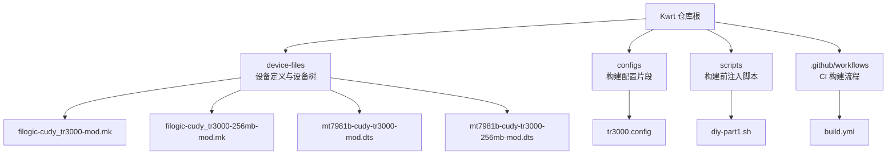
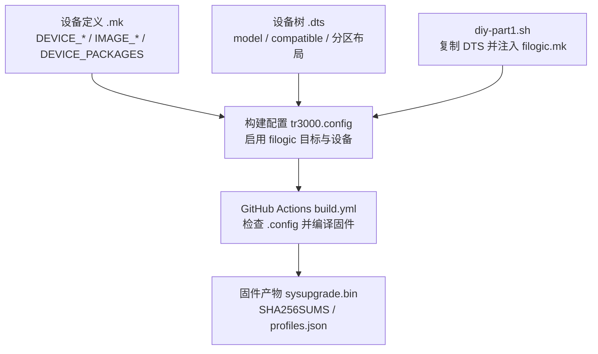
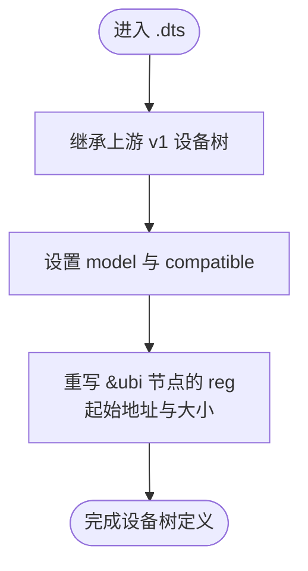
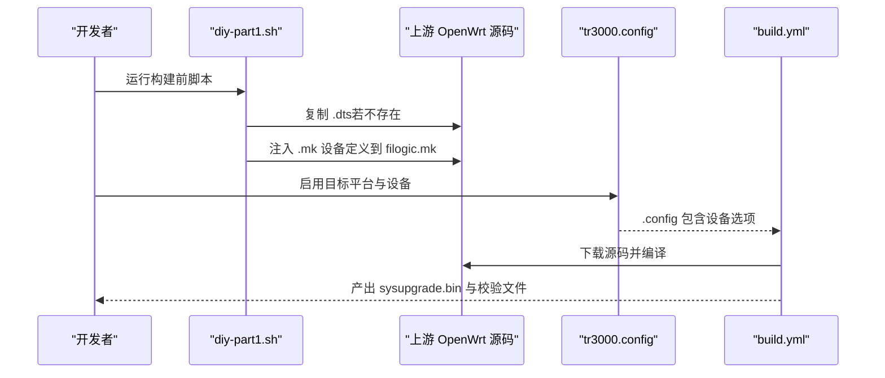
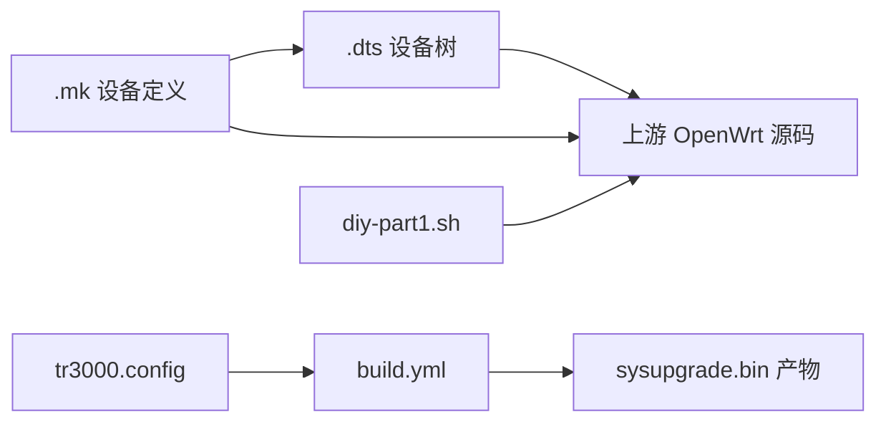

# 添加新设备支持

<cite>
**本文引用的文件**   
- [filogic-cudy_tr3000-256mb-mod.mk](file://device-files/filogic-cudy_tr3000-256mb-mod.mk)
- [filogic-cudy_tr3000-mod.mk](file://device-files/filogic-cudy_tr3000-mod.mk)
- [mt7981b-cudy-tr3000-256mb-mod.dts](file://device-files/mt7981b-cudy-tr3000-256mb-mod.dts)
- [mt7981b-cudy-tr3000-mod.dts](file://device-files/mt7981b-cudy-tr3000-mod.dts)
- [tr3000.config](file://configs/tr3000.config)
- [build.yml](file://.github/workflows/build.yml)
- [diy-part1.sh](file://scripts/diy-part1.sh)
</cite>

## 目录
1. [引言](#引言)
2. [项目结构](#项目结构)
3. [核心组件](#核心组件)
4. [架构总览](#架构总览)
5. [详细组件分析](#详细组件分析)
6. [依赖关系分析](#依赖关系分析)
7. [性能与分区注意事项](#性能与分区注意事项)
8. [故障排查指南](#故障排查指南)
9. [结论](#结论)
10. [附录：从现有设备复制与扩展的完整步骤](#附录从现有设备复制与扩展的完整步骤)

## 引言
本指南面向希望为 Kwrt（基于 OpenWrt）新增 Cudy TR3000 或其他 MediaTek Filogic 平台设备的开发者。文档以仓库中已有的 Cudy TR3000 大分区方案为例，系统说明如何：
- 创建 .mk 设备定义文件
- 编写或继承 .dts 设备树文件
- 配置分区布局与 UBI 大小
- 将设备注入到构建系统
- 在 GitHub Actions 中验证固件构建
- 排查常见硬件兼容性与分区问题

## 项目结构
Kwrt 仓库中与“添加新设备”直接相关的目录和文件如下：
- device-files：存放自定义的 .mk 设备定义与 .dts 设备树文件
- configs：OpenWrt 构建配置片段，启用目标平台与具体设备
- scripts：构建前脚本，负责将自定义设备注入上游 OpenWrt 源码
- .github/workflows：CI 构建流程，校验设备是否被正确识别并编译固件

**图表来源**
- [filogic-cudy_tr3000-mod.mk:1-19](file://device-files/filogic-cudy_tr3000-mod.mk#L1-L19)
- [filogic-cudy_tr3000-256mb-mod.mk:1-20](file://device-files/filogic-cudy_tr3000-256mb-mod.mk#L1-L20)
- [mt7981b-cudy-tr3000-mod.dts:1-23](file://device-files/mt7981b-cudy-tr3000-mod.dts#L1-L23)
- [mt7981b-cudy-tr3000-256mb-mod.dts:1-24](file://device-files/mt7981b-cudy-tr3000-256mb-mod.dts#L1-L24)
- [tr3000.config:1-33](file://configs/tr3000.config#L1-L33)
- [diy-part1.sh:1-51](file://scripts/diy-part1.sh#L1-L51)
- [build.yml:82-114](file://.github/workflows/build.yml#L82-L114)

**章节来源**
- [filogic-cudy_tr3000-mod.mk:1-19](file://device-files/filogic-cudy_tr3000-mod.mk#L1-L19)
- [filogic-cudy_tr3000-256mb-mod.mk:1-20](file://device-files/filogic-cudy_tr3000-256mb-mod.mk#L1-L20)
- [mt7981b-cudy-tr3000-mod.dts:1-23](file://device-files/mt7981b-cudy-tr3000-mod.dts#L1-L23)
- [mt7981b-cudy-tr3000-256mb-mod.dts:1-24](file://device-files/mt7981b-cudy-tr3000-256mb-mod.dts#L1-L24)
- [tr3000.config:1-33](file://configs/tr3000.config#L1-L33)
- [diy-part1.sh:1-51](file://scripts/diy-part1.sh#L1-L51)
- [build.yml:82-114](file://.github/workflows/build.yml#L82-L114)

## 核心组件
- 设备定义文件（.mk）
  - 定义设备厂商、型号、变体、DTS 名称、UBI 参数、镜像大小、内核位置、打包包等
  - 示例文件：
    - [filogic-cudy_tr3000-mod.mk](file://device-files/filogic-cudy_tr3000-mod.mk)
    - [filogic-cudy_tr3000-256mb-mod.mk](file://device-files/filogic-cudy_tr3000-256mb-mod.mk)
- 设备树文件（.dts）
  - 描述硬件模型、兼容性字符串、分区布局（如 ubi 起始地址与大小）
  - 示例文件：
    - [mt7981b-cudy-tr3000-mod.dts](file://device-files/mt7981b-cudy-tr3000-mod.dts)
    - [mt7981b-cudy-tr3000-256mb-mod.dts](file://device-files/mt7981b-cudy-tr3000-256mb-mod.dts)
- 构建配置（.config）
  - 启用 mediatek_filogic 目标平台，并选择具体设备
  - 示例文件：[tr3000.config](file://configs/tr3000.config)
- 构建注入脚本（bash）
  - 将自定义 .dts 与 .mk 注入上游 OpenWrt 源码，保证可重复构建
  - 示例文件：[diy-part1.sh](file://scripts/diy-part1.sh)
- CI 构建流程（GitHub Actions）
  - 检查设备是否出现在 .config，下载源码并编译固件，收集产物
  - 示例文件：[build.yml](file://.github/workflows/build.yml)

**章节来源**
- [filogic-cudy_tr3000-mod.mk:1-19](file://device-files/filogic-cudy_tr3000-mod.mk#L1-L19)
- [filogic-cudy_tr3000-256mb-mod.mk:1-20](file://device-files/filogic-cudy_tr3000-256mb-mod.mk#L1-L20)
- [mt7981b-cudy-tr3000-mod.dts:1-23](file://device-files/mt7981b-cudy-tr3000-mod.dts#L1-L23)
- [mt7981b-cudy-tr3000-256mb-mod.dts:1-24](file://device-files/mt7981b-cudy-tr3000-256mb-mod.dts#L1-L24)
- [tr3000.config:1-33](file://configs/tr3000.config#L1-L33)
- [diy-part1.sh:1-51](file://scripts/diy-part1.sh#L1-L51)
- [build.yml:82-114](file://.github/workflows/build.yml#L82-L114)

## 架构总览
下图展示从“设备定义 + 设备树”到“固件构建产物”的整体流程：

**图表来源**
- [filogic-cudy_tr3000-mod.mk:1-19](file://device-files/filogic-cudy_tr3000-mod.mk#L1-L19)
- [filogic-cudy_tr3000-256mb-mod.mk:1-20](file://device-files/filogic-cudy_tr3000-256mb-mod.mk#L1-L20)
- [mt7981b-cudy-tr3000-mod.dts:1-23](file://device-files/mt7981b-cudy-tr3000-mod.dts#L1-L23)
- [mt7981b-cudy-tr3000-256mb-mod.dts:1-24](file://device-files/mt7981b-cudy-tr3000-256mb-mod.dts#L1-L24)
- [tr3000.config:1-33](file://configs/tr3000.config#L1-L33)
- [diy-part1.sh:1-51](file://scripts/diy-part1.sh#L1-L51)
- [build.yml:82-114](file://.github/workflows/build.yml#L82-L114)

## 详细组件分析

### 设备定义文件（.mk）语法与字段
设备定义文件用于告诉 OpenWrt 如何为该设备生成固件镜像。关键字段包括：
- 基本信息
  - DEVICE_VENDOR：厂商名
  - DEVICE_MODEL：型号名
  - DEVICE_VARIANT：变体说明（例如大分区、U-Boot mod）
- 设备树关联
  - DEVICE_DTS：设备树基础文件名（不含后缀）
  - DEVICE_DTS_DIR：设备树所在目录（相对路径）
- 分区与镜像
  - UBINIZE_OPTS：UBI 参数（例如擦除对齐）
  - BLOCKSIZE / PAGESIZE：UBIFS/UBI 页与块大小
  - IMAGE_SIZE：镜像最大尺寸（决定最终 sysupgrade.bin 大小）
  - KERNEL_IN_UBI：是否将内核放入 UBI
  - IMAGE/sysupgrade.bin := ...：镜像生成规则
- 可选能力
  - SUPPORTED_DEVICES：允许从某设备升级到此设备
  - DEVICE_PACKAGES：默认包含的内核模块与固件包

参考实现：
- [filogic-cudy_tr3000-mod.mk](file://device-files/filogic-cudy_tr3000-mod.mk)
- [filogic-cudy_tr3000-256mb-mod.mk](file://device-files/filogic-cudy_tr3000-256mb-mod.mk)

要点说明：
- 两个 .mk 都使用 UBI 存储内核，并通过 append-metadata 附加元数据
- 通过 DEVICE_PACKAGES 引入 USB、Wi-Fi 驱动与 MT7981 相关固件
- 256M 变体额外声明 SUPPORTED_DEVICES，允许从标准版直接 sysupgrade

**章节来源**
- [filogic-cudy_tr3000-mod.mk:1-19](file://device-files/filogic-cudy_tr3000-mod.mk#L1-L19)
- [filogic-cudy_tr3000-256mb-mod.mk:1-20](file://device-files/filogic-cudy_tr3000-256mb-mod.mk#L1-L20)

### 设备树文件（.dts）规范与分区配置
设备树用于描述硬件模型、兼容性字符串以及分区布局。关键内容：
- model：可读的设备名称
- compatible：设备兼容字符串，通常包含厂商+型号，以及 SoC 通用兼容项
- 分区覆盖：通过 &ubi 节点重写 reg，指定 ubi 分区的起始地址与大小

参考实现：
- [mt7981b-cudy-tr3000-mod.dts](file://device-files/mt7981b-cudy-tr3000-mod.dts)
- [mt7981b-cudy-tr3000-256mb-mod.dts](file://device-files/mt7981b-cudy-tr3000-256mb-mod.dts)

分区布局要点：
- 128M 大分区（mod-112m）：ubi 起始于固定偏移，大小为 112MiB，尾部保留安全空间
- 256M 大分区：ubi 起始于相同偏移，大小为 240MiB，尾部保留约 10.25MiB
- 两者均继承上游 v1 硬件定义，仅覆盖 ubi 分区大小

**图表来源**
- [mt7981b-cudy-tr3000-mod.dts:1-23](file://device-files/mt7981b-cudy-tr3000-mod.dts#L1-L23)
- [mt7981b-cudy-tr3000-256mb-mod.dts:1-24](file://device-files/mt7981b-cudy-tr3000-256mb-mod.dts#L1-L24)

**章节来源**
- [mt7981b-cudy-tr3000-mod.dts:1-23](file://device-files/mt7981b-cudy-tr3000-mod.dts#L1-L23)
- [mt7981b-cudy-tr3000-256mb-mod.dts:1-24](file://device-files/mt7981b-cudy-tr3000-256mb-mod.dts#L1-L24)

### 构建配置与设备注入
- tr3000.config
  - 启用 CONFIG_TARGET_mediatek 与 CONFIG_TARGET_medicatek_filogic
  - 选择四个设备：cudy_tr3000-v1、cudy_tr3000-mod、cudy_tr3000-256mb-v1、cudy_tr3000-256mb-mod
- diy-part1.sh
  - 在 feeds 更新前运行
  - 将自定义 .dts 复制到 target/linux/mediatek/dts（若不存在）
  - 将 .mk 设备定义注入 target/linux/mediatek/image/filogic.mk（幂等）
  - 自检上游是否存在基础设备 cudy_tr3000-v1 与 cudy_tr3000-256mb-v1

**图表来源**
- [tr3000.config:1-33](file://configs/tr3000.config#L1-L33)
- [diy-part1.sh:1-51](file://scripts/diy-part1.sh#L1-L51)
- [build.yml:82-114](file://.github/workflows/build.yml#L82-L114)

**章节来源**
- [tr3000.config:1-33](file://configs/tr3000.config#L1-L33)
- [diy-part1.sh:1-51](file://scripts/diy-part1.sh#L1-L51)
- [build.yml:82-114](file://.github/workflows/build.yml#L82-L114)

### 从现有设备复制与修改的完整示例
以 Cudy TR3000 为例，新增一个类似设备（例如另一款 Filogic 路由器）的步骤：

1. 准备设备信息
   - 确认 SoC（例如 mt7981/mt7981b）、内存容量、原厂分区布局
   - 确定是否需要大分区方案（mod-112m 或更大）

2. 创建 .dts
   - 基于上游 v1 设备树进行继承
   - 设置 model 与 compatible
   - 根据实际闪存布局重写 ubi 分区大小与起始地址
   - 参考：
     - [mt7981b-cudy-tr3000-mod.dts](file://device-files/mt7981b-cudy-tr3000-mod.dts)
     - [mt7981b-cudy-tr3000-256mb-mod.dts](file://device-files/mt7981b-cudy-tr3000-256mb-mod.dts)

3. 创建 .mk
   - 填写 DEVICE_VENDOR / DEVICE_MODEL / DEVICE_VARIANT
   - 指定 DEVICE_DTS 与 DEVICE_DTS_DIR
   - 配置 UBINIZE_OPTS / BLOCKSIZE / PAGESIZE / IMAGE_SIZE / KERNEL_IN_UBI
   - 设置 IMAGE/sysupgrade.bin 生成规则
   - 按需添加 DEVICE_PACKAGES
   - 参考：
     - [filogic-cudy_tr3000-mod.mk](file://device-files/filogic-cudy_tr3000-mod.mk)
     - [filogic-cudy_tr3000-256mb-mod.mk](file://device-files/filogic-cudy_tr3000-256mb-mod.mk)

4. 注入构建系统
   - 将 .dts 与 .mk 放入 device-files
   - 确保 diy-part1.sh 能复制 .dts 并注入 .mk
   - 参考：[diy-part1.sh](file://scripts/diy-part1.sh)

5. 启用设备构建
   - 在 tr3000.config 中添加对应设备选项
   - 参考：[tr3000.config](file://configs/tr3000.config)

6. 构建与验证
   - 在 GitHub Actions 或本地执行 make defconfig 与 make
   - 检查 .config 是否包含新设备
   - 收集 bin/targets/mediatek/filogic/*sysupgrade.bin 产物
   - 参考：[build.yml](file://.github/workflows/build.yml)

**章节来源**
- [mt7981b-cudy-tr3000-mod.dts:1-23](file://device-files/mt7981b-cudy-tr3000-mod.dts#L1-L23)
- [mt7981b-cudy-tr3000-256mb-mod.dts:1-24](file://device-files/mt7981b-cudy-tr3000-256mb-mod.dts#L1-L24)
- [filogic-cudy_tr3000-mod.mk:1-19](file://device-files/filogic-cudy_tr3000-mod.mk#L1-L19)
- [filogic-cudy_tr3000-256mb-mod.mk:1-20](file://device-files/filogic-cudy_tr3000-256mb-mod.mk#L1-L20)
- [diy-part1.sh:1-51](file://scripts/diy-part1.sh#L1-L51)
- [tr3000.config:1-33](file://configs/tr3000.config#L1-L33)
- [build.yml:82-114](file://.github/workflows/build.yml#L82-L114)

## 依赖关系分析
- 设备定义与设备树
  - .mk 通过 DEVICE_DTS 指向 .dts，二者必须一致
- 构建脚本与上游源码
  - diy-part1.sh 依赖上游存在 filogic.mk 与基础设备定义
- 构建配置与 CI
  - tr3000.config 启用的设备必须在 .config 中出现，否则 CI 会报错
- 固件产物
  - build.yml 收集 *cudy_tr3000*sysupgrade.bin 与 sha256sums/profiles.json

**图表来源**
- [filogic-cudy_tr3000-mod.mk:1-19](file://device-files/filogic-cudy_tr3000-mod.mk#L1-L19)
- [filogic-cudy_tr3000-256mb-mod.mk:1-20](file://device-files/filogic-cudy_tr3000-256mb-mod.mk#L1-L20)
- [mt7981b-cudy-tr3000-mod.dts:1-23](file://device-files/mt7981b-cudy-tr3000-mod.dts#L1-L23)
- [mt7981b-cudy-tr3000-256mb-mod.dts:1-24](file://device-files/mt7981b-cudy-tr3000-256mb-mod.dts#L1-L24)
- [diy-part1.sh:1-51](file://scripts/diy-part1.sh#L1-L51)
- [tr3000.config:1-33](file://configs/tr3000.config#L1-L33)
- [build.yml:82-114](file://.github/workflows/build.yml#L82-L114)

**章节来源**
- [filogic-cudy_tr3000-mod.mk:1-19](file://device-files/filogic-cudy_tr3000-mod.mk#L1-L19)
- [filogic-cudy_tr3000-256mb-mod.mk:1-20](file://device-files/filogic-cudy_tr3000-256mb-mod.mk#L1-L20)
- [mt7981b-cudy-tr3000-mod.dts:1-23](file://device-files/mt7981b-cudy-tr3000-mod.dts#L1-L23)
- [mt7981b-cudy-tr3000-256mb-mod.dts:1-24](file://device-files/mt7981b-cudy-tr3000-256mb-mod.dts#L1-L24)
- [diy-part1.sh:1-51](file://scripts/diy-part1.sh#L1-L51)
- [tr3000.config:1-33](file://configs/tr3000.config#L1-L33)
- [build.yml:82-114](file://.github/workflows/build.yml#L82-L114)

## 性能与分区注意事项
- UBI 与 UBIFS 参数
  - UBINIZE_OPTS、BLOCKSIZE、PAGESIZE 需匹配硬件闪存特性
  - 参考：[filogic-cudy_tr3000-mod.mk](file://device-files/filogic-cudy_tr3000-mod.mk)、[filogic-cudy_tr3000-256mb-mod.mk](file://device-files/filogic-cudy_tr3000-256mb-mod.mk)
- 镜像大小
  - IMAGE_SIZE 应小于等于可用分区大小，避免写入失败
  - 参考：[filogic-cudy_tr3000-mod.mk](file://device-files/filogic-cudy_tr3000-mod.mk)、[filogic-cudy_tr3000-256mb-mod.mk](file://device-files/filogic-cudy_tr3000-256mb-mod.mk)
- 内核位置
  - KERNEL_IN_UBI=1 表示内核位于 UBI，需确保分区布局与 U-Boot 支持
  - 参考：[filogic-cudy_tr3000-mod.mk](file://device-files/filogic-cudy_tr3000-mod.mk)、[filogic-cudy_tr3000-256mb-mod.mk](file://device-files/filogic-cudy_tr3000-256mb-mod.mk)
- 尾部安全空间
  - 大分区方案保留尾部空间以避免破坏原厂引导区
  - 参考：[mt7981b-cudy-tr3000-mod.dts](file://device-files/mt7981b-cudy-tr3000-mod.dts)、[mt7981b-cudy-tr3000-256mb-mod.dts](file://device-files/mt7981b-cudy-tr3000-256mb-mod.dts)

**章节来源**
- [filogic-cudy_tr3000-mod.mk:1-19](file://device-files/filogic-cudy_tr3000-mod.mk#L1-L19)
- [filogic-cudy_tr3000-256mb-mod.mk:1-20](file://device-files/filogic-cudy_tr3000-256mb-mod.mk#L1-L20)
- [mt7981b-cudy-tr3000-mod.dts:1-23](file://device-files/mt7981b-cudy-tr3000-mod.dts#L1-L23)
- [mt7981b-cudy-tr3000-256mb-mod.dts:1-24](file://device-files/mt7981b-cudy-tr3000-256mb-mod.dts#L1-L24)

## 故障排查指南
常见问题与定位方法：
- 设备未出现在 .config
  - 现象：CI 报错提示设备未出现在 .config
  - 原因：tr3000.config 未启用该设备，或 diy-part1.sh 未注入 .mk
  - 处理：检查 tr3000.config 与 diy-part1.sh 注入逻辑
  - 参考：[tr3000.config:1-33](file://configs/tr3000.config#L1-L33)、[build.yml:82-114](file://.github/workflows/build.yml#L82-L114)、[diy-part1.sh:37-49](file://scripts/diy-part1.sh#L37-L49)
- 上游基础设备缺失
  - 现象：diy-part1.sh 警告上游未找到 cudy_tr3000-v1 或 cudy_tr3000-256mb-v1
  - 原因：OpenWrt 分支不支持该机型
  - 处理：切换到支持的基础分支或先合并上游设备定义
  - 参考：[diy-part1.sh:21-26](file://scripts/diy-part1.sh#L21-L26)
- 分区布局不匹配
  - 现象：刷入后无法启动或文件系统损坏
  - 原因：.dts 中 ubi 分区大小或起始地址与实际硬件不符
  - 处理：核对原厂布局与安全边界，调整 reg 值
  - 参考：[mt7981b-cudy-tr3000-mod.dts:19-22](file://device-files/mt7981b-cudy-tr3000-mod.dts#L19-L22)、[mt7981b-cudy-tr3000-256mb-mod.dts:20-23](file://device-files/mt7981b-cudy-tr3000-256mb-mod.dts#L20-L23)
- 固件体积过大
  - 现象：sysupgrade.bin 写入失败
  - 原因：IMAGE_SIZE 超过可用分区
  - 处理：减小镜像或扩大分区（需配合 U-Boot 与 .dts）
  - 参考：[filogic-cudy_tr3000-mod.mk:13-16](file://device-files/filogic-cudy_tr3000-mod.mk#L13-L16)、[filogic-cudy_tr3000-256mb-mod.mk:14-17](file://device-files/filogic-cudy_tr3000-256mb-mod.mk#L14-L17)

**章节来源**
- [tr3000.config:1-33](file://configs/tr3000.config#L1-L33)
- [build.yml:82-114](file://.github/workflows/build.yml#L82-L114)
- [diy-part1.sh:21-26](file://scripts/diy-part1.sh#L21-L26)
- [diy-part1.sh:37-49](file://scripts/diy-part1.sh#L37-L49)
- [mt7981b-cudy-tr3000-mod.dts:19-22](file://device-files/mt7981b-cudy-tr3000-mod.dts#L19-L22)
- [mt7981b-cudy-tr3000-256mb-mod.dts:20-23](file://device-files/mt7981b-cudy-tr3000-256mb-mod.dts#L20-L23)
- [filogic-cudy_tr3000-mod.mk:13-16](file://device-files/filogic-cudy_tr3000-mod.mk#L13-L16)
- [filogic-cudy_tr3000-256mb-mod.mk:14-17](file://device-files/filogic-cudy_tr3000-256mb-mod.mk#L14-L17)

## 结论
通过本指南，你可以：
- 理解 .mk 与 .dts 的职责与语法
- 掌握分区布局与 UBI 参数的配置方法
- 使用 diy-part1.sh 将自定义设备注入上游 OpenWrt 源码
- 在 CI 中验证设备构建与固件产物
- 排查常见的兼容性、分区与构建问题

建议优先从现有 Cudy TR3000 设备复制与修改，逐步适配新硬件，并确保分区布局与 U-Boot 环境一致。

## 附录：从现有设备复制与扩展的完整步骤
- 步骤清单
  1. 复制现有 .mk 与 .dts 模板
     - 参考：[filogic-cudy_tr3000-mod.mk](file://device-files/filogic-cudy_tr3000-mod.mk)、[mt7981b-cudy-tr3000-mod.dts](file://device-files/mt7981b-cudy-tr3000-mod.dts)
  2. 修改设备信息与分区布局
     - 调整 model、compatible、ubi 分区大小与起始地址
     - 参考：[mt7981b-cudy-tr3000-mod.dts:14-22](file://device-files/mt7981b-cudy-tr3000-mod.dts#L14-L22)
  3. 配置构建选项
     - 在 tr3000.config 中添加新设备
     - 参考：[tr3000.config:15-19](file://configs/tr3000.config#L15-L19)
  4. 运行构建前脚本
     - 确保 diy-part1.sh 成功注入 .mk 与 .dts
     - 参考：[diy-part1.sh:28-49](file://scripts/diy-part1.sh#L28-L49)
  5. 执行构建与收集产物
     - 在 CI 或本地执行构建，收集 sysupgrade.bin
     - 参考：[build.yml:95-114](file://.github/workflows/build.yml#L95-L114)
  6. 测试与验证
     - 刷入设备，检查系统启动、网络、USB、Wi-Fi 功能
     - 观察日志与分区使用情况，必要时调整分区布局

**章节来源**
- [filogic-cudy_tr3000-mod.mk:1-19](file://device-files/filogic-cudy_tr3000-mod.mk#L1-L19)
- [mt7981b-cudy-tr3000-mod.dts:14-22](file://device-files/mt7981b-cudy-tr3000-mod.dts#L14-L22)
- [tr3000.config:15-19](file://configs/tr3000.config#L15-L19)
- [diy-part1.sh:28-49](file://scripts/diy-part1.sh#L28-L49)
- [build.yml:95-114](file://.github/workflows/build.yml#L95-L114)