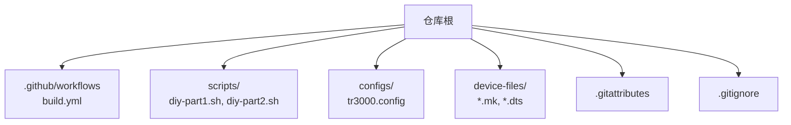
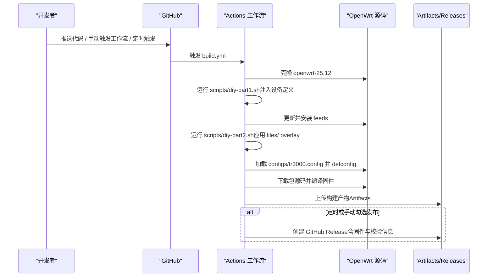
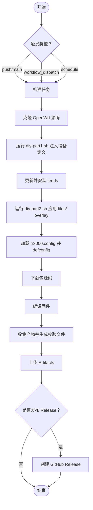
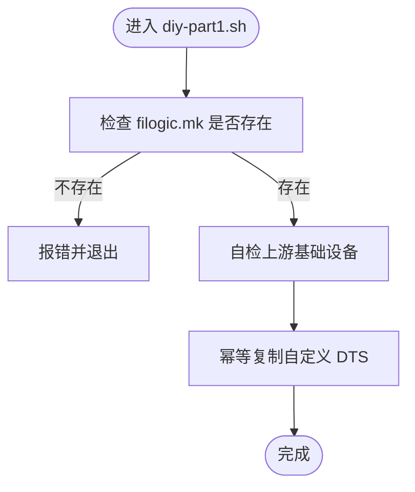
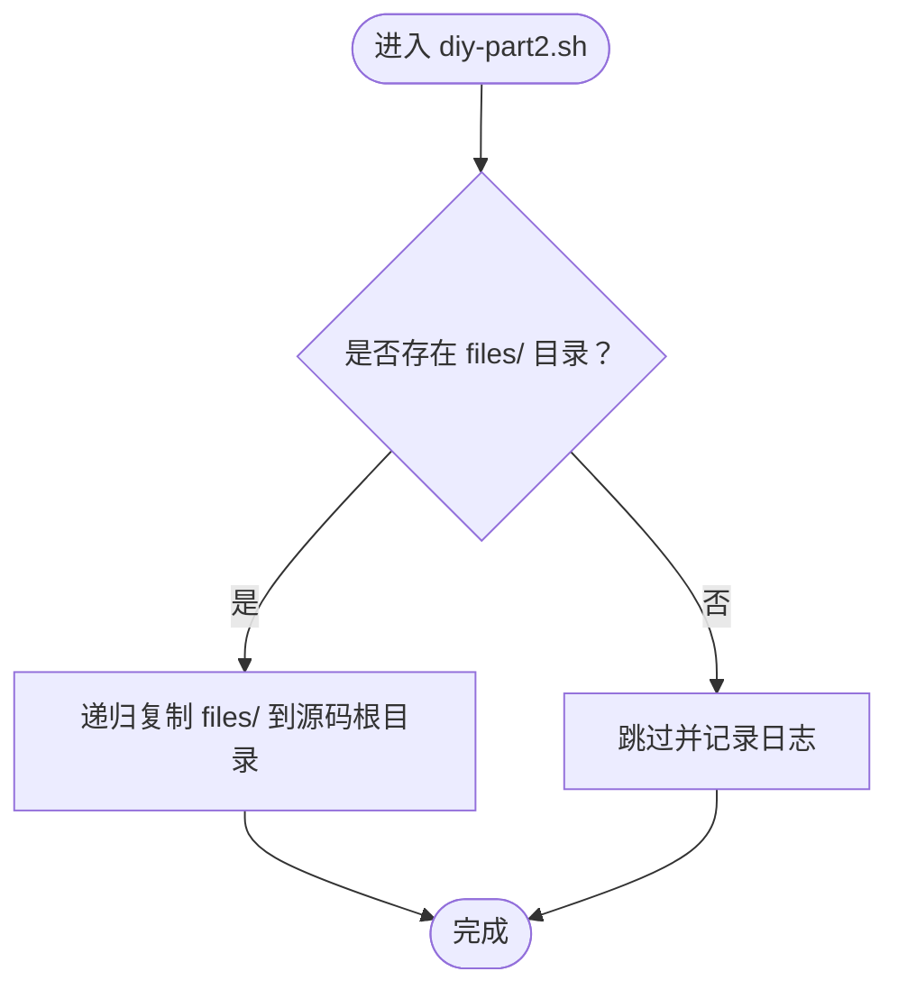
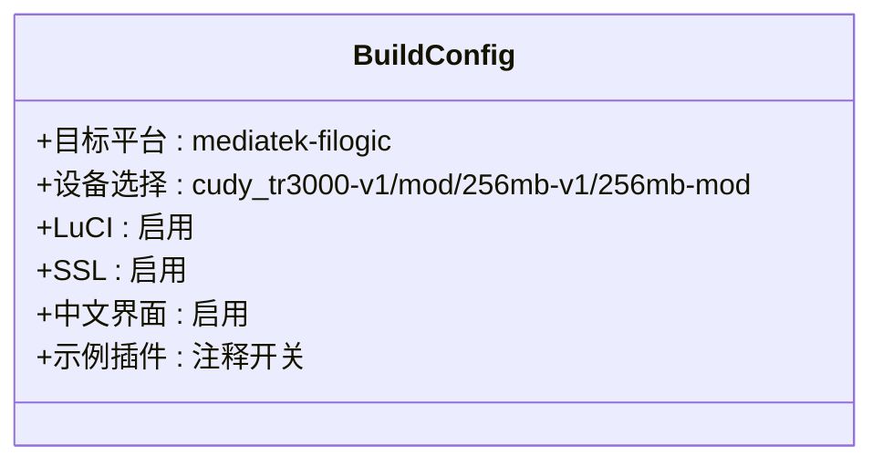
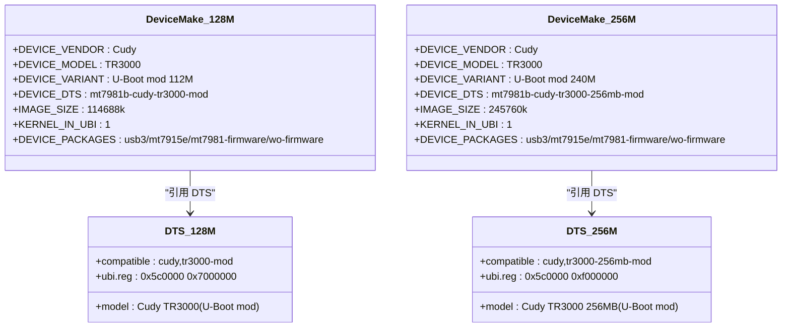
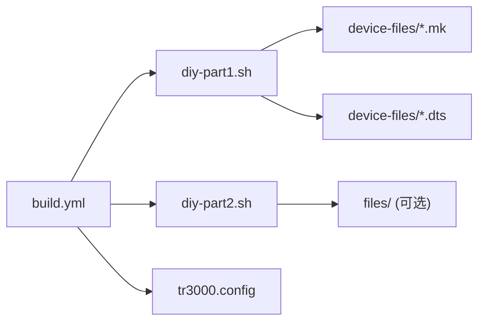

# 贡献工作流程

<cite>
**本文引用的文件**   
- [.github/workflows/build.yml](file://.github/workflows/build.yml)
- [scripts/diy-part1.sh](file://scripts/diy-part1.sh)
- [scripts/diy-part2.sh](file://scripts/diy-part2.sh)
- [configs/tr3000.config](file://configs/tr3000.config)
- [device-files/filogic-cudy_tr3000-mod.mk](file://device-files/filogic-cudy_tr3000-mod.mk)
- [device-files/filogic-cudy_tr3000-256mb-mod.mk](file://device-files/filogic-cudy_tr3000-256mb-mod.mk)
- [device-files/mt7981b-cudy-tr3000-mod.dts](file://device-files/mt7981b-cudy-tr3000-mod.dts)
- [device-files/mt7981b-cudy-tr3000-256mb-mod.dts](file://device-files/mt7981b-cudy-tr3000-256mb-mod.dts)
- [.gitattributes](file://.gitattributes)
- [.gitignore](file://.gitignore)
</cite>

## 目录
1. [引言](#引言)
2. [项目结构](#项目结构)
3. [核心组件](#核心组件)
4. [架构总览](#架构总览)
5. [详细组件分析](#详细组件分析)
6. [依赖关系分析](#依赖关系分析)
7. [性能与构建注意事项](#性能与构建注意事项)
8. [故障排查指南](#故障排查指南)
9. [结论](#结论)
10. [附录：贡献者操作清单](#附录贡献者操作清单)

## 引言
本仓库为 Cudy TR3000 设备的 OpenWrt 固件定制层，提供设备定义、构建配置与 GitHub Actions 自动编译流水线。贡献者通过 Fork 仓库、创建功能分支、提交 Pull Request 参与开发；代码变更会触发自动化构建，产出多版本固件并可选择发布到 Releases。本文档面向贡献者，说明如何高效参与项目开发、维护与协作。

## 项目结构
仓库采用“设备定制 + 构建脚本 + 工作流”的轻量结构：
- `.github/workflows/build.yml`：GitHub Actions 自动构建与发布流程。
- `scripts/`：在构建前注入设备定义与应用自定义文件的脚本。
- `configs/`：OpenWrt 构建配置（目标平台、设备选择、插件开关）。
- `device-files/`：设备 Make 定义与 DTS 设备树，用于生成大分区固件。
- `.gitattributes`：统一换行符，保证脚本在 Linux 构建机可执行。
- `.gitignore`：忽略本地构建产物与编辑器缓存。

**图表来源**
- [.github/workflows/build.yml:1-33](file://.github/workflows/build.yml#L1-L33)
- [.gitattributes:1-6](file://.gitattributes#L1-L6)
- [.gitignore:1-12](file://.gitignore#L1-L12)

**章节来源**
- [.github/workflows/build.yml:1-33](file://.github/workflows/build.yml#L1-L33)
- [.gitattributes:1-6](file://.gitattributes#L1-L6)
- [.gitignore:1-12](file://.gitignore#L1-L12)

## 核心组件
- 构建工作流：负责克隆官方 OpenWrt 源码、注入设备定义、安装 feeds、加载构建配置、下载源码、编译固件、收集产物、上传 Artifacts，并可创建 Release。
- 设备注入脚本：在构建前将设备 Make 定义与 DTS 注入到 OpenWrt 源码中，确保大分区设备可用。
- 自定义文件应用脚本：将仓库 `files/` 内容覆盖到 OpenWrt 源码根目录，打包进固件。
- 构建配置：声明目标平台、设备选择与 LuCI 中文界面等插件开关。
- 设备定义与设备树：定义 128M/256M 大分区版本的硬件描述与镜像参数。

**章节来源**
- [.github/workflows/build.yml:34-165](file://.github/workflows/build.yml#L34-L165)
- [scripts/diy-part1.sh:1-35](file://scripts/diy-part1.sh#L1-L35)
- [scripts/diy-part2.sh:1-21](file://scripts/diy-part2.sh#L1-L21)
- [configs/tr3000.config:1-34](file://configs/tr3000.config#L1-L34)
- [device-files/filogic-cudy_tr3000-mod.mk:1-19](file://device-files/filogic-cudy_tr3000-mod.mk#L1-L19)
- [device-files/filogic-cudy_tr3000-256mb-mod.mk:1-20](file://device-files/filogic-cudy_tr3000-256mb-mod.mk#L1-L20)
- [device-files/mt7981b-cudy-tr3000-mod.dts:1-23](file://device-files/mt7981b-cudy-tr3000-mod.dts#L1-L23)
- [device-files/mt7981b-cudy-tr3000-256mb-mod.dts:1-24](file://device-files/mt7981b-cudy-tr3000-256mb-mod.dts#L1-L24)

## 架构总览
下图展示从代码提交到固件产物的端到端流程，包括手动触发、推送触发与定时任务三种方式。

**图表来源**
- [.github/workflows/build.yml:10-33](file://.github/workflows/build.yml#L10-L33)
- [.github/workflows/build.yml:59-123](file://.github/workflows/build.yml#L59-L123)
- [.github/workflows/build.yml:125-165](file://.github/workflows/build.yml#L125-L165)

**章节来源**
- [.github/workflows/build.yml:10-33](file://.github/workflows/build.yml#L10-L33)
- [.github/workflows/build.yml:59-123](file://.github/workflows/build.yml#L59-L123)
- [.github/workflows/build.yml:125-165](file://.github/workflows/build.yml#L125-L165)

## 详细组件分析

### 构建工作流（GitHub Actions）
- 触发条件：
  - 手动触发（workflow_dispatch），支持是否发布到 Releases。
  - 推送到 main/master 分支时自动构建。
  - 每周日 22:30 UTC 定时构建并发布。
- 权限与并发：
  - 授予 contents: write 以创建 Release。
  - 使用 concurrency 控制同一 ref 的构建队列。
- 主要步骤：
  - 清理磁盘空间、安装宿主依赖。
  - 克隆官方 OpenWrt openwrt-25.12 分支。
  - 运行 diy-part1.sh 注入设备定义。
  - 更新并安装 feeds。
  - 运行 diy-part2.sh 应用自定义文件 overlay。
  - 加载 tr3000.config 并验证设备配置。
  - 下载包源码并编译固件。
  - 收集 sysupgrade.bin、SHA256SUMS.txt、profiles.json 等产物。
  - 上传 Artifacts，并在满足条件时创建 Release。

**图表来源**
- [.github/workflows/build.yml:10-33](file://.github/workflows/build.yml#L10-L33)
- [.github/workflows/build.yml:40-123](file://.github/workflows/build.yml#L40-L123)
- [.github/workflows/build.yml:125-165](file://.github/workflows/build.yml#L125-L165)

**章节来源**
- [.github/workflows/build.yml:10-33](file://.github/workflows/build.yml#L10-L33)
- [.github/workflows/build.yml:40-123](file://.github/workflows/build.yml#L40-L123)
- [.github/workflows/build.yml:125-165](file://.github/workflows/build.yml#L125-L165)

### 设备注入脚本（diy-part1.sh）
- 作用：在 feeds 更新前向 OpenWrt 源码注入 Cudy TR3000 大分区设备定义。
- 关键逻辑：
  - 检查 OpenWrt 源码根目录是否存在 filogic.mk。
  - 自检上游基础设备是否存在。
  - 幂等复制自定义 DTS 到 target/linux/mediatek/dts。
  - 后续由工作流继续完成 image 定义注入与构建。

**图表来源**
- [scripts/diy-part1.sh:1-35](file://scripts/diy-part1.sh#L1-L35)

**章节来源**
- [scripts/diy-part1.sh:1-35](file://scripts/diy-part1.sh#L1-L35)

### 自定义文件应用脚本（diy-part2.sh）
- 作用：在 feeds 安装后应用仓库内 files/ 自定义 overlay（默认配置、首次启动脚本等）。
- 关键逻辑：
  - 若存在 files/ 目录，则递归复制到 OpenWrt 源码根目录。
  - 输出日志便于调试。

**图表来源**
- [scripts/diy-part2.sh:1-21](file://scripts/diy-part2.sh#L1-L21)

**章节来源**
- [scripts/diy-part2.sh:1-21](file://scripts/diy-part2.sh#L1-L21)

### 构建配置（tr3000.config）
- 目标平台：mediatek-filogic。
- 设备选择：包含标准版与大分区版的四个设备。
- 界面与插件：启用 LuCI、SSL 与简体中文 i18n，示例插件以注释形式提供。

**图表来源**
- [configs/tr3000.config:1-34](file://configs/tr3000.config#L1-L34)

**章节来源**
- [configs/tr3000.config:1-34](file://configs/tr3000.config#L1-L34)

### 设备定义与设备树
- 设备 Make 定义：
  - 128M 大分区版：定义设备名、DTS、UBI 参数、镜像大小与附加驱动包。
  - 256M 大分区版：定义设备名、DTS、UBI 参数、镜像大小与附加驱动包。
- 设备树（DTS）：
  - 128M 大分区版：基于官方 v1 定义，扩展 ubi 分区至 112MiB。
  - 256M 大分区版：基于官方 256mb v1 定义，扩展 ubi 分区至 240MiB。

**图表来源**
- [device-files/filogic-cudy_tr3000-mod.mk:1-19](file://device-files/filogic-cudy_tr3000-mod.mk#L1-L19)
- [device-files/filogic-cudy_tr3000-256mb-mod.mk:1-20](file://device-files/filogic-cudy_tr3000-256mb-mod.mk#L1-L20)
- [device-files/mt7981b-cudy-tr3000-mod.dts:1-23](file://device-files/mt7981b-cudy-tr3000-mod.dts#L1-L23)
- [device-files/mt7981b-cudy-tr3000-256mb-mod.dts:1-24](file://device-files/mt7981b-cudy-tr3000-256mb-mod.dts#L1-L24)

**章节来源**
- [device-files/filogic-cudy_tr3000-mod.mk:1-19](file://device-files/filogic-cudy_tr3000-mod.mk#L1-L19)
- [device-files/filogic-cudy_tr3000-256mb-mod.mk:1-20](file://device-files/filogic-cudy_tr3000-256mb-mod.mk#L1-L20)
- [device-files/mt7981b-cudy-tr3000-mod.dts:1-23](file://device-files/mt7981b-cudy-tr3000-mod.dts#L1-L23)
- [device-files/mt7981b-cudy-tr3000-256mb-mod.dts:1-24](file://device-files/mt7981b-cudy-tr3000-256mb-mod.dts#L1-L24)

## 依赖关系分析
- 工作流依赖：
  - 外部：openwrt/openwrt 源码（openwrt-25.12）。
  - 内部：scripts/diy-part1.sh、scripts/diy-part2.sh、configs/tr3000.config、device-files/*.mk 与 *.dts。
- 脚本依赖：
  - diy-part1.sh 依赖 device-files 与 OpenWrt 源码结构。
  - diy-part2.sh 依赖 files/ 目录（可选）。
- 配置依赖：
  - tr3000.config 声明的设备需在 OpenWrt 源码中存在或通过 diy-part1.sh 注入。

**图表来源**
- [.github/workflows/build.yml:59-76](file://.github/workflows/build.yml#L59-L76)
- [scripts/diy-part1.sh:1-35](file://scripts/diy-part1.sh#L1-L35)
- [scripts/diy-part2.sh:1-21](file://scripts/diy-part2.sh#L1-L21)
- [configs/tr3000.config:1-34](file://configs/tr3000.config#L1-L34)

**章节来源**
- [.github/workflows/build.yml:59-76](file://.github/workflows/build.yml#L59-L76)
- [scripts/diy-part1.sh:1-35](file://scripts/diy-part1.sh#L1-L35)
- [scripts/diy-part2.sh:1-21](file://scripts/diy-part2.sh#L1-L21)
- [configs/tr3000.config:1-34](file://configs/tr3000.config#L1-L34)

## 性能与构建注意事项
- 构建环境：
  - 使用 ubuntu-24.04 虚拟机，设置超时 350 分钟。
  - 预清理磁盘空间并安装必要构建工具链。
- 并行下载与编译：
  - 下载包源码使用多线程（-j8），失败时回退单线程并开启详细日志。
  - 编译固件根据 CPU 核数并行（-j$(nproc)），失败时回退单线程并开启详细日志。
- 产物收集：
  - 收集所有 cudy_tr3000*sysupgrade.bin 及校验文件、profiles.json。
  - 生成 SHA256SUMS.txt 并写入步骤摘要。

**章节来源**
- [.github/workflows/build.yml:34-38](file://.github/workflows/build.yml#L34-L38)
- [.github/workflows/build.yml:44-57](file://.github/workflows/build.yml#L44-L57)
- [.github/workflows/build.yml:91-115](file://.github/workflows/build.yml#L91-L115)

## 故障排查指南
- 常见错误与定位：
  - 设备未出现在 .config：工作流会在加载配置阶段检查四个设备是否启用，若缺失将报错并终止。
  - 上游基础设备缺失：diy-part1.sh 会检测上游 filogic.mk 中是否存在基础设备定义，缺失则发出警告。
  - 脚本无法执行：确保 .gitattributes 已统一换行符为 LF，避免 Windows 编辑导致脚本在 Linux 构建机不可执行。
- 建议排查步骤：
  - 查看 Actions 构建日志中的错误输出。
  - 确认 configs/tr3000.config 中设备选择正确。
  - 确认 device-files 中 DTS 与 Make 定义一致且路径正确。
  - 检查 .gitattributes 与 .gitignore 是否正确配置。

**章节来源**
- [.github/workflows/build.yml:78-89](file://.github/workflows/build.yml#L78-L89)
- [scripts/diy-part1.sh:16-26](file://scripts/diy-part1.sh#L16-L26)
- [.gitattributes:1-6](file://.gitattributes#L1-L6)
- [.gitignore:1-12](file://.gitignore#L1-L12)

## 结论
本仓库通过清晰的设备定义、构建脚本与自动化工作流，实现了 Cudy TR3000 多版本固件的稳定构建与发布。贡献者可依据本文档的流程参与开发，确保代码质量与构建稳定性。建议在提交变更前进行本地验证，遵循统一的换行规范与配置约定，并通过 Pull Request 与社区协作。

## 附录：贡献者操作清单
- Fork 仓库并创建功能分支：
  - 从 main/master 分支创建功能分支，命名体现改动范围（如 feature/add-plugin、fix/device-dts）。
- 修改与验证：
  - 如需新增设备，请在 device-files 中添加对应的 .mk 与 .dts，并确保 configs/tr3000.config 启用该设备。
  - 如需添加默认文件或首次启动脚本，请将内容放入 files/ 目录，由 diy-part2.sh 自动应用。
  - 确保 .gitattributes 保持 LF 换行，避免脚本在构建机执行失败。
- 提交与 Pull Request：
  - 提交 Commit Message 应简洁明确，说明改动目的与影响范围。
  - 提交 PR 时附上改动说明、测试方法与预期结果。
- 构建流水线监控：
  - 推送代码或手动触发工作流后，查看 Actions 构建状态与产物。
  - 如需发布 Release，可在 workflow_dispatch 中选择发布选项，或在定时任务中自动发布。
- Issue 报告与问题跟踪：
  - 报告问题时请提供设备型号、固件版本、复现步骤与日志片段。
  - 尽量关联相关配置文件与脚本路径，便于快速定位。
- 社区协作与行为准则：
  - 尊重他人意见，保持建设性沟通。
  - 在讨论中聚焦问题本身，避免人身攻击与无关争论。
  - 遵守开源社区的通用礼仪与规范。

[本节为通用指导，不直接分析具体文件]