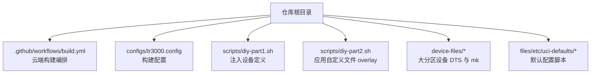
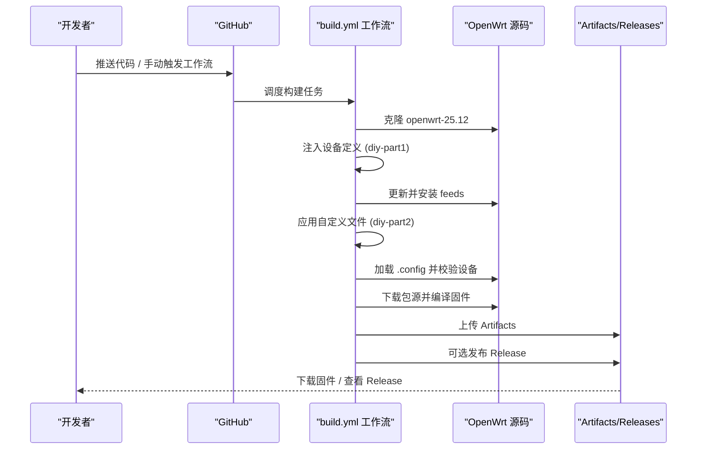
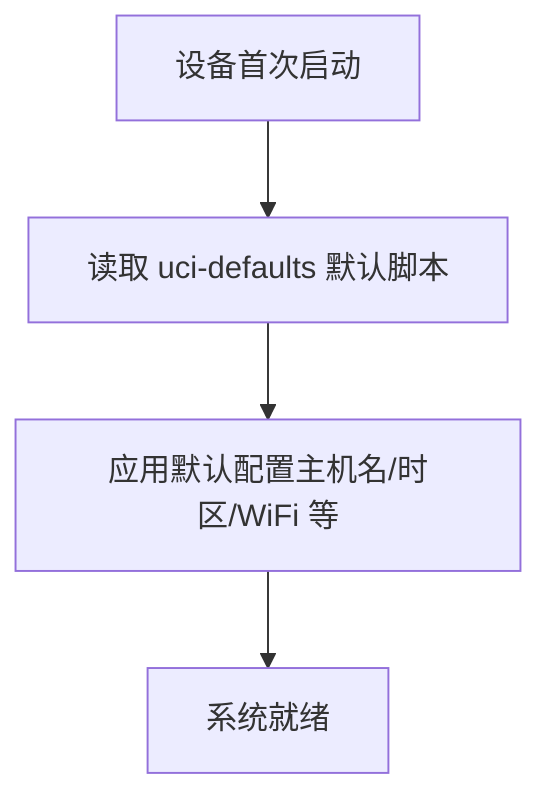

# 快速开始

<cite>
**本文引用的文件**   
- [README.md](file://README.md)
- [.github/workflows/build.yml](file://.github/workflows/build.yml)
- [configs/tr3000.config](file://configs/tr3000.config)
- [scripts/diy-part1.sh](file://scripts/diy-part1.sh)
- [scripts/diy-part2.sh](file://scripts/diy-part2.sh)
</cite>

## 目录
1. [简介](#简介)
2. [项目结构](#项目结构)
3. [环境准备与依赖安装](#环境准备与依赖安装)
4. [云端构建：使用 GitHub Actions](#云端构建使用-github-actions)
5. [本地构建：在本地设置 OpenWrt 编译环境](#本地构建在本地设置-openwrt-编译环境)
6. [固件版本选择与刷机方法](#固件版本选择与刷机方法)
7. [初始配置与默认行为](#初始配置与默认行为)
8. [常见问题与故障排除](#常见问题与故障排除)
9. [性能与构建优化建议](#性能与构建优化建议)
10. [结论](#结论)

## 简介
本仓库为 Cudy TR3000 的 OpenWrt 固件自动构建项目。它基于官方 OpenWrt 稳定分支，通过 GitHub Actions 一次构建同时产出 128M 与 256M 两种硬件版本的“标准版”和“大分区版”，共四款固件。项目提供清晰的配置文件、设备注入脚本与自定义文件 overlay，便于初学者快速上手，也满足开发者对构建流程的可控性与可定制性需求。

## 项目结构
仓库采用“配置驱动 + 脚本注入 + 云端自动化”的组织方式：
- `.github/workflows/build.yml`：GitHub Actions 工作流，负责拉取源码、注入设备定义、更新 feeds、下载包源、编译固件并上传产物或发布 Release。
- `configs/tr3000.config`：OpenWrt 构建配置，指定目标平台、设备选择、LuCI 与中文界面等。
- `device-files/`：存放大分区（mod）设备的 DTS 与 mk 定义，由 diy 脚本在编译前注入到上游 OpenWrt 源码。
- `scripts/diy-part1.sh`：在 feeds 更新前执行，负责注入大分区设备定义与 DTS。
- `scripts/diy-part2.sh`：在 feeds 安装后执行，将 `files/` 下的自定义文件覆盖进 OpenWrt 源码根目录，参与编译打包。
- `files/etc/uci-defaults/`：首次启动时执行的默认配置脚本所在目录。

**图表来源**
- [.github/workflows/build.yml:1-166](file://.github/workflows/build.yml#L1-L166)
- [configs/tr3000.config:1-34](file://configs/tr3000.config#L1-L34)
- [scripts/diy-part1.sh:1-52](file://scripts/diy-part1.sh#L1-L52)
- [scripts/diy-part2.sh:1-22](file://scripts/diy-part2.sh#L1-L22)

**章节来源**
- [README.md:27-43](file://README.md#L27-L43)

## 环境准备与依赖安装
### 云端构建（GitHub Actions）
- 无需本地安装编译工具链。
- 工作流已在 Ubuntu 24.04 环境中安装构建依赖，包括编译器、Python、ncurses、SSL、elf 库等。
- 工作流会克隆官方 OpenWrt 源码（openwrt-25.12），然后执行 diy 脚本注入设备定义，再更新并安装 feeds，最后下载包源并编译。

关键步骤概览：
- 清理磁盘空间
- 安装宿主依赖
- 克隆 OpenWrt 源码
- 注入 TR3000 设备定义（diy-part1）
- 更新并安装 feeds
- 应用自定义文件 overlay（diy-part2）
- 加载构建配置并校验设备选项
- 下载包源并编译固件
- 收集产物并上传 Artifacts；可选自动发布 Release

**章节来源**
- [.github/workflows/build.yml:44-97](file://.github/workflows/build.yml#L44-L97)
- [.github/workflows/build.yml:99-123](file://.github/workflows/build.yml#L99-L123)

### 本地构建（OpenWrt 编译环境）
如果你希望在本地机器上构建，需要：
- 一个支持 Linux 的开发环境（推荐 Ubuntu 22.04/24.04）。
- 安装 OpenWrt 构建所需的宿主依赖（参考工作流中的 apt 安装命令）。
- 克隆 OpenWrt 源码（openwrt-25.12 分支）。
- 在本仓库中运行 diy 脚本，将 TR3000 设备定义与自定义文件注入到 OpenWrt 源码树。
- 复制 `configs/tr3000.config` 到 OpenWrt 源码根目录作为 `.config`，执行 `make defconfig`。
- 执行 `make download -j$(nproc)` 下载包源，再执行 `make -j$(nproc)` 编译固件。

注意：
- diy-part1 需要在 OpenWrt 源码根目录下运行，确保能找到 `target/linux/mediatek/image/filogic.mk`。
- diy-part2 会将 `files/` 目录内容复制到 OpenWrt 源码根目录，参与编译打包。

**章节来源**
- [.github/workflows/build.yml:50-57](file://.github/workflows/build.yml#L50-L57)
- [.github/workflows/build.yml:59-76](file://.github/workflows/build.yml#L59-L76)
- [scripts/diy-part1.sh:1-52](file://scripts/diy-part1.sh#L1-L52)
- [scripts/diy-part2.sh:1-22](file://scripts/diy-part2.sh#L1-L22)

## 云端构建：使用 GitHub Actions
### 触发方式
- 手动触发：在仓库的 Actions 页面选择 “Build Cudy TR3000 Firmware”，勾选是否发布到 GitHub Releases。
- 推送代码：推送到 main/master 分支自动构建。
- 定时任务：每周日 22:30（UTC）自动构建并发布。

### 构建产物
- Artifacts：Actions 页面下载 `cudy-tr3000-firmware-<run_number>`，包含所有 sysupgrade.bin 与 SHA256SUMS.txt、profiles.json。
- Releases：自动创建标签 `tr3000-YYYYMMDD-r<run_number>`，附带固件列表与说明。

**图表来源**
- [.github/workflows/build.yml:10-33](file://.github/workflows/build.yml#L10-L33)
- [.github/workflows/build.yml:40-97](file://.github/workflows/build.yml#L40-L97)
- [.github/workflows/build.yml:117-163](file://.github/workflows/build.yml#L117-L163)

**章节来源**
- [README.md:45-60](file://README.md#L45-L60)
- [.github/workflows/build.yml:10-33](file://.github/workflows/build.yml#L10-L33)
- [.github/workflows/build.yml:125-163](file://.github/workflows/build.yml#L125-L163)

## 本地构建：在本地设置 OpenWrt 编译环境
### 步骤概览
1. 安装宿主依赖（参考工作流中的 apt 安装命令）。
2. 克隆 OpenWrt 源码（openwrt-25.12 分支）。
3. 在本仓库路径下运行 `scripts/diy-part1.sh`，将大分区设备定义与 DTS 注入到 OpenWrt 源码。
4. 运行 `scripts/diy-part2.sh`，将 `files/` 下的自定义文件覆盖进 OpenWrt 源码根目录。
5. 将 `configs/tr3000.config` 复制到 OpenWrt 源码根目录并重命名为 `.config`，执行 `make defconfig`。
6. 执行 `make download -j$(nproc)` 下载包源。
7. 执行 `make -j$(nproc)` 编译固件。
8. 编译完成后，从 `openwrt/bin/targets/mediatek/filogic/` 获取 `*cudy_tr3000*.sysupgrade.bin`。

### 注意事项
- 如果上游源码未包含 cudy_tr3000-v1 或 cudy_tr3000-256mb-v1 的基础设备定义，diy-part1 会给出警告。
- 若 `.config` 中缺少某个设备选项，工作流会在云端构建时报错；本地构建时请确保四个设备均被启用。
- 如需增删插件，直接编辑 `configs/tr3000.config`，取消注释对应 `CONFIG_PACKAGE_xxx=y`。

**章节来源**
- [.github/workflows/build.yml:50-57](file://.github/workflows/build.yml#L50-L57)
- [.github/workflows/build.yml:59-97](file://.github/workflows/build.yml#L59-L97)
- [scripts/diy-part1.sh:1-52](file://scripts/diy-part1.sh#L1-L52)
- [scripts/diy-part2.sh:1-22](file://scripts/diy-part2.sh#L1-L22)
- [configs/tr3000.config:1-34](file://configs/tr3000.config#L1-L34)

## 固件版本选择与刷机方法
### 固件清单与适用场景
| 固件 | 设备名 | 分区方案 | 刷写方式 |
|---|---|---|---|
| 128M 标准版 | `cudy_tr3000-v1` | 原厂布局，ubi 64M（可用约 45M） | 官方过渡固件后 LuCI 刷入 |
| 128M 大分区版 | `cudy_tr3000-mod` | U-Boot mod，ubi 112M（mod-112m 方案） | 需先写第三方大分区 U-Boot，刷机时选 `mod-112m` 布局 |
| 256M 标准版 | `cudy_tr3000-256mb-v1` | 原厂布局，ubi 230M | 官方 256M 过渡固件后 LuCI 刷入 |
| 256M 大分区版 | `cudy_tr3000-256mb-mod` | U-Boot mod，ubi 240M（实验性） | 从 256M 标准版系统直接 sysupgrade，重启后自动扩展 |

### 如何选择
- 如果你是新手且希望稳妥：优先选择“标准版”。
- 如果你需要更大的可用空间来安装更多插件：选择“大分区版”。
- 128M 与 256M 取决于你的硬件 Flash 容量；两者不可混用中间固件。

### 刷机方法要点
- 标准版：先刷入 Cudy 官方 OpenWrt 中间固件，再通过 LuCI 刷入对应标准版固件。
- 128M 大分区版：先在原厂过渡固件中备份 FIP，写入第三方大分区 U-Boot，进入 U-Boot Web 刷机页选择 `mod-112m` 布局，再刷入 `cudy_tr3000-mod`。
- 256M 大分区版：先刷到 256M 标准版，再从 LuCI 直接 sysupgrade 刷入 `cudy_tr3000-256mb-mod`，重启后 ubi 分区自动扩展。

**图表来源**
- [README.md:11-16](file://README.md#L11-L16)
- [README.md:72-92](file://README.md#L72-L92)

**章节来源**
- [README.md:11-16](file://README.md#L11-L16)
- [README.md:72-92](file://README.md#L72-L92)

## 初始配置与默认行为
- 本项目在 `files/etc/uci-defaults/` 下提供默认配置脚本，会在首次启动时应用默认主机名、时区、关闭 WiFi 等初始设置。
- 你可以通过修改该脚本调整默认行为；例如更改网络参数、时区、语言、禁用无线等。
- 如需添加或移除软件包，请在 `configs/tr3000.config` 中启用或注释对应 `CONFIG_PACKAGE_xxx=y`。

**图表来源**
- [scripts/diy-part2.sh:13-19](file://scripts/diy-part2.sh#L13-L19)
- [README.md:67-68](file://README.md#L67-L68)

**章节来源**
- [scripts/diy-part2.sh:1-22](file://scripts/diy-part2.sh#L1-L22)
- [README.md:67-68](file://README.md#L67-L68)

## 常见问题与故障排除
### 构建失败：设备定义缺失
- 现象：云端构建报错提示某个设备未出现在 `.config` 中。
- 原因：上游源码分支不包含该设备定义，或 diy 注入失败。
- 处理：确认 `configs/tr3000.config` 启用了四个设备；检查 diy-part1 是否正确注入；必要时更换上游分支或提交 PR 修复。

**章节来源**
- [.github/workflows/build.yml:78-89](file://.github/workflows/build.yml#L78-L89)
- [scripts/diy-part1.sh:21-26](file://scripts/diy-part1.sh#L21-L26)

### 构建失败：上游基础设备缺失
- 现象：diy-part1 输出警告，指出上游源码未找到 `cudy_tr3000-v1` 或 `cudy_tr3000-256mb-v1`。
- 原因：当前 OpenWrt 分支可能不支持该机型。
- 处理：切换到包含该机型定义的分支，或等待上游合并相关变更。

**章节来源**
- [scripts/diy-part1.sh:21-26](file://scripts/diy-part1.sh#L21-L26)

### 构建失败：缺少宿主依赖
- 现象：编译阶段报找不到编译器或 Python 工具。
- 原因：本地环境未安装必要依赖。
- 处理：安装工作流中列出的 apt 依赖；或在 GitHub Actions 中构建以规避环境问题。

**章节来源**
- [.github/workflows/build.yml:50-57](file://.github/workflows/build.yml#L50-L57)

### 刷机变砖风险
- 风险点：改写 U-Boot 或分区可能导致设备无法启动。
- 预防：刷机前务必备份全部分区（至少 BL2、FIP、factory）；严格按标准版或大分区版的流程操作；新批次 Flash（SN 2544 及以后）必须使用新版中间固件与固件。

**章节来源**
- [README.md:72-92](file://README.md#L72-L92)
- [README.md:94-100](file://README.md#L94-L100)

## 性能与构建优化建议
- 并行构建：使用 `-j$(nproc)` 充分利用多核 CPU。
- 缓存依赖：云端构建已固定依赖安装步骤；本地构建可复用已安装的宿主依赖与包源缓存。
- 增量构建：仅修改插件或默认配置时，可跳过不必要的步骤，但建议完整构建一次以确保一致性。
- 产物体积：大分区版可用空间除分区大小外还受固件体积影响；插件越多，剩余 overlay 越小。

[本节为通用指导，不直接分析具体文件]

## 结论
本仓库提供了完整的 Cudy TR3000 OpenWrt 固件构建与发布流程。对于初学者，推荐使用 GitHub Actions 云端构建，按 README 指引选择标准版或大分区版固件并进行安全刷机；对于有经验的开发者，可在本地搭建 OpenWrt 编译环境，通过 diy 脚本注入设备定义与自定义文件，灵活调整构建配置与默认行为。遇到问题时，优先检查设备定义注入、宿主依赖与上游分支兼容性，并按文档进行备份与回退。