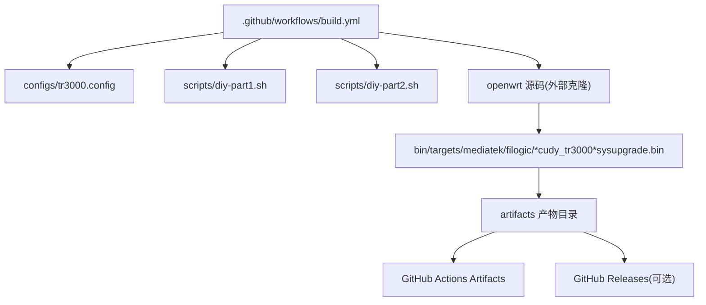
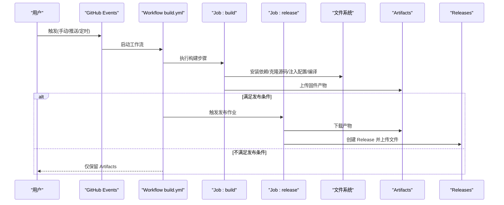
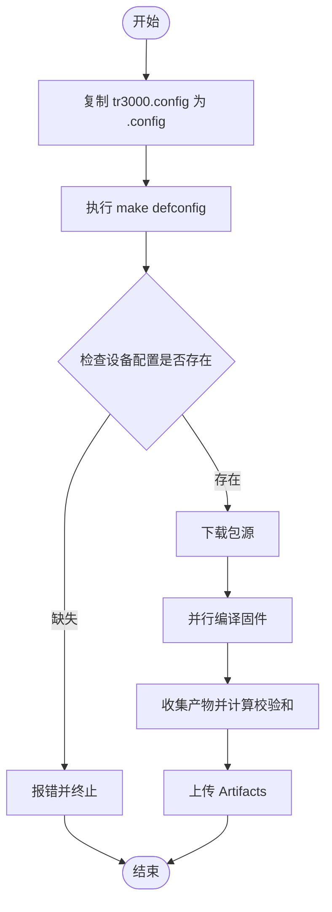
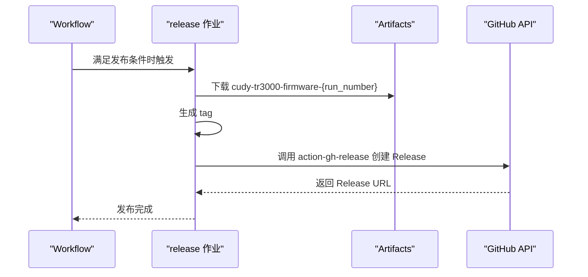
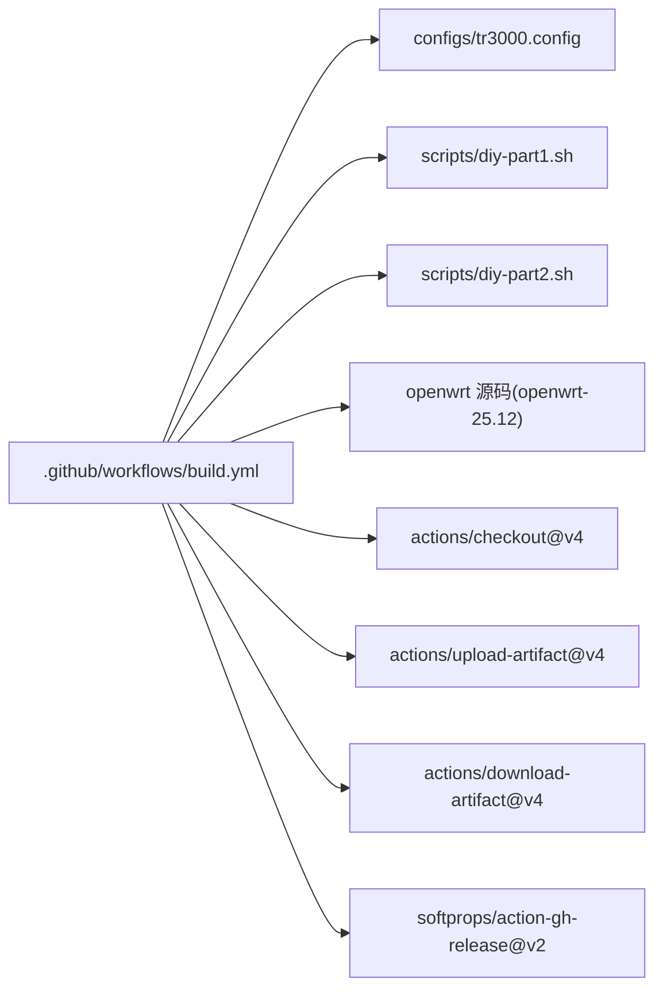

# CI/CD 流水线

<cite>
**本文引用的文件**   
- [build.yml](file://.github/workflows/build.yml)
- [tr3000.config](file://configs/tr3000.config)
- [diy-part1.sh](file://scripts/diy-part1.sh)
- [diy-part2.sh](file://scripts/diy-part2.sh)
</cite>

## 目录
1. [简介](#简介)
2. [项目结构](#项目结构)
3. [核心组件](#核心组件)
4. [架构总览](#架构总览)
5. [详细组件分析](#详细组件分析)
6. [依赖关系分析](#依赖关系分析)
7. [性能与成本优化](#性能与成本优化)
8. [故障排除指南](#故障排除指南)
9. [结论](#结论)
10. [附录：自定义与扩展示例](#附录自定义与扩展示例)

## 简介
本仓库通过 GitHub Actions 实现 Cudy TR3000 固件的自动化构建与发布。工作流基于 OpenWrt 源码，在 Ubuntu 24.04 环境中完成依赖安装、设备定义注入、包源更新、配置加载、下载源码与编译，最终产出多版本固件并可选择自动发布到 GitHub Releases。

该流水线支持三种触发方式：
- 手动触发（workflow_dispatch），可勾选是否发布到 GitHub Releases
- 推送代码至 main/master 分支时自动构建（产物为 Actions Artifacts）
- 定时任务（cron）每周六 22:30 UTC 自动构建并发布

## 项目结构
与本 CI/CD 直接相关的文件组织如下：
- .github/workflows/build.yml：GitHub Actions 工作流定义
- configs/tr3000.config：OpenWrt 目标设备与特性配置
- scripts/diy-part1.sh：构建前注入设备定义的脚本
- scripts/diy-part2.sh：构建前应用自定义文件的脚本

**图表来源**
- [build.yml:10-33](file://.github/workflows/build.yml#L10-L33)
- [build.yml:59-123](file://.github/workflows/build.yml#L59-L123)
- [build.yml:125-165](file://.github/workflows/build.yml#L125-L165)

**章节来源**
- [build.yml:1-33](file://.github/workflows/build.yml#L1-L33)

## 核心组件
- 触发器与权限控制
  - workflow_dispatch：支持输入参数 release（布尔值），决定是否发布到 GitHub Releases
  - push：监听 main/master 分支推送事件
  - schedule：cron 表达式，每周六 22:30 UTC 执行
  - concurrency：按 ref 分组，避免重复构建抢占资源
  - permissions：允许写入 releases 内容

- 构建作业 build
  - 运行环境：ubuntu-24.04，超时 350 分钟
  - 步骤包括：检出代码、释放磁盘空间、安装宿主依赖、克隆 OpenWrt 源码、注入设备定义、更新 feeds、应用自定义文件、加载构建配置、下载包源、编译固件、收集产物、上传 Artifacts

- 发布作业 release
  - 依赖 build 成功
  - 条件：schedule 触发或 workflow_dispatch 且 inputs.release=true
  - 步骤：下载 Artifacts、生成 tag、调用 softprops/action-gh-release 创建 Release

**章节来源**
- [build.yml:10-33](file://.github/workflows/build.yml#L10-L33)
- [build.yml:34-123](file://.github/workflows/build.yml#L34-L123)
- [build.yml:125-165](file://.github/workflows/build.yml#L125-L165)

## 架构总览
下图展示从触发到产物的端到端流程，包括构建与发布的两个作业及其依赖关系。

**图表来源**
- [build.yml:10-33](file://.github/workflows/build.yml#L10-L33)
- [build.yml:34-123](file://.github/workflows/build.yml#L34-L123)
- [build.yml:125-165](file://.github/workflows/build.yml#L125-L165)

## 详细组件分析

### 触发条件与并发控制
- 手动触发
  - 提供 release 布尔输入，默认 true；用于控制是否发布到 GitHub Releases
- 推送触发
  - 监听 main/master 分支，构建产物以 Artifacts 形式保存
- 定时触发
  - cron 表达式：每周六 22:30 UTC 执行，自动发布
- 并发控制
  - 按 github.ref 分组，禁止取消进行中的任务，确保同一分支构建串行化

**章节来源**
- [build.yml:10-33](file://.github/workflows/build.yml#L10-L33)

### 构建环境准备
- 运行环境：ubuntu-24.04
- 超时：350 分钟，适应完整编译耗时
- 清理磁盘空间：删除不必要的宿主工具与 Docker 镜像，释放空间
- 安装宿主依赖：包含编译器、开发库、Python 工具链等，满足 OpenWrt 编译要求

**章节来源**
- [build.yml:34-58](file://.github/workflows/build.yml#L34-L58)

### 源码获取与设备定义注入
- 克隆 OpenWrt 源码：使用 openwrt-25.12 稳定分支，浅克隆减少体积
- 注入设备定义：执行 diy-part1.sh，将 TR3000 设备定义幂等注入到 OpenWrt 源码树
- 更新与安装 feeds：同步并安装第三方包源

**章节来源**
- [build.yml:59-72](file://.github/workflows/build.yml#L59-L72)

### 自定义文件与构建配置
- 应用自定义文件：执行 diy-part2.sh，将仓库内 files 等自定义内容应用到 OpenWrt 源码树
- 加载构建配置：复制 tr3000.config 为 .config，执行 defconfig 生成完整配置
- 设备校验：检查四个目标设备是否在 .config 中启用，未启用则失败并输出错误信息

**图表来源**
- [build.yml:74-98](file://.github/workflows/build.yml#L74-L98)

**章节来源**
- [build.yml:74-98](file://.github/workflows/build.yml#L74-L98)
- [tr3000.config](file://configs/tr3000.config)

### 下载与编译
- 下载包源：优先并行下载，失败时回退单线程并开启详细日志
- 编译固件：优先并行编译，失败时回退单线程并开启详细日志

**章节来源**
- [build.yml:91-98](file://.github/workflows/build.yml#L91-L98)

### 产物收集与上传
- 产物路径：openwrt/bin/targets/mediatek/filogic/*cudy_tr3000*sysupgrade.bin
- 附加文件：sha256sums、profiles.json（若存在）
- 校验和：生成 SHA256SUMS.txt
- 构建摘要：在 Step Summary 中列出产物文件名与大小
- 上传 Artifacts：名称包含 run_number，保留 30 天

**章节来源**
- [build.yml:99-123](file://.github/workflows/build.yml#L99-L123)

### 发布到 GitHub Releases
- 触发条件：schedule 触发或 workflow_dispatch 且 inputs.release=true
- 下载产物：根据 run_number 匹配并下载对应 Artifacts
- 生成标签：格式 tr3000-YYYYMMDD-rRUN_NUMBER
- 创建 Release：使用 softprops/action-gh-release，上传 bin、SHA256SUMS.txt、profiles.json，非草稿、非预发行

**图表来源**
- [build.yml:125-165](file://.github/workflows/build.yml#L125-L165)

**章节来源**
- [build.yml:125-165](file://.github/workflows/build.yml#L125-L165)

## 依赖关系分析
- 内部依赖
  - build.yml 依赖 tr3000.config 作为构建配置
  - build.yml 依赖 diy-part1.sh 与 diy-part2.sh 完成设备定义注入与自定义文件应用
- 外部依赖
  - OpenWrt 源码仓库（openwrt-25.12）
  - GitHub Actions 官方 Action（checkout、upload-artifact、download-artifact）
  - 第三方 Action（softprops/action-gh-release）

**图表来源**
- [build.yml:41-42](file://.github/workflows/build.yml#L41-L42)
- [build.yml:117-123](file://.github/workflows/build.yml#L117-L123)
- [build.yml:133-137](file://.github/workflows/build.yml#L133-L137)
- [build.yml:143-165](file://.github/workflows/build.yml#L143-L165)

**章节来源**
- [build.yml:41-42](file://.github/workflows/build.yml#L41-L42)
- [build.yml:117-123](file://.github/workflows/build.yml#L117-L123)
- [build.yml:133-137](file://.github/workflows/build.yml#L133-L137)
- [build.yml:143-165](file://.github/workflows/build.yml#L143-L165)

## 性能与成本优化
- 并行下载与编译
  - 使用 -j8 与 $(nproc) 提升吞吐；失败时回退单线程便于定位问题
- 磁盘空间管理
  - 构建前清理宿主工具与 Docker 镜像，降低空间不足风险
- 缓存与复用
  - 当前未显式缓存 OpenWrt 源码与编译中间产物；可通过 actions/cache 缓存 openwrt 目录与 dl 目录以减少网络与编译时间
- 构建矩阵
  - 当前单作业顺序构建四款设备；如需加速可拆分为矩阵策略并行构建不同设备
- 超时与重试
  - 设置 350 分钟超时；对不稳定网络场景可增加重试逻辑或切换镜像源

[本节为通用建议，无需具体文件引用]

## 故障排除指南
- 设备定义未注入或配置缺失
  - 现象：构建阶段报告某设备未在 .config 中启用
  - 排查：确认 diy-part1.sh 正确注入设备定义；检查 tr3000.config 是否包含对应 CONFIG_TARGET_* 项
  - 参考位置：设备校验逻辑与配置加载步骤
- 下载或编译失败
  - 现象：make download 或 make 失败
  - 处理：查看详细日志（V=s），检查网络与镜像源；必要时增加重试或切换源
  - 参考位置：下载与编译步骤的回退逻辑
- 产物为空或未找到
  - 现象：上传 Artifacts 时报错“未找到文件”
  - 排查：确认编译输出路径与 glob 匹配规则；检查 bin/targets/mediatek/filogic 下是否存在 cudy_tr3000*sysupgrade.bin
  - 参考位置：产物收集与上传步骤
- 发布失败
  - 现象：创建 Release 失败或文件未上传
  - 排查：确认 permissions.contents=write；检查 release 触发条件；核对软链接或路径是否正确
  - 参考位置：release 作业与权限配置

**章节来源**
- [build.yml:78-98](file://.github/workflows/build.yml#L78-L98)
- [build.yml:99-123](file://.github/workflows/build.yml#L99-L123)
- [build.yml:125-165](file://.github/workflows/build.yml#L125-L165)

## 结论
该工作流实现了从代码变更到固件产物的完整闭环：支持手动、推送与定时触发；通过 OpenWrt 源码与自定义脚本完成设备适配与构建；最终可选择自动发布到 GitHub Releases。建议在后续迭代中引入缓存、矩阵构建与更细粒度的错误恢复机制，以提升稳定性与效率。

[本节为总结性内容，无需具体文件引用]

## 附录：自定义与扩展示例

- 添加新的构建阶段
  - 在 build 作业中新增 steps，例如运行测试、静态检查或打包额外资源
  - 参考现有步骤结构与 working-directory 用法
  - 参考位置：steps 列表与 working-directory 使用处

- 集成其他服务
  - 使用 actions/setup-* 系列 Action 安装 Node/Python/Rust 等工具链
  - 使用 curl/wget 调用外部 API 或拉取私有包源
  - 参考位置：Install host dependencies 与 Clone OpenWrt source 步骤

- 自定义构建任务
  - 修改 tr3000.config 以启用/禁用特定功能或驱动
  - 在 diy-part1.sh 与 diy-part2.sh 中添加设备定义与自定义文件
  - 参考位置：Load build config 与 Apply custom files 步骤

- 调整触发策略
  - 在 on.schedule 中添加更多 cron 表达式以实现每日/每周构建
  - 在 on.push.paths 中限制特定目录变更才触发构建，减少无效运行
  - 参考位置：on 触发器定义

**章节来源**
- [build.yml:50-58](file://.github/workflows/build.yml#L50-L58)
- [build.yml:59-76](file://.github/workflows/build.yml#L59-L76)
- [build.yml:78-98](file://.github/workflows/build.yml#L78-L98)
- [build.yml:10-26](file://.github/workflows/build.yml#L10-L26)