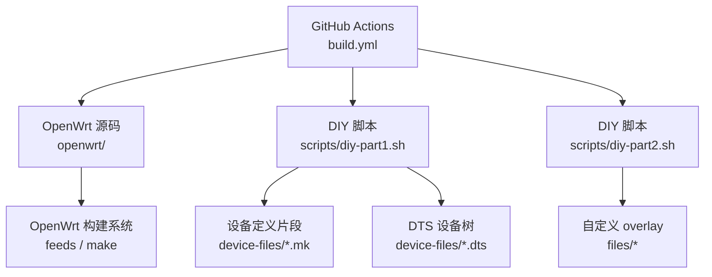
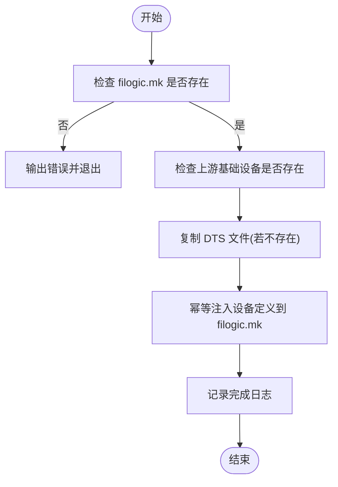
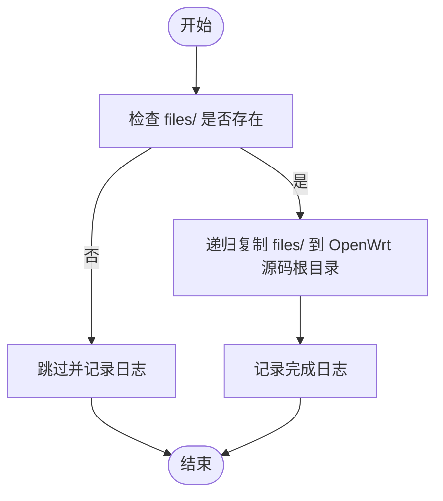
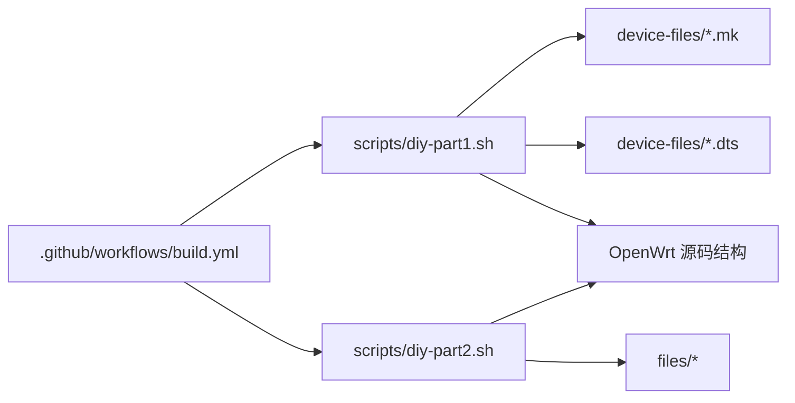

# DIY 脚本机制

<cite>
**本文引用的文件**   
- [diy-part1.sh](file://scripts/diy-part1.sh)
- [diy-part2.sh](file://scripts/diy-part2.sh)
- [build.yml](file://.github/workflows/build.yml)
- [filogic-cudy_tr3000-mod.mk](file://device-files/filogic-cudy_tr3000-mod.mk)
- [filogic-cudy_tr3000-256mb-mod.mk](file://device-files/filogic-cudy_tr3000-256mb-mod.mk)
- [mt7981b-cudy-tr3000-mod.dts](file://device-files/mt7981b-cudy-tr3000-mod.dts)
- [mt7981b-cudy-tr3000-256mb-mod.dts](file://device-files/mt7981b-cudy-tr3000-256mb-mod.dts)
</cite>

## 目录
1. [引言](#引言)
2. [项目结构](#项目结构)
3. [核心组件](#核心组件)
4. [架构总览](#架构总览)
5. [详细组件分析](#详细组件分析)
6. [依赖关系分析](#依赖关系分析)
7. [性能与健壮性](#性能与健壮性)
8. [故障排查指南](#故障排查指南)
9. [结论](#结论)
10. [附录：扩展示例](#附录扩展示例)

## 引言
本仓库为 Cudy TR3000 系列设备提供基于 OpenWrt 的固件构建定制能力。核心通过两个 DIY 脚本在 GitHub Actions 构建流程中注入设备定义与应用自定义 overlay：
- diy-part1.sh：在 feeds 更新前，向 OpenWrt 源码注入大分区（mod）设备定义与 DTS 文件。
- diy-part2.sh：在 feeds 安装后，将仓库 files/ 目录内容覆盖到 OpenWrt 源码根目录，作为编译期自动打包进固件的 overlay。

这两个脚本配合 .github/workflows/build.yml 中的步骤，确保在正确时机完成设备定义注入与自定义文件应用，从而产出 128M/256M 标准版与大分区版四款固件。

## 项目结构
与本主题直接相关的目录与文件如下：
- scripts：DIY 脚本入口
- device-files：设备定义片段与 DTS 修改
- .github/workflows/build.yml：GitHub Actions 构建编排
- configs/tr3000.config：OpenWrt 目标配置（由工作流复制到 openwrt/.config）



图表来源
- [build.yml:64-76](file://.github/workflows/build.yml#L64-L76)
- [diy-part1.sh:1-52](file://scripts/diy-part1.sh#L1-L52)
- [diy-part2.sh:1-22](file://scripts/diy-part2.sh#L1-L22)

章节来源
- [build.yml:64-76](file://.github/workflows/build.yml#L64-L76)
- [diy-part1.sh:1-52](file://scripts/diy-part1.sh#L1-L52)
- [diy-part2.sh:1-22](file://scripts/diy-part2.sh#L1-L22)

## 核心组件
- diy-part1.sh：负责在 OpenWrt 源码根目录下执行，校验上游基础设备是否存在，复制 DTS 文件，并幂等地将设备定义片段追加到 target/linux/mediatek/image/filogic.mk。
- diy-part2.sh：负责将仓库 files/ 目录内容递归复制到 OpenWrt 源码根目录，作为编译期 overlay。
- build.yml：编排克隆 OpenWrt、运行 diy-part1、更新安装 feeds、运行 diy-part2、加载配置、下载包源、编译固件、收集产物与发布 Release。

章节来源
- [diy-part1.sh:1-52](file://scripts/diy-part1.sh#L1-L52)
- [diy-part2.sh:1-22](file://scripts/diy-part2.sh#L1-L22)
- [build.yml:59-97](file://.github/workflows/build.yml#L59-L97)

## 架构总览
下图展示了从代码提交到固件产物的关键阶段，以及两个 DIY 脚本在其中的作用点。

```mermaid
sequenceDiagram
participant GH as "GitHub Actions"
participant OW as "OpenWrt 源码(openwrt)"
participant P1 as "diy-part1.sh"
participant FEEDS as "feeds 更新/安装"
participant P2 as "diy-part2.sh"
participant MK as "make 构建"
participant ART as "制品归档"
GH->>OW : 克隆 OpenWrt 源码
GH->>P1 : working-directory=openwrt; bash ../scripts/diy-part1.sh
P1-->>OW : 注入设备定义与 DTS
GH->>FEEDS : ./scripts/feeds update -a && install -a
GH->>P2 : working-directory=openwrt; bash ../scripts/diy-part2.sh
P2-->>OW : 应用 files/ overlay
GH->>MK : cp ../configs/tr3000.config .config; make defconfig; make download; make
MK-->>ART : 生成 sysupgrade.bin 等固件
```

图表来源
- [build.yml:64-97](file://.github/workflows/build.yml#L64-L97)
- [diy-part1.sh:1-52](file://scripts/diy-part1.sh#L1-L52)
- [diy-part2.sh:1-22](file://scripts/diy-part2.sh#L1-L22)

## 详细组件分析

### diy-part1.sh：在 feeds 更新前注入设备定义
职责与关键点：
- 运行环境要求：必须在 OpenWrt 源码根目录执行；工作流通过 working-directory: openwrt 保证。
- 路径解析：使用 SCRIPT_DIR 与 GITHUB_WORKSPACE 推导 WORKSPACE_DIR，再定位 device-files 目录。
- 前置校验：检查 target/linux/mediatek/image/filogic.mk 是否存在，否则报错退出。
- 上游基础设备自检：检测 cudy_tr3000-v1 与 cudy_tr3000-256mb-v1 是否已存在于 filogic.mk；若不存在则输出警告，提示当前分支可能不支持该机型。
- DTS 复制：将 mt7981b-cudy-tr3000-mod.dts 与 mt7981b-cudy-tr3000-256mb-mod.dts 复制到 target/linux/mediatek/dts，若同名文件已存在则跳过。
- 设备定义注入：通过 inject_device 函数判断是否已存在 define Device/<name>，若不存在则将对应 *.mk 片段追加到 filogic.mk，实现幂等注入。
- 日志与退出：使用 set -euo pipefail 严格模式，任何错误立即失败；所有操作均有日志输出。

执行时序要点：
- 在 feeds 更新之前执行，确保后续 feeds 安装与 make 能识别新注入的设备定义。
- 通过 grep 判断是否重复注入，避免多次运行造成重复定义。

参数与环境变量：
- GITHUB_WORKSPACE：GitHub Actions 提供的仓库根路径；本地运行时回退到脚本所在目录的父目录。
- SCRIPT_DIR：脚本所在目录，用于定位 device-files。
- IMAGE_MK：目标 Make 片段路径，用于追加设备定义。
- DTS_DIR：目标 DTS 目录，用于放置设备树文件。

错误处理：
- 未找到 IMAGE_MK 时直接退出，避免误在非 OpenWrt 源码目录运行。
- 上游基础设备缺失时仅警告，不中断流程，便于兼容不同分支。



图表来源
- [diy-part1.sh:16-49](file://scripts/diy-part1.sh#L16-L49)

章节来源
- [diy-part1.sh:1-52](file://scripts/diy-part1.sh#L1-L52)

### diy-part2.sh：在 feeds 安装后应用自定义 overlay
职责与关键点：
- 运行环境要求：同样需要在 OpenWrt 源码根目录执行；工作流通过 working-directory: openwrt 保证。
- 路径解析：使用 SCRIPT_DIR 与 GITHUB_WORKSPACE 推导 WORKSPACE_DIR，再定位 files 目录。
- 覆盖策略：若 files/ 目录存在，则递归复制到 OpenWrt 源码根目录；若不存在则跳过并记录日志。
- 用途：将默认配置、首次启动脚本等自定义文件纳入编译过程，最终打包进固件。

执行时序要点：
- 在 feeds 安装之后执行，确保后续 make 构建时能够包含这些自定义文件。
- 使用 cp -rv 保留权限与属性，确保可执行脚本等保持原权限。

参数与环境变量：
- GITHUB_WORKSPACE：同上。
- SCRIPT_DIR：同上。
- CUSTOM_FILES：指向仓库 files/ 目录。

错误处理：
- 未找到 files/ 目录不会导致失败，仅跳过并记录日志。



图表来源
- [diy-part2.sh:14-19](file://scripts/diy-part2.sh#L14-L19)

章节来源
- [diy-part2.sh:1-22](file://scripts/diy-part2.sh#L1-L22)

### 设备定义与 DTS 文件
- filogic-cudy_tr3000-mod.mk：定义 128M 大分区设备 cudy_tr3000-mod，指定 DTS、UBI 参数、镜像大小与附加包。
- filogic-cudy_tr3000-256mb-mod.mk：定义 256M 大分区设备 cudy_tr3000-256mb-mod，支持从 256M 标准版 sysupgrade 刷入。
- mt7981b-cudy-tr3000-mod.dts：在官方 v1 基础上扩大 ubi 分区至 112MiB，需第三方 U-Boot mod。
- mt7981b-cudy-tr3000-256mb-mod.dts：在官方 256mb v1 基础上扩大 ubi 分区至 240MiB，可直接从 256M 标准版 sysupgrade。

这些文件由 diy-part1.sh 在构建前注入或复制到 OpenWrt 源码相应位置，供构建系统识别与编译。

章节来源
- [filogic-cudy_tr3000-mod.mk:1-19](file://device-files/filogic-cudy_tr3000-mod.mk#L1-L19)
- [filogic-cudy_tr3000-256mb-mod.mk:1-20](file://device-files/filogic-cudy_tr3000-256mb-mod.mk#L1-L20)
- [mt7981b-cudy-tr3000-mod.dts:1-23](file://device-files/mt7981b-cudy-tr3000-mod.dts#L1-L23)
- [mt7981b-cudy-tr3000-256mb-mod.dts:1-24](file://device-files/mt7981b-cudy-tr3000-256mb-mod.dts#L1-L24)

## 依赖关系分析
- build.yml 依赖 OpenWrt 源码结构与路径约定（如 target/linux/mediatek/image/filogic.mk）。
- diy-part1.sh 依赖 device-files 下的 mk 与 dts 文件，以及 OpenWrt 源码目录结构。
- diy-part2.sh 依赖仓库 files/ 目录的存在与否。
- 设备定义 mk 文件依赖 OpenWrt 的 mediatek-filogic 目标与 DTS 命名规范。



图表来源
- [build.yml:64-76](file://.github/workflows/build.yml#L64-L76)
- [diy-part1.sh:1-52](file://scripts/diy-part1.sh#L1-L52)
- [diy-part2.sh:1-22](file://scripts/diy-part2.sh#L1-L22)

章节来源
- [build.yml:64-76](file://.github/workflows/build.yml#L64-L76)
- [diy-part1.sh:1-52](file://scripts/diy-part1.sh#L1-L52)
- [diy-part2.sh:1-22](file://scripts/diy-part2.sh#L1-L22)

## 性能与健壮性
- 幂等性：diy-part1.sh 通过 grep 判断是否已注入设备定义，避免重复追加；DTS 复制也采用“存在即跳过”的策略。
- 严格模式：两脚本均启用 set -euo pipefail，任何命令失败立即终止，防止部分注入导致构建异常。
- 条件检查：对关键路径与上游基础设备进行存在性检查，减少误用风险。
- 日志输出：每个关键步骤都有明确日志，便于追踪问题。

[本节为通用指导，不直接分析具体文件]

## 故障排查指南
常见问题与定位方法：
- 未在 OpenWrt 源码根目录运行：
  - 现象：找不到 filogic.mk 或路径错误。
  - 解决：确保 working-directory 设置为 openwrt，或在源码根目录手动执行脚本。
- 上游基础设备缺失：
  - 现象：diy-part1.sh 输出警告，提示当前分支可能不支持该机型。
  - 解决：切换到支持 cudy_tr3000-v1 与 cudy_tr3000-256mb-v1 的分支，或在上游添加对应定义。
- 设备定义未生效：
  - 现象：构建时未识别 cudy_tr3000-mod 或 cudy_tr3000-256mb-mod。
  - 解决：检查 filogic.mk 是否已追加 define Device/...；确认 build.yml 中 .config 是否包含对应 CONFIG_TARGET_*_DEVICE_*=y。
- 自定义 overlay 未生效：
  - 现象：files/ 中的默认配置或脚本未进入固件。
  - 解决：确认 files/ 目录存在且 diy-part2.sh 已执行；检查复制后的文件权限与路径是否正确。
- 构建失败：
  - 现象：make 阶段报错。
  - 解决：查看 build.yml 中 make V=s 的详细输出；核对设备定义与 DTS 是否与硬件匹配。

章节来源
- [diy-part1.sh:16-26](file://scripts/diy-part1.sh#L16-L26)
- [diy-part2.sh:14-19](file://scripts/diy-part2.sh#L14-L19)
- [build.yml:78-89](file://.github/workflows/build.yml#L78-L89)

## 结论
通过 diy-part1.sh 与 diy-part2.sh，本仓库实现了在 OpenWrt 构建流程中的设备定义注入与自定义 overlay 应用。两者分别在 feeds 更新前后执行，确保构建系统能正确识别新增设备并包含自定义文件。配合 build.yml 的编排，可稳定产出多版本固件，满足标准版与大分区版的差异化需求。

[本节为总结性内容，不直接分析具体文件]

## 附录：扩展示例

### 扩展新设备的步骤
- 在 device-files 下新增设备定义片段（*.mk），遵循现有 mk 文件的字段规范（DEVICE_VENDOR、DEVICE_MODEL、DEVICE_VARIANT、DEVICE_DTS、IMAGE_SIZE、DEVICE_PACKAGES 等）。
- 如需设备树变更，新增对应的 DTS 文件，并在其中 include 上游 v1 定义，仅覆盖需要修改的节点（如 ubi 分区大小）。
- 在 diy-part1.sh 中：
  - 将新的 DTS 文件名加入复制循环。
  - 调用 inject_device 注入新的 mk 片段。
- 在 build.yml 中：
  - 在 Load build config 步骤中添加新设备的 CONFIG_TARGET_*_DEVICE_*=y 检查，确保 .config 包含该设备。

参考路径
- [diy-part1.sh:28-49](file://scripts/diy-part1.sh#L28-L49)
- [filogic-cudy_tr3000-mod.mk:1-19](file://device-files/filogic-cudy_tr3000-mod.mk#L1-L19)
- [filogic-cudy_tr3000-256mb-mod.mk:1-20](file://device-files/filogic-cudy_tr3000-256mb-mod.mk#L1-L20)
- [build.yml:78-89](file://.github/workflows/build.yml#L78-L89)

### 扩展自定义功能（overlay）
- 在仓库 files/ 目录下新增或修改默认配置文件、首次启动脚本等。
- diy-part2.sh 会自动将这些文件复制到 OpenWrt 源码根目录，参与构建并打包进固件。
- 若需调整 overlay 行为，可在 diy-part2.sh 中增加条件判断或额外复制逻辑。

参考路径
- [diy-part2.sh:14-19](file://scripts/diy-part2.sh#L14-L19)

### 调试技巧
- 在 build.yml 中临时开启 make V=s 以获取详细构建日志。
- 在 diy-part1.sh 与 diy-part2.sh 中增加更多 log 输出，观察各步骤执行情况。
- 本地模拟 GitHub Actions 环境：设置 GITHUB_WORKSPACE 环境变量后，在 OpenWrt 源码根目录分别执行两个脚本，验证注入与 overlay 效果。

参考路径
- [build.yml:95-97](file://.github/workflows/build.yml#L95-L97)
- [diy-part1.sh:14-14](file://scripts/diy-part1.sh#L14-L14)
- [diy-part2.sh:11-11](file://scripts/diy-part2.sh#L11-L11)