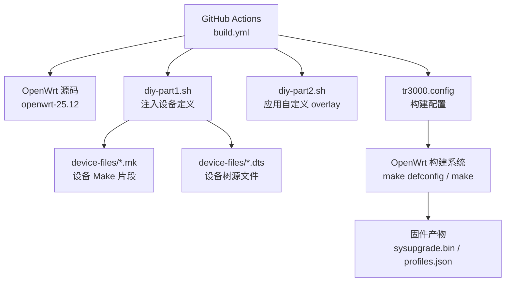
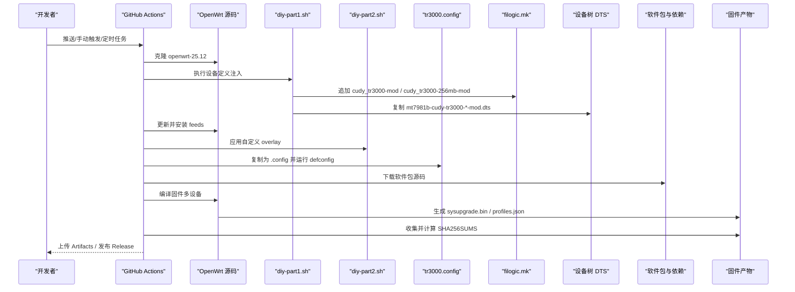
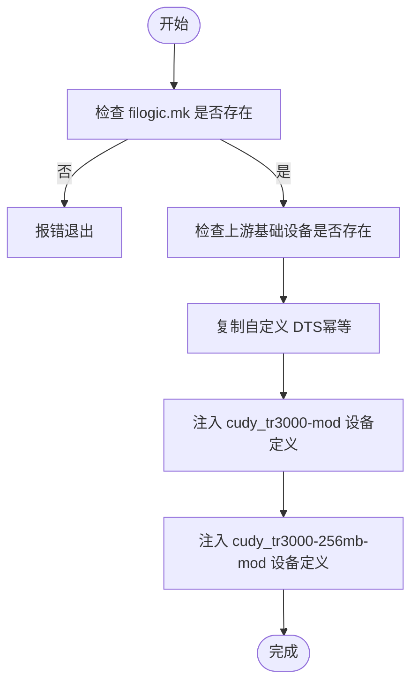
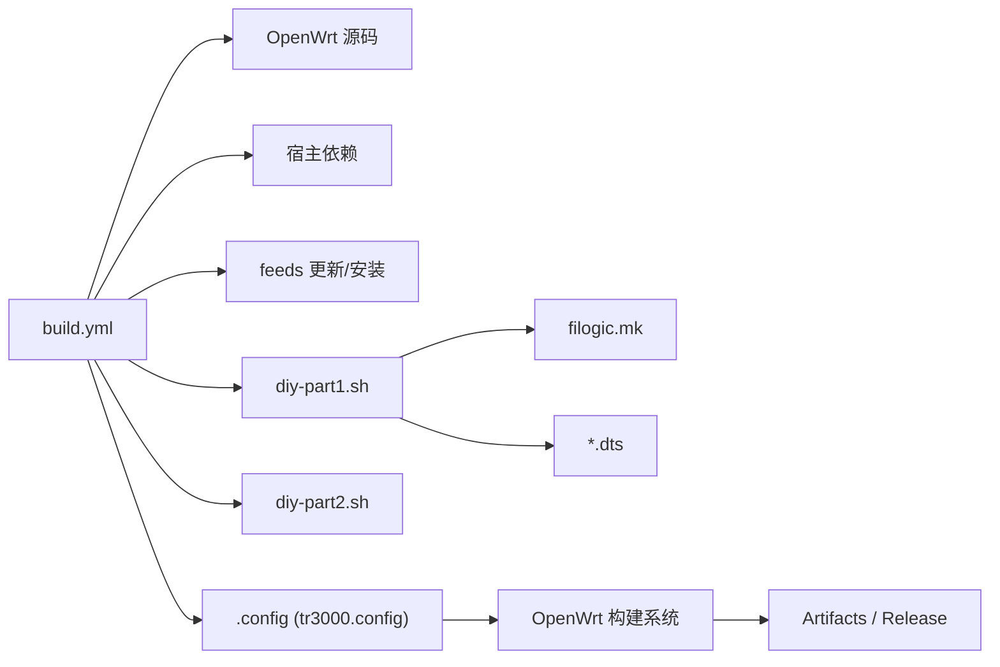

# 构建流程架构

<cite>
**本文引用的文件**   
- [.github/workflows/build.yml](file://.github/workflows/build.yml)
- [scripts/diy-part1.sh](file://scripts/diy-part1.sh)
- [scripts/diy-part2.sh](file://scripts/diy-part2.sh)
- [configs/tr3000.config](file://configs/tr3000.config)
- [device-files/filogic-cudy_tr3000-mod.mk](file://device-files/filogic-cudy_tr3000-mod.mk)
- [device-files/filogic-cudy_tr3000-256mb-mod.mk](file://device-files/filogic-cudy_tr3000-256mb-mod.mk)
- [device-files/mt7981b-cudy-tr3000-mod.dts](file://device-files/mt7981b-cudy-tr3000-mod.dts)
- [device-files/mt7981b-cudy-tr3000-256mb-mod.dts](file://device-files/mt7981b-cudy-tr3000-256mb-mod.dts)
</cite>

## 目录
1. [引言](#引言)
2. [项目结构](#项目结构)
3. [核心组件](#核心组件)
4. [架构总览](#架构总览)
5. [详细组件分析](#详细组件分析)
6. [依赖关系分析](#依赖关系分析)
7. [性能与并行构建](#性能与并行构建)
8. [可重复性与一致性保障](#可重复性与一致性保障)
9. [故障排查指南](#故障排查指南)
10. [结论](#结论)

## 引言
本文件面向“从代码提交到固件产物”的完整构建流程，围绕 Cudy TR3000 在 GitHub Actions 中基于 OpenWrt 源码进行自动编译、打包与发布的整体架构展开。文档重点解释以下方面：
- 源码克隆与版本锁定
- 设备定义注入（大分区 mod 方案）
- feeds 更新与自定义 overlay 应用
- 配置加载与多设备选择
- 软件包下载与固件编译
- 产物收集、校验与发布
- 多设备并行构建机制
- 构建可重复性与一致性策略
- 性能调优建议与常见问题处理

## 项目结构
仓库采用“工作流 + 脚本 + 配置 + 设备定义”的分层组织方式：
- .github/workflows/build.yml：GitHub Actions 工作流，定义触发条件、构建步骤、产物上传与 Release 发布
- scripts/diy-part1.sh：在 OpenWrt 源码根目录下执行，向目标平台 image 定义文件中注入大分区设备定义，并拷贝 DTS 文件
- scripts/diy-part2.sh：在 OpenWrt 源码根目录下执行，将仓库 files/ 目录内容覆盖到源码根目录，作为编译期 overlay
- configs/tr3000.config：OpenWrt 构建配置，指定目标平台、设备选择、LuCI 与中文界面等
- device-files/*：设备相关的 Makefile 片段与设备树源文件（DTS），用于定义大分区版本的设备属性、镜像大小、UBI 布局与内核驱动包

**图表来源**
- [.github/workflows/build.yml:59-97](file://.github/workflows/build.yml#L59-L97)
- [scripts/diy-part1.sh:1-52](file://scripts/diy-part1.sh#L1-L52)
- [scripts/diy-part2.sh:1-22](file://scripts/diy-part2.sh#L1-L22)
- [configs/tr3000.config:1-34](file://configs/tr3000.config#L1-L34)

**章节来源**
- [.github/workflows/build.yml:10-39](file://.github/workflows/build.yml#L10-L39)
- [scripts/diy-part1.sh:1-52](file://scripts/diy-part1.sh#L1-L52)
- [scripts/diy-part2.sh:1-22](file://scripts/diy-part2.sh#L1-L22)
- [configs/tr3000.config:1-34](file://configs/tr3000.config#L1-L34)

## 核心组件
- 工作流入口：build.yml 定义了手动触发、推送分支与定时任务三种触发方式，并通过 concurrency 控制同一分支的并发行为；权限设置为允许写入 releases。
- 设备注入脚本：diy-part1.sh 负责在 OpenWrt 源码根目录检查上游基础设备是否存在，复制自定义 DTS，并幂等地将大分区设备定义追加到 filogic.mk。
- 自定义 overlay 脚本：diy-part2.sh 将仓库 files/ 目录内容复制到 OpenWrt 源码根目录，供编译时打包进固件。
- 构建配置：tr3000.config 指定 mediatek-filogic 目标平台，启用四个设备（含两个标准版与两个大分区 mod 版），并开启 LuCI 与中文界面。
- 设备定义文件：filogic-cudy_tr3000-mod.mk 与 filogic-cudy_tr3000-256mb-mod.mk 定义大分区设备的厂商、型号、变体、DTS、UBI 参数、镜像大小、内核位于 UBI、sysupgrade 生成方式以及默认驱动包。
- 设备树源文件：mt7981b-cudy-tr3000-mod.dts 与 mt7981b-cudy-tr3000-256mb-mod.dts 继承官方 v1 定义，仅调整 ubi 分区大小以适配大分区方案。

**章节来源**
- [.github/workflows/build.yml:34-97](file://.github/workflows/build.yml#L34-L97)
- [scripts/diy-part1.sh:1-52](file://scripts/diy-part1.sh#L1-L52)
- [scripts/diy-part2.sh:1-22](file://scripts/diy-part2.sh#L1-L22)
- [configs/tr3000.config:11-34](file://configs/tr3000.config#L11-L34)
- [device-files/filogic-cudy_tr3000-mod.mk:1-19](file://device-files/filogic-cudy_tr3000-mod.mk#L1-L19)
- [device-files/filogic-cudy_tr3000-256mb-mod.mk:1-20](file://device-files/filogic-cudy_tr3000-256mb-mod.mk#L1-L20)
- [device-files/mt7981b-cudy-tr3000-mod.dts:1-23](file://device-files/mt7981b-cudy-tr3000-mod.dts#L1-L23)
- [device-files/mt7981b-cudy-tr3000-256mb-mod.dts:1-24](file://device-files/mt7981b-cudy-tr3000-256mb-mod.dts#L1-L24)

## 架构总览
下图展示从代码提交到固件产物的端到端数据流与控制流：

**图表来源**
- [.github/workflows/build.yml:59-105](file://.github/workflows/build.yml#L59-L105)
- [scripts/diy-part1.sh:28-49](file://scripts/diy-part1.sh#L28-L49)
- [scripts/diy-part2.sh:13-19](file://scripts/diy-part2.sh#L13-L19)
- [configs/tr3000.config:11-19](file://configs/tr3000.config#L11-L19)

## 详细组件分析

### 工作流与触发控制（build.yml）
- 触发方式：
  - 手动触发 workflow_dispatch，支持是否发布 Release
  - push 到 main/master 分支自动构建
  - 每周定时任务 schedule 自动构建并发布
- 并发控制：
  - concurrency 使用 group tr3000-build-${{ github.ref }}，避免同分支重复构建冲突
- 权限：
  - contents: write，允许创建 Release
- 构建步骤：
  - 清理磁盘空间、安装宿主依赖
  - 克隆 OpenWrt openwrt-25.12 分支
  - 执行 diy-part1.sh 注入设备定义
  - 更新并安装 feeds
  - 执行 diy-part2.sh 应用自定义 overlay
  - 复制 tr3000.config 为 .config 并运行 defconfig
  - 验证四个设备是否在 .config 中启用
  - 下载软件包源码（先尝试并行，失败回退串行）
  - 编译固件（优先并行，失败回退串行）
  - 收集产物、生成 SHA256SUMS、输出构建摘要
  - 上传 Artifacts
  - release 任务根据条件创建 GitHub Release

**章节来源**
- [.github/workflows/build.yml:10-39](file://.github/workflows/build.yml#L10-L39)
- [.github/workflows/build.yml:40-123](file://.github/workflows/build.yml#L40-L123)
- [.github/workflows/build.yml:125-166](file://.github/workflows/build.yml#L125-L166)

### 设备定义注入（diy-part1.sh）
- 前置检查：
  - 确认 filogic.mk 存在，否则报错退出
  - 检查上游基础设备 cudy_tr3000-v1 与 cudy_tr3000-256mb-v1 是否存在于 filogic.mk，不存在则告警
- 设备树复制：
  - 若 DTS 已存在则跳过，否则从 device-files 复制到 target/linux/mediatek/dts
- 设备定义注入：
  - 通过 inject_device 函数判断 filogic.mk 是否已包含对应 Device 定义，未包含则追加
  - 注入 cudy_tr3000-mod 与 cudy_tr3000-256mb-mod 两个大分区设备

**图表来源**
- [scripts/diy-part1.sh:16-49](file://scripts/diy-part1.sh#L16-L49)

**章节来源**
- [scripts/diy-part1.sh:1-52](file://scripts/diy-part1.sh#L1-L52)

### 自定义 overlay 应用（diy-part2.sh）
- 作用：将仓库 files/ 目录内容覆盖到 OpenWrt 源码根目录，以便编译时打包进固件（如 uci-defaults 默认配置、首次启动脚本等）。
- 行为：
  - 若 files/ 存在则递归复制
  - 若不存在则跳过并记录日志

**章节来源**
- [scripts/diy-part2.sh:1-22](file://scripts/diy-part2.sh#L1-L22)

### 构建配置（tr3000.config）
- 目标平台：
  - CONFIG_TARGET_mediatek=y
  - CONFIG_TARGET_mediatek_filogic=y
- 设备选择：
  - 启用四个设备：cudy_tr3000-v1、cudy_tr3000-mod、cudy_tr3000-256mb-v1、cudy_tr3000-256mb-mod
- 界面与本地化：
  - 启用 LuCI、SSL 与简体中文界面
- 扩展插件：
  - 提供若干可选插件示例（ttyd、filebrowser-q、openclash、USB 存储、block-mount、opkg 中文等），按需启用

**章节来源**
- [configs/tr3000.config:11-34](file://configs/tr3000.config#L11-L34)

### 设备 Make 片段（filogic-cudy_tr3000-mod.mk / filogic-cudy_tr3000-256mb-mod.mk）
- 共同点：
  - DEVICE_VENDOR= Cudy
  - DEVICE_MODEL= TR3000
  - KERNEL_IN_UBI= 1
  - IMAGE/sysupgrade.bin := sysupgrade-tar | append-metadata
  - DEVICE_PACKAGES 包含 USB3、MT7915E、MT7981 固件等
- 差异点：
  - 128M 大分区：IMAGE_SIZE=114688k，对应 ubi 112M（mod-112m）
  - 256M 大分区：IMAGE_SIZE=245760k，对应 ubi 240M，且 SUPPORTED_DEVICES 包含 cudy_tr3000-256mb-v1，允许从标准版直接 sysupgrade

**章节来源**
- [device-files/filogic-cudy_tr3000-mod.mk:1-19](file://device-files/filogic-cudy_tr3000-mod.mk#L1-L19)
- [device-files/filogic-cudy_tr3000-256mb-mod.mk:1-20](file://device-files/filogic-cudy_tr3000-256mb-mod.mk#L1-L20)

### 设备树源文件（mt7981b-cudy-tr3000-mod.dts / mt7981b-cudy-tr3000-256mb-mod.dts）
- 设计思路：
  - 继承官方 v1 或 256mb v1 的设备树定义
  - 仅修改 ubi 分区大小以适配大分区方案
  - 保持兼容标识符，便于识别与升级路径
- 128M 大分区：
  - 将 ubi 起始地址 0x5c0000 起扩展到 112MiB
- 256M 大分区：
  - 将 ubi 起始地址 0x5c0000 起扩展到 240MiB，保留尾部安全边界

**章节来源**
- [device-files/mt7981b-cudy-tr3000-mod.dts:1-23](file://device-files/mt7981b-cudy-tr3000-mod.dts#L1-L23)
- [device-files/mt7981b-cudy-tr3000-256mb-mod.dts:1-24](file://device-files/mt7981b-cudy-tr3000-256mb-mod.dts#L1-L24)

## 依赖关系分析
- 工作流依赖：
  - actions/checkout@v4：拉取当前仓库
  - actions/upload-artifact@v4：上传构建产物
  - softprops/action-gh-release@v2：创建 GitHub Release
- 构建系统依赖：
  - OpenWrt 源码 openwrt-25.12
  - feeds 更新与安装
  - 宿主环境依赖（build-essential、clang、flex、bison、gettext、libssl-dev 等）
- 设备定义依赖：
  - filogic.mk（由 diy-part1.sh 追加）
  - DTS 文件（由 diy-part1.sh 复制）
  - tr3000.config（由 build.yml 复制为 .config）

**图表来源**
- [.github/workflows/build.yml:50-97](file://.github/workflows/build.yml#L50-L97)
- [scripts/diy-part1.sh:28-49](file://scripts/diy-part1.sh#L28-L49)
- [scripts/diy-part2.sh:13-19](file://scripts/diy-part2.sh#L13-L19)
- [configs/tr3000.config:11-19](file://configs/tr3000.config#L11-L19)

**章节来源**
- [.github/workflows/build.yml:50-123](file://.github/workflows/build.yml#L50-L123)

## 性能与并行构建
- 并行下载：
  - make download -j8 优先并行下载，失败后回退 make download -j1 V=s 串行调试
- 并行编译：
  - make -j"$(nproc)" 优先并行编译，失败后回退 make -j1 V=s 串行调试
- 并发控制：
  - concurrency.group 使用 tr3000-build-${{ github.ref }}，避免同分支重复构建
- 资源清理：
  - 构建前清理 dotnet、android、ghc、CodeQL 缓存与 Docker 镜像，释放磁盘空间

优化建议：
- 合理设置 nproc 并行度，避免内存不足导致编译失败
- 对大型设备树或复杂驱动包，可在失败时启用 V=s 查看详细日志定位瓶颈
- 针对网络不稳定场景，优先保证 make download 成功，再进入编译阶段

**章节来源**
- [.github/workflows/build.yml:44-57](file://.github/workflows/build.yml#L44-L57)
- [.github/workflows/build.yml:91-97](file://.github/workflows/build.yml#L91-L97)
- [.github/workflows/build.yml:27-33](file://.github/workflows/build.yml#L27-L33)

## 可重复性与一致性保障
- 源码版本锁定：
  - 固定克隆 openwrt-25.12 分支，确保上游基线一致
- 设备定义幂等：
  - diy-part1.sh 通过 grep 判断是否已注入，避免重复追加
  - DTS 复制时若已存在则跳过
- 配置校验：
  - 构建前验证四个设备均在 .config 中启用，否则报错退出
- 产物校验：
  - 收集 artifacts 后生成 SHA256SUMS.txt，确保产物完整性
- 构建环境稳定：
  - 固定 Ubuntu 24.04 宿主机
  - 明确安装宿主依赖列表

**章节来源**
- [.github/workflows/build.yml:59-62](file://.github/workflows/build.yml#L59-L62)
- [scripts/diy-part1.sh:28-49](file://scripts/diy-part1.sh#L28-L49)
- [.github/workflows/build.yml:78-89](file://.github/workflows/build.yml#L78-L89)
- [.github/workflows/build.yml:99-105](file://.github/workflows/build.yml#L99-L105)

## 故障排查指南
- 上游基础设备缺失：
  - 现象：diy-part1.sh 告警上游未找到 cudy_tr3000-v1 或 cudy_tr3000-256mb-v1
  - 原因：OpenWrt 目标分支不支持该机型
  - 处理：切换至支持该机型的 OpenWrt 分支或修正上游依赖
- 设备定义未注入：
  - 现象：构建时报错某设备未在 .config 中启用
  - 原因：filogic.mk 未正确追加设备定义或路径错误
  - 处理：检查 diy-part1.sh 执行结果与 filogic.mk 内容
- 自定义 overlay 未生效：
  - 现象：首次启动脚本或默认配置未生效
  - 原因：files/ 目录不存在或路径不正确
  - 处理：确认 files/ 目录结构与 diy-part2.sh 逻辑
- 下载或编译失败：
  - 现象：make download 或 make 失败
  - 原因：网络问题、依赖缺失、内存不足
  - 处理：启用 V=s 查看详细日志，必要时回退串行构建并逐步定位

**章节来源**
- [scripts/diy-part1.sh:21-26](file://scripts/diy-part1.sh#L21-L26)
- [.github/workflows/build.yml:83-89](file://.github/workflows/build.yml#L83-L89)
- [scripts/diy-part2.sh:13-19](file://scripts/diy-part2.sh#L13-L19)
- [.github/workflows/build.yml:91-97](file://.github/workflows/build.yml#L91-L97)

## 结论
本构建流程通过 GitHub Actions 自动化实现 OpenWrt 源码克隆、设备定义注入、feeds 更新、自定义 overlay 应用、配置加载、软件包下载与固件编译，最终产出四种 TR3000 固件并可选择发布到 GitHub Releases。其关键优势包括：
- 明确的版本锁定与幂等注入，确保构建可重复性
- 多设备并行构建与失败回退机制，提升鲁棒性
- 清晰的设备定义与 DTS 分离，便于维护与扩展
- 完善的产物校验与发布流程，保障交付质量

建议在后续迭代中持续监控上游 OpenWrt 变更，及时适配设备定义与驱动包，并结合实际硬件特性优化镜像大小与默认包集合。