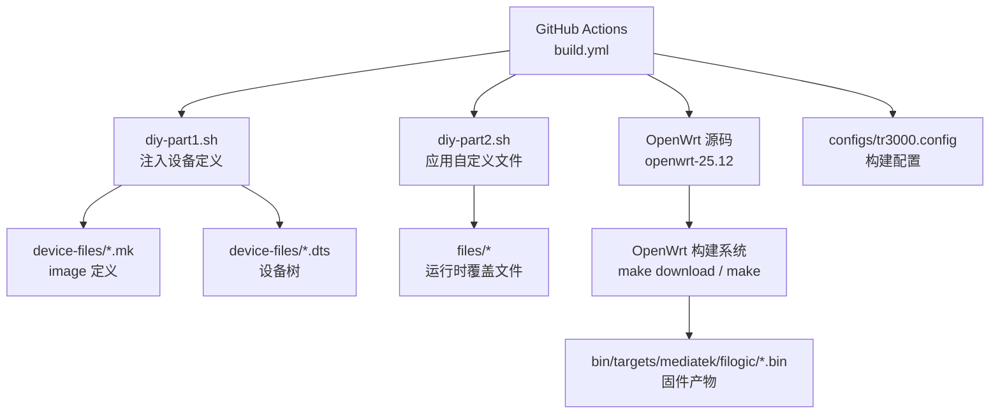
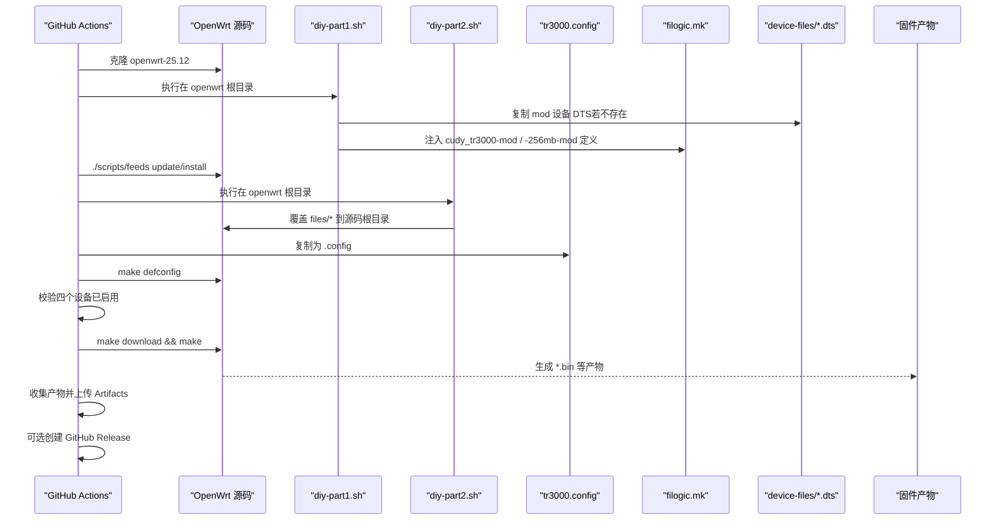
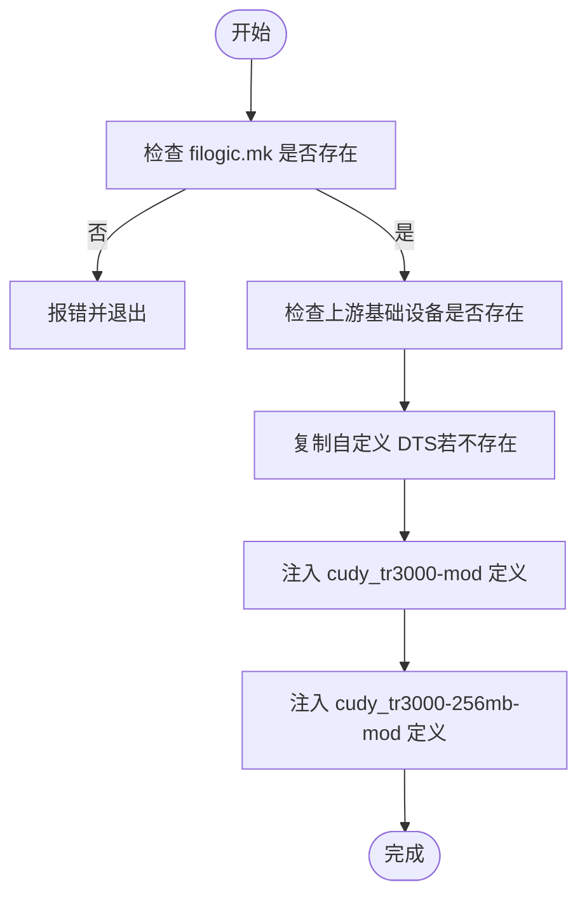
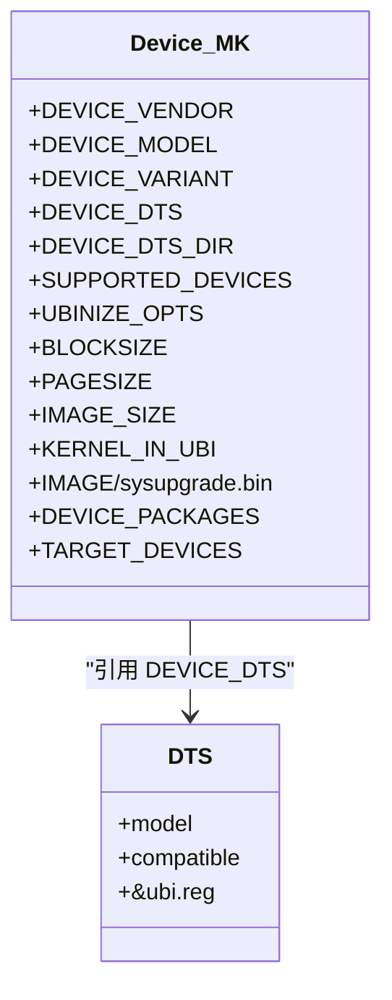
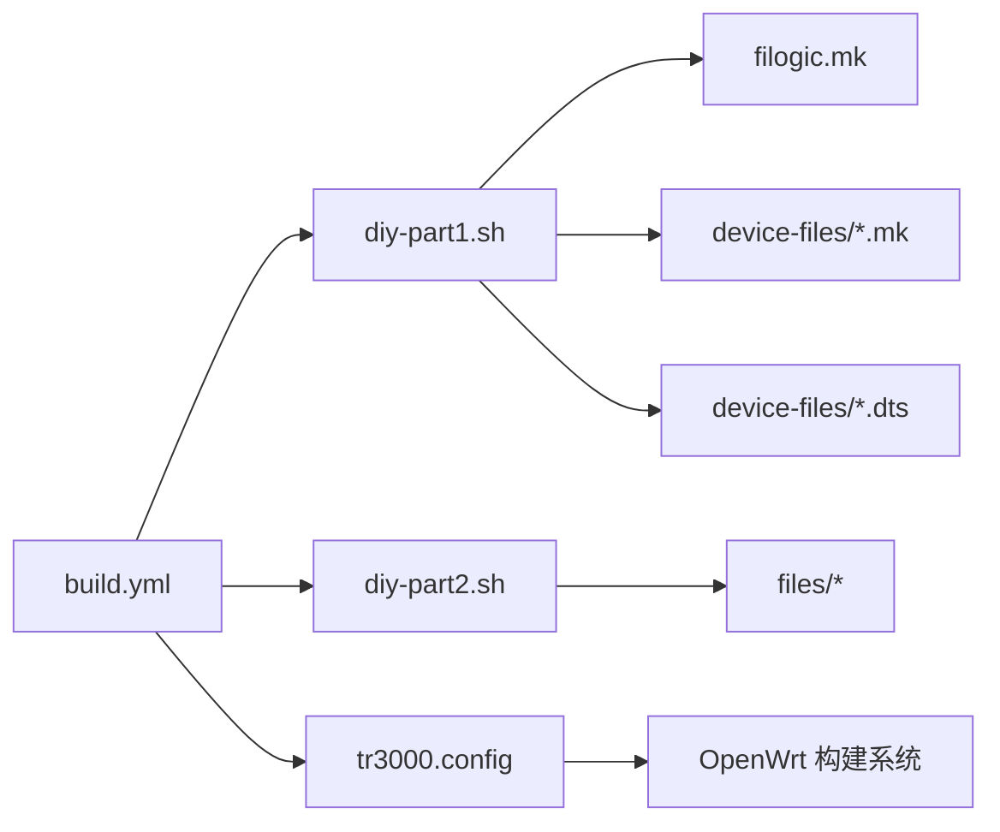

# 构建系统详解

<cite>
**本文引用的文件**   
- [build.yml](file://.github/workflows/build.yml)
- [diy-part1.sh](file://scripts/diy-part1.sh)
- [diy-part2.sh](file://scripts/diy-part2.sh)
- [tr3000.config](file://configs/tr3000.config)
- [filogic-cudy_tr3000-mod.mk](file://device-files/filogic-cudy_tr3000-mod.mk)
- [filogic-cudy_tr3000-256mb-mod.mk](file://device-files/filogic-cudy_tr3000-256mb-mod.mk)
- [mt7981b-cudy-tr3000-mod.dts](file://device-files/mt7981b-cudy-tr3000-mod.dts)
- [mt7981b-cudy-tr3000-256mb-mod.dts](file://device-files/mt7981b-cudy-tr3000-256mb-mod.dts)
</cite>

## 目录
1. [引言](#引言)
2. [项目结构](#项目结构)
3. [核心组件](#核心组件)
4. [架构总览](#架构总览)
5. [详细组件分析](#详细组件分析)
6. [依赖关系分析](#依赖关系分析)
7. [性能与构建优化](#性能与构建优化)
8. [故障排查指南](#故障排查指南)
9. [结论](#结论)
10. [附录：自定义与扩展示例](#附录自定义与扩展示例)

## 引言
本仓库为 Kwrt 针对 Cudy TR3000 设备的 OpenWrt 固件构建方案。它通过 GitHub Actions 自动拉取官方 OpenWrt 源码，注入设备定义与定制文件，加载构建配置，下载并编译软件包，最终产出多套固件镜像，并可自动发布到 GitHub Releases。

该构建系统的核心目标包括：
- 统一管理 OpenWrt 源码版本与构建环境
- 以脚本化方式向 OpenWrt 源码注入设备定义（含 DTS 与 image 定义）
- 通过配置文件集中控制目标平台、设备与软件包
- 提供可重复、幂等的构建流程，支持标准版与大分区版固件并行构建
- 自动化产物收集、校验与发布

## 项目结构
仓库采用“按职责分层”的组织方式：
- .github/workflows：GitHub Actions 工作流，负责触发、环境准备、源码克隆、构建与发布
- scripts：构建期自定义脚本，分为“注入设备定义”和“应用自定义文件”两个阶段
- configs：OpenWrt 构建配置文件，声明目标平台、设备与软件包
- device-files：设备相关定义，包含 Makefile 片段与设备树源（DTS）
- files：编译时覆盖到 OpenWrt 源码根目录的自定义文件（如 uci-defaults 等）

图表来源
- [build.yml:1-166](file://.github/workflows/build.yml#L1-L166)
- [diy-part1.sh:1-52](file://scripts/diy-part1.sh#L1-L52)
- [diy-part2.sh:1-22](file://scripts/diy-part2.sh#L1-L22)
- [tr3000.config:1-34](file://configs/tr3000.config#L1-L34)

章节来源
- [build.yml:1-166](file://.github/workflows/build.yml#L1-L166)
- [diy-part1.sh:1-52](file://scripts/diy-part1.sh#L1-L52)
- [diy-part2.sh:1-22](file://scripts/diy-part2.sh#L1-L22)
- [tr3000.config:1-34](file://configs/tr3000.config#L1-L34)

## 核心组件
- GitHub Actions 工作流：定义触发条件、并发策略、权限、任务步骤与产物发布
- diy-part1.sh：在 feeds 更新前，向 OpenWrt 源码注入大分区设备定义与 DTS
- diy-part2.sh：在 feeds 安装后，将仓库 files/ 覆盖到 OpenWrt 源码根目录
- tr3000.config：OpenWrt 构建配置，指定目标平台、设备与软件包
- device-files：设备 Makefile 片段与 DTS，描述硬件布局、UBI 分区与打包参数
- files：运行时覆盖文件（例如 uci-defaults），用于默认配置或首次启动脚本

章节来源
- [build.yml:1-166](file://.github/workflows/build.yml#L1-L166)
- [diy-part1.sh:1-52](file://scripts/diy-part1.sh#L1-L52)
- [diy-part2.sh:1-22](file://scripts/diy-part2.sh#L1-L22)
- [tr3000.config:1-34](file://configs/tr3000.config#L1-L34)
- [filogic-cudy_tr3000-mod.mk:1-19](file://device-files/filogic-cudy_tr3000-mod.mk#L1-L19)
- [filogic-cudy_tr3000-256mb-mod.mk:1-20](file://device-files/filogic-cudy_tr3000-256mb-mod.mk#L1-L20)
- [mt7981b-cudy-tr3000-mod.dts:1-23](file://device-files/mt7981b-cudy-tr3000-mod.dts#L1-L23)
- [mt7981b-cudy-tr3000-256mb-mod.dts:1-24](file://device-files/mt7981b-cudy-tr3000-256mb-mod.dts#L1-L24)

## 架构总览
整体构建流程如下：
1. 触发构建：手动触发、推送 main/master 分支、定时任务
2. 准备环境：清理磁盘空间、安装宿主依赖
3. 获取源码：克隆 openwrt-25.12 分支
4. 注入设备定义：执行 diy-part1.sh，复制 DTS 并向 filogic.mk 注入设备定义
5. 更新与安装 feeds
6. 应用自定义文件：执行 diy-part2.sh，将 files/ 覆盖到源码根目录
7. 加载构建配置：复制 tr3000.config 为 .config，运行 defconfig，校验设备是否启用
8. 下载源码与编译：download 与 make
9. 收集产物：拷贝 sysupgrade.bin、profiles.json、sha256sums，生成 SHA256SUMS.txt
10. 上传 Artifacts；可选发布 Release

图表来源
- [build.yml:40-166](file://.github/workflows/build.yml#L40-L166)
- [diy-part1.sh:1-52](file://scripts/diy-part1.sh#L1-L52)
- [diy-part2.sh:1-22](file://scripts/diy-part2.sh#L1-L22)
- [tr3000.config:1-34](file://configs/tr3000.config#L1-L34)

## 详细组件分析

### GitHub Actions 工作流（build.yml）
- 触发方式
  - workflow_dispatch：支持勾选是否发布 Release
  - push：main/master 分支推送自动构建
  - schedule：每周六 22:30 UTC 定时构建并发布
- 并发与权限
  - concurrency 使用 ref 分组，避免重复构建冲突
  - permissions.contents=write，允许创建 Release
- 构建步骤
  - 清理磁盘空间，安装宿主依赖
  - 克隆 openwrt-25.12 分支
  - 执行 diy-part1.sh 注入设备定义
  - 更新并安装 feeds
  - 执行 diy-part2.sh 应用自定义文件
  - 复制 tr3000.config 为 .config，运行 defconfig
  - 校验四个设备均已启用
  - 下载源码并编译
  - 收集产物、计算 SHA256SUMS.txt、生成步骤摘要
  - 上传 Artifacts
- 发布步骤
  - 仅在 schedule 或 workflow_dispatch 且勾选 release 时执行
  - 下载 Artifacts，生成 tag，创建 Release 并附带说明与产物

关键要点
- 构建机为 ubuntu-24.04，超时 350 分钟
- 构建命令先尝试并行编译，失败回退串行 V=s 输出详细日志
- 产物路径固定为 bin/targets/mediatek/filogic/*cudy_tr3000*sysupgrade.bin

章节来源
- [build.yml:1-166](file://.github/workflows/build.yml#L1-L166)

### diy-part1.sh：设备定义注入
职责
- 在 OpenWrt 源码根目录下运行
- 检查上游 filogic.mk 是否存在，确保脚本运行位置正确
- 自检上游基础设备（cudy_tr3000-v1、cudy_tr3000-256mb-v1）是否存在
- 复制自定义 DTS 到 target/linux/mediatek/dts（不覆盖已有文件）
- 幂等地向 filogic.mk 追加 cudy_tr3000-mod 与 cudy_tr3000-256mb-mod 的设备定义

执行顺序
1. 定位脚本与工作区目录
2. 校验 filogic.mk 存在
3. 遍历基础设备名，检测上游是否包含对应 define Device/...
4. 遍历 DTS 文件，若不存在则复制
5. 调用 inject_device 函数，判断是否已存在同名设备定义，否则追加

幂等性保证
- 对 DTS 与 mk 片段均进行存在性检查，避免重复复制与追加

错误处理
- 未找到 filogic.mk 直接退出
- 上游缺少基础设备时给出警告，便于发现分支不匹配问题

图表来源
- [diy-part1.sh:1-52](file://scripts/diy-part1.sh#L1-L52)

章节来源
- [diy-part1.sh:1-52](file://scripts/diy-part1.sh#L1-L52)

### diy-part2.sh：自定义文件覆盖
职责
- 在 OpenWrt 源码根目录下运行
- 将仓库 files/ 目录内容覆盖到当前目录（即 OpenWrt 源码根目录）
- 编译时这些文件会被打包进固件，常用于 uci-defaults、默认配置、启动脚本等

行为说明
- 若 files/ 存在则递归复制，否则跳过
- 使用 cp -rv 保留属性并显示过程

章节来源
- [diy-part2.sh:1-22](file://scripts/diy-part2.sh#L1-L22)

### tr3000.config：构建配置语法与选项
语法
- 遵循 OpenWrt Kconfig 风格，形如 CONFIG_XXX=y/n
- 通过 make defconfig 解析并生成 .config

主要选项分类
- 目标平台
  - CONFIG_TARGET_mediatek=y
  - CONFIG_TARGET_mediatek_filogic=y
- 设备选择
  - cudy_tr3000-v1：128M 标准版（原厂布局，ubi 64M）
  - cudy_tr3000-mod：128M 大分区版（U-Boot mod，ubi 112M）
  - cudy_tr3000-256mb-v1：256M 标准版（原厂布局，ubi 230M）
  - cudy_tr3000-256mb-mod：256M 大分区版（U-Boot mod，ubi 240M）
- LuCI 与中文界面
  - luci、luci-ssl、luci-i18n-base-zh-cn、luci-i18n-firewall-zh-cn
- 插件扩展（示例，取消注释即可启用）
  - ttyd、filebrowser-q、openclash、usb-storage、block-mount、opkg 中文界面等

注意事项
- 大分区设备定义由 diy-part1.sh 注入，因此必须确保该脚本成功执行
- 新增设备需同时修改此配置文件并在 .config 中启用

章节来源
- [tr3000.config:1-34](file://configs/tr3000.config#L1-L34)

### device-files：设备定义与设备树
- filogic-cudy_tr3000-mod.mk
  - 定义 cudy_tr3000-mod 设备
  - 设置 UBINIZE_OPTS、BLOCKSIZE、PAGESIZE、IMAGE_SIZE、KERNEL_IN_UBI、打包参数与附加驱动包
  - 将该设备加入 TARGET_DEVICES
- filogic-cudy_tr3000-256mb-mod.mk
  - 定义 cudy_tr3000-256mb-mod 设备
  - 设置 SUPPORTED_DEVICES 允许从 256M 标准版系统直接 sysupgrade 刷入
  - 其他字段与 128M 版类似，但 IMAGE_SIZE 更大
- mt7981b-cudy-tr3000-mod.dts
  - 基于官方 v1 定义，仅扩大 ubi 分区至 112MiB
  - 兼容标识为 cudy,tr3000-mod
- mt7981b-cudy-tr3000-256mb-mod.dts
  - 基于官方 256mb v1 定义，扩大 ubi 分区至 240MiB
  - 兼容标识为 cudy,tr3000-256mb-mod

图表来源
- [filogic-cudy_tr3000-mod.mk:1-19](file://device-files/filogic-cudy_tr3000-mod.mk#L1-L19)
- [filogic-cudy_tr3000-256mb-mod.mk:1-20](file://device-files/filogic-cudy_tr3000-256mb-mod.mk#L1-L20)
- [mt7981b-cudy-tr3000-mod.dts:1-23](file://device-files/mt7981b-cudy-tr3000-mod.dts#L1-L23)
- [mt7981b-cudy-tr3000-256mb-mod.dts:1-24](file://device-files/mt7981b-cudy-tr3000-256mb-mod.dts#L1-L24)

章节来源
- [filogic-cudy_tr3000-mod.mk:1-19](file://device-files/filogic-cudy_tr3000-mod.mk#L1-L19)
- [filogic-cudy_tr3000-256mb-mod.mk:1-20](file://device-files/filogic-cudy_tr3000-256mb-mod.mk#L1-L20)
- [mt7981b-cudy-tr3000-mod.dts:1-23](file://device-files/mt7981b-cudy-tr3000-mod.dts#L1-L23)
- [mt7981b-cudy-tr3000-256mb-mod.dts:1-24](file://device-files/mt7981b-cudy-tr3000-256mb-mod.dts#L1-L24)

## 依赖关系分析
- build.yml 依赖
  - scripts/diy-part1.sh：注入设备定义
  - scripts/diy-part2.sh：应用自定义文件
  - configs/tr3000.config：构建配置
  - device-files/*.mk 与 *.dts：被 diy-part1.sh 引用
- diy-part1.sh 依赖
  - OpenWrt 源码中的 target/linux/mediatek/image/filogic.mk
  - device-files/*.dts 与 *.mk
- diy-part2.sh 依赖
  - files/*：运行时覆盖文件
- tr3000.config 依赖
  - OpenWrt 构建系统（defconfig 解析）
  - 由 diy-part1.sh 注入的设备定义

图表来源
- [build.yml:40-166](file://.github/workflows/build.yml#L40-L166)
- [diy-part1.sh:1-52](file://scripts/diy-part1.sh#L1-L52)
- [diy-part2.sh:1-22](file://scripts/diy-part2.sh#L1-L22)
- [tr3000.config:1-34](file://configs/tr3000.config#L1-L34)

章节来源
- [build.yml:40-166](file://.github/workflows/build.yml#L40-L166)
- [diy-part1.sh:1-52](file://scripts/diy-part1.sh#L1-L52)
- [diy-part2.sh:1-22](file://scripts/diy-part2.sh#L1-L22)
- [tr3000.config:1-34](file://configs/tr3000.config#L1-L34)

## 性能与构建优化
- 并行下载与编译
  - make download -j8 加速源码下载
  - make -j"$(nproc)" 利用全部 CPU 核心编译
  - 失败回退 make -j1 V=s 以便定位问题
- 缓存与复用
  - 建议结合 GitHub Actions cache 缓存 OpenWrt 工具链与 dl 目录（可在现有工作流基础上扩展）
- 资源清理
  - 构建前清理宿主环境多余组件，释放磁盘空间
- 增量构建
  - 本地开发时可复用 OpenWrt 源码与 dl 目录，减少重复下载

[本节为通用指导，不涉及具体文件分析]

## 故障排查指南
常见问题与定位方法
- 上游基础设备缺失
  - 现象：diy-part1.sh 打印上游未找到基础设备的警告
  - 原因：使用的 OpenWrt 分支不包含 cudy_tr3000-v1 或 -256mb-v1
  - 解决：切换至包含该机型定义的分支或在上游添加相应定义
- 设备未在 .config 中启用
  - 现象：build.yml 校验失败，提示某设备未出现在 .config
  - 原因：diy-part1.sh 未注入 mk 定义，或 tr3000.config 未启用对应设备
  - 解决：确认 diy-part1.sh 执行成功，并确保 tr3000.config 中对应 CONFIG_TARGET_*_DEVICE_*=y
- 编译失败
  - 现象：并行编译失败
  - 解决：查看串行模式下的详细日志（V=s），定位具体模块或依赖问题
- 产物缺失
  - 现象：Artifacts 为空
  - 解决：检查 bin/targets/mediatek/filogic 下是否存在 *cudy_tr3000*sysupgrade.bin

调试技巧
- 在 build.yml 中临时增加 echo 或 cat .config 步骤，确认设备是否启用
- 在 diy-part1.sh 中增加 log 输出，观察 DTS 与 mk 注入过程
- 在 diy-part2.sh 中检查 files/ 是否被正确复制到源码根目录

章节来源
- [build.yml:78-97](file://.github/workflows/build.yml#L78-L97)
- [diy-part1.sh:16-49](file://scripts/diy-part1.sh#L16-L49)
- [diy-part2.sh:13-19](file://scripts/diy-part2.sh#L13-L19)

## 结论
本构建系统通过 GitHub Actions 实现端到端自动化，结合 diy-part1.sh 与 diy-part2.sh 的阶段性注入与覆盖机制，以及 tr3000.config 的集中式配置管理，稳定地产出多套 Cudy TR3000 固件。其设计强调幂等性与可维护性，便于扩展新设备与调整构建参数。

[本节为总结性内容，不涉及具体文件分析]

## 附录：自定义与扩展示例

### 添加新设备支持的步骤
- 在 device-files 中添加新的设备 Makefile 片段（参考 filogic-cudy_tr3000-mod.mk）
- 如需设备树，添加对应的 DTS 文件（参考 mt7981b-cudy-tr3000-mod.dts）
- 在 diy-part1.sh 中追加对新 mk 片段的注入逻辑与新 DTS 的复制逻辑
- 在 tr3000.config 中启用新设备的 CONFIG_TARGET_*_DEVICE_*=y
- 在 build.yml 中校验新设备是否已启用（可选）

参考路径
- [filogic-cudy_tr3000-mod.mk:1-19](file://device-files/filogic-cudy_tr3000-mod.mk#L1-L19)
- [mt7981b-cudy-tr3000-mod.dts:1-23](file://device-files/mt7981b-cudy-tr3000-mod.dts#L1-L23)
- [diy-part1.sh:28-49](file://scripts/diy-part1.sh#L28-L49)
- [tr3000.config:15-19](file://configs/tr3000.config#L15-L19)

### 修改构建参数的步骤
- 修改 tr3000.config 中的目标平台、设备或软件包选项
- 重新运行构建，确认 .config 生效
- 如需新增默认配置或启动脚本，放入 files/ 目录，由 diy-part2.sh 自动覆盖

参考路径
- [tr3000.config:11-34](file://configs/tr3000.config#L11-L34)
- [diy-part2.sh:13-19](file://scripts/diy-part2.sh#L13-L19)

### 自定义 GitHub Actions 工作流
- 修改触发条件（push、schedule、workflow_dispatch）
- 调整构建环境与依赖安装
- 扩展缓存策略以提升构建速度
- 自定义产物命名与发布标签

参考路径
- [build.yml:10-33](file://.github/workflows/build.yml#L10-L33)
- [build.yml:50-57](file://.github/workflows/build.yml#L50-L57)
- [build.yml:125-166](file://.github/workflows/build.yml#L125-L166)