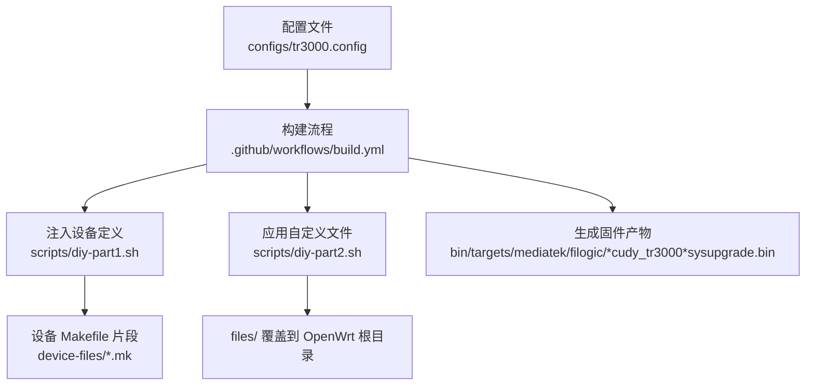
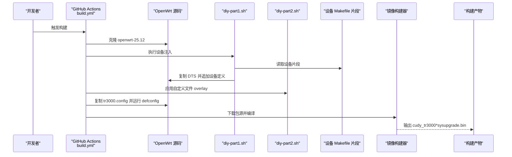
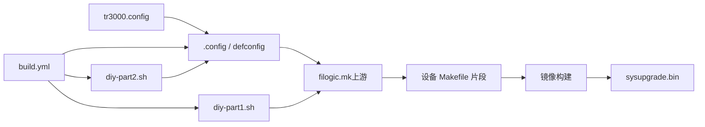

# 构建配置详解

<cite>
**本文引用的文件**   
- [tr3000.config](file://configs/tr3000.config)
- [filogic-cudy_tr3000-mod.mk](file://device-files/filogic-cudy_tr3000-mod.mk)
- [filogic-cudy_tr3000-256mb-mod.mk](file://device-files/filogic-cudy_tr3000-256mb-mod.mk)
- [diy-part1.sh](file://scripts/diy-part1.sh)
- [diy-part2.sh](file://scripts/diy-part2.sh)
- [build.yml](file://.github/workflows/build.yml)
- [.gitattributes](file://.gitattributes)
</cite>

## 目录
1. [简介](#简介)
2. [项目结构](#项目结构)
3. [核心组件](#核心组件)
4. [架构总览](#架构总览)
5. [详细组件分析](#详细组件分析)
6. [依赖关系分析](#依赖关系分析)
7. [性能与体积考量](#性能与体积考量)
8. [故障排查指南](#故障排查指南)
9. [结论](#结论)
10. [附录：配置语法与最佳实践](#附录配置语法与最佳实践)

## 简介
本文件为 Cudy TR3000 路由器的 OpenWrt 构建配置技术文档，围绕仓库中的 tr3000.config 展开，系统解释 OpenWrt 构建系统的配置语法与选项，包括目标平台、设备选择与软件包配置。同时说明如何通过脚本注入自定义设备定义、如何添加或修改软件包（含 LuCI 界面与中文语言包），并给出可操作的示例与最佳实践。

## 项目结构
该仓库采用“配置 + 设备定义 + 构建脚本”的清晰分层：
- configs/tr3000.config：OpenWrt 构建配置入口，声明目标平台、设备与软件包。
- device-files/*.mk：TR3000 大分区设备的 Makefile 片段，描述设备属性、镜像大小、UBI 参数与默认驱动包。
- scripts/diy-part1.sh / diy-part2.sh：在构建前向 OpenWrt 源码注入设备定义与应用自定义 overlay。
- .github/workflows/build.yml：GitHub Actions 自动化构建流程，串联克隆源码、注入设备、安装 feeds、加载配置、下载源码、编译与收集产物。
- .gitattributes：统一换行符，保证脚本在不同平台下行为一致。

**图示来源**
- [tr3000.config:1-34](file://configs/tr3000.config#L1-L34)
- [build.yml:64-104](file://.github/workflows/build.yml#L64-L104)
- [diy-part1.sh:1-51](file://scripts/diy-part1.sh#L1-L51)
- [diy-part2.sh:1-22](file://scripts/diy-part2.sh#L1-L22)

**章节来源**
- [tr3000.config:1-34](file://configs/tr3000.config#L1-L34)
- [build.yml:59-104](file://.github/workflows/build.yml#L59-L104)
- [diy-part1.sh:1-51](file://scripts/diy-part1.sh#L1-L51)
- [diy-part2.sh:1-22](file://scripts/diy-part2.sh#L1-L22)

## 核心组件
- 构建配置 tr3000.config：集中管理目标平台、设备与软件包开关。
- 设备定义 Makefile 片段：定义设备厂商、型号、DTS、UBI 参数、镜像大小与默认驱动包。
- 注入脚本 diy-part1.sh：将自定义 DTS 与设备定义注入上游 OpenWrt 源码。
- 覆盖脚本 diy-part2.sh：将 files/ 目录内容覆盖到 OpenWrt 源码根目录，用于默认配置与首次启动脚本等。
- CI 工作流 build.yml：编排整个构建过程，确保设备定义与配置一致性。

**章节来源**
- [tr3000.config:11-33](file://configs/tr3000.config#L11-L33)
- [filogic-cudy_tr3000-mod.mk:1-19](file://device-files/filogic-cudy_tr3000-mod.mk#L1-L19)
- [filogic-cudy_tr3000-256mb-mod.mk:1-20](file://device-files/filogic-cudy_tr3000-256mb-mod.mk#L1-L20)
- [diy-part1.sh:1-51](file://scripts/diy-part1.sh#L1-L51)
- [diy-part2.sh:1-22](file://scripts/diy-part2.sh#L1-L22)
- [build.yml:64-104](file://.github/workflows/build.yml#L64-L104)

## 架构总览
下图展示从配置到产物的端到端流程：

**图示来源**
- [build.yml:59-104](file://.github/workflows/build.yml#L59-L104)
- [diy-part1.sh:28-49](file://scripts/diy-part1.sh#L28-L49)
- [diy-part2.sh:13-19](file://scripts/diy-part2.sh#L13-L19)
- [tr3000.config:11-33](file://configs/tr3000.config#L11-L33)

## 详细组件分析

### 构建配置 tr3000.config
- 目标平台配置
  - CONFIG_TARGET_mediatek=y：启用 MediaTek 平台支持。
  - CONFIG_TARGET_mediatek_filogic=y：启用 Filogic 子平台支持，TR3000 基于 MT7981B，属于 Filogic 系列。
- 设备选择配置
  - CONFIG_TARGET_mediatek_filogic_DEVICE_cudy_tr3000-v1=y：标准版 128M（原厂布局）。
  - CONFIG_TARGET_mediatek_filogic_DEVICE_cudy_tr3000-mod=y：大分区版 128M（U-Boot mod，mod-112m 方案）。
  - CONFIG_TARGET_mediatek_filogic_DEVICE_cudy_tr3000-256mb-v1=y：标准版 256M（原厂布局）。
  - CONFIG_TARGET_mediatek_filogic_DEVICE_cudy_tr3000-256mb-mod=y：大分区版 256M（U-Boot mod，ubi 240M）。
- LuCI 与中文界面
  - CONFIG_PACKAGE_luci=y：启用 LuCI Web 管理界面。
  - CONFIG_PACKAGE_luci-ssl=y：启用 LuCI SSL 支持。
  - CONFIG_PACKAGE_luci-i18n-base-zh-cn=y：基础界面中文语言包。
  - CONFIG_PACKAGE_luci-i18n-firewall-zh-cn=y：防火墙模块中文语言包。
- 可选插件（按需启用）
  - luci-app-ttyd、luci-app-filebrowser-q、luci-app-openclash、kmod-usb-storage、block-mount、luci-i18n-opkg-zh-cn 等，通过取消注释启用。

影响与注意事项
- 目标平台与设备必须匹配；若上游未提供对应设备定义，需先通过 diy-part1.sh 注入。
- 启用过多软件包会增大固件体积，建议仅启用必要项。
- 中文语言包需与对应模块版本匹配，避免界面显示异常。

**章节来源**
- [tr3000.config:11-33](file://configs/tr3000.config#L11-L33)

### 设备定义 Makefile 片段
- filogic-cudy_tr3000-mod.mk（128M 大分区）
  - DEVICE_VENDOR/MODEL/VARIANT：标识设备信息。
  - DEVICE_DTS/DTS_DIR：指定设备树文件与目录。
  - UBINIZE_OPTS/BLOCKSIZE/PAGESIZE：UBI 卷参数。
  - IMAGE_SIZE/KERNEL_IN_UBI：镜像大小与内核位置。
  - IMAGE/sysupgrade.bin：sysupgrade 打包方式。
  - DEVICE_PACKAGES：默认驱动包（USB3、Wi-Fi 驱动与固件）。
- filogic-cudy_tr3000-256mb-mod.mk（256M 大分区）
  - 与 128M 大分区类似，但镜像大小更大，且包含 SUPPORTED_DEVICES 以允许从 256M 标准版直接 sysupgrade 刷入。

作用与影响
- 决定最终固件的分区布局、镜像大小与默认驱动集合。
- 大分区方案提升可用空间，便于安装更多软件包。
- SUPPORTED_DEVICES 字段影响升级兼容性。

**章节来源**
- [filogic-cudy_tr3000-mod.mk:1-19](file://device-files/filogic-cudy_tr3000-mod.mk#L1-L19)
- [filogic-cudy_tr3000-256mb-mod.mk:1-20](file://device-files/filogic-cudy_tr3000-256mb-mod.mk#L1-L20)

### 注入脚本 diy-part1.sh
职责
- 校验上游 filogic.mk 是否存在。
- 自检上游是否已包含标准版设备定义。
- 复制自定义 DTS（不覆盖已有同名文件）。
- 幂等注入设备定义到 filogic.mk（若不存在则追加）。

关键点
- 使用 grep 检测是否已存在 define Device/xxx，避免重复注入。
- 通过 append 追加设备片段，保持上游源码整洁。

风险与建议
- 若上游分支不包含所需设备定义，需先确认分支兼容性。
- 建议在 CI 中固定 OpenWrt 分支，避免上游变更导致不一致。

**章节来源**
- [diy-part1.sh:1-51](file://scripts/diy-part1.sh#L1-L51)

### 覆盖脚本 diy-part2.sh
职责
- 将仓库 files/ 目录内容覆盖到 OpenWrt 源码根目录，用于默认配置与首次启动脚本等。
- 若 files/ 不存在则跳过。

适用场景
- 放置 uci-defaults 脚本、默认配置文件、开机自启服务等。
- 与 tr3000.config 配合，实现“配置 + 运行时行为”的统一管理。

**章节来源**
- [diy-part2.sh:1-22](file://scripts/diy-part2.sh#L1-L22)

### CI 工作流 build.yml
关键步骤
- 安装主机依赖。
- 克隆 OpenWrt openwrt-25.12 分支。
- 执行 diy-part1.sh 注入设备定义。
- 更新并安装 feeds。
- 执行 diy-part2.sh 应用自定义文件。
- 复制 tr3000.config 为 .config 并运行 make defconfig。
- 校验所有设备均出现在 .config 中。
- 下载包源并编译固件。
- 收集 sysupgrade.bin 与校验和、profiles.json。

保障机制
- 对每个目标设备进行 .config 校验，失败即中断构建。
- 产物收集后生成 SHA256SUMS.txt，便于发布与验证。

**章节来源**
- [build.yml:50-114](file://.github/workflows/build.yml#L50-L114)

## 依赖关系分析
- tr3000.config 依赖 OpenWrt 目标平台与设备定义。
- 设备定义依赖 DTS 与上游 filogic.mk。
- diy-part1.sh 依赖 OpenWrt 源码结构与 filogic.mk。
- diy-part2.sh 依赖 files/ 目录。
- build.yml 串联上述所有环节，确保一致性。

**图示来源**
- [tr3000.config:11-33](file://configs/tr3000.config#L11-L33)
- [build.yml:64-104](file://.github/workflows/build.yml#L64-L104)
- [diy-part1.sh:28-49](file://scripts/diy-part1.sh#L28-L49)
- [diy-part2.sh:13-19](file://scripts/diy-part2.sh#L13-L19)

**章节来源**
- [tr3000.config:11-33](file://configs/tr3000.config#L11-L33)
- [build.yml:64-104](file://.github/workflows/build.yml#L64-L104)
- [diy-part1.sh:28-49](file://scripts/diy-part1.sh#L28-L49)
- [diy-part2.sh:13-19](file://scripts/diy-part2.sh#L13-L19)

## 性能与体积考量
- 目标平台与设备选择直接影响内核与驱动集合，进而影响固件体积与性能。
- 启用 LuCI 与中文语言包会增加体积，但提升易用性。
- 大分区方案提供更多用户空间，适合安装更多软件包。
- 建议仅在必要时启用额外插件，避免不必要的依赖链。

[本节为通用指导，无需具体文件引用]

## 故障排查指南
常见问题与定位
- 设备未出现在 .config
  - 检查 diy-part1.sh 是否正确注入设备定义。
  - 确认 tr3000.config 中对应 DEVICE_* 已启用。
  - 查看 build.yml 的设备校验逻辑是否通过。
- 上游缺少设备定义
  - 确认使用的 OpenWrt 分支是否包含 cudy_tr3000-v1 与 cudy_tr3000-256mb-v1。
  - 如缺失，需调整分支或补充上游设备定义。
- 中文界面显示异常
  - 确认已启用 luci-i18n-base-zh-cn 与相关模块的语言包。
  - 检查 LuCI 模块版本是否与固件版本匹配。
- 固件体积过大
  - 减少非必要插件与语言包。
  - 评估是否必须启用大分区方案。

**章节来源**
- [build.yml:83-89](file://.github/workflows/build.yml#L83-L89)
- [diy-part1.sh:21-26](file://scripts/diy-part1.sh#L21-L26)
- [tr3000.config:21-33](file://configs/tr3000.config#L21-L33)

## 结论
tr3000.config 作为 OpenWrt 构建配置的入口，结合设备 Makefile 片段与注入脚本，实现了针对 Cudy TR3000 的多变体固件构建。通过 CI 工作流的严格校验与标准化流程，确保了构建的一致性与可重复性。遵循本文的配置语法与最佳实践，可安全地扩展软件包、优化固件体积，并稳定产出可用的 sysupgrade 固件。

[本节为总结性内容，无需具体文件引用]

## 附录：配置语法与最佳实践

### OpenWrt 配置语法要点
- 目标平台开关
  - CONFIG_TARGET_<platform>=y/n
  - 示例：CONFIG_TARGET_mediatek=y、CONFIG_TARGET_mediatek_filogic=y
- 设备选择开关
  - CONFIG_TARGET_<platform>_<subplatform>_DEVICE_<device>=y/n
  - 示例：CONFIG_TARGET_mediatek_filogic_DEVICE_cudy_tr3000-mod=y
- 软件包开关
  - CONFIG_PACKAGE_<package>=y/n
  - 示例：CONFIG_PACKAGE_luci=y、CONFIG_PACKAGE_luci-i18n-base-zh-cn=y

### 添加新软件包的步骤
- 在 tr3000.config 中添加对应 CONFIG_PACKAGE_*=y 行。
- 如需默认行为或首次启动脚本，可在 files/ 目录下添加相应文件，由 diy-part2.sh 自动覆盖到 OpenWrt 源码根目录。
- 重新运行构建流程，确保依赖正确解析与编译。

### 修改现有配置的建议
- 优先通过 tr3000.config 管理软件包开关，保持可维护性。
- 设备相关参数（镜像大小、UBI 参数、默认驱动）集中在 device-files/*.mk 中，便于按机型管理。
- 使用 CI 校验确保所有目标设备均出现在 .config 中，避免遗漏。

### 注释规范
- 配置文件顶部应说明目标平台、设备变体与构建目标。
- 各配置段使用分隔注释（如“目标平台”“设备选择”“LuCI 与中文界面”）提高可读性。
- 可选插件以注释形式提供示例，便于按需启用。

**章节来源**
- [tr3000.config:1-33](file://configs/tr3000.config#L1-L33)
- [filogic-cudy_tr3000-mod.mk:1-19](file://device-files/filogic-cudy_tr3000-mod.mk#L1-L19)
- [filogic-cudy_tr3000-256mb-mod.mk:1-20](file://device-files/filogic-cudy_tr3000-256mb-mod.mk#L1-L20)
- [diy-part2.sh:1-22](file://scripts/diy-part2.sh#L1-L22)