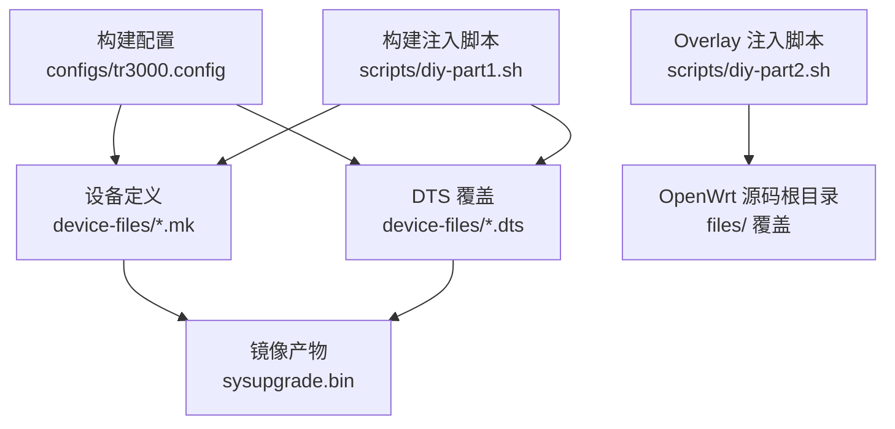
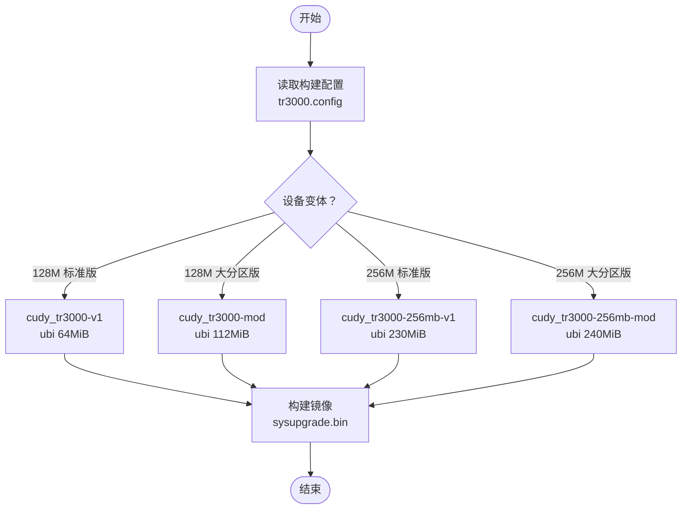
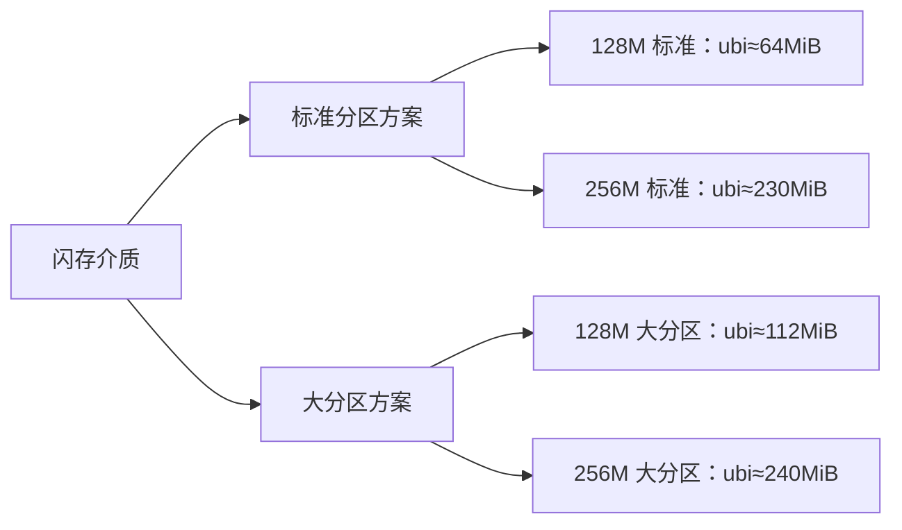
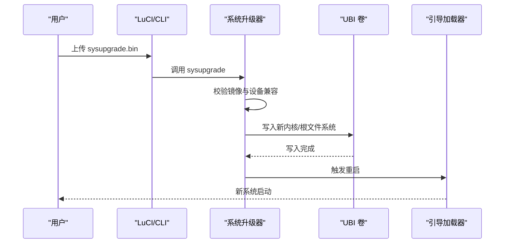
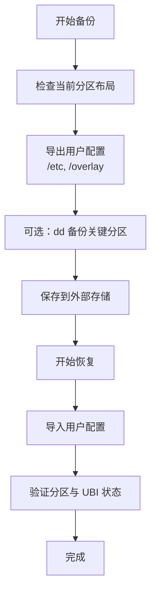
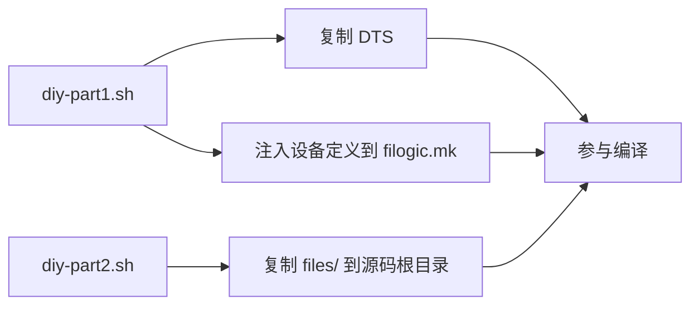
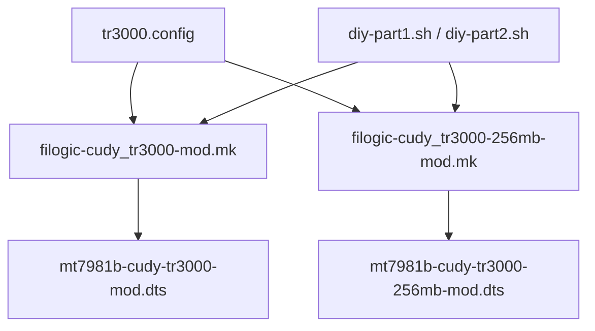

# 分区布局方案

<cite>
**本文引用的文件**   
- [tr3000.config](file://configs/tr3000.config)
- [filogic-cudy_tr3000-mod.mk](file://device-files/filogic-cudy_tr3000-mod.mk)
- [filogic-cudy_tr3000-256mb-mod.mk](file://device-files/filogic-cudy_tr3000-256mb-mod.mk)
- [diy-part1.sh](file://scripts/diy-part1.sh)
- [diy-part2.sh](file://scripts/diy-part2.sh)
- [mt7981b-cudy-tr3000-mod.dts](file://device-files/mt7981b-cudy-tr3000-mod.dts)
- [mt7981b-cudy-tr3000-256mb-mod.dts](file://device-files/mt7981b-cudy-tr3000-256mb-mod.dts)
</cite>

## 目录
1. [引言](#引言)
2. [项目结构](#项目结构)
3. [核心组件](#核心组件)
4. [架构总览](#架构总览)
5. [详细组件分析](#详细组件分析)
6. [依赖关系分析](#依赖关系分析)
7. [性能与容量特性](#性能与容量特性)
8. [故障排查指南](#故障排查指南)
9. [结论](#结论)
10. [附录：分区与安全建议](#附录分区与安全建议)

## 引言
本文面向 Cudy TR3000 的分区布局，系统性说明标准分区方案与大分区方案的差异、UBI 文件系统参数、sysupgrade.bin 固件结构与刷写流程、分区表与 UBI 卷配置要点，以及备份恢复机制和安全注意事项。文档基于仓库中的设备定义、构建脚本与 DTS 描述进行技术解读，帮助读者在 128MB 与 256MB 两种闪存规格下正确选择并安全使用分区方案。

## 项目结构
本仓库围绕“设备定义 + 构建注入 + DTS 覆盖”的方式实现 TR3000 的标准版与大分区版固件：
- configs/tr3000.config：声明目标平台与四款设备（128M 标准版、128M 大分区版、256M 标准版、256M 大分区版）。
- device-files/*.mk：定义大分区设备的镜像大小、UBI 参数与 sysupgrade.bin 生成规则。
- scripts/diy-part1.sh：在 OpenWrt 源码更新前，将自定义 DTS 与设备定义注入到上游 filogic.mk，保证可重复构建。
- scripts/diy-part2.sh：在 feeds 安装后，将 files/ 下的自定义 overlay 复制到 OpenWrt 源码根目录参与打包。
- device-files/*.dts：以 include 方式继承官方 v1 定义，仅调整 ubi 分区范围，形成“mod”大分区布局。

**图表来源**
- [tr3000.config:1-34](file://configs/tr3000.config#L1-L34)
- [filogic-cudy_tr3000-mod.mk:1-19](file://device-files/filogic-cudy_tr3000-mod.mk#L1-L19)
- [filogic-cudy_tr3000-256mb-mod.mk:1-20](file://device-files/filogic-cudy_tr3000-256mb-mod.mk#L1-L20)
- [diy-part1.sh:1-52](file://scripts/diy-part1.sh#L1-L52)
- [diy-part2.sh:1-22](file://scripts/diy-part2.sh#L1-L22)

**章节来源**
- [tr3000.config:1-34](file://configs/tr3000.config#L1-L34)
- [diy-part1.sh:1-52](file://scripts/diy-part1.sh#L1-L52)
- [diy-part2.sh:1-22](file://scripts/diy-part2.sh#L1-L22)

## 核心组件
- 构建配置 tr3000.config：集中声明 Mediatek Filogic 平台与四款设备变体，明确标准版与大分区版的 ubi 容量差异。
- 大分区设备定义 *.mk：设置 UBINIZE_OPTS、BLOCKSIZE、PAGESIZE、IMAGE_SIZE、KERNEL_IN_UBI 与 sysupgrade.bin 生成规则。
- DTS 覆盖 *.dts：在官方 v1 基础上扩展 ubi 分区起始地址与长度，保持尾部保留空间一致。
- 构建脚本 diy-part1.sh / diy-part2.sh：确保上游源码中注入自定义 DTS 与设备定义，并将 files/ 内容合并进固件。

关键要点：
- 标准版与大分区版的核心差异在于 ubi 分区大小与 IMAGE_SIZE。
- 所有大分区方案均启用 KERNEL_IN_UBI=1，内核与根文件系统位于 UBI 内。
- sysupgrade.bin 通过 sysupgrade-tar | append-metadata 生成，便于系统升级工具识别与回滚。

**章节来源**
- [tr3000.config:1-34](file://configs/tr3000.config#L1-L34)
- [filogic-cudy_tr3000-mod.mk:1-19](file://device-files/filogic-cudy_tr3000-mod.mk#L1-L19)
- [filogic-cudy_tr3000-256mb-mod.mk:1-20](file://device-files/filogic-cudy_tr3000-256mb-mod.mk#L1-L20)

## 架构总览
下图展示从构建配置到最终固件产物的整体流程，以及标准版与大分区版在 ubi 容量上的分支点。

**图表来源**
- [tr3000.config:1-34](file://configs/tr3000.config#L1-L34)
- [filogic-cudy_tr3000-mod.mk:1-19](file://device-files/filogic-cudy_tr3000-mod.mk#L1-L19)
- [filogic-cudy_tr3000-256mb-mod.mk:1-20](file://device-files/filogic-cudy_tr3000-256mb-mod.mk#L1-L20)

## 详细组件分析

### 标准分区方案与大分区方案差异
- 128MB 闪存：
  - 标准版：ubi 分区为 64MiB。
  - 大分区版：ubi 分区扩大至 112MiB，对应社区 mod-112m 方案；需第三方 U-Boot 支持。
- 256MB 闪存：
  - 标准版：ubi 分区为 230MiB。
  - 大分区版：ubi 分区扩大至 240MiB，仍保留约 10.25MiB 尾部空间；可从标准版系统直接 sysupgrade 升级。

差异来源：
- tr3000.config 明确列出四种变体的 ubi 容量。
- *.mk 中 IMAGE_SIZE 决定镜像大小，并与 ubi 容量匹配。
- *.dts 中 ubi 分区的 reg 字段指定起始地址与长度。

**图表来源**
- [tr3000.config:1-34](file://configs/tr3000.config#L1-L34)
- [mt7981b-cudy-tr3000-mod.dts:19-22](file://device-files/mt7981b-cudy-tr3000-mod.dts#L19-L22)
- [mt7981b-cudy-tr3000-256mb-mod.dts:20-23](file://device-files/mt7981b-cudy-tr3000-256mb-mod.dts#L20-L23)

**章节来源**
- [tr3000.config:1-34](file://configs/tr3000.config#L1-L34)
- [mt7981b-cudy-tr3000-mod.dts:1-23](file://device-files/mt7981b-cudy-tr3000-mod.dts#L1-L23)
- [mt7981b-cudy-tr3000-256mb-mod.dts:1-24](file://device-files/mt7981b-cudy-tr3000-256mb-mod.dts#L1-L24)

### U-Boot、内核、根文件系统与用户数据分配
- U-Boot：由硬件原厂或第三方修改版本提供；大分区 128M 方案要求已刷入第三方 U-Boot。
- 内核与根文件系统：启用 KERNEL_IN_UBI=1，二者均位于 UBI 卷内，便于原子升级与回滚。
- 用户数据：通常位于 UBI 内的独立卷（例如 rootfs_data），具体划分由 UBI 卷配置决定；本仓库未包含运行时卷创建脚本，但 mk 文件中定义了 UBI 构建参数，供构建阶段生成镜像。

注意：
- 大分区方案通过增大 ubi 分区来容纳更多软件包与用户数据。
- 尾部保留空间用于保护厂商分区与引导区，避免误写导致无法启动。

**章节来源**
- [filogic-cudy_tr3000-mod.mk:10-16](file://device-files/filogic-cudy_tr3000-mod.mk#L10-L16)
- [filogic-cudy_tr3000-256mb-mod.mk:11-17](file://device-files/filogic-cudy_tr3000-256mb-mod.mk#L11-L17)
- [mt7981b-cudy-tr3000-mod.dts:19-22](file://device-files/mt7981b-cudy-tr3000-mod.dts#L19-L22)
- [mt7981b-cudy-tr3000-256mb-mod.dts:20-23](file://device-files/mt7981b-cudy-tr3000-256mb-mod.dts#L20-L23)

### UBI 文件系统使用与配置参数
- UBINIZE_OPTS := -E 5：擦除块大小相关选项，影响 UBI 层对坏块与对齐的处理。
- BLOCKSIZE := 128k：UBIFS 逻辑块大小，影响写入效率与碎片化程度。
- PAGESIZE := 2048：NAND 页大小，必须与硬件闪存页大小一致。
- IMAGE_SIZE：镜像总大小，需与 ubi 分区容量匹配，避免溢出。
- KERNEL_IN_UBI := 1：将内核与根文件系统打包进 UBI，提升升级可靠性。

这些参数共同决定了 UBI/UBIFS 的性能与稳定性，并在构建时生成 sysupgrade.bin。

**章节来源**
- [filogic-cudy_tr3000-mod.mk:10-16](file://device-files/filogic-cudy_tr3000-mod.mk#L10-L16)
- [filogic-cudy_tr3000-256mb-mod.mk:11-17](file://device-files/filogic-cudy_tr3000-256mb-mod.mk#L11-L17)

### sysupgrade.bin 固件结构与刷写过程
- 结构：由 sysupgrade-tar 打包系统内容，再经 append-metadata 附加元数据，形成标准升级镜像。
- 刷写流程：
  1) 准备正确的设备变体镜像（标准版或大分区版）。
  2) 通过 LuCI 或命令行执行 sysupgrade。
  3) 系统校验镜像元数据与设备兼容性。
  4) 写入 UBI 卷并切换内核/根文件系统。
  5) 重启完成升级。

**图表来源**
- [filogic-cudy_tr3000-mod.mk:15-16](file://device-files/filogic-cudy_tr3000-mod.mk#L15-L16)
- [filogic-cudy_tr3000-256mb-mod.mk:16-17](file://device-files/filogic-cudy_tr3000-256mb-mod.mk#L16-L17)

**章节来源**
- [filogic-cudy_tr3000-mod.mk:15-16](file://device-files/filogic-cudy_tr3000-mod.mk#L15-L16)
- [filogic-cudy_tr3000-256mb-mod.mk:16-17](file://device-files/filogic-cudy_tr3000-256mb-mod.mk#L16-L17)

### 分区表格式、UBI 卷配置与备份恢复
- 分区表：由 DTS 中的 ubi 节点 reg 字段定义起始地址与长度；标准版与大分区版在此处产生差异。
- UBI 卷：内核与根文件系统位于 UBI 内；用户数据卷通常在运行时由系统创建与管理。
- 备份恢复：
  - 推荐在升级前备份 /etc、/overlay 等用户配置目录。
  - 若需完整镜像备份，可使用 dd 对特定分区进行镜像保存，并在需要时恢复。
  - 大分区方案允许更大用户数据空间，但仍应谨慎操作以避免覆盖厂商分区。

[此图为概念性流程图，不直接映射具体代码文件]

**章节来源**
- [mt7981b-cudy-tr3000-mod.dts:19-22](file://device-files/mt7981b-cudy-tr3000-mod.dts#L19-L22)
- [mt7981b-cudy-tr3000-256mb-mod.dts:20-23](file://device-files/mt7981b-cudy-tr3000-256mb-mod.dts#L20-L23)

### 构建注入与 Overlay 机制
- diy-part1.sh：
  - 检查上游 filogic.mk 是否存在基础设备定义。
  - 复制自定义 DTS 到 target/linux/mediatek/dts（若不存在同名文件则复制）。
  - 幂等注入 cudy_tr3000-mod 与 cudy_tr3000-256mb-mod 的设备定义到 filogic.mk。
- diy-part2.sh：
  - 将仓库 files/ 目录内容复制到 OpenWrt 源码根目录，参与固件打包。

**图表来源**
- [diy-part1.sh:28-49](file://scripts/diy-part1.sh#L28-L49)
- [diy-part2.sh:13-19](file://scripts/diy-part2.sh#L13-L19)

**章节来源**
- [diy-part1.sh:1-52](file://scripts/diy-part1.sh#L1-L52)
- [diy-part2.sh:1-22](file://scripts/diy-part2.sh#L1-L22)

## 依赖关系分析
- tr3000.config 依赖 mediatek_filogic 平台，并声明四款设备。
- *.mk 依赖 DTS 与 UBINIZE 工具链，生成 sysupgrade.bin。
- *.dts 继承官方 v1 定义，仅调整 ubi 分区范围。
- diy-part1.sh 依赖上游 filogic.mk 的存在，确保注入位置正确。
- diy-part2.sh 依赖 files/ 目录存在，否则跳过 overlay。

**图表来源**
- [tr3000.config:11-19](file://configs/tr3000.config#L11-L19)
- [filogic-cudy_tr3000-mod.mk:1-19](file://device-files/filogic-cudy_tr3000-mod.mk#L1-L19)
- [filogic-cudy_tr3000-256mb-mod.mk:1-20](file://device-files/filogic-cudy_tr3000-256mb-mod.mk#L1-L20)
- [diy-part1.sh:28-49](file://scripts/diy-part1.sh#L28-L49)
- [diy-part2.sh:13-19](file://scripts/diy-part2.sh#L13-L19)

**章节来源**
- [tr3000.config:11-19](file://configs/tr3000.config#L11-L19)
- [filogic-cudy_tr3000-mod.mk:1-19](file://device-files/filogic-cudy_tr3000-mod.mk#L1-L19)
- [filogic-cudy_tr3000-256mb-mod.mk:1-20](file://device-files/filogic-cudy_tr3000-256mb-mod.mk#L1-L20)
- [diy-part1.sh:28-49](file://scripts/diy-part1.sh#L28-L49)
- [diy-part2.sh:13-19](file://scripts/diy-part2.sh#L13-L19)

## 性能与容量特性
- 更大的 ubi 分区意味着更多的软件包与用户数据空间，但也可能增加首次启动时间与写入开销。
- BLOCKSIZE 与 PAGESIZE 的设置影响 I/O 效率；128k 逻辑块与 2048 页大小是常见组合，兼顾性能与磨损均衡。
- KERNEL_IN_UBI=1 提升升级可靠性，但需确保镜像大小不超过 ubi 分区容量。

[本节为通用性能讨论，不直接分析具体文件]

## 故障排查指南
- 刷错变体：
  - 现象：无法启动或分区异常。
  - 处理：确认设备闪存规格与变体是否匹配；128M 大分区需第三方 U-Boot。
- 镜像大小不匹配：
  - 现象：升级失败或分区溢出。
  - 处理：核对 IMAGE_SIZE 与 ubi 分区容量；重新构建正确变体镜像。
- UBI 参数不一致：
  - 现象：UBIFS 挂载错误或性能异常。
  - 处理：检查 UBINIZE_OPTS、BLOCKSIZE、PAGESIZE 是否与硬件一致。
- 构建注入失败：
  - 现象：目标设备未出现在构建列表中。
  - 处理：确认 diy-part1.sh 运行环境与上游 filogic.mk 存在；检查日志输出。

**章节来源**
- [filogic-cudy_tr3000-mod.mk:10-16](file://device-files/filogic-cudy_tr3000-mod.mk#L10-L16)
- [filogic-cudy_tr3000-256mb-mod.mk:11-17](file://device-files/filogic-cudy_tr3000-256mb-mod.mk#L11-L17)
- [diy-part1.sh:16-26](file://scripts/diy-part1.sh#L16-L26)

## 结论
Cudy TR3000 的标准分区与大分区方案通过 DTS 与 mk 定义精确控制 ubi 分区大小与镜像结构。标准版适合原厂 U-Boot 环境，大分区版在 128M 场景需第三方 U-Boot，在 256M 场景可直接 sysupgrade 升级。构建脚本确保可重复性与一致性，sysupgrade.bin 采用标准流程保障升级可靠性。合理选择变体、遵循备份策略与安全边界，是稳定运行的关键。

[本节为总结性内容，不直接分析具体文件]

## 附录：分区与安全建议
- 分区选择：
  - 128M 标准版：ubi≈64MiB，适合轻量部署。
  - 128M 大分区版：ubi≈112MiB，需第三方 U-Boot。
  - 256M 标准版：ubi≈230MiB。
  - 256M 大分区版：ubi≈240MiB，可从标准版直接升级。
- 安全边界：
  - 保持尾部约 10.25MiB 保留空间，避免覆盖厂商分区。
  - 升级前备份用户配置与关键数据。
- 最佳实践：
  - 使用与硬件匹配的变体镜像。
  - 校验镜像元数据与设备兼容性。
  - 谨慎操作分区与 UBI 卷，避免误写。

[本节为通用建议，不直接分析具体文件]