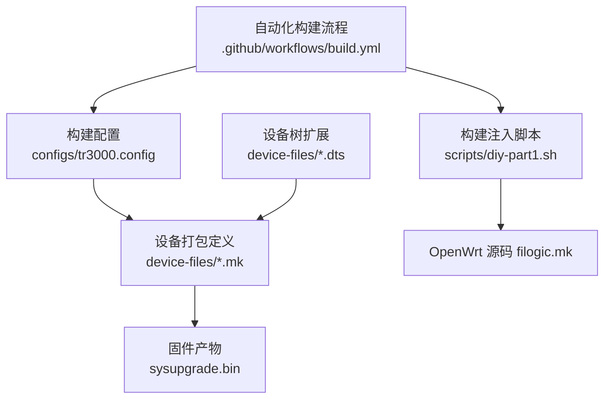
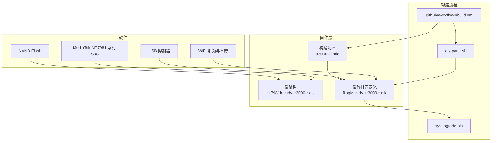
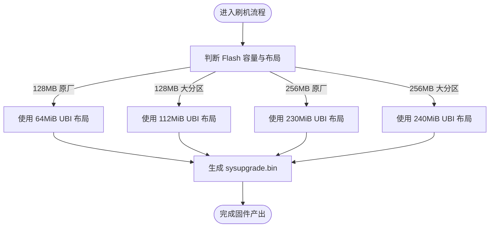
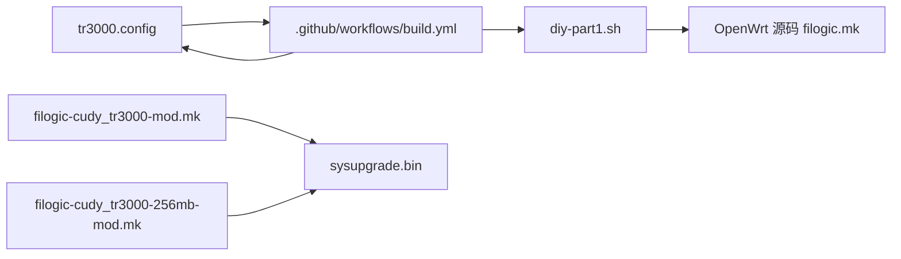
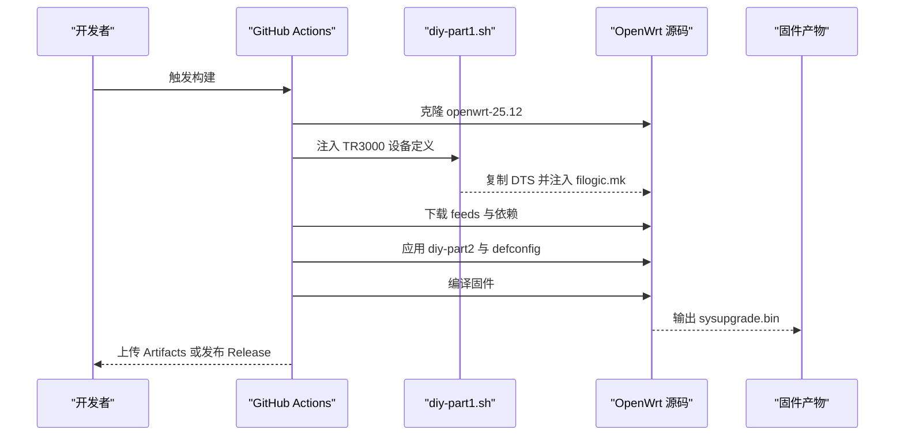

# 硬件规格详解

<cite>
**本文引用的文件**   
- [mt7981b-cudy-tr3000-mod.dts](file://device-files/mt7981b-cudy-tr3000-mod.dts)
- [mt7981b-cudy-tr3000-256mb-mod.dts](file://device-files/mt7981b-cudy-tr3000-256mb-mod.dts)
- [filogic-cudy_tr3000-mod.mk](file://device-files/filogic-cudy_tr3000-mod.mk)
- [filogic-cudy_tr3000-256mb-mod.mk](file://device-files/filogic-cudy_tr3000-256mb-mod.mk)
- [tr3000.config](file://configs/tr3000.config)
- [diy-part1.sh](file://scripts/diy-part1.sh)
- [build.yml](file://.github/workflows/build.yml)
</cite>

## 目录
1. [简介](#简介)
2. [项目结构](#项目结构)
3. [核心硬件组件](#核心硬件组件)
4. [架构总览](#架构总览)
5. [详细组件分析](#详细组件分析)
6. [依赖关系分析](#依赖关系分析)
7. [性能与功耗考量](#性能与功耗考量)
8. [故障排查指南](#故障排查指南)
9. [结论](#结论)

## 简介
本文件面向 Cudy TR3000 路由器，基于仓库中的设备定义、构建配置与固件打包脚本，整理并说明其硬件规格与相关系统实现要点。重点覆盖：
- 处理器平台与 SoC 型号
- 无线模块与驱动包
- 内存与闪存容量及分区布局
- USB 等外设支持
- 固件构建与刷写流程对硬件的影响
- 功耗、散热与环境要求（受限于仓库内容，仅给出可验证信息与建议）

需要特别说明的是：本仓库主要提供 OpenWrt 侧的设备定义与固件构建配置，并未包含官方产品手册或电气参数表。因此，关于 CPU 频率、天线数量、电源输入、功耗曲线、工作温度范围等具体数值，无法从当前仓库直接确认；文档中涉及这些内容的部分将明确标注“仓库未提供”，并给出基于现有信息的推断与建议。

## 项目结构
该仓库围绕 Cudy TR3000 的 OpenWrt 适配与固件构建组织，关键目录与文件如下：
- device-files：设备树与设备打包定义，描述 SoC、兼容标识、UBI 分区大小、镜像尺寸与内置驱动包
- configs：OpenWrt 目标平台与设备选择、LuCI 界面与可选插件的配置
- scripts：在构建前向 OpenWrt 源码注入自定义设备定义的脚本
- .github/workflows：GitHub Actions 自动构建与发布流程

**图表来源**
- [tr3000.config:1-34](file://configs/tr3000.config#L1-L34)
- [filogic-cudy_tr3000-mod.mk:1-18](file://device-files/filogic-cudy_tr3000-mod.mk#L1-L18)
- [filogic-cudy_tr3000-256mb-mod.mk:1-19](file://device-files/filogic-cudy_tr3000-256mb-mod.mk#L1-L19)
- [diy-part1.sh:1-51](file://scripts/diy-part1.sh#L1-L51)
- [build.yml:1-165](file://.github/workflows/build.yml#L1-L165)

**章节来源**
- [tr3000.config:1-34](file://configs/tr3000.config#L1-L34)
- [diy-part1.sh:1-51](file://scripts/diy-part1.sh#L1-L51)
- [build.yml:1-165](file://.github/workflows/build.yml#L1-L165)

## 核心硬件组件
根据仓库中的设备兼容标识、驱动包与构建配置，可以确认以下硬件相关信息：

- 处理器与平台
  - SoC 系列：MediaTek Filogic 平台
  - SoC 兼容标识：mediatek,mt7981
  - 设备兼容标识：cudy,tr3000-mod 与 cudy,tr3000-256mb-mod
  - 目标平台：CONFIG_TARGET_mediatek_filogic=y

- 无线模块与驱动
  - 内置驱动包：kmod-mt7915e、kmod-mt7981-firmware、mt7981-wo-firmware
  - 这表明系统为 MT7981 系列 SoC 加载 WiFi 固件，并通过 mt7915e 驱动启用无线功能

- USB 外设
  - 内置驱动包：kmod-usb3
  - 表明固件默认启用 USB 3.0 内核模块，便于挂载 U 盘或外接存储

- 内存与闪存
  - 存在 128MB 与 256MB 两个版本的标准版与大分区版固件
  - 大分区版通过修改 UBI 分区大小来扩大可用空间
  - 仓库未直接声明 RAM 类型与容量，但固件命名与分区策略暗示存在不同 Flash 容量的硬件版本

- 网络接口
  - 仓库未提供以太网 MAC、PHY、交换机芯片或端口数量的设备树节点信息
  - 无法从当前仓库确认有线网口数量与速率

**章节来源**
- [mt7981b-cudy-tr3000-mod.dts:12-22](file://device-files/mt7981b-cudy-tr3000-mod.dts#L12-L22)
- [mt7981b-cudy-tr3000-256mb-mod.dts:13-23](file://device-files/mt7981b-cudy-tr3000-256mb-mod.dts#L13-L23)
- [filogic-cudy_tr3000-mod.mk:1-18](file://device-files/filogic-cudy_tr3000-mod.mk#L1-L18)
- [filogic-cudy_tr3000-256mb-mod.mk:1-19](file://device-files/filogic-cudy_tr3000-256mb-mod.mk#L1-L19)
- [tr3000.config:11-19](file://configs/tr3000.config#L11-L19)

## 架构总览
下图展示 Cudy TR3000 在该仓库中的软件-硬件映射关系：SoC 通过设备树被识别，固件打包时加入无线与 USB 驱动，构建流程生成 sysupgrade 固件。

**图表来源**
- [mt7981b-cudy-tr3000-mod.dts:12-22](file://device-files/mt7981b-cudy-tr3000-mod.dts#L12-L22)
- [mt7981b-cudy-tr3000-256mb-mod.dts:13-23](file://device-files/mt7981b-cudy-tr3000-256mb-mod.dts#L13-L23)
- [filogic-cudy_tr3000-mod.mk:1-18](file://device-files/filogic-cudy_tr3000-mod.mk#L1-L18)
- [filogic-cudy_tr3000-256mb-mod.mk:1-19](file://device-files/filogic-cudy_tr3000-256mb-mod.mk#L1-L19)
- [tr3000.config:11-19](file://configs/tr3000.config#L11-L19)
- [diy-part1.sh:28-49](file://scripts/diy-part1.sh#L28-L49)
- [build.yml:64-97](file://.github/workflows/build.yml#L64-L97)

## 详细组件分析

### 处理器与平台
- SoC 兼容标识为 mediatek,mt7981，表明该设备运行在 MediaTek Filogic 平台上，使用 MT7981 系列 SoC。
- 设备兼容标识包括 cudy,tr3000-mod 与 cudy,tr3000-256mb-mod，用于区分标准版与大分区版固件。
- 构建配置启用 CONFIG_TARGET_mediatek_filogic=y，确认目标平台为 mediatek-filogic。

需要注意：
- 仓库未提供 CPU 核心数、主频、缓存、GPU/NPU 等详细指标。
- 仓库未提供 SoC 内部总线、DDR 控制器、PCIe/SATA 等更底层硬件细节。

**章节来源**
- [mt7981b-cudy-tr3000-mod.dts:15-17](file://device-files/mt7981b-cudy-tr3000-mod.dts#L15-L17)
- [mt7981b-cudy-tr3000-256mb-mod.dts:16-18](file://device-files/mt7981b-cudy-tr3000-256mb-mod.dts#L16-L18)
- [tr3000.config:11-13](file://configs/tr3000.config#L11-L13)

### 无线模块与天线
- 固件打包包含 kmod-mt7915e、kmod-mt7981-firmware、mt7981-wo-firmware，表示系统会加载 MT7981 的 WiFi 固件，并使用 mt7915e 驱动启用无线功能。
- 这通常对应 MT7981 集成 WiFi 能力，以及可能的外部或集成 WiFi 协处理方案。
- 仓库未提供：
  - 支持的 WiFi 协议版本（例如 802.11ax/Wi-Fi 6 的具体实现）
  - 双频或三频配置
  - 天线数量、增益、布局
  - 射频前端、PA/LNA 芯片信息

因此，关于“双频 WiFi 标准和天线配置”的具体技术细节，不能仅凭当前仓库断言，需参考产品手册或实际设备测量。

**章节来源**
- [filogic-cudy_tr3000-mod.mk:16-17](file://device-files/filogic-cudy_tr3000-mod.mk#L16-L17)
- [filogic-cudy_tr3000-256mb-mod.mk:17-18](file://device-files/filogic-cudy_tr3000-256mb-mod.mk#L17-L18)

### 内存与存储规格
仓库提供了较明确的闪存分区与固件镜像大小信息，但未直接声明 RAM 类型与容量。

- 128MB 大分区版
  - UBI 分区起始地址：0x5c0000
  - UBI 分区大小：112MiB
  - 固件镜像大小：约 114688KiB
  - 使用第三方 U-Boot 大分区布局（mod-112m）

- 256MB 大分区版
  - UBI 分区起始地址：0x5c0000
  - UBI 分区大小：240MiB
  - 固件镜像大小：约 245760KiB
  - 可从 256MB 标准版系统 sysupgrade 刷入，重启后 UBI 自动扩展到 240MiB

- 标准版
  - 128MB 标准版：原厂布局，UBI 64MiB
  - 256MB 标准版：原厂布局，UBI 230MiB

- RAM 规格
  - 仓库未提供 RAM 容量、类型、频率等信息
  - 固件命名中包含 128M/256M，通常指 Flash 容量，而非 RAM

**图表来源**
- [mt7981b-cudy-tr3000-mod.dts:19-22](file://device-files/mt7981b-cudy-tr3000-mod.dts#L19-L22)
- [mt7981b-cudy-tr3000-256mb-mod.dts:20-23](file://device-files/mt7981b-cudy-tr3000-256mb-mod.dts#L20-L23)
- [filogic-cudy_tr3000-mod.mk:10-16](file://device-files/filogic-cudy_tr3000-mod.mk#L10-L16)
- [filogic-cudy_tr3000-256mb-mod.mk:10-16](file://device-files/filogic-cudy_tr3000-256mb-mod.mk#L10-L16)
- [tr3000.config:4-8](file://configs/tr3000.config#L4-L8)

**章节来源**
- [mt7981b-cudy-tr3000-mod.dts:19-22](file://device-files/mt7981b-cudy-tr3000-mod.dts#L19-L22)
- [mt7981b-cudy-tr3000-256mb-mod.dts:20-23](file://device-files/mt7981b-cudy-tr3000-256mb-mod.dts#L20-L23)
- [filogic-cudy_tr3000-mod.mk:10-16](file://device-files/filogic-cudy_tr3000-mod.mk#L10-L16)
- [filogic-cudy_tr3000-256mb-mod.mk:10-16](file://device-files/filogic-cudy_tr3000-256mb-mod.mk#L10-L16)
- [tr3000.config:4-8](file://configs/tr3000.config#L4-L8)

### 网络接口与 USB 端口
- USB
  - 固件默认包含 kmod-usb3，表示启用 USB 3.0 内核模块
  - 可用于挂载 U 盘、移动硬盘或其他 USB 外设
- 以太网接口
  - 仓库未提供 MAC、PHY、交换芯片或端口数量
  - 无法从当前仓库确认有线网口数量、速率与 VLAN 配置

**章节来源**
- [filogic-cudy_tr3000-mod.mk:16-17](file://device-files/filogic-cudy_tr3000-mod.mk#L16-L17)
- [filogic-cudy_tr3000-256mb-mod.mk:17-18](file://device-files/filogic-cudy_tr3000-256mb-mod.mk#L17-L18)

### 其他外设
- LuCI 与中文界面
  - 构建配置启用 luci、luci-ssl 与简体中文语言包
  - 提供 Web 管理界面与防火墙规则界面中文支持
- 可选插件
  - 示例中包含 ttyd、filebrowser、openclash、block-mount 等插件开关
  - 可根据需求启用更多功能，但这些属于软件层面，不改变硬件规格

**章节来源**
- [tr3000.config:21-33](file://configs/tr3000.config#L21-L33)

## 依赖关系分析
该仓库的依赖关系主要体现在构建系统与设备定义之间：

- tr3000.config 指定目标平台 mediatek-filogic 与四个设备目标
- diy-part1.sh 在构建前向 OpenWrt 源码注入自定义设备定义
- build.yml 执行克隆源码、注入定义、下载依赖、编译固件、收集产物与发布 Release
- 设备打包定义 mk 文件决定镜像大小、UBI 参数与内置驱动包

**图表来源**
- [tr3000.config:11-19](file://configs/tr3000.config#L11-L19)
- [diy-part1.sh:28-49](file://scripts/diy-part1.sh#L28-L49)
- [build.yml:64-97](file://.github/workflows/build.yml#L64-L97)
- [filogic-cudy_tr3000-mod.mk:1-18](file://device-files/filogic-cudy_tr3000-mod.mk#L1-L18)
- [filogic-cudy_tr3000-256mb-mod.mk:1-19](file://device-files/filogic-cudy_tr3000-256mb-mod.mk#L1-L19)

**章节来源**
- [tr3000.config:11-19](file://configs/tr3000.config#L11-L19)
- [diy-part1.sh:28-49](file://scripts/diy-part1.sh#L28-L49)
- [build.yml:64-97](file://.github/workflows/build.yml#L64-L97)

## 性能与功耗考量
- 性能
  - 仓库未提供 CPU 主频、核心数、内存带宽、无线吞吐等基准测试数据
  - 可通过固件中的驱动包推断设备具备 MT7981 平台的 WiFi 能力，但具体性能取决于硬件设计与固件优化
- 功耗
  - 仓库未提供电源输入电压、电流、待机功耗、满载功耗等电气参数
  - 无法从当前仓库确认功耗曲线或能效表现
- 散热
  - 仓库未提供散热器、外壳材质、风道设计或热设计功率
  - 无法从当前仓库确认是否需要主动散热或被动散热方案
- 工作环境
  - 仓库未提供工作温度、湿度、海拔、认证标准等环境规范

建议：
- 如需精确性能与功耗数据，应参考 Cudy 官方产品手册、规格书或实测报告
- 若用于企业部署，建议在典型负载下进行端到端吞吐量、延迟与稳定性测试

[本节为通用指导，不直接分析具体代码文件]

## 故障排查指南
结合仓库中的构建与刷写逻辑，常见注意事项如下：

- 标准版与大分区版固件不可混刷
  - 128MB 标准版使用原厂布局（UBI 64MiB）
  - 128MB 大分区版需要第三方 U-Boot 大分区布局（mod-112m）
  - 256MB 标准版使用原厂布局（UBI 230MiB）
  - 256MB 大分区版可从标准版系统 sysupgrade 刷入，重启后 UBI 自动扩展到 240MiB

- 构建流程校验
  - GitHub Actions 会在加载配置后检查四个设备是否出现在 .config 中
  - 若设备定义注入失败，会导致构建中断

- 固件产物
  - 构建完成后收集所有 cudy_tr3000*sysupgrade.bin 产物
  - 同时生成 SHA256SUMS.txt 与 profiles.json 供发布与验证

**图表来源**
- [build.yml:59-97](file://.github/workflows/build.yml#L59-L97)
- [diy-part1.sh:28-49](file://scripts/diy-part1.sh#L28-L49)

**章节来源**
- [build.yml:78-105](file://.github/workflows/build.yml#L78-L105)
- [diy-part1.sh:28-49](file://scripts/diy-part1.sh#L28-L49)

## 结论
基于当前仓库内容，可以确认 Cudy TR3000 在软件侧使用 MediaTek Filogic 平台与 MT7981 系列 SoC，固件默认启用 USB 3.0 与 MT7981 WiFi 相关驱动，并提供 128MB 与 256MB 两种 Flash 容量的标准版与大分区版固件。仓库未提供 CPU 频率、内存类型与容量、无线协议细节、天线配置、电源与功耗、散热与环境规范等硬件级详细参数。

若需要完整的硬件规格说明书，建议：
- 查阅 Cudy 官方产品页面与产品手册
- 核对主板丝印、SoC 型号、Flash/RAM 颗粒型号
- 在典型负载下测试无线吞吐、有线转发与功耗表现
- 结合 OpenWrt 系统信息命令进一步确认运行时硬件状态

[本节为总结性内容，不直接分析具体代码文件]