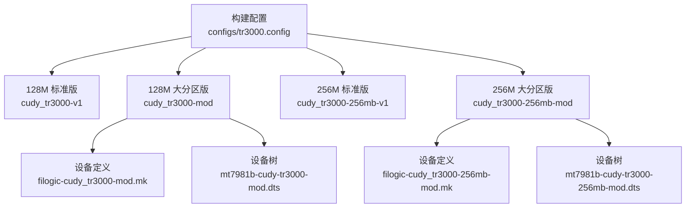
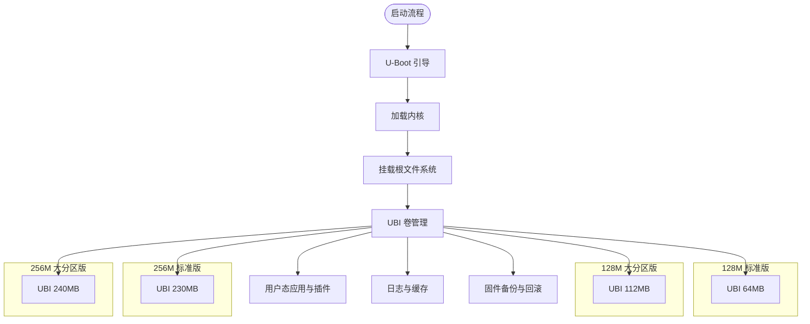
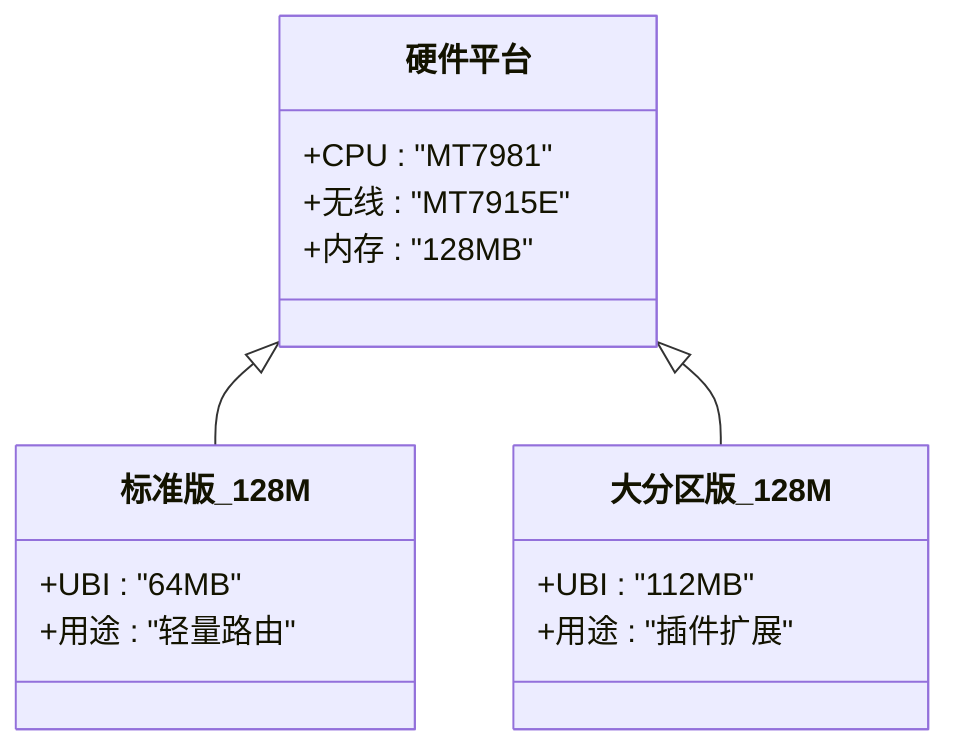
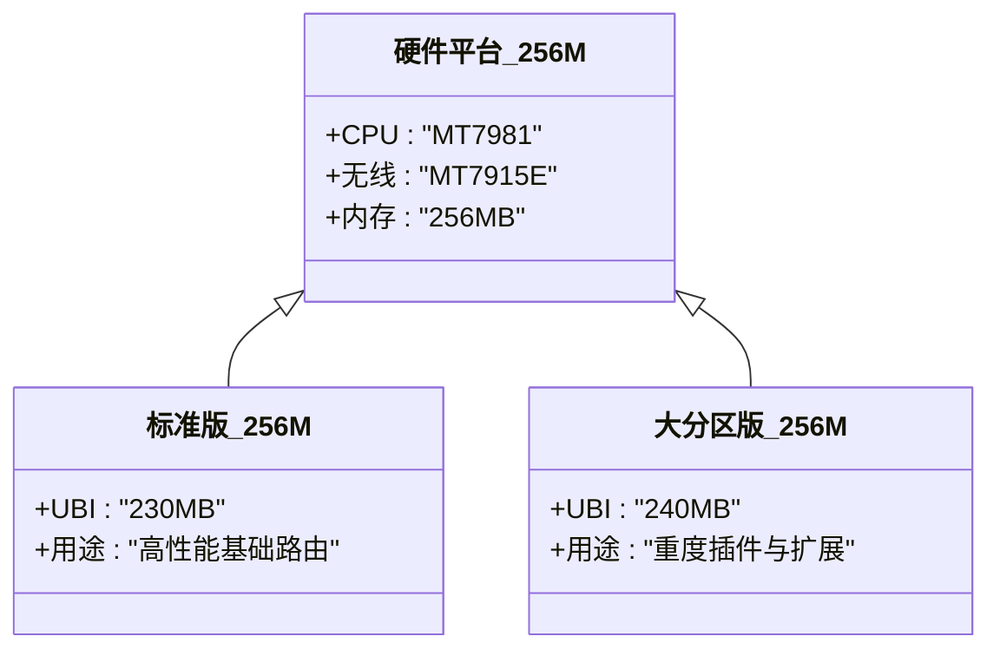
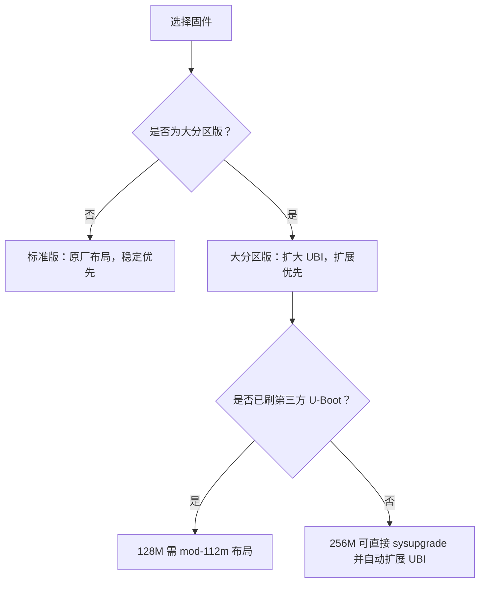
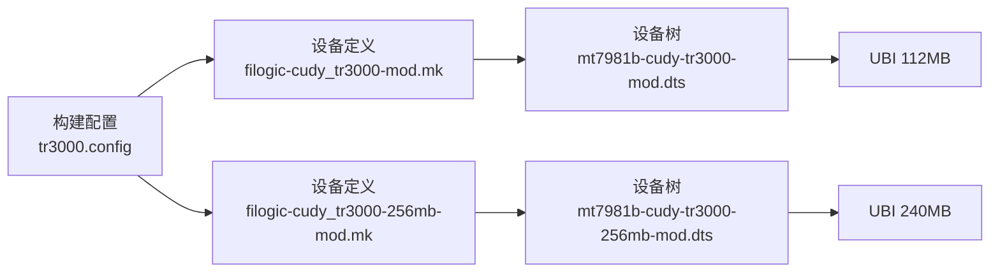

# 设备变体对比

<cite>
**本文引用的文件**   
- [tr3000.config](file://configs/tr3000.config)
- [filogic-cudy_tr3000-mod.mk](file://device-files/filogic-cudy_tr3000-mod.mk)
- [filogic-cudy_tr3000-256mb-mod.mk](file://device-files/filogic-cudy_tr3000-256mb-mod.mk)
- [mt7981b-cudy-tr3000-mod.dts](file://device-files/mt7981b-cudy-tr3000-mod.dts)
- [mt7981b-cudy-tr3000-256mb-mod.dts](file://device-files/mt7981b-cudy-tr3000-256mb-mod.dts)
</cite>

## 目录
1. [简介](#简介)
2. [项目结构与构建目标](#项目结构与构建目标)
3. [核心结论与硬件差异总览](#核心结论与硬件差异总览)
4. [架构与分区模型](#架构与分区模型)
5. [详细变体分析](#详细变体分析)
6. [兼容性矩阵与适用场景](#兼容性矩阵与适用场景)
7. [硬件识别与版本检测](#硬件识别与版本检测)
8. [依赖关系分析](#依赖关系分析)
9. [性能与容量影响](#性能与容量影响)
10. [故障排查与注意事项](#故障排查与注意事项)
11. [结论](#结论)

## 简介
本文面向 Cudy TR3000 设备的四种固件变体，基于仓库中的构建配置、设备定义与设备树文件，系统梳理以下要点：
- 128MB 与 256MB 内存版本的硬件规格差异（处理器平台一致，无线能力相同，主要差异在内存与 UBI 存储容量）。
- 标准版与大分区版的区别，重点解释 UBI 分区大小对固件功能的影响。
- 提供兼容性矩阵，说明不同变体的适用场景与限制。
- 给出硬件识别方法与版本检测命令建议。

本说明不直接展示源码内容，而是通过“章节来源”标注具体文件与行号，便于读者溯源。

**章节来源**
- [tr3000.config:1-34](file://configs/tr3000.config#L1-L34)

## 项目结构与构建目标
该仓库为 Cudy TR3000 的 OpenWrt/Kwrt 构建配置与设备定义集合，核心文件包括：
- 构建配置：configs/tr3000.config
- 设备包定义：device-files/filogic-cudy_tr3000-mod.mk、device-files/filogic-cudy_tr3000-256mb-mod.mk
- 设备树定义：device-files/mt7981b-cudy-tr3000-mod.dts、device-files/mt7981b-cudy-tr3000-256mb-mod.dts

构建配置明确一次构建产出四款固件：
- 128M 标准版：cudy_tr3000-v1（原厂布局，UBI 64MB）
- 128M 大分区版：cudy_tr3000-mod（U-Boot mod，UBI 112MB，mod-112m 方案）
- 256M 标准版：cudy_tr3000-256mb-v1（原厂布局，UBI 230MB）
- 256M 大分区版：cudy_tr3000-256mb-mod（U-Boot mod，UBI 240MB）

**图表来源**
- [tr3000.config:4-19](file://configs/tr3000.config#L4-L19)
- [filogic-cudy_tr3000-mod.mk:1-19](file://device-files/filogic-cudy_tr3000-mod.mk#L1-L19)
- [filogic-cudy_tr3000-256mb-mod.mk:1-20](file://device-files/filogic-cudy_tr3000-256mb-mod.mk#L1-L20)
- [mt7981b-cudy-tr3000-mod.dts:1-23](file://device-files/mt7981b-cudy-tr3000-mod.dts#L1-L23)
- [mt7981b-cudy-tr3000-256mb-mod.dts:1-24](file://device-files/mt7981b-cudy-tr3000-256mb-mod.dts#L1-L24)

**章节来源**
- [tr3000.config:1-34](file://configs/tr3000.config#L1-L34)

## 核心结论与硬件差异总览
- 处理器与无线能力：四个变体均基于 MediaTek Filogic MT7981 平台，使用相同的无线驱动包（kmod-mt7915e、kmod-mt7981-firmware、mt7981-wo-firmware），因此无线性能与 CPU 能力在各变体之间保持一致。
- 内存差异：128MB 与 256MB 两个硬件版本的主要差异是运行内存大小；256MB 版本在运行大型插件、多任务并发、日志缓存等方面具备更大空间优势。
- 存储差异（关键）：标准版与大分区版的差异体现在 UBI 分区大小：
  - 128M 标准版：UBI 64MB
  - 128M 大分区版：UBI 112MB（mod-112m 方案）
  - 256M 标准版：UBI 230MB
  - 256M 大分区版：UBI 240MB
- 大分区版的意义：更大的 UBI 分区可容纳更多用户态软件、日志、缓存与备份镜像，适合需要安装较多插件或进行高级定制的场景。

**章节来源**
- [tr3000.config:4-8](file://configs/tr3000.config#L4-L8)
- [filogic-cudy_tr3000-mod.mk:16-16](file://device-files/filogic-cudy_tr3000-mod.mk#L16-L16)
- [filogic-cudy_tr3000-256mb-mod.mk:17-17](file://device-files/filogic-cudy_tr3000-256mb-mod.mk#L17-L17)
- [mt7981b-cudy-tr3000-mod.dts:19-22](file://device-files/mt7981b-cudy-tr3000-mod.dts#L19-L22)
- [mt7981b-cudy-tr3000-256mb-mod.dts:20-23](file://device-files/mt7981b-cudy-tr3000-256mb-mod.dts#L20-L23)

## 架构与分区模型
TR3000 的固件架构围绕 U-Boot、内核、UBI 文件系统展开。大分区版通过调整 UBI 分区起始地址与长度，扩大可用存储空间，同时保留尾部安全区域以避免覆盖引导区或厂商数据。

**图表来源**
- [mt7981b-cudy-tr3000-mod.dts:19-22](file://device-files/mt7981b-cudy-tr3000-mod.dts#L19-L22)
- [mt7981b-cudy-tr3000-256mb-mod.dts:20-23](file://device-files/mt7981b-cudy-tr3000-256mb-mod.dts#L20-L23)

**章节来源**
- [mt7981b-cudy-tr3000-mod.dts:1-23](file://device-files/mt7981b-cudy-tr3000-mod.dts#L1-L23)
- [mt7981b-cudy-tr3000-256mb-mod.dts:1-24](file://device-files/mt7981b-cudy-tr3000-256mb-mod.dts#L1-L24)

## 详细变体分析

### 128MB 标准版 vs 128MB 大分区版
- 处理器与无线：一致（MT7981 平台，MT7915E 无线驱动）。
- 内存：均为 128MB。
- UBI 分区：
  - 标准版：64MB
  - 大分区版：112MB（mod-112m 方案）
- 适用场景：
  - 标准版：轻量使用，基础路由与网络功能。
  - 大分区版：需要安装更多插件、日志与缓存，或进行更复杂的网络定制。

**图表来源**
- [filogic-cudy_tr3000-mod.mk:1-19](file://device-files/filogic-cudy_tr3000-mod.mk#L1-L19)
- [mt7981b-cudy-tr3000-mod.dts:1-23](file://device-files/mt7981b-cudy-tr3000-mod.dts#L1-L23)

**章节来源**
- [tr3000.config:4-8](file://configs/tr3000.config#L4-L8)
- [filogic-cudy_tr3000-mod.mk:1-19](file://device-files/filogic-cudy_tr3000-mod.mk#L1-L19)
- [mt7981b-cudy-tr3000-mod.dts:1-23](file://device-files/mt7981b-cudy-tr3000-mod.dts#L1-L23)

### 256MB 标准版 vs 256MB 大分区版
- 处理器与无线：一致（MT7981 平台，MT7915E 无线驱动）。
- 内存：均为 256MB，相比 128MB 版本具备更强的多任务与缓存能力。
- UBI 分区：
  - 标准版：230MB
  - 大分区版：240MB（从原厂布局尾部保留区域中扩展，仍保留 10.25MB 尾部空间）
- 适用场景：
  - 标准版：高性能需求但保持原厂分区布局，兼容性好。
  - 大分区版：进一步扩展存储，适合重度插件、日志、缓存与备份需求。

**图表来源**
- [filogic-cudy_tr3000-256mb-mod.mk:1-20](file://device-files/filogic-cudy_tr3000-256mb-mod.mk#L1-L20)
- [mt7981b-cudy-tr3000-256mb-mod.dts:1-24](file://device-files/mt7981b-cudy-tr3000-256mb-mod.dts#L1-L24)

**章节来源**
- [tr3000.config:4-8](file://configs/tr3000.config#L4-L8)
- [filogic-cudy_tr3000-256mb-mod.mk:1-20](file://device-files/filogic-cudy_tr3000-256mb-mod.mk#L1-L20)
- [mt7981b-cudy-tr3000-256mb-mod.dts:1-24](file://device-files/mt7981b-cudy-tr3000-256mb-mod.dts#L1-L24)

### 标准版与大分区版的核心差异
- 分区策略：
  - 标准版遵循原厂分区布局，稳定性高、兼容性强。
  - 大分区版通过调整 UBI 分区长度扩大可用空间，提升可扩展性。
- 安全性边界：
  - 大分区版在扩大 UBI 的同时保留尾部安全区域（约 10.25MB），避免覆盖引导区或厂商数据。
- 升级路径：
  - 256M 大分区版支持从 256M 标准版系统直接 sysupgrade 刷入，重启后 UBI 自动扩展到 240MB。

**图表来源**
- [mt7981b-cudy-tr3000-mod.dts:3-10](file://device-files/mt7981b-cudy-tr3000-mod.dts#L3-L10)
- [mt7981b-cudy-tr3000-256mb-mod.dts:3-11](file://device-files/mt7981b-cudy-tr3000-256mb-mod.dts#L3-L11)
- [filogic-cudy_tr3000-256mb-mod.mk:3-3](file://device-files/filogic-cudy_tr3000-256mb-mod.mk#L3-L3)

**章节来源**
- [mt7981b-cudy-tr3000-mod.dts:1-23](file://device-files/mt7981b-cudy-tr3000-mod.dts#L1-L23)
- [mt7981b-cudy-tr3000-256mb-mod.dts:1-24](file://device-files/mt7981b-cudy-tr3000-256mb-mod.dts#L1-L24)
- [filogic-cudy_tr3000-256mb-mod.mk:1-20](file://device-files/filogic-cudy_tr3000-256mb-mod.mk#L1-L20)

## 兼容性矩阵与适用场景

| 变体 | 内存 | UBI 大小 | 是否需要第三方 U-Boot | 典型适用场景 | 限制与注意 |
|---|---:|---:|---:|---|---|
| 128M 标准版 (cudy_tr3000-v1) | 128MB | 64MB | 否 | 轻量路由、基础网络功能 | 插件与日志空间有限 |
| 128M 大分区版 (cudy_tr3000-mod) | 128MB | 112MB | 是（需 mod-112m 布局） | 插件扩展、中等负载 | 必须刷第三方 U-Boot 并使用对应分区布局 |
| 256M 标准版 (cudy_tr3000-256mb-v1) | 256MB | 230MB | 否 | 高性能基础路由、原生兼容 | 存储扩展空间小于大分区版 |
| 256M 大分区版 (cudy_tr3000-256mb-mod) | 256MB | 240MB | 否（可从标准版 sysupgrade） | 重度插件、日志与缓存、备份回滚 | 升级后 UBI 自动扩展，需注意尾部安全区域 |

**章节来源**
- [tr3000.config:4-8](file://configs/tr3000.config#L4-L8)
- [filogic-cudy_tr3000-mod.mk:1-19](file://device-files/filogic-cudy_tr3000-mod.mk#L1-L19)
- [filogic-cudy_tr3000-256mb-mod.mk:1-20](file://device-files/filogic-cudy_tr3000-256mb-mod.mk#L1-L20)
- [mt7981b-cudy-tr3000-mod.dts:3-10](file://device-files/mt7981b-cudy-tr3000-mod.dts#L3-L10)
- [mt7981b-cudy-tr3000-256mb-mod.dts:3-11](file://device-files/mt7981b-cudy-tr3000-256mb-mod.dts#L3-L11)

## 硬件识别与版本检测
以下为建议在设备上执行的识别与检测方法（用于区分内存大小、UBI 分区与当前固件变体）：

- 查看系统信息与内存大小
  - 命令示例：`cat /proc/meminfo`
  - 目的：确认是否为 128MB 或 256MB 内存版本。

- 查看 UBI 分区与大小
  - 命令示例：`cat /proc/mtd` 或 `ubidetach -l`
  - 目的：确认 UBI 分区长度是否符合预期（64MB/112MB/230MB/240MB）。

- 查看设备型号与兼容标识
  - 命令示例：`cat /sys/class/dmi/id/product_name` 或 `dmesg | grep -i model`
  - 目的：确认设备树中的 model 与 compatible 字段是否与预期变体一致。

- 检查支持的固件设备列表
  - 命令示例：`cat /tmp/sysinfo/model` 或 `fw_printenv supported_devices`
  - 目的：验证当前系统支持的固件设备名，确保与目标固件匹配。

- 执行 sysupgrade 前校验
  - 命令示例：`sysupgrade --check`
  - 目的：在升级前检查固件与设备兼容性，避免错误刷写。

提示：
- 128M 大分区版要求已刷第三方 U-Boot 并使用 mod-112m 分区布局。
- 256M 大分区版可从 256M 标准版系统直接 sysupgrade，重启后 UBI 自动扩展到 240MB。

**章节来源**
- [mt7981b-cudy-tr3000-mod.dts:3-10](file://device-files/mt7981b-cudy-tr3000-mod.dts#L3-L10)
- [mt7981b-cudy-tr3000-256mb-mod.dts:3-11](file://device-files/mt7981b-cudy-tr3000-256mb-mod.dts#L3-L11)
- [filogic-cudy_tr3000-256mb-mod.mk:3-3](file://device-files/filogic-cudy_tr3000-256mb-mod.mk#L3-L3)

## 依赖关系分析
设备定义与设备树之间的依赖关系如下：
- 构建配置启用四个目标设备。
- 大分区版设备定义包含无线与 USB 相关驱动包。
- 设备树继承官方 v1 定义，仅调整 UBI 分区范围。

**图表来源**
- [tr3000.config:16-19](file://configs/tr3000.config#L16-L19)
- [filogic-cudy_tr3000-mod.mk:1-19](file://device-files/filogic-cudy_tr3000-mod.mk#L1-L19)
- [filogic-cudy_tr3000-256mb-mod.mk:1-20](file://device-files/filogic-cudy_tr3000-256mb-mod.mk#L1-L20)
- [mt7981b-cudy-tr3000-mod.dts:12-22](file://device-files/mt7981b-cudy-tr3000-mod.dts#L12-L22)
- [mt7981b-cudy-tr3000-256mb-mod.dts:13-23](file://device-files/mt7981b-cudy-tr3000-256mb-mod.dts#L13-L23)

**章节来源**
- [tr3000.config:16-19](file://configs/tr3000.config#L16-L19)
- [filogic-cudy_tr3000-mod.mk:1-19](file://device-files/filogic-cudy_tr3000-mod.mk#L1-L19)
- [filogic-cudy_tr3000-256mb-mod.mk:1-20](file://device-files/filogic-cudy_tr3000-256mb-mod.mk#L1-L20)
- [mt7981b-cudy-tr3000-mod.dts:12-22](file://device-files/mt7981b-cudy-tr3000-mod.dts#L12-L22)
- [mt7981b-cudy-tr3000-256mb-mod.dts:13-23](file://device-files/mt7981b-cudy-tr3000-256mb-mod.dts#L13-L23)

## 性能与容量影响
- 处理器性能：各变体使用相同平台与驱动，CPU 性能无差异。
- 无线性能：各变体使用相同无线驱动包，无线性能无差异。
- 内存影响：256MB 版本在多任务、插件并发、日志缓存方面更具优势。
- UBI 容量影响：
  - 112MB vs 64MB：大分区版可显著增加插件与日志空间。
  - 240MB vs 230MB：大分区版进一步扩展存储，适合重度扩展场景。
- 尾部安全区域：大分区版保留约 10.25MB 尾部空间，保障引导区与厂商数据安全。

**章节来源**
- [tr3000.config:4-8](file://configs/tr3000.config#L4-L8)
- [filogic-cudy_tr3000-mod.mk:16-16](file://device-files/filogic-cudy_tr3000-mod.mk#L16-L16)
- [filogic-cudy_tr3000-256mb-mod.mk:17-17](file://device-files/filogic-cudy_tr3000-256mb-mod.mk#L17-L17)
- [mt7981b-cudy-tr3000-mod.dts:19-22](file://device-files/mt7981b-cudy-tr3000-mod.dts#L19-L22)
- [mt7981b-cudy-tr3000-256mb-mod.dts:20-23](file://device-files/mt7981b-cudy-tr3000-256mb-mod.dts#L20-L23)

## 故障排查与注意事项
- 128M 大分区版无法启动或 UBIFS 挂载失败：
  - 可能原因：未刷第三方 U-Boot 或未使用 mod-112m 分区布局。
  - 处理建议：确认已刷第三方 U-Boot，并选择 mod-112m 分区布局。
- 256M 大分区版升级后 UBI 未扩展：
  - 可能原因：未从 256M 标准版系统直接 sysupgrade。
  - 处理建议：从 256M 标准版系统执行 sysupgrade，重启后 UBI 自动扩展到 240MB。
- 插件安装失败或空间不足：
  - 可能原因：UBI 分区过小。
  - 处理建议：评估是否切换至大分区版固件。
- 升级前兼容性校验：
  - 建议使用 sysupgrade 的校验功能，确保固件与设备匹配。

**章节来源**
- [mt7981b-cudy-tr3000-mod.dts:3-10](file://device-files/mt7981b-cudy-tr3000-mod.dts#L3-L10)
- [mt7981b-cudy-tr3000-256mb-mod.dts:3-11](file://device-files/mt7981b-cudy-tr3000-256mb-mod.dts#L3-L11)
- [filogic-cudy_tr3000-256mb-mod.mk:3-3](file://device-files/filogic-cudy_tr3000-256mb-mod.mk#L3-L3)

## 结论
- 四个变体在处理器与无线性能上保持一致，主要差异在于内存与 UBI 存储容量。
- 标准版强调稳定与兼容，大分区版强调扩展与容量。
- 128M 大分区版需第三方 U-Boot 与 mod-112m 布局；256M 大分区版可从标准版直接升级并自动扩展 UBI。
- 选择建议：
  - 轻量使用：128M 标准版。
  - 插件扩展：128M 大分区版或 256M 大分区版。
  - 高性能基础路由：256M 标准版。
  - 重度扩展与备份回滚：256M 大分区版。

[无需章节来源，因为本节为总结性内容]