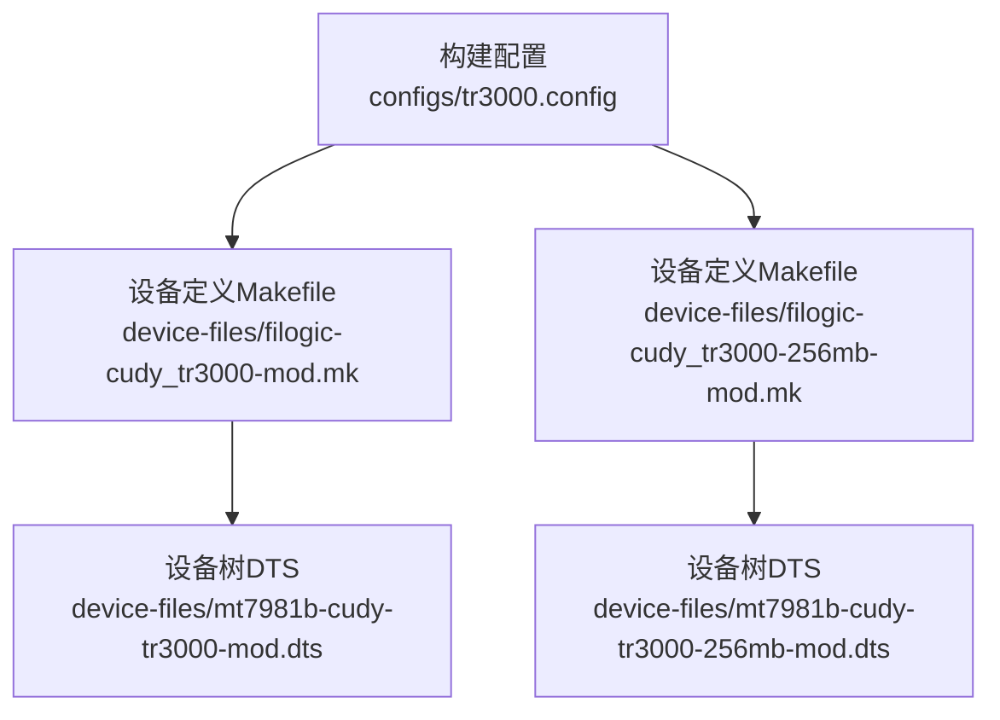
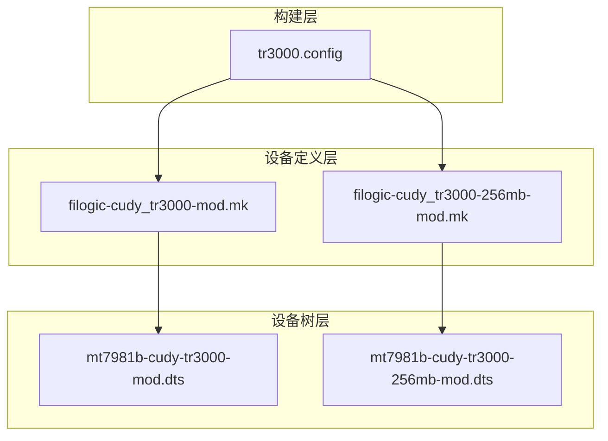
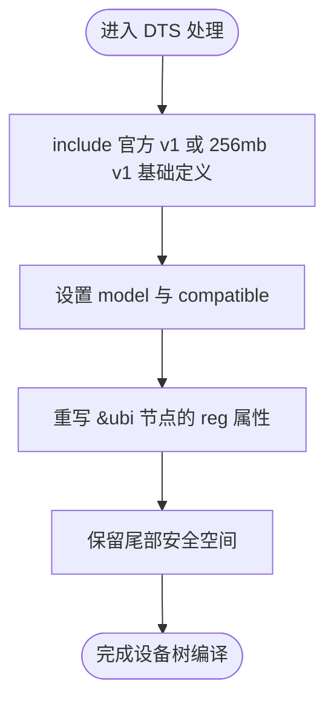
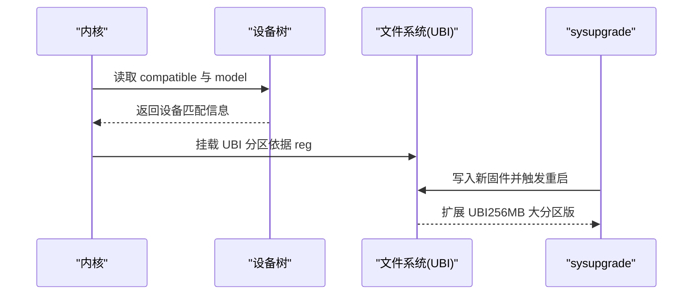
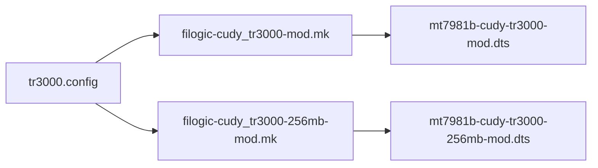

# 设备支持

<cite>
**本文引用的文件**   
- [filogic-cudy_tr3000-mod.mk](file://device-files/filogic-cudy_tr3000-mod.mk)
- [filogic-cudy_tr3000-256mb-mod.mk](file://device-files/filogic-cudy_tr3000-256mb-mod.mk)
- [mt7981b-cudy-tr3000-mod.dts](file://device-files/mt7981b-cudy-tr3000-mod.dts)
- [mt7981b-cudy-tr3000-256mb-mod.dts](file://device-files/mt7981b-cudy-tr3000-256mb-mod.dts)
- [tr3000.config](file://configs/tr3000.config)
</cite>

## 目录
1. [简介](#简介)
2. [项目结构](#项目结构)
3. [核心组件](#核心组件)
4. [架构总览](#架构总览)
5. [详细组件分析](#详细组件分析)
6. [依赖关系分析](#依赖关系分析)
7. [性能与分区特性](#性能与分区特性)
8. [故障排查指南](#故障排查指南)
9. [结论](#结论)
10. [附录：硬件兼容矩阵与已知限制](#附录硬件兼容矩阵与已知限制)

## 简介
本文件为 Kwrt 项目中 Cudy TR3000 系列设备的“设备支持”技术文档。内容覆盖以下方面：
- 四种设备变体的硬件规格差异、内存容量与分区布局
- .mk 设备定义文件的语法与关键字段含义
- .dts 设备树源文件的结构与硬件描述规范
- 标准版与大分区版的区别，包括 UBI 分区大小与 U-Boot 修改版的使用场景
- 设备识别、驱动加载与硬件检测相关配置
- 兼容性矩阵与已知限制

## 项目结构
Kwrt 针对 Cudy TR3000 的设备支持由三部分构成：
- 构建配置：configs/tr3000.config
- 设备定义（Makefile）：device-files/filogic-cudy_tr3000-mod.mk、device-files/filogic-cudy_tr3000-256mb-mod.mk
- 设备树（DTS）：device-files/mt7981b-cudy-tr3000-mod.dts、device-files/mt7981b-cudy-tr3000-256mb-mod.dts

**图表来源**
- [tr3000.config:1-34](file://configs/tr3000.config#L1-L34)
- [filogic-cudy_tr3000-mod.mk:1-19](file://device-files/filogic-cudy_tr3000-mod.mk#L1-L19)
- [filogic-cudy_tr3000-256mb-mod.mk:1-20](file://device-files/filogic-cudy_tr3000-256mb-mod.mk#L1-L20)
- [mt7981b-cudy-tr3000-mod.dts:1-23](file://device-files/mt7981b-cudy-tr3000-mod.dts#L1-L23)
- [mt7981b-cudy-tr3000-256mb-mod.dts:1-24](file://device-files/mt7981b-cudy-tr3000-256mb-mod.dts#L1-L24)

**章节来源**
- [tr3000.config:1-34](file://configs/tr3000.config#L1-L34)

## 核心组件
- 构建配置 tr3000.config：声明目标平台 mediatek_filogic，并启用四款设备目标：cudy_tr3000-v1、cudy_tr3000-mod、cudy_tr3000-256mb-v1、cudy_tr3000-256mb-mod。其中大分区设备由脚本注入到系统 Makefile。
- 设备定义 Makefile：定义 DEVICE_* 变量、UBI 参数、镜像大小、内核在 UBI 中的开关、sysupgrade 镜像生成方式以及默认安装包集合。
- 设备树 DTS：继承官方 v1 或 256mb v1 的硬件定义，仅调整 model、compatible 字符串与 ubi 分区的 reg 属性，以适配不同闪存布局。

**章节来源**
- [tr3000.config:11-19](file://configs/tr3000.config#L11-L19)
- [filogic-cudy_tr3000-mod.mk:1-19](file://device-files/filogic-cudy_tr3000-mod.mk#L1-L19)
- [filogic-cudy_tr3000-256mb-mod.mk:1-20](file://device-files/filogic-cudy_tr3000-256mb-mod.mk#L1-L20)
- [mt7981b-cudy-tr3000-mod.dts:1-23](file://device-files/mt7981b-cudy-tr3000-mod.dts#L1-L23)
- [mt7981b-cudy-tr3000-256mb-mod.dts:1-24](file://device-files/mt7981b-cudy-tr3000-256mb-mod.dts#L1-L24)

## 架构总览
下图展示从构建配置到设备树定义的依赖关系，以及各变体之间的继承与扩展关系。

**图表来源**
- [tr3000.config:11-19](file://configs/tr3000.config#L11-L19)
- [filogic-cudy_tr3000-mod.mk:1-19](file://device-files/filogic-cudy_tr3000-mod.mk#L1-L19)
- [filogic-cudy_tr3000-256mb-mod.mk:1-20](file://device-files/filogic-cudy_tr3000-256mb-mod.mk#L1-L20)
- [mt7981b-cudy-tr3000-mod.dts:1-23](file://device-files/mt7981b-cudy-tr3000-mod.dts#L1-L23)
- [mt7981b-cudy-tr3000-256mb-mod.dts:1-24](file://device-files/mt7981b-cudy-tr3000-256mb-mod.dts#L1-L24)

## 详细组件分析

### 设备定义文件（.mk）语法与关键字段
- 作用：声明设备元数据、UBI 参数、镜像大小、内核是否位于 UBI、sysupgrade 镜像生成方式以及默认安装包集合；并将设备加入 TARGET_DEVICES 供构建系统选择。
- 关键字段说明：
  - DEVICE_VENDOR / DEVICE_MODEL / DEVICE_VARIANT：厂商、型号与变体标识，用于 LuCI 与日志显示。
  - DEVICE_DTS / DEVICE_DTS_DIR：指定设备树文件名与目录，决定编译时使用的硬件描述。
  - UBINIZE_OPTS / BLOCKSIZE / PAGESIZE：UBI 卷创建参数，影响文件系统布局与擦写块大小。
  - IMAGE_SIZE：固件镜像最大尺寸，需与目标设备闪存布局匹配。
  - KERNEL_IN_UBI：将内核放入 UBI 卷，便于升级与回滚策略。
  - IMAGE/sysupgrade.bin：定义 sysupgrade 镜像打包流程。
  - DEVICE_PACKAGES：默认安装的驱动与固件包，如 USB3、Wi-Fi 驱动与 MT7981 固件。
  - SUPPORTED_DEVICES：允许从某类设备直接 sysupgrade 刷入当前固件，提升升级路径兼容性。

- 两个 .mk 的差异要点：
  - cudy_tr3000-mod：面向 128MB 闪存的大分区方案，UBI 分区扩大至约 112MB，IMAGE_SIZE 约为 114688KB。
  - cudy_tr3000-256mb-mod：面向 256MB 闪存的大分区方案，UBI 分区扩大至约 240MB，IMAGE_SIZE 约为 245760KB，并声明可从 256M 标准版系统直接升级。

**章节来源**
- [filogic-cudy_tr3000-mod.mk:1-19](file://device-files/filogic-cudy_tr3000-mod.mk#L1-L19)
- [filogic-cudy_tr3000-256mb-mod.mk:1-20](file://device-files/filogic-cudy_tr3000-256mb-mod.mk#L1-L20)

### 设备树源文件（.dts）结构与硬件描述
- 继承机制：通过 include 引入官方 v1 或 256mb v1 的基础硬件定义，避免重复描述网络、GPIO、LED、串口等外设。
- 关键节点与属性：
  - / { model = "..."; compatible = "cudy,tr3000-mod", "mediatek,mt7981"; }：设置设备模型与兼容字符串，用于内核设备匹配。
  - &ubi { reg = <起始地址 长度>; }：重写 ubi 分区的位置与大小，实现不同闪存布局的适配。
- 两种 DTS 的区别：
  - mt7981b-cudy-tr3000-mod.dts：基于 128MB 官方 v1，将 ubi 从原厂 64MB 扩大至 112MB，尾部保留约 10.25MB。
  - mt7981b-cudy-tr3000-256mb-mod.dts：基于 256MB 官方 v1，将 ubi 从原厂 230MB 扩大至 240MB，同样保留尾部空间。

**图表来源**
- [mt7981b-cudy-tr3000-mod.dts:12-22](file://device-files/mt7981b-cudy-tr3000-mod.dts#L12-L22)
- [mt7981b-cudy-tr3000-256mb-mod.dts:13-23](file://device-files/mt7981b-cudy-tr3000-256mb-mod.dts#L13-L23)

**章节来源**
- [mt7981b-cudy-tr3000-mod.dts:1-23](file://device-files/mt7981b-cudy-tr3000-mod.dts#L1-L23)
- [mt7981b-cudy-tr3000-256mb-mod.dts:1-24](file://device-files/mt7981b-cudy-tr3000-256mb-mod.dts#L1-L24)

### 四种设备变体的规格与分区布局对比
- 128MB 标准版（cudy_tr3000-v1）：使用原厂布局，UBI 分区为 64MB。适用于未刷第三方 U-Boot 的设备。
- 128MB 大分区版（cudy_tr3000-mod）：使用第三方 U-Boot 与 mod-112m 布局，UBI 分区扩大至约 112MB。
- 256MB 标准版（cudy_tr3000-256mb-v1）：使用原厂布局，UBI 分区为 230MB。
- 256MB 大分区版（cudy_tr3000-256mb-mod）：无需第三方 U-Boot 菜单适配，可直接从 256M 标准版系统 sysupgrade 刷入，重启后 UBI 自动扩展到约 240MB。

| 设备变体 | 内存容量 | 分区布局 | UBI 分区大小 | U-Boot 要求 | 升级路径 |
|---|---|---|---:|---|---|
| cudy_tr3000-v1 | 128MB | 原厂布局 | 64MB | 原厂 U-Boot | 标准版固件 |
| cudy_tr3000-mod | 128MB | mod-112m | 约 112MB | 第三方 U-Boot | 大分区固件 |
| cudy_tr3000-256mb-v1 | 256MB | 原厂布局 | 230MB | 原厂 U-Boot | 标准版固件 |
| cudy_tr3000-256mb-mod | 256MB | 原厂布局 + 尾部扩展 | 约 240MB | 无需第三方 U-Boot 菜单适配 | 可从 256M 标准版直接升级 |

**章节来源**
- [tr3000.config:4-8](file://configs/tr3000.config#L4-L8)
- [filogic-cudy_tr3000-mod.mk:1-19](file://device-files/filogic-cudy_tr3000-mod.mk#L1-L19)
- [filogic-cudy_tr3000-256mb-mod.mk:1-20](file://device-files/filogic-cudy_tr3000-256mb-mod.mk#L1-L20)
- [mt7981b-cudy-tr3000-mod.dts:5-9](file://device-files/mt7981b-cudy-tr3000-mod.dts#L5-L9)
- [mt7981b-cudy-tr3000-256mb-mod.dts:5-10](file://device-files/mt7981b-cudy-tr3000-256mb-mod.dts#L5-L10)

### 标准版与大分区版的关键区别
- UBI 分区大小：
  - 128MB：标准版 64MB → 大分区版约 112MB
  - 256MB：标准版 230MB → 大分区版约 240MB
- U-Boot 修改版使用场景：
  - 128MB 大分区版需要第三方 U-Boot 与 mod-112m 分区布局。
  - 256MB 大分区版无需第三方 U-Boot 菜单适配，可直接从标准版系统升级，并在重启后自动扩展 UBI。

**章节来源**
- [mt7981b-cudy-tr3000-mod.dts:5-9](file://device-files/mt7981b-cudy-tr3000-mod.dts#L5-L9)
- [mt7981b-cudy-tr3000-256mb-mod.dts:5-10](file://device-files/mt7981b-cudy-tr3000-256mb-mod.dts#L5-L10)

### 设备识别、驱动加载与硬件检测
- 设备识别：
  - 通过 DTS 的 compatible 字符串进行内核设备匹配，例如 “cudy,tr3000-mod”、“cudy,tr3000-256mb-mod”。
  - model 字段用于用户界面显示设备名称。
- 驱动加载：
  - 默认安装包包含 USB3 驱动、MT7915E Wi-Fi 驱动、MT7981 固件与无线优化固件，确保基本网络与无线功能可用。
- 硬件检测：
  - 设备树中重写 ubi 分区 reg 属性，确保内核与文件系统正确映射到目标闪存区域。
  - 256MB 大分区版在升级后自动扩展 UBI，减少手动分区操作风险。

**图表来源**
- [mt7981b-cudy-tr3000-mod.dts:15-22](file://device-files/mt7981b-cudy-tr3000-mod.dts#L15-L22)
- [mt7981b-cudy-tr3000-256mb-mod.dts:16-23](file://device-files/mt7981b-cudy-tr3000-256mb-mod.dts#L16-L23)
- [filogic-cudy_tr3000-256mb-mod.mk:10-17](file://device-files/filogic-cudy_tr3000-256mb-mod.mk#L10-L17)

**章节来源**
- [mt7981b-cudy-tr3000-mod.dts:15-22](file://device-files/mt7981b-cudy-tr3000-mod.dts#L15-L22)
- [mt7981b-cudy-tr3000-256mb-mod.dts:16-23](file://device-files/mt7981b-cudy-tr3000-256mb-mod.dts#L16-L23)
- [filogic-cudy_tr3000-mod.mk:15-17](file://device-files/filogic-cudy_tr3000-mod.mk#L15-L17)
- [filogic-cudy_tr3000-256mb-mod.mk:15-17](file://device-files/filogic-cudy_tr3000-256mb-mod.mk#L15-L17)

## 依赖关系分析
- 构建配置 tr3000.config 启用四个设备目标，并通过脚本将大分区设备定义注入到系统 Makefile。
- 设备定义 Makefile 依赖对应的 DTS 文件，决定内核编译时的硬件描述。
- DTS 文件继承官方 v1 或 256mb v1 的基础定义，仅调整 model、compatible 与 ubi 分区大小。

**图表来源**
- [tr3000.config:11-19](file://configs/tr3000.config#L11-L19)
- [filogic-cudy_tr3000-mod.mk:1-19](file://device-files/filogic-cudy_tr3000-mod.mk#L1-L19)
- [filogic-cudy_tr3000-256mb-mod.mk:1-20](file://device-files/filogic-cudy_tr3000-256mb-mod.mk#L1-L20)
- [mt7981b-cudy-tr3000-mod.dts:1-23](file://device-files/mt7981b-cudy-tr3000-mod.dts#L1-L23)
- [mt7981b-cudy-tr3000-256mb-mod.dts:1-24](file://device-files/mt7981b-cudy-tr3000-256mb-mod.dts#L1-L24)

**章节来源**
- [tr3000.config:11-19](file://configs/tr3000.config#L11-L19)

## 性能与分区特性
- UBI 分区越大，可安装更多软件包与数据，但会压缩其他分区（如 rootfs 或保留区）。
- 大分区方案通过调整 ubi 分区 reg 属性实现，保持尾部安全空间以避免破坏引导区。
- 256MB 大分区版在升级后自动扩展 UBI，减少手动分区带来的风险与停机时间。

[本节为通用指导，不直接分析具体文件]

## 故障排查指南
- 无法识别设备：
  - 检查 DTS 的 compatible 字符串是否与内核匹配。
  - 确认 model 字段是否正确设置。
- 分区异常或无法启动：
  - 核对 ubi 分区 reg 属性是否与目标闪存布局一致。
  - 128MB 大分区版必须使用第三方 U-Boot 与 mod-112m 布局。
- 升级失败：
  - 256MB 大分区版可从标准版直接升级；若失败，请确认镜像大小与 IMAGE_SIZE 匹配。
  - 检查 sysupgrade 镜像生成流程是否正确。

**章节来源**
- [mt7981b-cudy-tr3000-mod.dts:5-9](file://device-files/mt7981b-cudy-tr3000-mod.dts#L5-L9)
- [mt7981b-cudy-tr3000-256mb-mod.dts:5-10](file://device-files/mt7981b-cudy-tr3000-256mb-mod.dts#L5-L10)
- [filogic-cudy_tr3000-mod.mk:13-17](file://device-files/filogic-cudy_tr3000-mod.mk#L13-L17)
- [filogic-cudy_tr3000-256mb-mod.mk:14-17](file://device-files/filogic-cudy_tr3000-256mb-mod.mk#L14-L17)

## 结论
Kwrt 对 Cudy TR3000 的设备支持通过构建配置、设备定义与设备树三层协作实现。标准版与大分区版的核心差异在于 UBI 分区大小与 U-Boot 要求。128MB 大分区版需要第三方 U-Boot，而 256MB 大分区版可直接从标准版升级并自动扩展 UBI。合理选择设备变体与分区布局，有助于提升稳定性与可扩展性。

[本节为总结，不直接分析具体文件]

## 附录：硬件兼容矩阵与已知限制
- 兼容矩阵：
  - 128MB 标准版：原厂布局，UBI 64MB，适合未刷第三方 U-Boot 的设备。
  - 128MB 大分区版：mod-112m 布局，UBI 约 112MB，需第三方 U-Boot。
  - 256MB 标准版：原厂布局，UBI 230MB，适合未刷第三方 U-Boot 的设备。
  - 256MB 大分区版：原厂布局 + 尾部扩展，UBI 约 240MB，可直接从标准版升级。
- 已知限制：
  - 128MB 大分区版必须使用第三方 U-Boot 与 mod-112m 布局，否则可能导致分区错位。
  - 256MB 大分区版虽无需第三方 U-Boot 菜单适配，但仍需确保镜像大小与 IMAGE_SIZE 匹配。
  - 尾部保留空间不可随意占用，以免破坏引导区。

**章节来源**
- [tr3000.config:4-8](file://configs/tr3000.config#L4-L8)
- [filogic-cudy_tr3000-mod.mk:1-19](file://device-files/filogic-cudy_tr3000-mod.mk#L1-L19)
- [filogic-cudy_tr3000-256mb-mod.mk:1-20](file://device-files/filogic-cudy_tr3000-256mb-mod.mk#L1-L20)
- [mt7981b-cudy-tr3000-mod.dts:5-9](file://device-files/mt7981b-cudy-tr3000-mod.dts#L5-L9)
- [mt7981b-cudy-tr3000-256mb-mod.dts:5-10](file://device-files/mt7981b-cudy-tr3000-256mb-mod.dts#L5-L10)