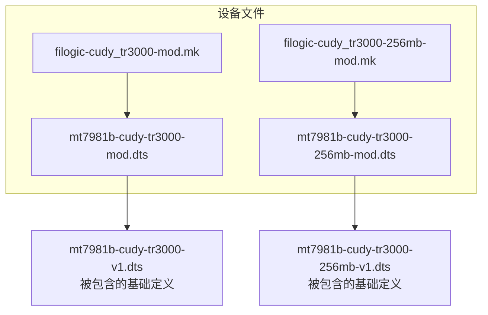
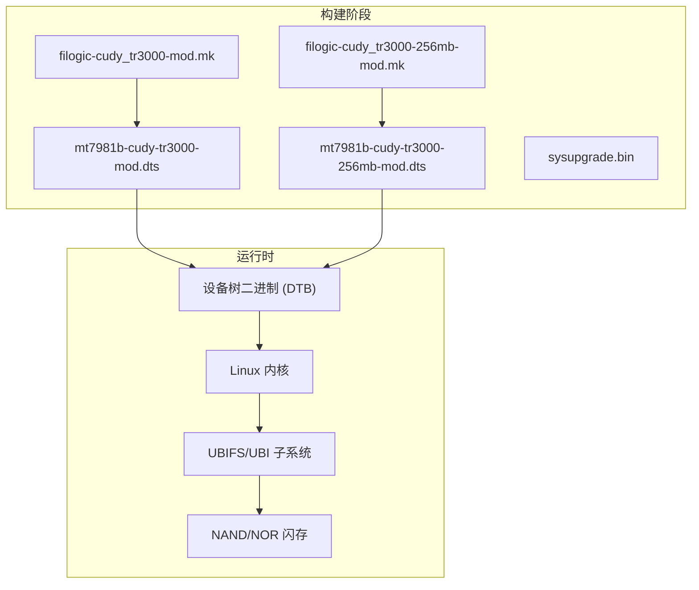
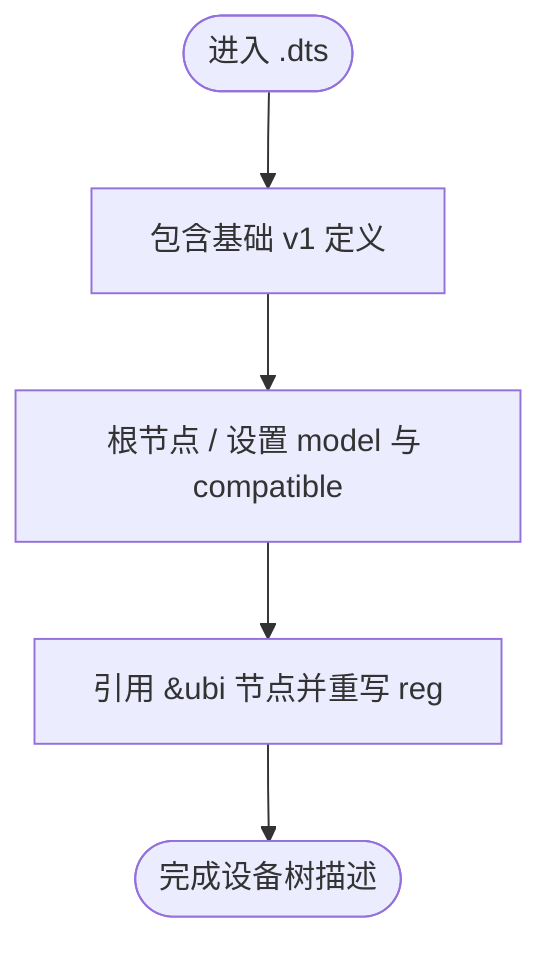
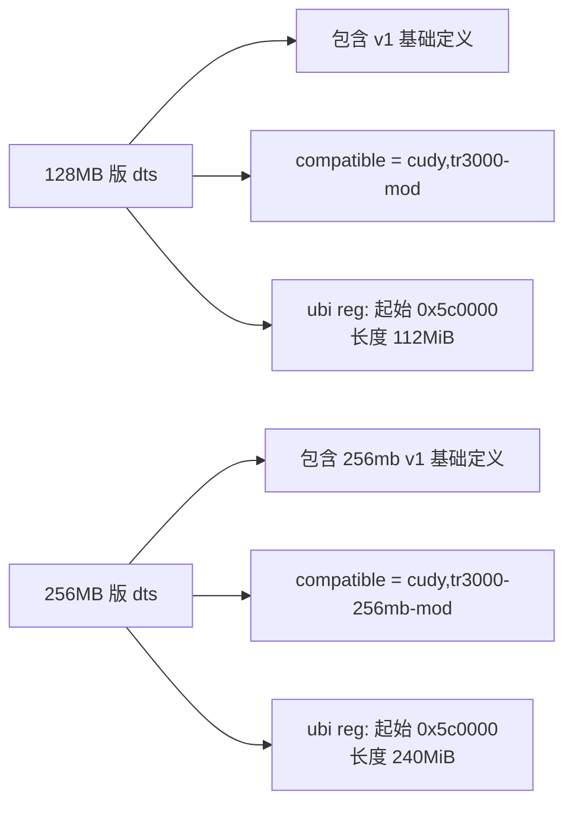
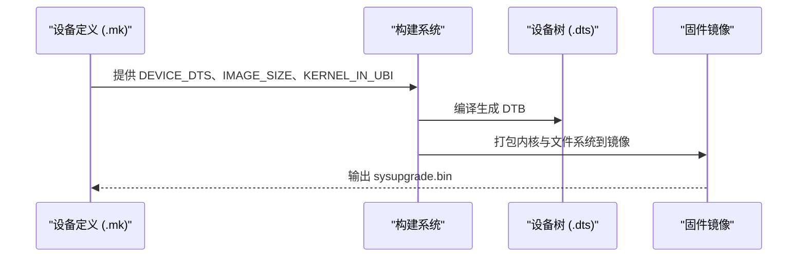
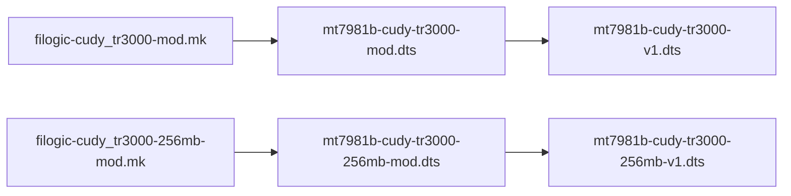
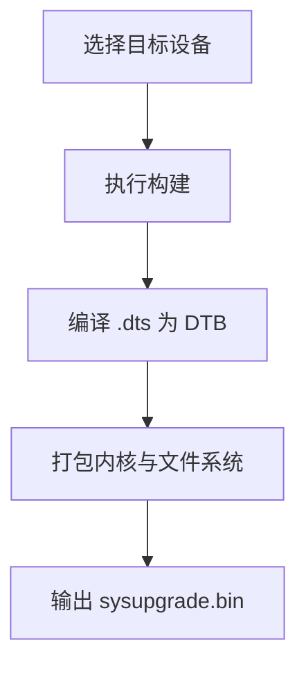

# 设备树配置

<cite>
**本文引用的文件**   
- [mt7981b-cudy-tr3000-mod.dts](file://device-files/mt7981b-cudy-tr3000-mod.dts)
- [mt7981b-cudy-tr3000-256mb-mod.dts](file://device-files/mt7981b-cudy-tr3000-256mb-mod.dts)
- [filogic-cudy_tr3000-mod.mk](file://device-files/filogic-cudy_tr3000-mod.mk)
- [filogic-cudy_tr3000-256mb-mod.mk](file://device-files/filogic-cudy_tr3000-256mb-mod.mk)
</cite>

## 目录
1. [引言](#引言)
2. [项目结构](#项目结构)
3. [核心组件](#核心组件)
4. [架构总览](#架构总览)
5. [详细组件分析](#详细组件分析)
6. [依赖关系分析](#依赖关系分析)
7. [性能与容量特性](#性能与容量特性)
8. [编译、调试与验证](#编译调试与验证)
9. [常见问题与设备树解决方案](#常见问题与设备树解决方案)
10. [结论](#结论)

## 引言
本文面向 Cudy TR3000 设备的设备树（Device Tree Source, .dts）配置，聚焦两个“大分区 U-Boot mod”变体：
- 128MB 闪存版本，对应社区所称的 “mod-112m” 方案。
- 256MB 闪存版本，对应 “U-Boot mod 240M” 方案。

文档将解释 .dts 的基本语法与结构、节点与属性含义、引用关系，并对比两个 .dts 的差异，重点说明内存（闪存）容量变化对设备树的影响。同时给出设备树编译、调试与验证方法，以及常见硬件问题的设备树侧解决方案。

## 项目结构
本仓库中与 Cudy TR3000 设备树相关的核心文件位于 device-files 目录：
- mt7981b-cudy-tr3000-mod.dts：128MB 闪存的大分区设备树定义。
- mt7981b-cudy-tr3000-256mb-mod.dts：256MB 闪存的大分区设备树定义。
- filogic-cudy_tr3000-mod.mk：构建系统对 128MB 版本的设备描述与镜像参数。
- filogic-cudy_tr3000-256mb-mod.mk：构建系统对 256MB 版本的设备描述与镜像参数。

**图表来源**
- [mt7981b-cudy-tr3000-mod.dts:12-22](file://device-files/mt7981b-cudy-tr3000-mod.dts#L12-L22)
- [mt7981b-cudy-tr3000-256mb-mod.dts:13-23](file://device-files/mt7981b-cudy-tr3000-256mb-mod.dts#L13-L23)
- [filogic-cudy_tr3000-mod.mk:4-17](file://device-files/filogic-cudy_tr3000-mod.mk#L4-L17)
- [filogic-cudy_tr3000-256mb-mod.mk:4-18](file://device-files/filogic-cudy_tr3000-256mb-mod.mk#L4-L18)

**章节来源**
- [mt7981b-cudy-tr3000-mod.dts:1-22](file://device-files/mt7981b-cudy-tr3000-mod.dts#L1-L22)
- [mt7981b-cudy-tr3000-256mb-mod.dts:1-23](file://device-files/mt7981b-cudy-tr3000-256mb-mod.dts#L1-L23)
- [filogic-cudy_tr3000-mod.mk:1-19](file://device-files/filogic-cudy_tr3000-mod.mk#L1-L19)
- [filogic-cudy_tr3000-256mb-mod.mk:1-20](file://device-files/filogic-cudy_tr3000-256mb-mod.mk#L1-L20)

## 核心组件
- 设备树源文件（.dts）：描述硬件拓扑、资源分配和驱动绑定。TR3000 的两个 .dts 均通过 include 引用基础 v1 定义，并在根节点 / 中设置 model 与 compatible，同时重写 ubi 分区的 reg 属性以适配不同闪存容量。
- 构建脚本（.mk）：将设备名、DTS 文件名、UBI 参数、镜像大小等打包进固件构建流程，确保内核与文件系统按预期布局写入闪存。

关键要点：
- 两个 .dts 都继承自各自的 v1 基础定义，仅覆盖必要差异。
- 两者都将 ubi 分区起始地址统一为 0x5c0000，但长度不同：128MB 版为 112MiB，256MB 版为 240MiB，尾部保留约 10.25MiB 安全空间。
- .mk 文件中指定了 DEVICE_DTS、IMAGE_SIZE、KERNEL_IN_UBI、UBINIZE_OPTS 等构建参数，直接影响最终固件的分区布局与可刷写性。

**章节来源**
- [mt7981b-cudy-tr3000-mod.dts:14-22](file://device-files/mt7981b-cudy-tr3000-mod.dts#L14-L22)
- [mt7981b-cudy-tr3000-256mb-mod.dts:15-23](file://device-files/mt7981b-cudy-tr3000-256mb-mod.dts#L15-L23)
- [filogic-cudy_tr3000-mod.mk:4-17](file://device-files/filogic-cudy_tr3000-mod.mk#L4-L17)
- [filogic-cudy_tr3000-256mb-mod.mk:4-18](file://device-files/filogic-cudy_tr3000-256mb-mod.mk#L4-L18)

## 架构总览
下图展示 Cudy TR3000 在构建与运行时的设备树相关架构：

**图表来源**
- [filogic-cudy_tr3000-mod.mk:4-17](file://device-files/filogic-cudy_tr3000-mod.mk#L4-L17)
- [filogic-cudy_tr3000-256mb-mod.mk:4-18](file://device-files/filogic-cudy_tr3000-256mb-mod.mk#L4-L18)
- [mt7981b-cudy-tr3000-mod.dts:12-22](file://device-files/mt7981b-cudy-tr3000-mod.dts#L12-L22)
- [mt7981b-cudy-tr3000-256mb-mod.dts:13-23](file://device-files/mt7981b-cudy-tr3000-256mb-mod.dts#L13-L23)

## 详细组件分析

### .dts 语法与结构要点
- 节点定义：使用斜杠 / 表示根节点；&ubi 表示对已有 ubi 节点的引用并重写属性。
- 属性设置：model 用于标识设备型号；compatible 用于驱动匹配；reg 用于描述物理地址与长度。
- 引用关系：通过 #include 引入基础 v1 定义，再局部覆盖差异，避免重复定义。

**图表来源**
- [mt7981b-cudy-tr3000-mod.dts:12-22](file://device-files/mt7981b-cudy-tr3000-mod.dts#L12-L22)
- [mt7981b-cudy-tr3000-256mb-mod.dts:13-23](file://device-files/mt7981b-cudy-tr3000-256mb-mod.dts#L13-L23)

**章节来源**
- [mt7981b-cudy-tr3000-mod.dts:14-22](file://device-files/mt7981b-cudy-tr3000-mod.dts#L14-L22)
- [mt7981b-cudy-tr3000-256mb-mod.dts:15-23](file://device-files/mt7981b-cudy-tr3000-256mb-mod.dts#L15-L23)

### 128MB 与 256MB 设备树差异对比
- 基础定义不同：
  - 128MB 版包含 mt7981b-cudy-tr3000-v1.dts。
  - 256MB 版包含 mt7981b-cudy-tr3000-256mb-v1.dts。
- 兼容字符串不同：
  - 128MB 版 compatible 为 cudy,tr3000-mod。
  - 256MB 版 compatible 为 cudy,tr3000-256mb-mod。
- ubi 分区长度不同：
  - 128MB 版 ubi 长度为 112MiB（十六进制 0x7000000）。
  - 256MB 版 ubi 长度为 240MiB（十六进制 0xf000000）。
- 起始地址一致：
  - 两者 ubi 起始地址均为 0x5c0000，保持与原厂布局对齐。
- 尾部保留空间：
  - 两者均保留约 10.25MiB 尾部空间，作为安全边界。

**图表来源**
- [mt7981b-cudy-tr3000-mod.dts:12-22](file://device-files/mt7981b-cudy-tr3000-mod.dts#L12-L22)
- [mt7981b-cudy-tr3000-256mb-mod.dts:13-23](file://device-files/mt7981b-cudy-tr3000-256mb-mod.dts#L13-L23)

**章节来源**
- [mt7981b-cudy-tr3000-mod.dts:12-22](file://device-files/mt7981b-cudy-tr3000-mod.dts#L12-L22)
- [mt7981b-cudy-tr3000-256mb-mod.dts:13-23](file://device-files/mt7981b-cudy-tr3000-256mb-mod.dts#L13-L23)

### 构建脚本与镜像参数
- DEVICE_DTS：指向对应的 .dts 文件名，决定生成 DTB 的来源。
- IMAGE_SIZE：镜像大小需与 ubi 分区及尾部保留空间匹配。
- KERNEL_IN_UBI：启用将内核放入 UBI 的方案。
- UBINIZE_OPTS、BLOCKSIZE、PAGESIZE：UBI 卷创建参数，影响文件系统布局与擦除块大小。
- SUPPORTED_DEVICES：允许从标准版系统直接 sysupgrade 到 mod 版本（256MB 版支持从 cudy_tr3000-256mb-v1 升级）。

**图表来源**
- [filogic-cudy_tr3000-mod.mk:4-17](file://device-files/filogic-cudy_tr3000-mod.mk#L4-L17)
- [filogic-cudy_tr3000-256mb-mod.mk:4-18](file://device-files/filogic-cudy_tr3000-256mb-mod.mk#L4-L18)

**章节来源**
- [filogic-cudy_tr3000-mod.mk:4-17](file://device-files/filogic-cudy_tr3000-mod.mk#L4-L17)
- [filogic-cudy_tr3000-256mb-mod.mk:4-18](file://device-files/filogic-cudy_tr3000-256mb-mod.mk#L4-L18)

## 依赖关系分析
- .dts 对基础 v1 定义的依赖：
  - 128MB 版依赖 mt7981b-cudy-tr3000-v1.dts。
  - 256MB 版依赖 mt7981b-cudy-tr3000-256mb-v1.dts。
- .mk 对 .dts 的依赖：
  - 128MB 版 mk 指向 mt7981b-cudy-tr3000-mod。
  - 256MB 版 mk 指向 mt7981b-cudy-tr3000-256mb-mod。

**图表来源**
- [filogic-cudy_tr3000-mod.mk:8-9](file://device-files/filogic-cudy_tr3000-mod.mk#L8-L9)
- [filogic-cudy_tr3000-256mb-mod.mk:8-9](file://device-files/filogic-cudy_tr3000-256mb-mod.mk#L8-L9)
- [mt7981b-cudy-tr3000-mod.dts:12](file://device-files/mt7981b-cudy-tr3000-mod.dts#L12)
- [mt7981b-cudy-tr3000-256mb-mod.dts:13](file://device-files/mt7981b-cudy-tr3000-256mb-mod.dts#L13)

**章节来源**
- [filogic-cudy_tr3000-mod.mk:4-17](file://device-files/filogic-cudy_tr3000-mod.mk#L4-L17)
- [filogic-cudy_tr3000-256mb-mod.mk:4-18](file://device-files/filogic-cudy_tr3000-256mb-mod.mk#L4-L18)
- [mt7981b-cudy-tr3000-mod.dts:12-22](file://device-files/mt7981b-cudy-tr3000-mod.dts#L12-L22)
- [mt7981b-cudy-tr3000-256mb-mod.dts:13-23](file://device-files/mt7981b-cudy-tr3000-256mb-mod.dts#L13-L23)

## 性能与容量特性
- 闪存容量与 ubi 分区：
  - 128MB 版将 ubi 扩展到 112MiB，尾部保留约 10.25MiB。
  - 256MB 版将 ubi 扩展到 240MiB，尾部同样保留约 10.25MiB。
- 起始地址一致性：
  - 两者 ubi 起始地址均为 0x5c0000，保证与原厂布局兼容，便于从标准版系统直接升级。
- 构建镜像大小：
  - 128MB 版镜像大小为 114688k。
  - 256MB 版镜像大小为 245760k。
- UBI 参数：
  - 两者均使用相同的 UBINIZE_OPTS、BLOCKSIZE、PAGESIZE，确保文件系统布局一致。

这些参数直接影响可用存储空间、升级路径与稳定性。增大 ubi 分区可提升用户数据与包管理空间，但必须保证尾部保留空间不被破坏，以避免损坏引导或厂商分区。

**章节来源**
- [mt7981b-cudy-tr3000-mod.dts:19-22](file://device-files/mt7981b-cudy-tr3000-mod.dts#L19-L22)
- [mt7981b-cudy-tr3000-256mb-mod.dts:20-23](file://device-files/mt7981b-cudy-tr3000-256mb-mod.dts#L20-L23)
- [filogic-cudy_tr3000-mod.mk:10-16](file://device-files/filogic-cudy_tr3000-mod.mk#L10-L16)
- [filogic-cudy_tr3000-256mb-mod.mk:11-17](file://device-files/filogic-cudy_tr3000-256mb-mod.mk#L11-L17)

## 编译、调试与验证

### 编译流程
- 选择目标设备：
  - 128MB 版：cudy_tr3000-mod。
  - 256MB 版：cudy_tr3000-256mb-mod。
- 构建产物：
  - 生成 sysupgrade.bin，其中包含内核与 UBI 文件系统。
- 关键构建参数：
  - DEVICE_DTS 决定 DTB 来源。
  - IMAGE_SIZE 与 ubi 分区长度匹配。
  - KERNEL_IN_UBI=1 启用内核在 UBI 中的部署。
  - UBINIZE_OPTS、BLOCKSIZE、PAGESIZE 控制 UBI 卷参数。

[此图为概念流程图，不直接映射具体源码文件]

### 调试与验证
- 检查 DTB 内容：
  - 使用 dtc 反编译 DTB，确认 root 节点 model 与 compatible 是否正确。
  - 检查 ubi 节点的 reg 属性是否符合预期（起始地址与长度）。
- 验证分区布局：
  - 在设备上查看 /proc/mtd 或 mtdinfo，确认 ubi 分区大小与偏移。
  - 使用 dmesg 查看内核启动时解析设备树的信息，确认驱动匹配。
- 升级路径验证：
  - 128MB 版需先刷入第三方大分区 U-Boot，然后选择 mod-112m 分区布局。
  - 256MB 版可从标准版系统直接 sysupgrade，重启后 ubi 自动扩展至 240MiB。

**章节来源**
- [filogic-cudy_tr3000-mod.mk:4-17](file://device-files/filogic-cudy_tr3000-mod.mk#L4-L17)
- [filogic-cudy_tr3000-256mb-mod.mk:4-18](file://device-files/filogic-cudy_tr3000-256mb-mod.mk#L4-L18)
- [mt7981b-cudy-tr3000-mod.dts:14-22](file://device-files/mt7981b-cudy-tr3000-mod.dts#L14-L22)
- [mt7981b-cudy-tr3000-256mb-mod.dts:15-23](file://device-files/mt7981b-cudy-tr3000-256mb-mod.dts#L15-L23)

## 常见问题与设备树解决方案

- 问题：刷入固件后 ubi 分区大小不符合预期。
  - 原因：使用了错误的 .dts 或 .mk 组合，导致 ubi 长度与镜像大小不匹配。
  - 解决：确认目标设备与 .dts 对应关系；检查 IMAGE_SIZE 与 ubi reg 长度是否一致；尾部保留空间是否被正确保留。

- 问题：从标准版系统无法升级到 mod 版本。
  - 原因：SUPPORTED_DEVICES 未包含原设备 ID，或 ubi 起始地址不一致。
  - 解决：256MB 版已添加 SUPPORTED_DEVICES += cudy_tr3000-256mb-v1；确保 ubi 起始地址为 0x5c0000。

- 问题：内核无法识别设备。
  - 原因：compatible 字符串不匹配。
  - 解决：确认 .dts 中 compatible 值与驱动期望一致；检查模型名称 model 是否正确。

- 问题：尾部空间被误用导致不稳定。
  - 原因：自定义分区覆盖了尾部保留区域。
  - 解决：保持尾部约 10.25MiB 不被占用；调整分区表时避开该区域。

**章节来源**
- [mt7981b-cudy-tr3000-mod.dts:19-22](file://device-files/mt7981b-cudy-tr3000-mod.dts#L19-L22)
- [mt7981b-cudy-tr3000-256mb-mod.dts:20-23](file://device-files/mt7981b-cudy-tr3000-256mb-mod.dts#L20-L23)
- [filogic-cudy_tr3000-256mb-mod.mk:10-17](file://device-files/filogic-cudy_tr3000-256mb-mod.mk#L10-L17)

## 结论
Cudy TR3000 的设备树配置通过继承基础 v1 定义并局部覆盖 ubi 分区，实现了针对不同闪存容量的“大分区 U-Boot mod”方案。128MB 与 256MB 版本在 compatible、ubi 长度与镜像大小上存在差异，但起始地址与尾部保留策略保持一致，确保了兼容性与安全边界。构建脚本将设备树与镜像参数紧密耦合，指导生成正确的 sysupgrade.bin。在实际使用中，应严格匹配设备与 .dts/.mk，验证 ubi 分区布局，并遵循尾部保留空间的约束，以获得稳定可靠的运行效果。