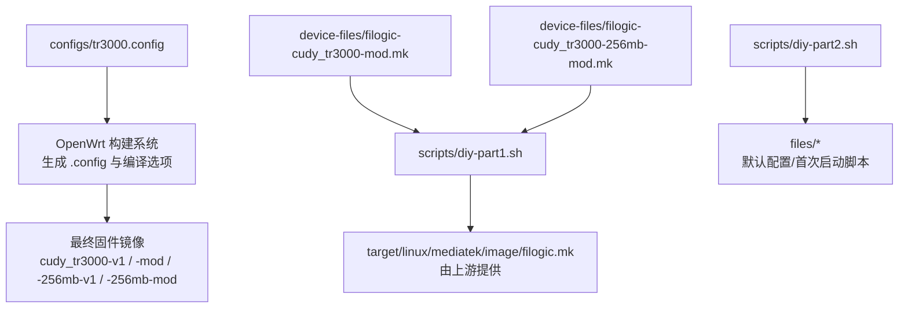
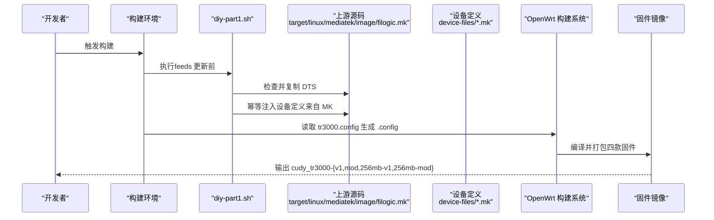
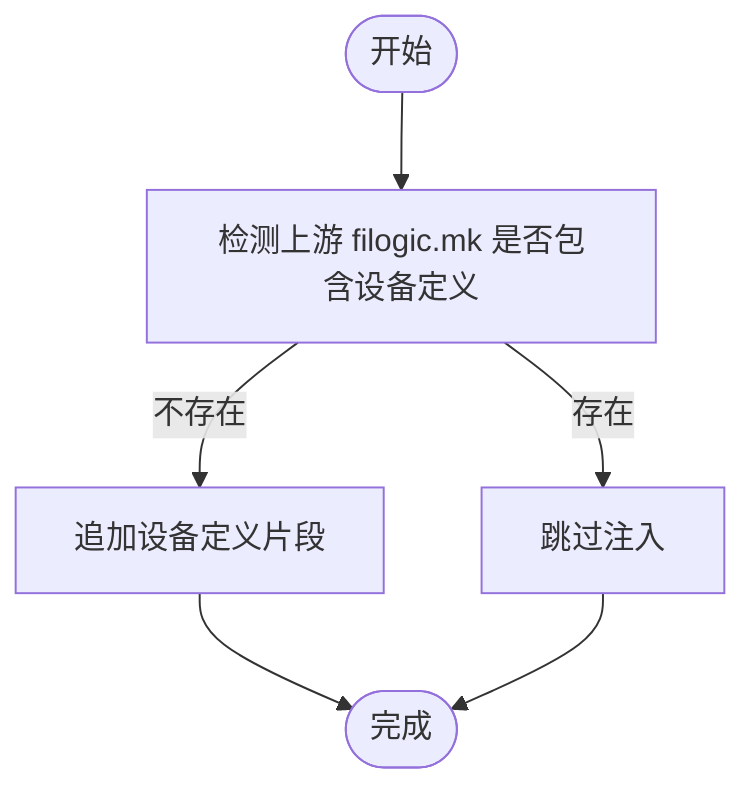
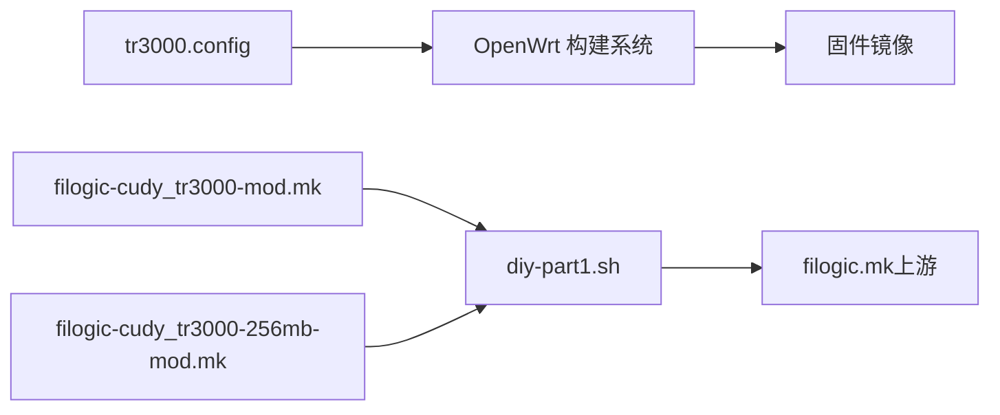

# 构建配置详解

<cite>
**本文引用的文件**   
- [tr3000.config](file://configs/tr3000.config)
- [filogic-cudy_tr3000-mod.mk](file://device-files/filogic-cudy_tr3000-mod.mk)
- [filogic-cudy_tr3000-256mb-mod.mk](file://device-files/filogic-cudy_tr3000-256mb-mod.mk)
- [diy-part1.sh](file://scripts/diy-part1.sh)
- [diy-part2.sh](file://scripts/diy-part2.sh)
</cite>

## 目录
1. [简介](#简介)
2. [项目结构](#项目结构)
3. [核心组件](#核心组件)
4. [架构总览](#架构总览)
5. [详细组件分析](#详细组件分析)
6. [依赖关系分析](#依赖关系分析)
7. [性能与分区调优](#性能与分区调优)
8. [常见问题与排错](#常见问题与排错)
9. [结论](#结论)
10. [附录：常用操作清单](#附录常用操作清单)

## 简介
本文件面向 Kwrt 项目中 Cudy TR3000 系列设备的固件构建，围绕 configs/tr3000.config 展开，系统解释目标平台选择、设备启用、LuCI 界面与中文化支持、软件包增删策略，以及不同分区方案的差异与最佳实践。文档同时说明 scripts 自动化注入机制如何把“大分区 mod”设备定义合并进 OpenWrt 源码树，从而一次构建产出四款固件变体。

## 项目结构
Kwrt 仓库中与构建相关的关键路径如下：
- configs/tr3000.config：本次构建的 OpenWrt 配置入口，声明目标平台、设备、LuCI 与中文界面、可选插件等。
- device-files/*.mk：定义“大分区 mod”设备的镜像参数（UBI、块大小、页大小、镜像大小、内核位置、默认驱动包等）。
- scripts/diy-part1.sh：在 feeds 更新前执行，负责复制自定义 DTS 并幂等注入设备定义到上游 filogic.mk。
- scripts/diy-part2.sh：在 feeds 安装后执行，将 files/ 目录内容覆盖到 OpenWrt 源码根目录，作为首次启动脚本和默认配置的 overlay。

图表来源
- [tr3000.config:1-34](file://configs/tr3000.config#L1-L34)
- [diy-part1.sh:1-52](file://scripts/diy-part1.sh#L1-L52)
- [diy-part2.sh:1-22](file://scripts/diy-part2.sh#L1-L22)

章节来源
- [tr3000.config:1-34](file://configs/tr3000.config#L1-L34)
- [diy-part1.sh:1-52](file://scripts/diy-part1.sh#L1-L52)
- [diy-part2.sh:1-22](file://scripts/diy-part2.sh#L1-L22)

## 核心组件
- 目标平台开关
  - CONFIG_TARGET_mediatek=y：启用 MediaTek 平台支持。
  - CONFIG_TARGET_mediatek_filogic=y：启用 Filogic 子平台，TR3000 基于 MT7981B/Filogic 架构。
- 设备启用开关
  - 四种 TR3000 变体通过 CONFIG_TARGET_mediatek_filogic_DEVICE_* 启用：
    - cudy_tr3000-v1：128M 标准版（原厂布局，UBI 64M）。
    - cudy_tr3000-mod：128M 大分区版（U-Boot mod，UBI 112M，mod-112m 方案）。
    - cudy_tr3000-256mb-v1：256M 标准版（原厂布局，UBI 230M）。
    - cudy_tr3000-256mb-mod：256M 大分区版（U-Boot mod，UBI 240M）。
- LuCI 与中文界面
  - CONFIG_PACKAGE_luci=y：启用 LuCI Web 管理界面。
  - CONFIG_PACKAGE_luci-ssl=y：启用 HTTPS 支持。
  - CONFIG_PACKAGE_luci-i18n-base-zh-cn=y：基础界面中文。
  - CONFIG_PACKAGE_luci-i18n-firewall-zh-cn=y：防火墙界面中文。
- 可选插件（按需启用）
  - 示例包含 ttyd、filebrowser-q、openclash、USB 存储、block-mount、opkg 中文等，取消注释即可加入构建。

章节来源
- [tr3000.config:11-33](file://configs/tr3000.config#L11-L33)

## 架构总览
下图展示从配置文件到最终固件的构建流程，包括 diy 脚本对上游源码的注入过程。

图表来源
- [diy-part1.sh:21-49](file://scripts/diy-part1.sh#L21-L49)
- [tr3000.config:11-19](file://configs/tr3000.config#L11-L19)

## 详细组件分析

### 目标平台与设备选择
- 目标平台
  - 启用 mediatek 与 mediatek_filogic 以支持 TR3000 硬件。
- 设备选择
  - 四个 DEVICE_* 开关分别对应四种变体；其中“mod”变体由 diy-part1.sh 自动注入到上游 filogic.mk，确保构建时可用。
- 建议
  - 若仅需某一款固件，可关闭其他 DEVICE_* 开关以减少构建产物体积与时间。

章节来源
- [tr3000.config:11-19](file://configs/tr3000.config#L11-L19)
- [diy-part1.sh:37-49](file://scripts/diy-part1.sh#L37-L49)

### LuCI 界面与中文化
- 已启用项
  - luci、luci-ssl、基础中文、防火墙中文。
- 扩展建议
  - 如需 opkg 中文，启用 luci-i18n-opkg-zh-cn。
  - 如需终端访问，启用 luci-app-ttyd。
  - 如需文件浏览器，启用 luci-app-filebrowser-q。
  - 如需代理或科学上网，启用 luci-app-openclash（注意许可证与合规性）。

章节来源
- [tr3000.config:21-33](file://configs/tr3000.config#L21-L33)

### 软件包增删策略
- 网络类插件
  - 例如 openclash、ttyd、filebrowser-q 等，按需启用对应的 luci-app-* 包。
- 存储支持
  - kmod-usb-storage：启用 USB 存储驱动。
  - block-mount：挂载与管理块设备。
- 界面扩展
  - 除基础中文外，可按需添加 opkg 中文等 i18n 包。
- 注意事项
  - 仅启用所需包，避免镜像膨胀。
  - 某些插件依赖内核模块，请一并启用相应 kmod-*。

章节来源
- [tr3000.config:27-33](file://configs/tr3000.config#L27-L33)

### 分区方案与镜像参数
- 标准版 vs 大分区版
  - 标准版使用原厂分区布局；大分区版通过 U-Boot mod 扩大 UBI 分区，提升用户空间容量。
- 关键参数（大分区 mod）
  - UBINIZE_OPTS、BLOCKSIZE、PAGESIZE、IMAGE_SIZE、KERNEL_IN_UBI、DEVICE_PACKAGES 等由 *.mk 定义。
- 兼容性
  - 256M 大分区版设置 SUPPORTED_DEVICES 允许从 256M 标准版 sysupgrade 刷入。

图表来源
- [diy-part1.sh:37-49](file://scripts/diy-part1.sh#L37-L49)

章节来源
- [filogic-cudy_tr3000-mod.mk:1-19](file://device-files/filogic-cudy_tr3000-mod.mk#L1-L19)
- [filogic-cudy_tr3000-256mb-mod.mk:1-20](file://device-files/filogic-cudy_tr3000-256mb-mod.mk#L1-L20)
- [diy-part1.sh:37-49](file://scripts/diy-part1.sh#L37-L49)

### 自动化脚本职责
- diy-part1.sh
  - 校验上游 filogic.mk 是否存在；
  - 复制自定义 DTS（不覆盖已有同名文件）；
  - 幂等注入两个“mod”设备定义到 filogic.mk。
- diy-part2.sh
  - 将 files/ 目录内容复制到 OpenWrt 源码根目录，作为首次启动脚本与默认配置的 overlay。

章节来源
- [diy-part1.sh:1-52](file://scripts/diy-part1.sh#L1-L52)
- [diy-part2.sh:1-22](file://scripts/diy-part2.sh#L1-L22)

## 依赖关系分析
- tr3000.config 依赖 OpenWrt 构建系统解析 CONFIG_* 选项，决定编译哪些包与特性。
- 设备定义依赖 upstream target/linux/mediatek/image/filogic.mk；diy-part1.sh 负责注入缺失的“mod”设备定义。
- 大分区 mod 设备定义依赖 device-files/*.mk 中的镜像参数与默认驱动包集合。

图表来源
- [tr3000.config:11-19](file://configs/tr3000.config#L11-L19)
- [diy-part1.sh:37-49](file://scripts/diy-part1.sh#L37-L49)
- [filogic-cudy_tr3000-mod.mk:1-19](file://device-files/filogic-cudy_tr3000-mod.mk#L1-L19)
- [filogic-cudy_tr3000-256mb-mod.mk:1-20](file://device-files/filogic-cudy_tr3000-256mb-mod.mk#L1-L20)

## 性能与分区调优
- 分区与容量
  - 大分区 mod 显著增加 UBI 空间，适合安装更多软件包与数据；标准版更贴近原厂分区，升级风险更低。
- 镜像大小与内核位置
  - 大分区 mod 设置 IMAGE_SIZE 与 KERNEL_IN_UBI=1，确保内核位于 UBI 内，便于动态扩容与回滚。
- 默认驱动包
  - 大分区 mod 默认包含 USB3、Wi-Fi 驱动与 MT7981 固件，开箱即用；可根据需要裁剪。
- 页面与块大小
  - BLOCKSIZE 与 PAGESIZE 影响 UBI 写入效率与磨损均衡，保持与设备 NAND 特性一致。
- 建议
  - 生产环境优先使用稳定分支与官方支持的机型定义；仅在确有需要时切换至大分区 mod。
  - 谨慎裁剪驱动包，避免因缺少必要 kmod-* 导致功能异常。

章节来源
- [filogic-cudy_tr3000-mod.mk:10-17](file://device-files/filogic-cudy_tr3000-mod.mk#L10-L17)
- [filogic-cudy_tr3000-256mb-mod.mk:11-17](file://device-files/filogic-cudy_tr3000-256mb-mod.mk#L11-L17)

## 常见问题与排错
- 构建未生成“mod”设备
  - 确认 diy-part1.sh 已执行且 filogic.mk 中存在设备定义；检查脚本日志是否提示“已注入设备”。
- 无法从标准版 sysupgrade 到 256M 大分区版
  - 确认 256M 大分区版定义了 SUPPORTED_DEVICES 包含 cudy_tr3000-256mb-v1。
- 中文界面未生效
  - 确认已启用 luci-i18n-base-zh-cn 与 luci-i18n-firewall-zh-cn；如需 opkg 中文，额外启用 luci-i18n-opkg-zh-cn。
- 插件未出现
  - 检查是否启用了对应的 luci-app-* 包及其依赖；必要时启用相关 kmod-*。
- 首次启动脚本未生效
  - 确认 diy-part2.sh 已将 files/ 内容复制到源码根目录；检查 uci-defaults 下的脚本权限与命名。

章节来源
- [diy-part1.sh:21-49](file://scripts/diy-part1.sh#L21-L49)
- [filogic-cudy_tr3000-256mb-mod.mk:10-10](file://device-files/filogic-cudy_tr3000-256mb-mod.mk#L10-L10)
- [tr3000.config:21-33](file://configs/tr3000.config#L21-L33)
- [diy-part2.sh:13-19](file://scripts/diy-part2.sh#L13-L19)

## 结论
tr3000.config 是 Kwrt 针对 Cudy TR3000 的构建入口，配合 diy-part1.sh 与 device-files/*.mk，实现一次构建产出四款固件变体。通过合理选择目标平台、设备、LuCI 与插件，可在保证兼容性的前提下获得合适的镜像体积与功能集。对于生产环境，建议优先使用标准版；当需要更大用户空间时再考虑大分区 mod，并严格遵循分区与驱动包的配置约束。

## 附录：常用操作清单
- 新增网络插件
  - 在 tr3000.config 中取消对应 luci-app-* 的注释并启用。
- 新增存储支持
  - 启用 kmod-usb-storage 与 block-mount。
- 新增界面中文
  - 启用 luci-i18n-opkg-zh-cn。
- 调整分区方案
  - 根据需求选择标准版或大分区 mod；必要时修改 *.mk 中的镜像参数（需谨慎评估兼容性）。
- 清理与重建
  - 清理旧构建缓存后重新运行构建，确保新配置生效。