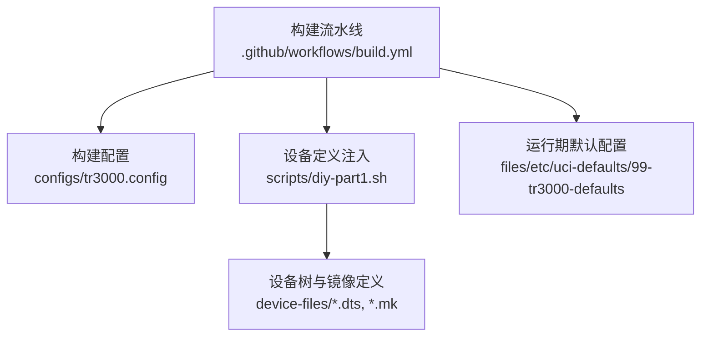
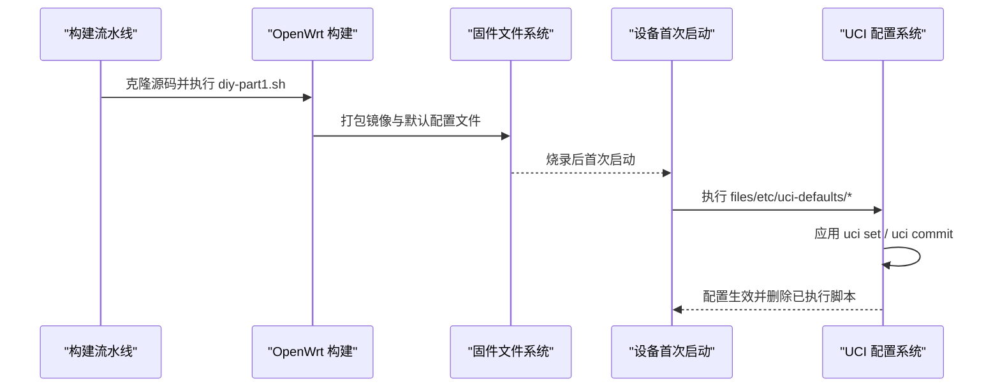
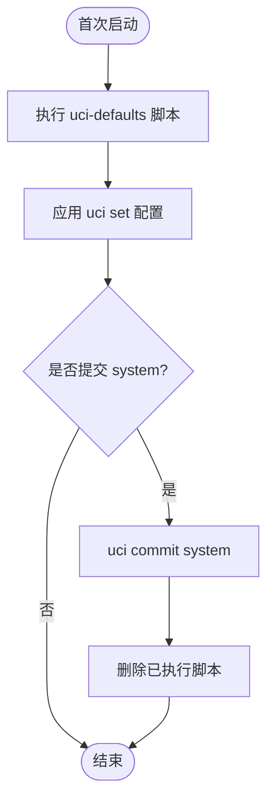
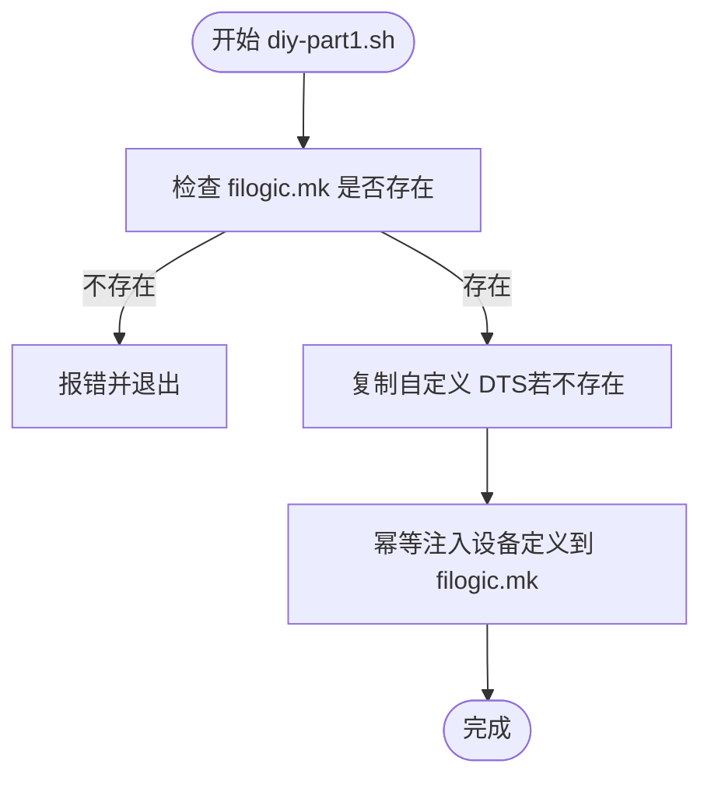
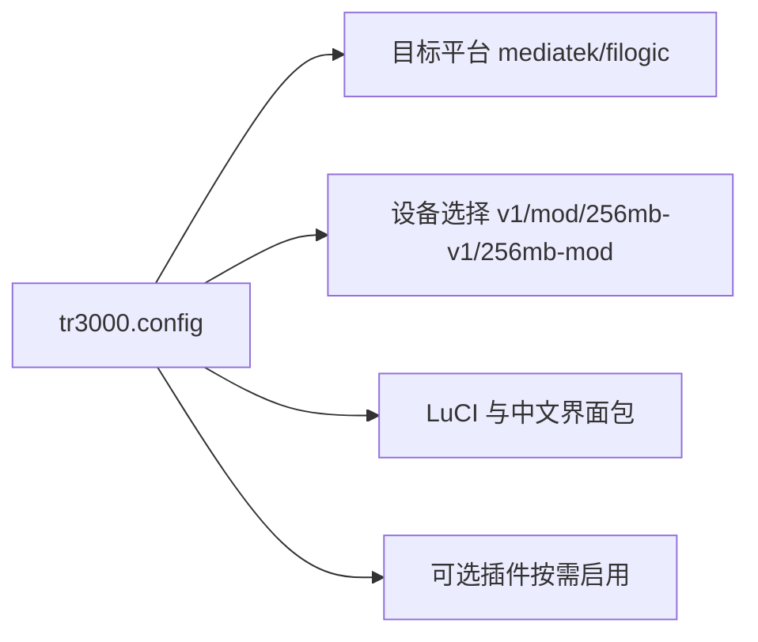
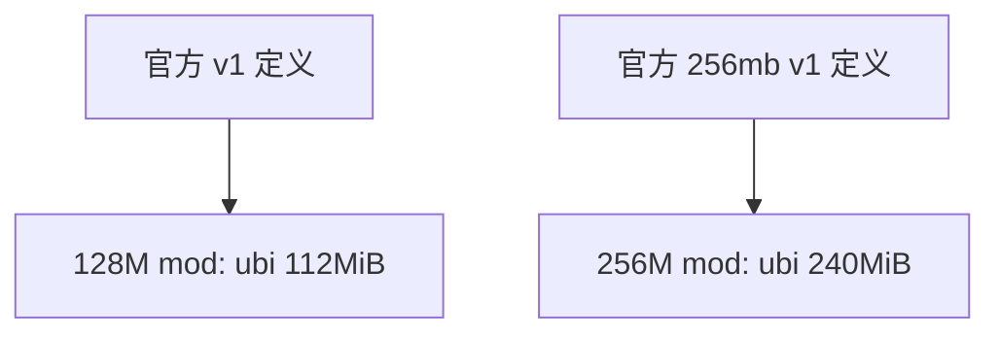
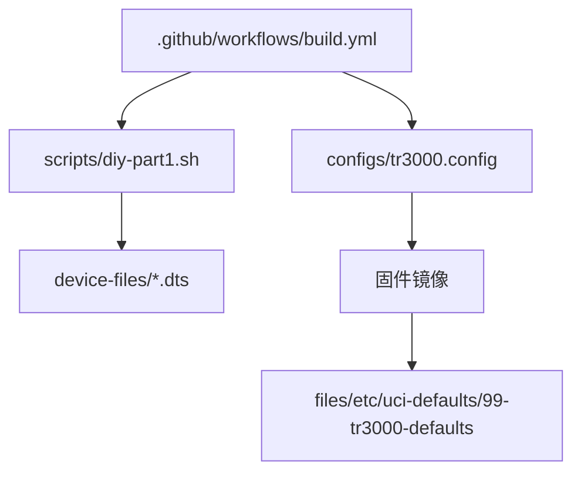

# 运行时配置管理

<cite>
**本文引用的文件**   
- [99-tr3000-defaults](file://files/etc/uci-defaults/99-tr3000-defaults)
- [tr3000.config](file://configs/tr3000.config)
- [diy-part1.sh](file://scripts/diy-part1.sh)
- [build.yml](file://.github/workflows/build.yml)
- [mt7981b-cudy-tr3000-mod.dts](file://device-files/mt7981b-cudy-tr3000-mod.dts)
- [mt7981b-cudy-tr3000-256mb-mod.dts](file://device-files/mt7981b-cudy-tr3000-256mb-mod.dts)
</cite>

## 目录
1. [简介](#简介)
2. [项目结构](#项目结构)
3. [核心组件](#核心组件)
4. [架构总览](#架构总览)
5. [详细组件分析](#详细组件分析)
6. [依赖关系分析](#依赖关系分析)
7. [性能与稳定性考虑](#性能与稳定性考虑)
8. [故障排查指南](#故障排查指南)
9. [结论](#结论)
10. [附录：常见运行时配置项参考](#附录常见运行时配置项参考)

## 简介
本文面向 Kwrt 项目中基于 OpenWrt 的 Cudy TR3000 设备，系统化说明“运行时配置管理”机制，重点围绕 UCI 默认配置系统、`files/etc/uci-defaults/` 脚本的执行时机与作用、以及如何在固件构建阶段注入设备相关定义。文档同时给出网络、时区、主机名等常见运行时配置的实践建议、优先级与执行顺序说明、调试验证方法、常见问题排查与优化建议。

本项目的运行时默认配置由一个 uci-defaults 脚本提供，主要设置系统主机名与时区；设备相关的分区与镜像定义则由构建期脚本注入到 OpenWrt 源码中。

## 项目结构
Kwrt 仓库中与运行时配置和构建期设备定义相关的关键位置如下：
- `files/etc/uci-defaults/99-tr3000-defaults`：首次启动时执行的 UCI 默认配置脚本，设置系统级默认值（如主机名、时区）。
- `configs/tr3000.config`：OpenWrt 构建配置，选择目标平台、设备与 LuCI 包。
- `scripts/diy-part1.sh`：在构建流程早期向 OpenWrt 源码注入自定义设备定义（DTS 与镜像定义），实现大分区方案。
- `.github/workflows/build.yml`：GitHub Actions 构建流水线，负责克隆 OpenWrt、注入设备定义、应用自定义文件、加载构建配置并生成多设备固件。
- `device-files/*.dts`：设备树源文件，用于调整 ubi 分区大小等硬件相关参数。

图表来源
- [build.yml:59-82](file://.github/workflows/build.yml#L59-L82)
- [tr3000.config:11-25](file://configs/tr3000.config#L11-L25)
- [diy-part1.sh:28-49](file://scripts/diy-part1.sh#L28-L49)
- [99-tr3000-defaults:1-11](file://files/etc/uci-defaults/99-tr3000-defaults#L1-L11)

章节来源
- [build.yml:59-82](file://.github/workflows/build.yml#L59-L82)
- [tr3000.config:11-25](file://configs/tr3000.config#L11-L25)
- [diy-part1.sh:28-49](file://scripts/diy-part1.sh#L28-L49)
- [99-tr3000-defaults:1-11](file://files/etc/uci-defaults/99-tr3000-defaults#L1-L11)

## 核心组件
- UCI 默认配置脚本：`files/etc/uci-defaults/99-tr3000-defaults`
  - 作用：在设备首次启动时设置系统默认值，例如主机名与时区。
  - 行为：使用 `uci set` 写入配置，并通过 `uci commit system` 提交；成功后自动删除该脚本，避免重复执行。
- 构建期设备定义注入：`scripts/diy-part1.sh`
  - 作用：在 OpenWrt 构建流程早期，将自定义 DTS 和设备镜像定义注入到上游源码，确保不同内存容量与分区布局的设备能正确编译。
- 构建配置：`configs/tr3000.config`
  - 作用：指定目标平台（mediatek/filogic）、启用多个设备变体、包含 LuCI 及中文界面包。
- 设备树与镜像定义：`device-files/mt7981b-cudy-tr3000-mod.dts`、`device-files/mt7981b-cudy-tr3000-256mb-mod.dts`
  - 作用：在官方设备定义基础上扩展 ubi 分区大小，适配“大分区”方案。

章节来源
- [99-tr3000-defaults:1-11](file://files/etc/uci-defaults/99-tr3000-defaults#L1-L11)
- [diy-part1.sh:28-49](file://scripts/diy-part1.sh#L28-L49)
- [tr3000.config:11-25](file://configs/tr3000.config#L11-L25)
- [mt7981b-cudy-tr3000-mod.dts:1-22](file://device-files/mt7981b-cudy-tr3000-mod.dts#L1-L22)
- [mt7981b-cudy-tr3000-256mb-mod.dts:1-23](file://device-files/mt7981b-cudy-tr3000-256mb-mod.dts#L1-L23)

## 架构总览
下图展示从构建到运行期的关键路径：构建流水线调用 diy-part1 注入设备定义，最终生成的固件中包含 uci-defaults 脚本；设备首次启动时执行该脚本完成默认配置。

图表来源
- [build.yml:59-82](file://.github/workflows/build.yml#L59-L82)
- [diy-part1.sh:28-49](file://scripts/diy-part1.sh#L28-L49)
- [99-tr3000-defaults:1-11](file://files/etc/uci-defaults/99-tr3000-defaults#L1-L11)

## 详细组件分析

### UCI 默认配置脚本：99-tr3000-defaults
该脚本是运行时默认配置的核心入口，位于 `files/etc/uci-defaults/`，文件名以数字前缀开头，表示执行顺序。当前脚本为 `99-tr3000-defaults`，会在其他低编号脚本之后执行，适合放置设备特定的收尾型默认配置。

- 功能要点
  - 设置系统主机名为固定值。
  - 设置时区为 CST-8，区域名称为 Asia/Shanghai。
  - 通过 `uci commit system` 提交 system 段配置。
  - 成功退出后由系统自动删除该脚本，避免重复执行。

- 执行时机与生命周期
  - 首次启动时由 OpenWrt 的 uci-defaults 框架触发。
  - 执行完成后自动删除，保证幂等性。

- 可定制点
  - 修改主机名、时区、区域名称。
  - 添加更多系统级默认值（如日志级别、内核参数等）。
  - 增加条件判断，针对不同设备或分区布局设置差异化默认值。

图表来源
- [99-tr3000-defaults:1-11](file://files/etc/uci-defaults/99-tr3000-defaults#L1-L11)

章节来源
- [99-tr3000-defaults:1-11](file://files/etc/uci-defaults/99-tr3000-defaults#L1-L11)

### 构建期设备定义注入：diy-part1.sh
该脚本在构建流程早期执行，负责将自定义设备定义注入到 OpenWrt 源码中，确保不同内存容量与分区布局的设备能够被正确识别与编译。

- 功能要点
  - 检查上游源码是否存在基础设备定义。
  - 复制自定义 DTS 文件（若不存在则跳过）。
  - 幂等地将设备镜像定义追加到 filogic.mk。

- 安全与幂等性
  - 对已有文件进行存在性检查，避免覆盖上游定义。
  - 对设备定义进行存在性检查，避免重复注入。

图表来源
- [diy-part1.sh:16-49](file://scripts/diy-part1.sh#L16-L49)

章节来源
- [diy-part1.sh:16-49](file://scripts/diy-part1.sh#L16-L49)

### 构建配置：tr3000.config
该文件用于控制 OpenWrt 构建选项，包括目标平台、设备选择与软件包。

- 关键内容
  - 目标平台：mediatek、mediatek_filogic。
  - 设备选择：cudy_tr3000-v1、cudy_tr3000-mod、cudy_tr3000-256mb-v1、cudy_tr3000-256mb-mod。
  - LuCI 与中文界面：luci、luci-ssl、luci-i18n-base-zh-cn、luci-i18n-firewall-zh-cn。
  - 可选插件：ttyd、filebrowser-q、openclash、usb-storage、block-mount、opkg-zh-cn 等（注释示例）。

图表来源
- [tr3000.config:11-33](file://configs/tr3000.config#L11-L33)

章节来源
- [tr3000.config:11-33](file://configs/tr3000.config#L11-L33)

### 设备树与镜像定义：mod 与 256mb-mod
两个 DTS 文件在官方设备定义基础上扩展 ubi 分区大小，适配“大分区”方案。

- mt7981b-cudy-tr3000-mod.dts
  - 在官方 v1 基础上将 ubi 分区扩大至 112MiB，尾部保留安全边界。
  - 适用于需要第三方大分区 U-Boot 的场景。

- mt7981b-cudy-tr3000-256mb-mod.dts
  - 在官方 256mb v1 基础上将 ubi 分区扩大至 240MiB，尾部保留安全边界。
  - 可直接从 256M 标准版系统 sysupgrade 刷入，重启后 ubi 自动扩展。

图表来源
- [mt7981b-cudy-tr3000-mod.dts:1-22](file://device-files/mt7981b-cudy-tr3000-mod.dts#L1-L22)
- [mt7981b-cudy-tr3000-256mb-mod.dts:1-23](file://device-files/mt7981b-cudy-tr3000-256mb-mod.dts#L1-L23)

章节来源
- [mt7981b-cudy-tr3000-mod.dts:1-22](file://device-files/mt7981b-cudy-tr3000-mod.dts#L1-L22)
- [mt7981b-cudy-tr3000-256mb-mod.dts:1-23](file://device-files/mt7981b-cudy-tr3000-256mb-mod.dts#L1-L23)

## 依赖关系分析
- 构建流水线依赖 diy-part1.sh 注入设备定义，再依赖 tr3000.config 选择设备与包。
- 运行时默认配置依赖 uci-defaults 框架执行脚本，并在成功后删除脚本。
- 设备树与镜像定义影响固件分区布局与可用空间，进而影响运行时软件安装与数据持久化能力。

图表来源
- [build.yml:59-82](file://.github/workflows/build.yml#L59-L82)
- [diy-part1.sh:28-49](file://scripts/diy-part1.sh#L28-L49)
- [tr3000.config:11-25](file://configs/tr3000.config#L11-L25)
- [99-tr3000-defaults:1-11](file://files/etc/uci-defaults/99-tr3000-defaults#L1-L11)

章节来源
- [build.yml:59-82](file://.github/workflows/build.yml#L59-L82)
- [diy-part1.sh:28-49](file://scripts/diy-part1.sh#L28-L49)
- [tr3000.config:11-25](file://configs/tr3000.config#L11-L25)
- [99-tr3000-defaults:1-11](file://files/etc/uci-defaults/99-tr3000-defaults#L1-L11)

## 性能与稳定性考虑
- 首次启动默认配置应尽可能轻量，避免阻塞启动流程。
- 使用 uci-defaults 脚本时注意幂等性，避免重复执行导致状态不一致。
- 大分区方案提升可用空间，有利于安装更多软件与持久化数据，但需确保 U-Boot 与分区布局匹配。
- 构建期注入应保持幂等，防止上游更新覆盖或重复注入造成构建异常。

[本节为通用指导，不直接分析具体文件]

## 故障排查指南
- 默认配置未生效
  - 确认 uci-defaults 脚本是否被执行且已删除（首次启动后应自动删除）。
  - 检查 system 段配置是否正确提交（uci commit system）。
  - 查看系统日志，确认脚本执行无错误。

- 主机名或时区不正确
  - 核对脚本中设置的 hostname、timezone、zonename 是否符合预期。
  - 手动验证：通过命令行查询系统时间与区域设置。

- 构建失败或设备未识别
  - 检查 diy-part1.sh 是否成功注入设备定义。
  - 确认 filogic.mk 中存在对应设备定义。
  - 核对 tr3000.config 中启用的设备是否与目标一致。

- 分区空间不足
  - 确认使用的是 mod 或 256mb-mod 设备定义。
  - 检查 ubi 分区大小是否符合预期（112MiB 或 240MiB）。
  - 若从标准版升级，确认支持 sysupgrade 的路径与兼容性。

章节来源
- [99-tr3000-defaults:1-11](file://files/etc/uci-defaults/99-tr3000-defaults#L1-L11)
- [diy-part1.sh:16-49](file://scripts/diy-part1.sh#L16-L49)
- [tr3000.config:11-25](file://configs/tr3000.config#L11-L25)
- [mt7981b-cudy-tr3000-mod.dts:1-22](file://device-files/mt7981b-cudy-tr3000-mod.dts#L1-L22)
- [mt7981b-cudy-tr3000-256mb-mod.dts:1-23](file://device-files/mt7981b-cudy-tr3000-256mb-mod.dts#L1-L23)

## 结论
Kwrt 针对 Cudy TR3000 设备的运行时配置管理采用“构建期设备定义注入 + 运行期 UCI 默认配置”的组合方式：
- 构建期通过 diy-part1.sh 注入设备定义，确保不同内存容量与分区布局的设备能被正确编译。
- 运行期通过 uci-defaults 脚本设置系统默认值（主机名、时区等），并在首次启动后自动删除脚本，保证幂等性。
- 构建配置 tr3000.config 明确目标平台、设备与软件包，便于一次构建产出多设备固件。

该方案简洁可靠，适合在嵌入式路由器设备上快速部署与运维。

[本节为总结性内容，不直接分析具体文件]

## 附录：常见运行时配置项参考
以下为常见的运行时配置类别与建议，供在实际项目中扩展 uci-defaults 脚本时参考：
- 网络设置
  - LAN/WAN 接口 IP、子网掩码、网关。
  - DHCP 服务器开关与地址池范围。
  - DNS 服务器与转发策略。
  - 无线 SSID、加密方式与信道。
- 时区与时间同步
  - timezone、zonename。
  - NTP 服务器与同步间隔。
- 主机名与安全
  - hostname。
  - root 密码策略、SSH 端口与访问控制。
- 系统与日志
  - 日志级别、存储位置与轮转策略。
  - 内核参数调优（如 net.core.somaxconn、vm.swappiness）。
- 存储与挂载
  - USB 存储自动挂载、extroot 配置。
  - 分区格式化与数据迁移策略。

[本节为概念性参考，不直接分析具体文件]