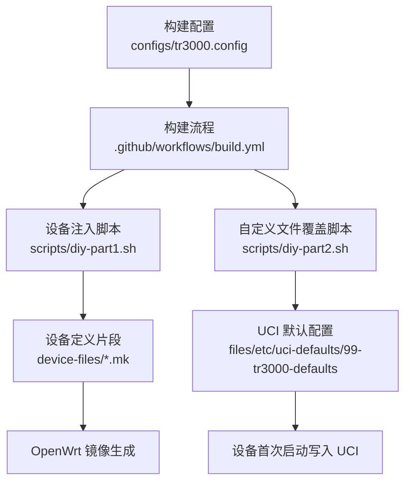
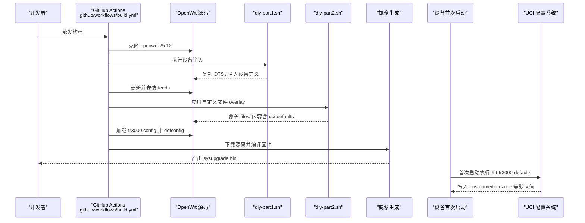
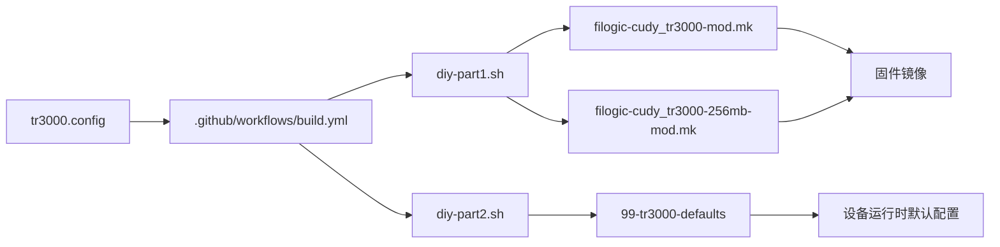

# 配置指南

<cite>
**本文引用的文件**   
- [tr3000.config](file://configs/tr3000.config)
- [diy-part1.sh](file://scripts/diy-part1.sh)
- [diy-part2.sh](file://scripts/diy-part2.sh)
- [build.yml](file://.github/workflows/build.yml)
- [filogic-cudy_tr3000-mod.mk](file://device-files/filogic-cudy_tr3000-mod.mk)
- [filogic-cudy_tr3000-256mb-mod.mk](file://device-files/filogic-cudy_tr3000-256mb-mod.mk)
- [99-tr3000-defaults](file://files/etc/uci-defaults/99-tr3000-defaults)
</cite>

## 目录
1. [简介](#简介)
2. [项目结构](#项目结构)
3. [核心组件](#核心组件)
4. [架构总览](#架构总览)
5. [详细组件分析](#详细组件分析)
6. [依赖关系分析](#依赖关系分析)
7. [性能与体积调优建议](#性能与体积调优建议)
8. [故障排查指南](#故障排查指南)
9. [结论](#结论)
10. [附录：常用操作清单](#附录常用操作清单)

## 简介
本指南面向 Kwrt 项目中 Cudy TR3000 设备的固件定制与配置，围绕以下目标展开：
- 深入解释 tr3000.config 中所有构建选项的含义与用法，包括目标平台选择、设备启用、软件包管理与 LuCI 界面配置。
- 说明如何通过修改配置文件来定制固件功能，添加或删除软件包。
- 详细介绍 UCI 默认配置系统的使用方法，包括运行时配置的管理和自定义默认值的设置。
- 提供具体配置示例与最佳实践，并给出性能调优建议与常见问题解决方案。

该仓库采用“构建期配置 + 首次启动默认值”的双层机制：
- 构建期：通过 configs/tr3000.config 控制目标平台、设备与软件包。
- 运行期：通过 files/etc/uci-defaults/99-tr3000-defaults 在首次启动时写入 UCI 默认配置。

## 项目结构
Kwrt 针对 TR3000 的定制主要分布在以下位置：
- configs/tr3000.config：OpenWrt 构建配置（目标平台、设备、软件包）。
- scripts/diy-part1.sh：在 feeds 更新前注入大分区设备定义与 DTS。
- scripts/diy-part2.sh：在 feeds 安装后应用 files/ 自定义 overlay（包含 uci-defaults）。
- device-files/*.mk：TR3000 大分区设备定义片段，由 diy-part1.sh 注入到上游 filogic.mk。
- files/etc/uci-defaults/99-tr3000-defaults：首次启动时设置的 UCI 默认项。
- .github/workflows/build.yml：GitHub Actions 自动化构建流程，串联上述步骤。

**图表来源**
- [tr3000.config:1-34](file://configs/tr3000.config#L1-L34)
- [build.yml:64-83](file://.github/workflows/build.yml#L64-L83)
- [diy-part1.sh:1-51](file://scripts/diy-part1.sh#L1-L51)
- [diy-part2.sh:1-21](file://scripts/diy-part2.sh#L1-L21)
- [filogic-cudy_tr3000-mod.mk:1-19](file://device-files/filogic-cudy_tr3000-mod.mk#L1-L19)
- [filogic-cudy_tr3000-256mb-mod.mk:1-19](file://device-files/filogic-cudy_tr3000-256mb-mod.mk#L1-L19)
- [99-tr3000-defaults:1-11](file://files/etc/uci-defaults/99-tr3000-defaults#L1-L11)

**章节来源**
- [tr3000.config:1-34](file://configs/tr3000.config#L1-L34)
- [build.yml:64-83](file://.github/workflows/build.yml#L64-L83)
- [diy-part1.sh:1-51](file://scripts/diy-part1.sh#L1-L51)
- [diy-part2.sh:1-21](file://scripts/diy-part2.sh#L1-L21)

## 核心组件
本节聚焦 tr3000.config 的核心配置项及其作用。

- 目标平台选择
  - CONFIG_TARGET_mediatek=y：启用 MediaTek 平台支持。
  - CONFIG_TARGET_mediatek_filogic=y：启用 Filogic 子平台（MT7981 系列）。
- 设备选择
  - CONFIG_TARGET_mediatek_filogic_DEVICE_cudy_tr3000-v1=y：128M 标准版。
  - CONFIG_TARGET_mediatek_filogic_DEVICE_cudy_tr3000-mod=y：128M 大分区版（U-Boot mod）。
  - CONFIG_TARGET_mediatek_filogic_DEVICE_cudy_tr3000-256mb-v1=y：256M 标准版。
  - CONFIG_TARGET_mediatek_filogic_DEVICE_cudy_tr3000-256mb-mod=y：256M 大分区版（U-Boot mod）。
- LuCI 与中文界面
  - CONFIG_PACKAGE_luci=y：启用 LuCI Web 管理界面。
  - CONFIG_PACKAGE_luci-ssl=y：启用 LuCI SSL 支持。
  - CONFIG_PACKAGE_luci-i18n-base-zh-cn=y：基础中文语言包。
  - CONFIG_PACKAGE_luci-i18n-firewall-zh-cn=y：防火墙模块中文语言包。
- 按需追加插件（示例）
  - 注释掉的示例项用于演示如何添加额外插件或内核模块，取消注释即可启用。

这些配置项直接决定 OpenWrt 编译产物中包含哪些设备支持与软件包，从而影响固件大小、功能集与可维护性。

**章节来源**
- [tr3000.config:11-33](file://configs/tr3000.config#L11-L33)

## 架构总览
下图展示从源码克隆到固件产物的完整构建流程，以及首次启动时的 UCI 默认配置写入过程。

**图表来源**
- [build.yml:64-97](file://.github/workflows/build.yml#L64-L97)
- [diy-part1.sh:1-51](file://scripts/diy-part1.sh#L1-L51)
- [diy-part2.sh:1-21](file://scripts/diy-part2.sh#L1-L21)
- [99-tr3000-defaults:1-11](file://files/etc/uci-defaults/99-tr3000-defaults#L1-L11)

## 详细组件分析

### 构建配置 tr3000.config
- 作用：集中声明目标平台、设备与软件包，是构建系统的单一事实来源。
- 关键要点：
  - 一次构建同时产出四款固件（128M/256M × 标准/大分区），便于统一测试与发布。
  - 大分区设备定义由 diy-part1.sh 注入，避免污染上游源码。
  - LuCI 与中文语言包默认启用，开箱即用。
  - 插件以注释形式提供示例，便于按需启用。

- 配置项分类与建议：
  - 平台与设备：保持与硬件一致；如需新增设备，遵循现有命名规范并在 build.yml 校验。
  - LuCI 与 i18n：仅启用必要语言包以减少体积。
  - 插件：优先评估必要性，避免引入冗余依赖导致镜像膨胀。

**章节来源**
- [tr3000.config:1-34](file://configs/tr3000.config#L1-L34)

### 设备注入脚本 diy-part1.sh
- 作用：在 feeds 更新前向 OpenWrt 源码注入 TR3000 大分区设备定义与 DTS。
- 行为特征：
  - 自检上游基础设备是否存在，若缺失则发出警告。
  - 幂等复制 DTS（不覆盖已存在文件）。
  - 幂等注入设备定义片段到 filogic.mk（避免重复注入）。

- 使用建议：
  - 仅在需要新增或调整大分区设备时使用。
  - 保持 device-files/*.mk 与 dts 文件同步更新。

**章节来源**
- [diy-part1.sh:1-51](file://scripts/diy-part1.sh#L1-L51)

### 自定义文件覆盖脚本 diy-part2.sh
- 作用：在 feeds 安装后，将仓库 files/ 目录内容覆盖到 OpenWrt 源码根目录，使 uci-defaults 等自定义文件进入构建。
- 行为特征：
  - 若 files/ 不存在则跳过。
  - 输出日志便于调试。

- 使用建议：
  - 将首次启动脚本、默认配置、overlay 文件放入 files/ 对应路径。
  - 避免覆盖上游重要文件，谨慎使用 cp -rv。

**章节来源**
- [diy-part2.sh:1-21](file://scripts/diy-part2.sh#L1-L21)

### 设备定义片段 filogic-cudy_tr3000-mod.mk 与 filogic-cudy_tr3000-256mb-mod.mk
- 作用：定义 TR3000 大分区版本的设备属性、UBI 参数、镜像大小、内核打包方式与默认软件包。
- 关键字段说明：
  - DEVICE_VENDOR/MODEL/VARIANT：厂商、型号与变体标识。
  - DEVICE_DTS/DTS_DIR：设备树源文件路径。
  - SUPPORTED_DEVICES：允许从标准版 sysupgrade 升级到大分区版（提升兼容性）。
  - UBINIZE_OPTS/BLOCKSIZE/PAGESIZE：UBI 卷参数，影响存储布局与可靠性。
  - IMAGE_SIZE/KERNEL_IN_UBI：镜像大小与内核打包策略。
  - IMAGE/sysupgrade.bin：sysupgrade 镜像生成规则。
  - DEVICE_PACKAGES：默认内置驱动与固件包。

- 使用建议：
  - 调整 IMAGE_SIZE 时需确保与硬件 Flash 容量匹配。
  - DEVICE_PACKAGES 应精简，仅保留必要驱动与固件。

**章节来源**
- [filogic-cudy_tr3000-mod.mk:1-19](file://device-files/filogic-cudy_tr3000-mod.mk#L1-L19)
- [filogic-cudy_tr3000-256mb-mod.mk:1-19](file://device-files/filogic-cudy_tr3000-256mb-mod.mk#L1-L19)

### UCI 默认配置 99-tr3000-defaults
- 作用：在设备首次启动时设置系统默认项（如主机名、时区），成功后自动删除脚本以避免重复执行。
- 当前默认项：
  - system.hostname=TR3000
  - system.timezone=CST-8
  - system.zonename=Asia/Shanghai

- 扩展建议：
  - 可按需添加网络、无线、防火墙等默认配置。
  - 使用 uci set/commit 进行原子化提交。
  - 保持脚本幂等，避免重复写入造成异常。

**章节来源**
- [99-tr3000-defaults:1-11](file://files/etc/uci-defaults/99-tr3000-defaults#L1-L11)

### 构建流水线 build.yml
- 作用：自动化构建流程，串联克隆源码、设备注入、feeds 安装、自定义文件覆盖、加载构建配置、下载源码与编译、收集产物。
- 关键点：
  - 在加载 tr3000.config 后执行 make defconfig。
  - 校验四个设备是否出现在 .config 中，未出现则报错退出。
  - 收集 sysupgrade.bin 与校验文件。

- 使用建议：
  - 新增设备时需同步更新校验逻辑。
  - 可根据需要调整并行度与重试策略。

**章节来源**
- [build.yml:64-105](file://.github/workflows/build.yml#L64-L105)

## 依赖关系分析
下图展示各组件之间的依赖关系与数据流向。

**图表来源**
- [tr3000.config:1-34](file://configs/tr3000.config#L1-L34)
- [build.yml:64-105](file://.github/workflows/build.yml#L64-L105)
- [diy-part1.sh:1-51](file://scripts/diy-part1.sh#L1-L51)
- [diy-part2.sh:1-21](file://scripts/diy-part2.sh#L1-L21)
- [filogic-cudy_tr3000-mod.mk:1-19](file://device-files/filogic-cudy_tr3000-mod.mk#L1-L19)
- [filogic-cudy_tr3000-256mb-mod.mk:1-19](file://device-files/filogic-cudy_tr3000-256mb-mod.mk#L1-L19)
- [99-tr3000-defaults:1-11](file://files/etc/uci-defaults/99-tr3000-defaults#L1-L11)

**章节来源**
- [build.yml:64-105](file://.github/workflows/build.yml#L64-L105)

## 性能与体积调优建议
- 软件包裁剪
  - 仅启用必要的 LuCI 模块与语言包，减少镜像体积与内存占用。
  - 移除不必要的 luci-app-* 插件，尤其是大型代理或可视化工具。
  - 内核模块按需启用，避免引入未使用的驱动。

- 存储与 UBI 优化
  - 合理设置 UBINIZE_OPTS、BLOCKSIZE、PAGESIZE，平衡可靠性与空间利用率。
  - 根据 Flash 容量调整 IMAGE_SIZE，避免浪费或溢出。

- 启动与运行性能
  - 减少首次启动脚本中的复杂逻辑，避免阻塞初始化。
  - 使用 uci commit 批量提交配置，降低多次 I/O 开销。

- 构建效率
  - 在 CI 中缓存依赖与中间产物，缩短构建时间。
  - 分阶段构建与增量编译，提高迭代效率。

[本节为通用指导，不涉及具体文件分析]

## 故障排查指南
- 设备未出现在 .config 中
  - 现象：构建流程校验失败，提示某设备未出现在 .config。
  - 原因：tr3000.config 未启用对应设备，或 diy-part1.sh 注入失败。
  - 处理：检查 tr3000.config 中对应 CONFIG_TARGET_*_DEVICE_*=y；确认 diy-part1.sh 成功注入设备定义。

- 大分区设备无法识别
  - 现象：设备树或设备定义缺失，导致镜像不包含目标设备。
  - 原因：DTS 未复制到 target/linux/mediatek/dts，或 filogic.mk 未注入设备片段。
  - 处理：确认 diy-part1.sh 执行成功；检查 device-files/*.mk 与 dts 文件完整性。

- UCI 默认配置未生效
  - 现象：首次启动后主机名或时区未改变。
  - 原因：99-tr3000-defaults 未被覆盖进固件，或脚本语法错误。
  - 处理：确认 diy-part2.sh 已将 files/ 覆盖到源码；检查脚本语法与权限。

- 镜像体积过大
  - 现象：固件体积超出预期，影响刷写与运行。
  - 原因：启用了过多 LuCI 插件或内核模块。
  - 处理：在 tr3000.config 中注释掉非必要插件；精简 DEVICE_PACKAGES。

**章节来源**
- [build.yml:83-89](file://.github/workflows/build.yml#L83-L89)
- [diy-part1.sh:16-49](file://scripts/diy-part1.sh#L16-L49)
- [diy-part2.sh:13-19](file://scripts/diy-part2.sh#L13-L19)
- [99-tr3000-defaults:1-11](file://files/etc/uci-defaults/99-tr3000-defaults#L1-L11)

## 结论
Kwrt 对 TR3000 的配置体系清晰且可扩展：
- 通过 tr3000.config 统一管理目标平台、设备与软件包，保证构建一致性。
- 借助 diy-part1.sh 与 diy-part2.sh 实现设备注入与自定义文件覆盖，避免污染上游源码。
- 使用 99-tr3000-defaults 在首次启动时写入 UCI 默认配置，简化部署与维护。
- 结合 build.yml 的自动化校验与产物收集，形成完整的 CI/CD 闭环。

在实际使用中，建议遵循最小化原则裁剪软件包，合理设置 UBI 参数，并通过 CI 校验保障构建质量。

[本节为总结性内容，不涉及具体文件分析]

## 附录：常用操作清单
- 添加新插件
  - 在 tr3000.config 中取消对应 CONFIG_PACKAGE_* 注释，重新构建。
- 删除无用插件
  - 在 tr3000.config 中注释掉对应 CONFIG_PACKAGE_*，重新构建。
- 修改默认主机名与时区
  - 编辑 files/etc/uci-defaults/99-tr3000-defaults，重启设备验证。
- 新增大分区设备
  - 在 device-files 中添加 *.mk 片段，并确保 diy-part1.sh 能注入；在 tr3000.config 启用对应设备；更新 build.yml 校验逻辑。
- 调整镜像大小与 UBI 参数
  - 修改对应 *.mk 片段中的 IMAGE_SIZE、UBINIZE_OPTS、BLOCKSIZE、PAGESIZE，重新构建并验证。

[本节为操作清单，不涉及具体文件分析]