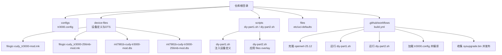
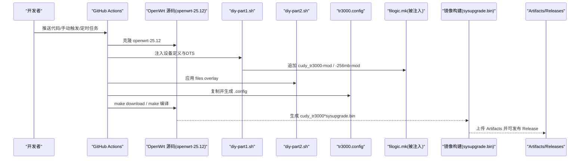
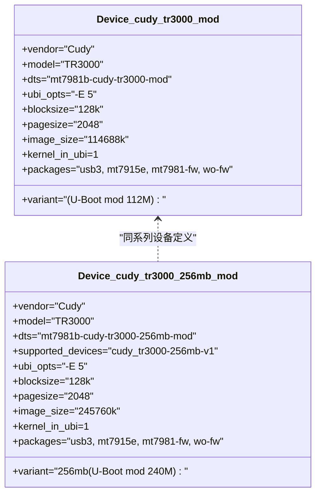
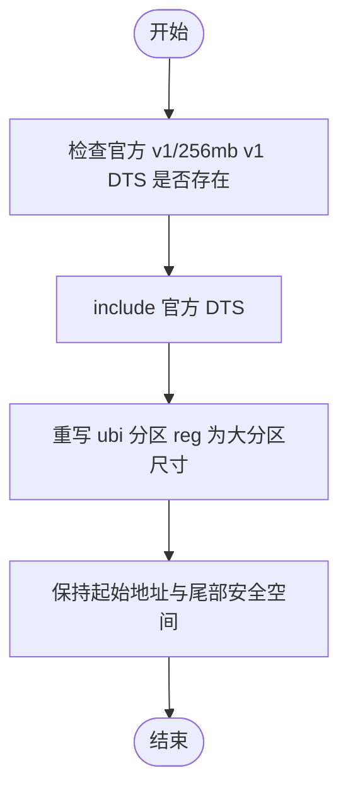
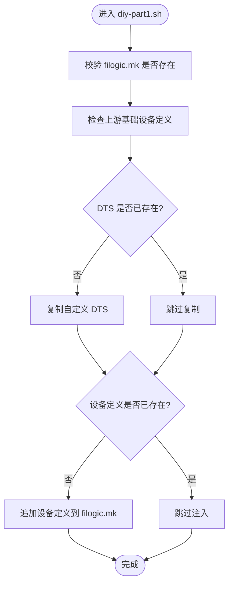
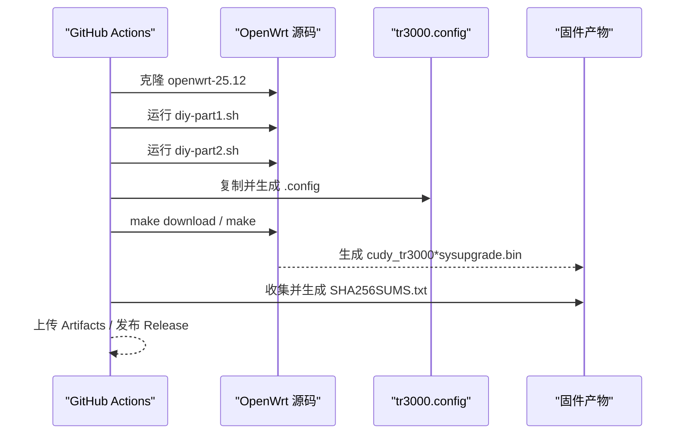
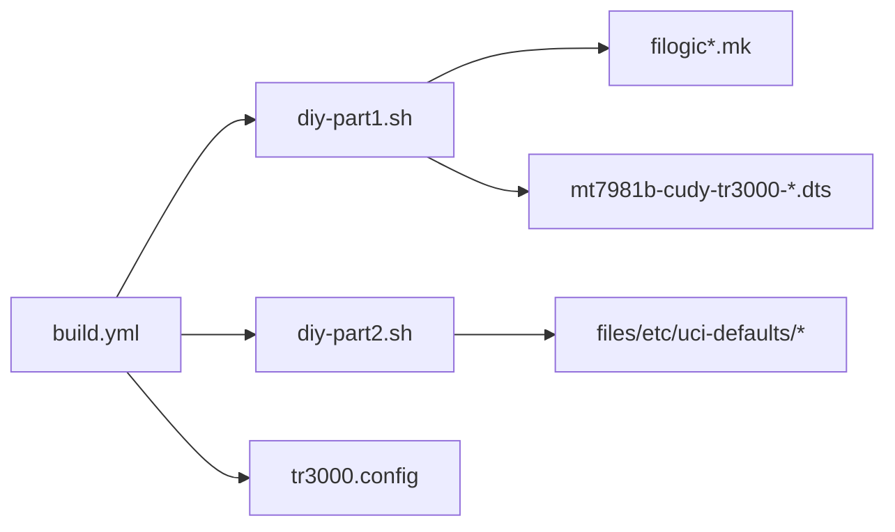
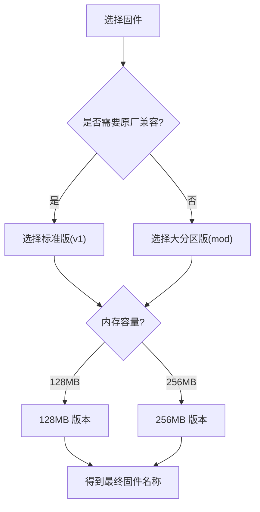

# 项目概述

<cite>
**本文引用的文件**   
- [tr3000.config](file://configs/tr3000.config)
- [filogic-cudy_tr3000-mod.mk](file://device-files/filogic-cudy_tr3000-mod.mk)
- [filogic-cudy_tr3000-256mb-mod.mk](file://device-files/filogic-cudy_tr3000-256mb-mod.mk)
- [mt7981b-cudy-tr3000-mod.dts](file://device-files/mt7981b-cudy-tr3000-mod.dts)
- [mt7981b-cudy-tr3000-256mb-mod.dts](file://device-files/mt7981b-cudy-tr3000-256mb-mod.dts)
- [diy-part1.sh](file://scripts/diy-part1.sh)
- [diy-part2.sh](file://scripts/diy-part2.sh)
- [build.yml](file://.github/workflows/build.yml)
- [99-tr3000-defaults](file://files/etc/uci-defaults/99-tr3000-defaults)
</cite>

## 目录
1. [简介](#简介)
2. [项目结构](#项目结构)
3. [核心组件](#核心组件)
4. [架构总览](#架构总览)
5. [详细组件分析](#详细组件分析)
6. [依赖关系分析](#依赖关系分析)
7. [性能与分区特性](#性能与分区特性)
8. [常见问题排查](#常见问题排查)
9. [结论](#结论)
10. [附录：设备变体与固件选择](#附录设备变体与固件选择)

## 简介
Kwrt 是针对 Cudy TR3000 路由器定制的 OpenWrt 固件构建工程。该项目基于官方 OpenWrt openwrt-25.12 稳定分支，面向 mediatek-filogic 平台，为 TR3000 提供四类固件产物：
- 128MB 标准版
- 128MB 大分区版（U-Boot mod，mod-112m）
- 256MB 标准版
- 256MB 大分区版（U-Boot mod）

该仓库不直接包含完整 OpenWrt 源码，而是通过 GitHub Actions 拉取官方源码、注入自定义设备定义、应用默认配置并编译出四款 sysupgrade.bin 固件，同时支持自动发布到 GitHub Releases。

对于初学者：你可以把它理解为“TR3000 的定制固件工厂”，它负责把官方 OpenWrt 内核和软件包，按照 TR3000 的硬件与分区方案打包成可直接刷写的固件。

对于有经验的开发者：本仓库的核心是“设备定义 + 构建脚本 + CI 流水线”，通过 diy 脚本在 OpenWrt 源码中幂等注入大分区设备定义，并通过 .config 控制目标平台、设备与 LuCI 中文界面等选项。

**章节来源**
- [tr3000.config:1-34](file://configs/tr3000.config#L1-L34)
- [build.yml:1-166](file://.github/workflows/build.yml#L1-L166)

## 项目结构
仓库采用“配置驱动 + 设备定义 + 构建脚本”的组织方式：
- configs：OpenWrt 构建配置，指定目标平台、设备与可选插件。
- device-files：TR3000 的设备定义与 DTS 扩展，覆盖原厂布局或适配 U-Boot mod 的大分区布局。
- scripts：构建期 diy 脚本，负责注入设备定义与应用 files overlay。
- files：首次启动时应用的 uci-defaults 等系统默认项。
- .github/workflows：GitHub Actions 自动化构建与发布流程。

**图表来源**
- [build.yml:59-105](file://.github/workflows/build.yml#L59-L105)
- [diy-part1.sh:1-51](file://scripts/diy-part1.sh#L1-L51)
- [diy-part2.sh:1-22](file://scripts/diy-part2.sh#L1-L22)
- [tr3000.config:11-34](file://configs/tr3000.config#L11-L34)

**章节来源**
- [build.yml:1-166](file://.github/workflows/build.yml#L1-L166)
- [diy-part1.sh:1-51](file://scripts/diy-part1.sh#L1-L51)
- [diy-part2.sh:1-22](file://scripts/diy-part2.sh#L1-L22)
- [tr3000.config:1-34](file://configs/tr3000.config#L1-L34)

## 核心组件
- 构建配置 tr3000.config：声明 mediatek-filogic 目标平台，启用四个 TR3000 设备，并默认开启 LuCI 与简体中文界面；还提供若干常用插件的示例开关。
- 设备定义 mk 文件：定义 cudy_tr3000-mod 与 cudy_tr3000-256mb-mod 两个大分区设备，包括 DTS、UBI 参数、镜像大小、内核位于 UBI 以及默认驱动包。
- DTS 扩展：在官方 v1 基础上仅调整 ubi 分区大小，保持起始地址一致，确保从标准版系统可 sysupgrade 升级到大分区版。
- diy-part1.sh：在 feeds 更新前将自定义 DTS 与设备定义注入到 OpenWrt 源码的 filogic.mk，保证幂等性。
- diy-part2.sh：在 feeds 安装后，将 files/ 目录内容覆盖到 OpenWrt 源码根目录，使首次启动默认项随固件打包。
- build.yml：GitHub Actions 工作流，负责拉取 openwrt-25.12、执行 diy 脚本、加载配置、下载源码、编译固件、收集产物并可选择发布 Release。

**章节来源**
- [tr3000.config:11-34](file://configs/tr3000.config#L11-L34)
- [filogic-cudy_tr3000-mod.mk:1-19](file://device-files/filogic-cudy_tr3000-mod.mk#L1-L19)
- [filogic-cudy_tr3000-256mb-mod.mk:1-20](file://device-files/filogic-cudy_tr3000-256mb-mod.mk#L1-L20)
- [mt7981b-cudy-tr3000-mod.dts:1-22](file://device-files/mt7981b-cudy-tr3000-mod.dts#L1-L22)
- [mt7981b-cudy-tr3000-256mb-mod.dts:1-23](file://device-files/mt7981b-cudy-tr3000-256mb-mod.dts#L1-L23)
- [diy-part1.sh:1-51](file://scripts/diy-part1.sh#L1-L51)
- [diy-part2.sh:1-22](file://scripts/diy-part2.sh#L1-L22)
- [build.yml:59-105](file://.github/workflows/build.yml#L59-L105)

## 架构总览
下图展示从代码提交到固件产物的端到端流程，体现仓库如何与官方 OpenWrt 源码协作，以及如何产出四种 TR3000 固件。

**图表来源**
- [build.yml:59-105](file://.github/workflows/build.yml#L59-L105)
- [diy-part1.sh:28-49](file://scripts/diy-part1.sh#L28-L49)
- [diy-part2.sh:13-19](file://scripts/diy-part2.sh#L13-L19)
- [tr3000.config:11-34](file://configs/tr3000.config#L11-L34)

## 详细组件分析

### 构建配置 tr3000.config
- 目标平台：mediatek 与 mediatek_filogic。
- 设备选择：一次构建包含四个设备名，分别对应 128M/256M 的标准版与大分区版。
- 界面与语言：默认启用 luci、luci-ssl 与简体中文 i18n。
- 插件扩展：提供 ttyd、filebrowser-q、openclash、USB 存储、block-mount 等示例开关，便于按需裁剪。

该配置文件是“一次构建四固件”的关键入口，配合 diy 脚本完成设备定义的动态注入。

**章节来源**
- [tr3000.config:11-34](file://configs/tr3000.config#L11-L34)

### 设备定义：cudy_tr3000-mod 与 cudy_tr3000-256mb-mod
- cudy_tr3000-mod：128MB 大分区版，使用 U-Boot mod 的 mod-112m 方案，ubi 分区扩大至 112MiB，镜像大小约 114688k，内核位于 UBI。
- cudy_tr3000-256mb-mod：256MB 大分区版，ubi 分区扩大至 240MiB，镜像大小约 245760k，内核位于 UBI，并声明 SUPPORTED_DEVICES 允许从 256MB 标准版系统直接 sysupgrade 升级。

两者均包含 USB3、MT7915E、MT7981 固件等默认驱动包，确保无线与 USB 功能开箱可用。

**图表来源**
- [filogic-cudy_tr3000-mod.mk:1-19](file://device-files/filogic-cudy_tr3000-mod.mk#L1-L19)
- [filogic-cudy_tr3000-256mb-mod.mk:1-20](file://device-files/filogic-cudy_tr3000-256mb-mod.mk#L1-L20)

**章节来源**
- [filogic-cudy_tr3000-mod.mk:1-19](file://device-files/filogic-cudy_tr3000-mod.mk#L1-L19)
- [filogic-cudy_tr3000-256mb-mod.mk:1-20](file://device-files/filogic-cudy_tr3000-256mb-mod.mk#L1-L20)

### DTS 扩展：大分区 ubi 布局
- 128MB 大分区版 DTS：在官方 v1 基础上，仅修改 ubi 分区大小为 112MiB，起始地址与官方一致，尾部保留安全空间。
- 256MB 大分区版 DTS：在官方 256mb v1 基础上，将 ubi 由 230MiB 扩大至 240MiB，仍保留尾部空间，确保与 128MB 大分区方案的安全边界一致。

这种“继承官方 DTS + 仅改 ubi reg”的方式，既降低维护成本，又保证从标准版系统可平滑升级到对应大分区版固件。

**图表来源**
- [mt7981b-cudy-tr3000-mod.dts:1-22](file://device-files/mt7981b-cudy-tr3000-mod.dts#L1-L22)
- [mt7981b-cudy-tr3000-256mb-mod.dts:1-23](file://device-files/mt7981b-cudy-tr3000-256mb-mod.dts#L1-L23)

**章节来源**
- [mt7981b-cudy-tr3000-mod.dts:1-22](file://device-files/mt7981b-cudy-tr3000-mod.dts#L1-L22)
- [mt7981b-cudy-tr3000-256mb-mod.dts:1-23](file://device-files/mt7981b-cudy-tr3000-256mb-mod.dts#L1-L23)

### diy-part1.sh：设备定义注入
- 作用：在 OpenWrt 源码根目录下运行，向 target/linux/mediatek/image/filogic.mk 注入 cudy_tr3000-mod 与 cudy_tr3000-256mb-mod 设备定义，并复制自定义 DTS（若上游不存在）。
- 幂等性：若设备定义已存在则跳过注入，避免重复追加。
- 自检：检测上游是否包含基础设备 cudy_tr3000-v1 与 cudy_tr3000-256mb-v1，若缺失则给出警告。

**图表来源**
- [diy-part1.sh:16-49](file://scripts/diy-part1.sh#L16-L49)

**章节来源**
- [diy-part1.sh:1-51](file://scripts/diy-part1.sh#L1-L51)

### diy-part2.sh：应用 files overlay
- 作用：在 feeds 安装后，将仓库 files/ 目录内容复制到 OpenWrt 源码根目录，使首次启动默认项随固件打包。
- 典型用途：放置 etc/uci-defaults 下的默认配置脚本，例如设置主机名、时区等。

**章节来源**
- [diy-part2.sh:1-22](file://scripts/diy-part2.sh#L1-L22)

### GitHub Actions 构建与发布
- 触发条件：手动触发（可勾选是否发布）、推送 main/master 分支、每周定时任务。
- 关键步骤：
  - 清理磁盘空间并安装构建依赖。
  - 克隆 openwrt-25.12 源码。
  - 执行 diy-part1.sh 注入设备定义。
  - 更新并安装 feeds。
  - 执行 diy-part2.sh 应用 files overlay。
  - 复制 tr3000.config 并执行 defconfig，校验四个设备是否生效。
  - 下载源码并编译固件。
  - 收集 cudy_tr3000*sysupgrade.bin 与 sha256sums/profiles.json。
  - 上传 Artifacts，并在满足条件时创建 GitHub Release。

**图表来源**
- [build.yml:59-105](file://.github/workflows/build.yml#L59-L105)
- [build.yml:125-166](file://.github/workflows/build.yml#L125-L166)

**章节来源**
- [build.yml:1-166](file://.github/workflows/build.yml#L1-L166)

### 首次启动默认项
- 路径：files/etc/uci-defaults/99-tr3000-defaults。
- 行为：首次启动时设置主机名为 TR3000，时区 CST-8，区域 Asia/Shanghai，然后退出。
- 生命周期：uci-defaults 执行成功后自动删除，避免重复执行。

**章节来源**
- [99-tr3000-defaults:1-11](file://files/etc/uci-defaults/99-tr3000-defaults#L1-L11)
- [diy-part2.sh:13-19](file://scripts/diy-part2.sh#L13-L19)

## 依赖关系分析
- 外部依赖：
  - OpenWrt 源码：openwrt-25.12 稳定分支。
  - GitHub Actions：ubuntu-24.04 环境，构建工具链与网络访问。
- 内部依赖：
  - build.yml 依赖 diy-part1.sh 与 diy-part2.sh。
  - diy-part1.sh 依赖 device-files 中的 mk 与 dts。
  - tr3000.config 驱动四个设备的构建。
  - files overlay 依赖 diy-part2.sh 的复制逻辑。

**图表来源**
- [build.yml:59-105](file://.github/workflows/build.yml#L59-L105)
- [diy-part1.sh:28-49](file://scripts/diy-part1.sh#L28-L49)
- [diy-part2.sh:13-19](file://scripts/diy-part2.sh#L13-L19)
- [tr3000.config:11-34](file://configs/tr3000.config#L11-L34)

**章节来源**
- [build.yml:1-166](file://.github/workflows/build.yml#L1-L166)
- [diy-part1.sh:1-51](file://scripts/diy-part1.sh#L1-L51)
- [diy-part2.sh:1-22](file://scripts/diy-part2.sh#L1-L22)
- [tr3000.config:1-34](file://configs/tr3000.config#L1-L34)

## 性能与分区特性
- 标准版固件：遵循原厂分区布局，适合希望保持原厂兼容性的用户。
- 大分区版固件：通过 U-Boot mod 与 DTS 调整，显著扩大 ubi 分区，从而获得更大的用户空间，有利于安装更多软件包与数据。
- 内核位于 UBI：提高系统分区的灵活性与可升级性。
- 默认驱动包：包含 USB3、MT7915E、MT7981 固件等，保障无线与外设能力。

注意：大分区版需要对应的 U-Boot mod 或从标准版 sysupgrade 升级（256MB 大分区版明确声明可从标准版升级）。

**章节来源**
- [filogic-cudy_tr3000-mod.mk:1-19](file://device-files/filogic-cudy_tr3000-mod.mk#L1-L19)
- [filogic-cudy_tr3000-256mb-mod.mk:1-20](file://device-files/filogic-cudy_tr3000-256mb-mod.mk#L1-L20)
- [mt7981b-cudy-tr3000-mod.dts:1-22](file://device-files/mt7981b-cudy-tr3000-mod.dts#L1-L22)
- [mt7981b-cudy-tr3000-256mb-mod.dts:1-23](file://device-files/mt7981b-cudy-tr3000-256mb-mod.dts#L1-L23)

## 常见问题排查
- 构建失败提示某设备未出现在 .config：
  - 原因：diy-part1.sh 未成功注入设备定义，或 tr3000.config 未启用对应设备。
  - 处理：确认 OpenWrt 源码根目录存在 filogic.mk，且 diy-part1.sh 已执行；检查 tr3000.config 中四个设备是否启用。
- 上游缺少基础设备定义：
  - 现象：diy-part1.sh 输出警告，提示上游源码未找到 cudy_tr3000-v1 或 cudy_tr3000-256mb-v1。
  - 处理：确认使用的 OpenWrt 分支为 openwrt-25.12，或上游已包含 TR3000 基础设备定义。
- 无法从标准版升级到 256MB 大分区版：
  - 说明：256MB 大分区版定义了 SUPPORTED_DEVICES 允许从标准版升级；若失败，请确认当前系统确为 256MB 标准版，并重新尝试 sysupgrade。
- 首次启动默认项未生效：
  - 检查：确认 diy-part2.sh 已将 files/ 内容复制到 OpenWrt 源码根目录，且 99-tr3000-defaults 存在于 etc/uci-defaults。

**章节来源**
- [build.yml:83-89](file://.github/workflows/build.yml#L83-L89)
- [diy-part1.sh:21-26](file://scripts/diy-part1.sh#L21-L26)
- [filogic-cudy_tr3000-256mb-mod.mk:10-10](file://device-files/filogic-cudy_tr3000-256mb-mod.mk#L10-L10)
- [diy-part2.sh:13-19](file://scripts/diy-part2.sh#L13-L19)
- [99-tr3000-defaults:1-11](file://files/etc/uci-defaults/99-tr3000-defaults#L1-L11)

## 结论
Kwrt 以最小侵入的方式对官方 OpenWrt 进行定制化扩展：通过 diy 脚本注入设备定义与默认配置，通过 .config 控制目标平台与插件，通过 GitHub Actions 实现自动化构建与发布。其核心价值在于为 Cudy TR3000 提供稳定、可复现、可选择的四款固件，兼顾原厂兼容性与大分区扩展能力。

## 附录：设备变体与固件选择
- 128MB 标准版（cudy_tr3000-v1）：原厂布局，ubi 64MiB，适合保守升级路径。
- 128MB 大分区版（cudy_tr3000-mod）：U-Boot mod，ubi 112MiB，mod-112m 方案，需先刷入第三方大分区 U-Boot。
- 256MB 标准版（cudy_tr3000-256mb-v1）：原厂布局，ubi 230MiB，适合保守升级路径。
- 256MB 大分区版（cudy_tr3000-256mb-mod）：U-Boot mod，ubi 240MiB，可从 256MB 标准版系统直接 sysupgrade 升级。

**图表来源**
- [tr3000.config:4-8](file://configs/tr3000.config#L4-L8)
- [build.yml:151-156](file://.github/workflows/build.yml#L151-L156)

**章节来源**
- [tr3000.config:4-8](file://configs/tr3000.config#L4-L8)
- [build.yml:151-156](file://.github/workflows/build.yml#L151-L156)